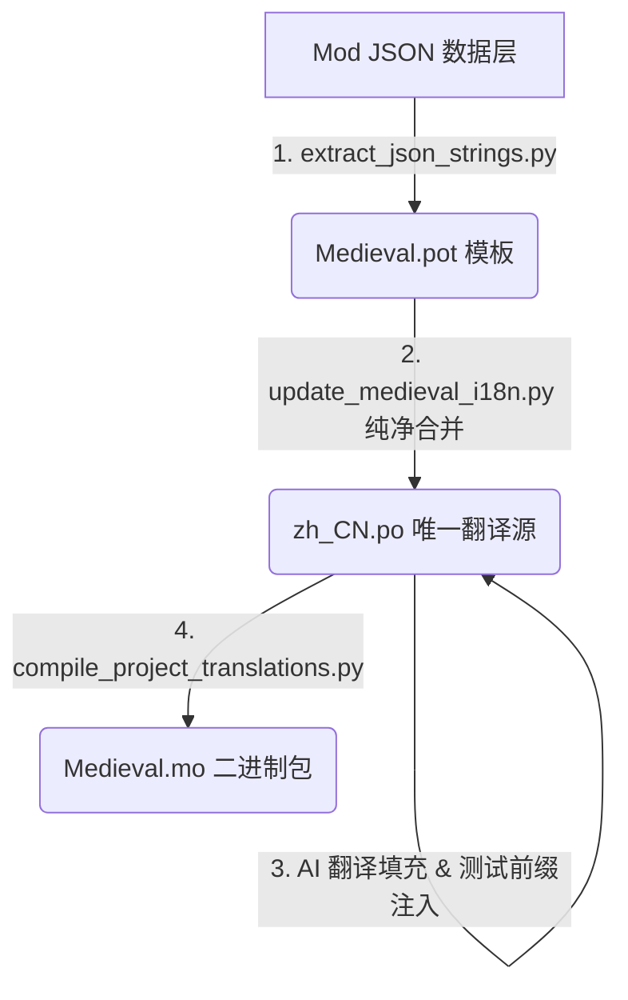

# 中世纪 Mod 独立本地化自动化工作流 (Medieval i18n Workflow)

本指南总结了 **中世纪 Mod（Cataclysm-Medieval）** 的独立本地化（Scenario C 方案）的标准开发工作流。

为了遵循现代软件工程的最佳实践，本方案彻底杜绝了在 Python 代码中硬编码翻译字典的臃肿设计，确立了以 **`zh_CN.po` 为唯一翻译源头（Single Source of Truth）** 的高可维护性架构。

---

## 🔄 核心本地化管线 (Localization Pipeline)



---

## 🛠️ 工作流四步走 (Step-by-Step)

### 步骤 1：自动提取（Extract）
利用 CDDA 原版提供的 JSON 字符提取脚本，扫描 `data/mods/Medieval` 目录下的所有 JSON 文件，抓取所有可翻译字段（如 name、description 等），生成最新的 `Medieval.pot` 翻译模板。
* **命令**：此步骤已由 `update_medieval_i18n.py` 内部自动托管。

### 步骤 2：纯净合并（Merge）
将最新提取出的 `Medieval.pot` 中的所有 msgid 合并入已有的 `zh_CN.po` 文件：
* 如果 `zh_CN.po` 中已存在该 msgid，则**保留已有翻译**（不被覆盖）。
* 如果是新增的 msgid，则自动追加在文件末尾，翻译值留空为 `msgstr ""`，等待翻译。
* **执行命令**：
  ```powershell
  python data/mods/Medieval/tools/update_medieval_i18n.py
  ```

### 步骤 3：AI 翻译与前缀注入（AI Translate & Format）
AI 代理程序（或人工翻译者）直接对唯一翻译源 [zh_CN.po](file:///e:/Cataclysm-Medieval/data/mods/Medieval/lang/po/zh_CN.po) 中所有的空白翻译条目（`msgstr ""`）进行处理：
* **测试用前缀**：所有物品类名称（如 `med_` 前缀条目），其中文翻译必须强制以 **“中世纪”** 作为开头前缀（例如：`中世纪武装衣`、`中世纪战戟`），以便在测试期间瞬间与其他 Mod 或原版物品区分开。
* **Lore 描述汉化**：背景 Lore 及描述信息进行原汁原味的学术考证级翻译，直接填入 `msgstr` 中。
* **执行脚本**（一次性自动化填充工具）：
  ```powershell
  python data/mods/Medieval/tools/workflow_ai_translate.py
  ```

### 步骤 4：二进制编译（Compile to MO）
调用我们编写的 0 依赖高性能流式编译器，将 100% 汉化的 `zh_CN.po` 极速打包编译成二进制的 GNU `Medieval.mo` 文件。游戏引擎在启动时会自动读取并加载该二进制文件，动态应用中文翻译。
* **编译输出路径**：`data/mods/Medieval/lang/zh_CN/LC_MESSAGES/Medieval.mo`
* **执行命令**：此步骤由 `update_medieval_i18n.py` 脚本在 Step 2 合并后自动一并执行。

---

## ⚠️ 常见故障与 Gotchas

> [!CAUTION]
> **Windows 文件锁占用问题（PermissionError - Errno 13）**
> 在 Windows 环境下，如果游戏程序（`cataclysm-tiles.exe`）正处于开启运行状态，游戏引擎会锁定已加载的 `Medieval.mo` 文件。此时运行编译管道会抛出 `PermissionError: [Errno 13] Permission denied` 报错。
> 
> **解决方案**：必须**先完全关闭正在运行的游戏**，然后再在命令行中执行 `python data/mods/Medieval/tools/update_medieval_i18n.py` 编译，编译成功后再重新启动游戏验证效果。

---

## 📈 长期维护与增量更新
当未来有新的中世纪武器、防具或地图配置加入 JSON 目录时：
1. 运行 `python data/mods/Medieval/tools/update_medieval_i18n.py`，它会安全提取出新 key 并在 `zh_CN.po` 中生成空的 `msgstr ""`。
2. 呼叫 AI 助手执行 `Workflow-AI-Translate`，AI 会自动扫描并完美翻译新增的空 key。
3. 再次运行 `python data/mods/Medieval/tools/update_medieval_i18n.py`，即可一键重构最新的 `Medieval.mo` 独立汉化包。
