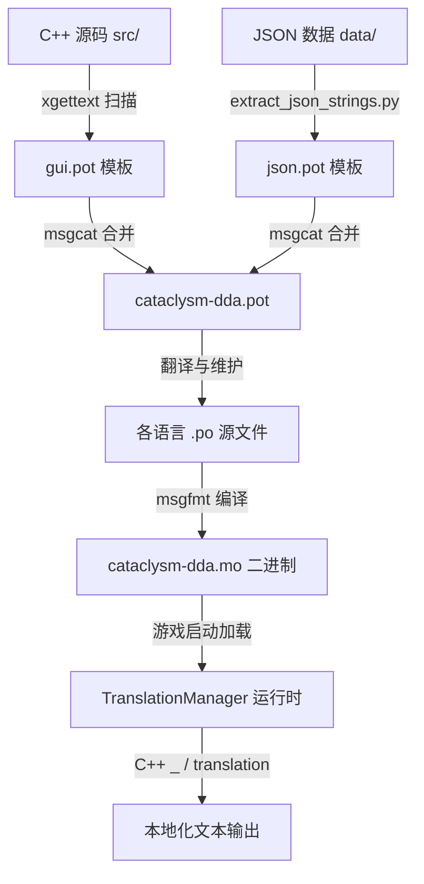

# CDDA 本地化与国际化 (i18n) 系统调研

> 记录 CDDA 官方源码中本地化系统的架构、核心机制、JSON 文本提取工作流以及对中世纪 Mod (Medieval) 本地化的启示。

---

## 1. 整体架构与运行机制

CDDA 的本地化系统采用统一的 **Gettext** 标准机制。无论是 C++ 源码中的硬编码文案，还是 JSON 数据文件中的可配置文本（如物品名称、描述、对话等），都经过统一的翻译管道提取，并最终由游戏内置的翻译管理器在运行时统一翻译和缓存。

其核心数据流动拓扑如下：



---

## 2. C++ 核心机制

### 2.1 延迟翻译容器 `class translation`
在 CDDA 中，为了避免静态初始化时语言选项尚未加载就进行翻译，绝大多数 JSON 属性在反序列化后并不是直接存储为普通的 `std::string`，而是存储为 `class translation`（定义于 [translation.h](file:///e:/Cataclysm-Medieval/src/translation.h)）。

该类支持以下核心功能：
- **延迟翻译**：在需要显示给玩家时（例如 UI 渲染），才调用 `.translated()` 方法动态获取当前语言的翻译文本。
- **内置缓存**：内部维护缓存，只有当语言版本号改变（`current_language_version` 递增）或复数数量参数发生变化时，才会重新查找并刷新翻译，性能极高。
- **单复数支持**：包含可选的 `raw_pl`（复数原始字符串），在翻译时支持传入 `num`（数量）以调用 `n_gettext`。
- **反序列化形式**：
  `class translation` 在 JSON 中支持两种定义方式，极具灵活性：
  1. **简单字符串**：直接定义文本，提取器会自动按默认规则生成其复数形式（一般加 `"s"`）。
     ```json
     "name": "broadsword"
     ```
  2. **复杂 JSON 对象**：显式提供翻译上下文（`ctxt`）、单数（`str`）、复数（`str_pl`）或单复数同形（`str_sp`），并支持为翻译者提供注释注释（`//~`）。
     ```json
     "name": {
         "//~": "A heavy, double-edged medieval sword.",
         "ctxt": "weapon",
         "str": "broadsword",
         "str_pl": "broadswords"
     }
     ```

### 2.2 内置的翻译管理器 `TranslationManager`
与许多需要动态链接外部 `libintl.dll` 的游戏不同，CDDA 在 [translation_manager_impl.cpp](file:///e:/Cataclysm-Medieval/src/translation_manager_impl.cpp) 中**自主实现了一套轻量级二进制 `.mo` 文件解析器**。

其关键技术细节如下：
- **多文档融合**：通过 `LoadDocuments` 可以同时加载并解析多个 `.mo` 翻译文件，将它们的所有翻译键值对读入内存，并通过 `djb2_hash` 算法对原始字符串哈希化，在内存中构建极其快速的 `std::unordered_map` 哈希表查找结构。
- **Mod 翻译自动加载**：运行时会通过 `ScanTranslationDocuments` 自动扫描 `mods/` （由 `PATH_INFO::user_moddir()` 定义）目录下所有含有 `LC_MESSAGES` 目录的子文件夹，并自动寻找 `.mo` 结尾的文件加载进内存。这使第三方 Mod 能够完全独立提供和维护翻译，而不需要修改核心翻译包！
- **上下文拼接（Contextual Query）**：在翻译带上下文（`msgctxt`）的文本时，它利用了 Gettext 的规范，将 context 字符串、`"\004"`（ASCII 传输结束符，即 `\x04`）以及 raw message 字符串拼接为单个查询键进行哈希检索。

---

## 3. 本地化提取工作流 (Extraction Pipeline)

整个项目的本地化翻译模板生成由脚本 [update_pot.sh](file:///e:/Cataclysm-Medieval/lang/update_pot.sh) 统一驱动，分为以下三步：

### Step 1: 源码字符串提取
利用 GNU gettext 工具链的 `xgettext` 扫描 `src/` 下的所有 C++ 源文件，提取带有 `_()`, `pgettext()`, `n_gettext()`, `npgettext()` 以及各种 `translation` 构造函数标志的文本，输出为 `lang/po/gui.pot` 模板。

### Step 2: JSON 字符串精密提取
调用 Python 脚本 [extract_json_strings.py](file:///e:/Cataclysm-Medieval/lang/extract_json_strings.py) 递归扫描 `data/` 目录。
- **94 个细分类型解析器**：该提取器的核心位于 `lang/string_extractor/`。它在 `parser.py` 中维护了一个大字典，把 JSON 的 `type` 字段（如 `"item"`, `"recipe"`, `"terrain"`, `"monster"` 等）映射到 `parsers/` 目录下对应的专门解析子模块。
- **字段级精确提取**：例如在 `parsers/generic.py` 中，解析器仅对 `"name"`, `"description"`, `"variants"`, `"pocket_data"` 等属性值进行提取，并自动附带类型与物品名作为翻译注释，而忽略程序内部属性（如 `"weight"`, `"volume"`），避免模板污染。
- 生成 `lang/po/json.pot` 模板。

### Step 3: 合并与编译
- 使用 `msgcat` 合并 `gui.pot` 和 `json.pot` 模板，生成总模板 `lang/po/cataclysm-dda.pot`。
- 翻译人员对 `.pot` 提取出的文本在各语言 `.po` 文件中进行翻译（如 `lang/po/zh_CN.po`）。
- 最终运行 `compile_mo.sh`，使用 `msgfmt` 工具将各 `.po` 编译为二进制的 `.mo` 文件，存放于 `lang/mo/{lang}/LC_MESSAGES/cataclysm-dda.mo` 中。

---

## 4. 对中世纪 Mod (Medieval) 的本地化启示与策略选择

中世纪 Mod 作为独立 Mod 存放在 `data/mods/Medieval` 中。随着我们不断扩充中世纪的盔甲、武器、材料、聚落、NPC 与职业，本地化有以下三种可行策略：

### 策略 A：全中文直接硬编码入 JSON (快速/粗暴)
* **做法**：在 `data/mods/Medieval/` 下的所有 JSON 属性值中直接书写中文字符（如 `"name": "布里根丁板甲衣"`）。
* **优点**：无需任何翻译编译管道，即写即用，开发和调试阶段体验极爽。
* **缺点**：丧失了多语言切换支持。如果未来有英文或其他语言玩家，他们看到的依然是中文。

### 策略 B：合并至官方翻译大 PO 文件 (标准/合规)
* **做法**：我们正常用英文编写 JSON 属性，运行 `update_pot.sh` 脚本，因为该脚本扫描整个 `data/` 目录，所以中世纪 Mod 的新字段会被自动提取至官方 `cataclysm-dda.pot`。然后我们将其合并至 `lang/po/zh_CN.po` 并重新用 `compile_mo.sh` 编译核心 `.mo` 文件。
* **优点**：完全符合 CDDA 的官方开发和分发规范，翻译资源高度统一。
* **缺点**：`zh_CN.po` 极其庞大（23.5MB，数十万行），直接编辑或频繁合并在开发阶段比较繁琐。

### 策略 C：建立 Mod 独立翻译子系统 (模块化/推荐)
* **做法**：由于 `TranslationManager` 支持动态扫描 Mod 目录下的 `LC_MESSAGES` 文件夹，我们可以：
  1. 仿照官方提取脚本，写一个只针对 `data/mods/Medieval` 目录的 Python 提取命令，生成 `Medieval.pot`。
  2. 建立小型的 `Medieval_zh_CN.po`。
  3. 用 `msgfmt` 编译出 `Medieval.mo`，并放置于 `data/mods/Medieval/lang/zh_CN/LC_MESSAGES/Medieval.mo`。
* **优点**：完全模块化，Medieval 的翻译与核心翻译解耦，po 文件小巧玲珑，便于协作与增量翻译。
* **缺点**：在非绿色版（即 `user_moddir()` 映射到其他用户数据目录而非当前 `data/mods/`）下，需要确保该翻译目录被正确加载。
