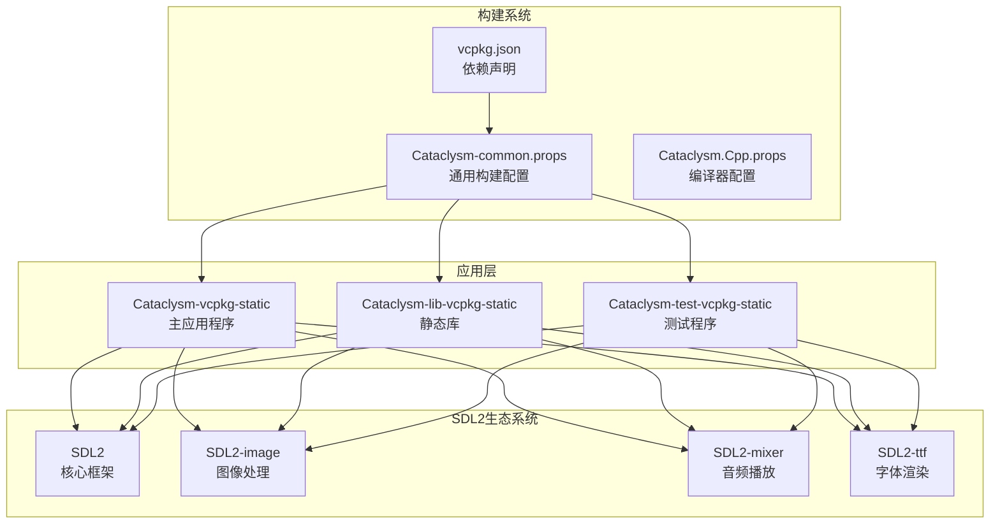
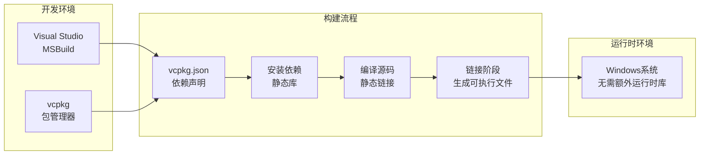
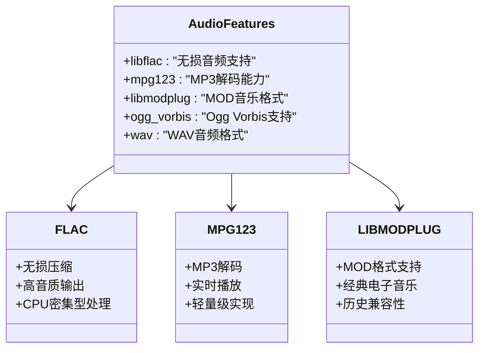
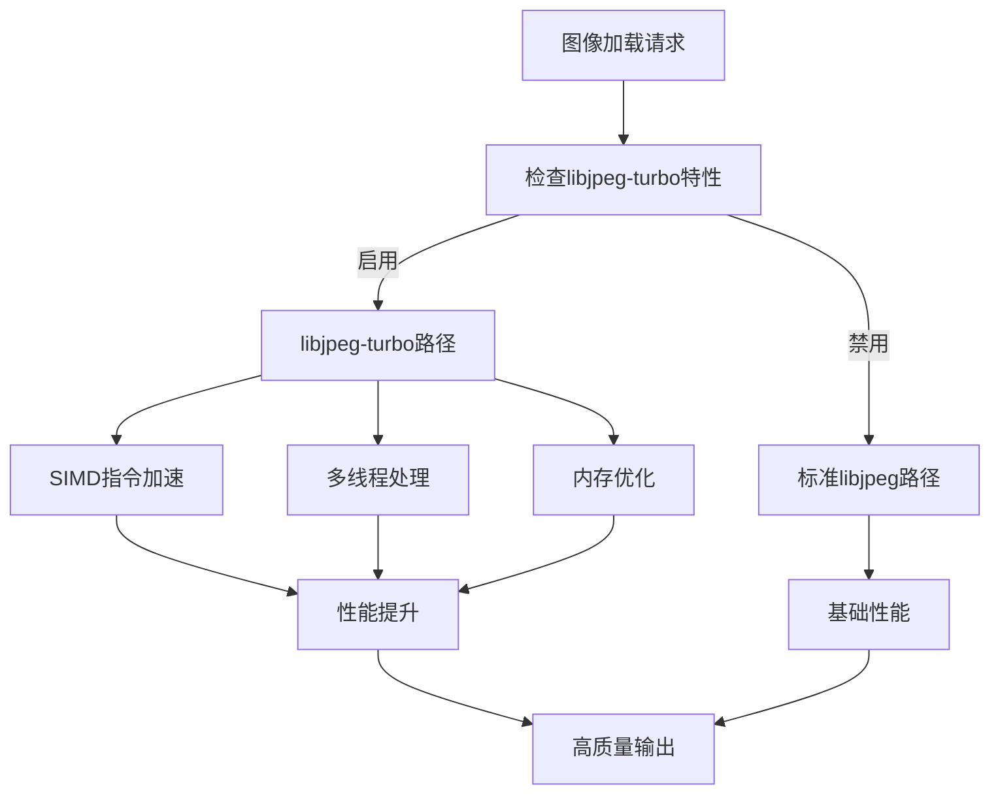
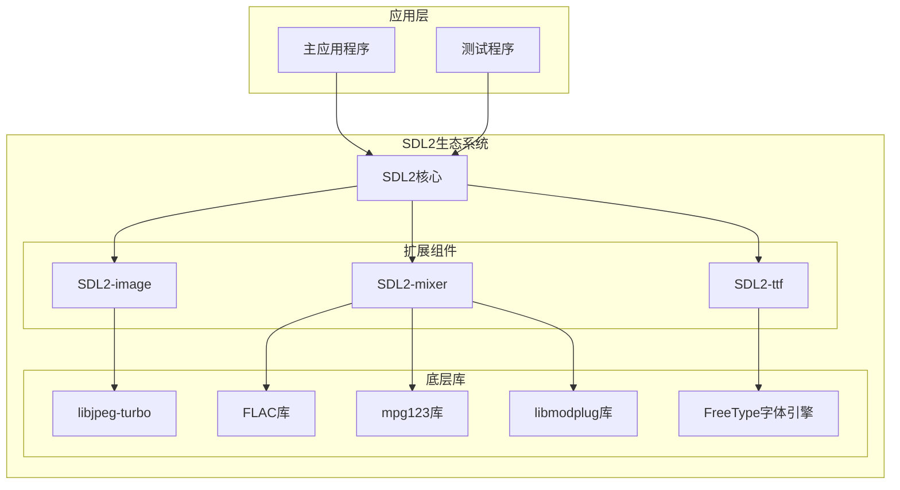
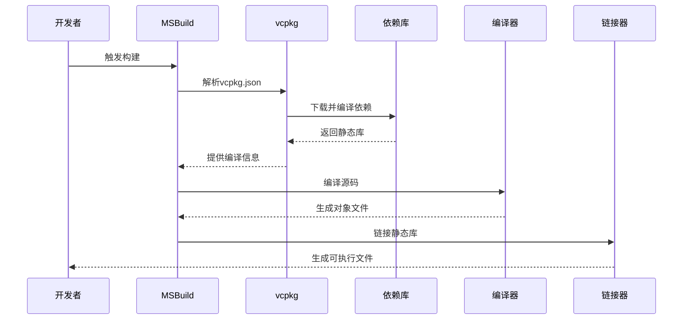
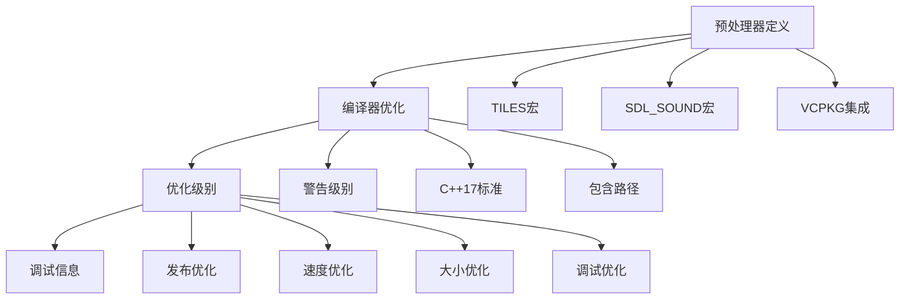

# SDL2生态系统集成

<cite>
**本文档引用的文件**
- [vcpkg.json](file://vcpkg.json)
- [Cataclysm-vcpkg-static.vcxproj](file://Cataclysm-vcpkg-static.vcxproj)
- [Cataclysm-lib-vcpkg-static.vcxproj](file://Cataclysm-lib-vcpkg-static.vcxproj)
- [Cataclysm-test-vcpkg-static.vcxproj](file://Cataclysm-test-vcpkg-static.vcxproj)
- [Cataclysm-common.props](file://Cataclysm-common.props)
- [Cataclysm.Cpp.props](file://Cataclysm.Cpp.props)
- [stdafx.h](file://stdafx.h)
</cite>

## 目录
1. [简介](#简介)
2. [项目结构](#项目结构)
3. [核心组件](#核心组件)
4. [架构概览](#架构概览)
5. [详细组件分析](#详细组件分析)
6. [依赖关系分析](#依赖关系分析)
7. [性能考虑](#性能考虑)
8. [故障排除指南](#故障排除指南)
9. [结论](#结论)

## 简介

本项目展示了SDL2生态系统在Windows平台上的完整集成方案，采用vcpkg包管理器进行依赖管理，实现了静态链接的部署策略。项目通过精心设计的构建配置，为游戏开发提供了完整的多媒体支持解决方案。

该集成方案涵盖了图形渲染（SDL2）、图像处理（SDL2-image）、音频播放（SDL2-mixer）和字体渲染（SDL2-ttf）四大核心组件，每个组件都针对特定的性能优化进行了配置选择。

## 项目结构

项目采用分层架构设计，通过MSBuild属性文件实现配置的模块化管理：

**图表来源**
- [vcpkg.json:1-21](file://vcpkg.json#L1-L21)
- [Cataclysm-common.props:23-144](file://Cataclysm-common.props#L23-L144)

**章节来源**
- [vcpkg.json:1-21](file://vcpkg.json#L1-L21)
- [Cataclysm-common.props:1-154](file://Cataclysm-common.props#L1-L154)

## 核心组件

### SDL2核心框架

SDL2作为整个多媒体系统的基石，提供了跨平台的窗口管理、输入处理和基本的图形渲染能力。在本项目中，SDL2被配置为静态链接，确保了最终可执行文件的独立性。

### SDL2-image图像处理

SDL2-image组件专门负责图像格式的加载和处理。项目选择了libjpeg-turbo特性，这是一个高度优化的JPEG解码库，相比标准libjpeg具有显著的性能提升。

### SDL2-mixer音频播放

SDL2-mixer是音频处理的核心组件，支持多种音频格式的播放。项目集成了三个关键特性：
- **libflac**: 支持无损音频压缩格式
- **mpg123**: 提供MP3音频解码能力
- **libmodplug**: 支持MOD音乐格式播放

### SDL2-ttf字体渲染

SDL2-ttf组件负责高质量的字体渲染，为游戏界面提供清晰的文字显示功能。

**章节来源**
- [vcpkg.json:4-14](file://vcpkg.json#L4-L14)
- [Cataclysm-common.props:112-115](file://Cataclysm-common.props#L112-L115)

## 架构概览

项目采用静态链接的部署架构，通过vcpkg自动管理所有依赖库的下载、编译和链接过程：

**图表来源**
- [vcpkg.json:16-20](file://vcpkg.json#L16-L20)
- [Cataclysm-common.props:63-72](file://Cataclysm-common.props#L63-L72)

**章节来源**
- [Cataclysm-vcpkg-static.vcxproj:63-72](file://Cataclysm-vcpkg-static.vcxproj#L63-L72)
- [Cataclysm-lib-vcpkg-static.vcxproj:60-71](file://Cataclysm-lib-vcpkg-static.vcxproj#L60-L71)

## 详细组件分析

### SDL2-mixer特性配置详解

SDL2-mixer的配置体现了针对不同音频格式的专业化选择：

**图表来源**
- [vcpkg.json:11-12](file://vcpkg.json#L11-L12)
- [Cataclysm-common.props:103-109](file://Cataclysm-common.props#L103-L109)

#### libflac配置与应用场景

libflac特性提供了无损音频压缩支持，适用于对音质要求极高的音频内容。其配置特点包括：
- 支持FLAC格式的完整解码链
- 高质量音频输出，无压缩损失
- 相对较高的CPU使用率

#### mpg123配置与应用场景

mpg123提供了高效的MP3解码能力，是现代音频播放的标准选择：
- 实时MP3解码性能优异
- 轻量级实现，内存占用低
- 广泛的音频格式兼容性

#### libmodplug配置与应用场景

libmodplug专注于经典音乐格式的支持：
- MOD、S3M、XM等历史音频格式
- 适合复古风格或经典游戏音效
- 轻量且高效

**章节来源**
- [vcpkg.json:11-12](file://vcpkg.json#L11-L12)
- [Cataclysm-common.props:108-109](file://Cataclysm-common.props#L108-L109)

### SDL2-image libjpeg-turbo性能优势

libjpeg-turbo特性相比标准libjpeg具有以下性能优势：

**图表来源**
- [vcpkg.json:7-8](file://vcpkg.json#L7-L8)
- [Cataclysm-common.props:117](file://Cataclysm-common.props#L117)

#### 性能优化机制

libjpeg-turbo通过以下技术实现性能提升：
- **SIMD指令集优化**: 利用SSE、AVX等现代CPU指令
- **多线程并行处理**: 充分利用多核CPU资源
- **内存访问优化**: 减少内存拷贝和缓存未命中

#### 配置方法

项目通过vcpkg.json中的特性声明启用libjpeg-turbo：
- 在依赖项中指定`"features": ["libjpeg-turbo"]`
- vcpkg自动下载和编译优化版本
- 编译器自动链接优化库

**章节来源**
- [vcpkg.json:7-8](file://vcpkg.json#L7-L8)
- [Cataclysm-common.props:117](file://Cataclysm-common.props#L117)

### 组件间依赖关系

SDL2生态系统各组件之间存在明确的依赖层次：

**图表来源**
- [vcpkg.json:4-14](file://vcpkg.json#L4-L14)
- [Cataclysm-common.props:112-115](file://Cataclysm-common.props#L112-L115)

**章节来源**
- [vcpkg.json:4-14](file://vcpkg.json#L4-L14)
- [Cataclysm-common.props:98-136](file://Cataclysm-common.props#L98-L136)

## 依赖关系分析

### 构建时依赖链

项目构建过程中遵循严格的依赖顺序：

**图表来源**
- [vcpkg.json:16-20](file://vcpkg.json#L16-L20)
- [Cataclysm-common.props:63-72](file://Cataclysm-common.props#L63-L72)

### 运行时库依赖

通过静态链接策略，项目实现了最小化的运行时依赖：

| 组件 | 静态库名称 | 功能描述 |
|------|------------|----------|
| SDL2 | SDL2-static.lib | 核心框架功能 |
| SDL2-image | SDL2_image-static.lib | 图像处理能力 |
| SDL2-mixer | SDL2_mixer-static.lib | 音频播放功能 |
| SDL2-ttf | SDL2_ttf.lib | 字体渲染服务 |
| libjpeg-turbo | turbojpeg.lib | JPEG图像解码 |
| FLAC | FLAC.lib, FLAC++.lib | 无损音频解码 |
| mpg123 | mpg123.lib | MP3音频解码 |
| libmodplug | modplug.lib | MOD音乐格式 |

**章节来源**
- [Cataclysm-common.props:112-115](file://Cataclysm-common.props#L112-L115)
- [Cataclysm-common.props:103-109](file://Cataclysm-common.props#L103-L109)

## 性能考虑

### 编译器优化配置

项目采用了多层次的编译器优化策略：

**图表来源**
- [Cataclysm.Cpp.props:42-57](file://Cataclysm.Cpp.props#L42-L57)
- [Cataclysm-common.props:119-121](file://Cataclysm-common.props#L119-L121)

### 内存管理和资源优化

项目通过以下方式优化内存使用和资源管理：
- 使用静态库减少动态加载开销
- 合理的预编译头文件配置
- 针对不同配置的优化策略

**章节来源**
- [Cataclysm.Cpp.props:42-57](file://Cataclysm.Cpp.props#L42-L57)
- [Cataclysm-common.props:119-121](file://Cataclysm-common.props#L119-L121)

## 故障排除指南

### 常见构建问题

#### vcpkg依赖安装失败

**症状**: 构建过程中vcpkg无法找到或下载依赖库

**解决方案**:
1. 检查网络连接和代理设置
2. 清理vcpkg缓存并重新安装
3. 验证vcpkg.json中的依赖声明

#### 静态库链接错误

**症状**: 链接阶段出现未解析的外部符号

**解决方案**:
1. 确认所有必需的静态库都已正确安装
2. 检查库文件名和版本匹配
3. 验证链接器的库路径配置

#### 平台兼容性问题

**症状**: 在不同Windows版本上运行异常

**解决方案**:
1. 确保使用兼容的Windows SDK版本
2. 验证目标平台配置（x86/x64/ARM64EC）
3. 检查运行时库依赖

**章节来源**
- [vcpkg.json:16-20](file://vcpkg.json#L16-L20)
- [Cataclysm-common.props:91-140](file://Cataclysm-common.props#L91-L140)

### 调试和诊断

项目提供了完善的调试支持：
- 多种构建配置（Debug/Release）
- 不同的功能组合（TILES/NoTiles）
- 详细的编译器和链接器日志

## 结论

本项目成功实现了SDL2生态系统的完整集成，通过以下关键特性展现了优秀的工程实践：

### 技术成就

1. **完整的多媒体支持**: 覆盖了从图形渲染到音频播放的完整多媒体栈
2. **性能优化**: 通过libjpeg-turbo和静态链接策略实现了卓越的性能表现
3. **跨平台兼容**: 基于vcpkg的包管理系统确保了构建的一致性和可重复性
4. **灵活的配置**: 支持多种特性组合，适应不同的项目需求

### 最佳实践总结

1. **依赖管理**: 使用vcpkg统一管理第三方库，避免手动配置的复杂性
2. **静态链接**: 通过静态链接简化部署，减少运行时依赖
3. **特性选择**: 根据具体需求选择合适的SDL2特性，避免不必要的功能开销
4. **平台适配**: 通过MSBuild属性文件实现跨平台的统一配置管理

### 未来发展方向

1. **持续集成**: 可以进一步集成自动化测试和构建流程
2. **性能监控**: 添加运行时性能指标收集和分析
3. **容器化**: 考虑使用Docker等容器技术实现更一致的构建环境
4. **云构建**: 利用云端CI/CD服务提高构建效率

这个SDL2生态系统集成方案为类似的游戏开发项目提供了可靠的参考模板，展示了如何在Windows平台上实现高性能、可维护的多媒体应用开发。