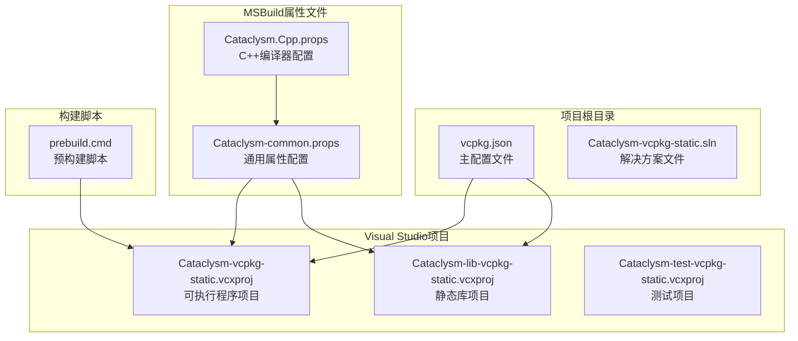
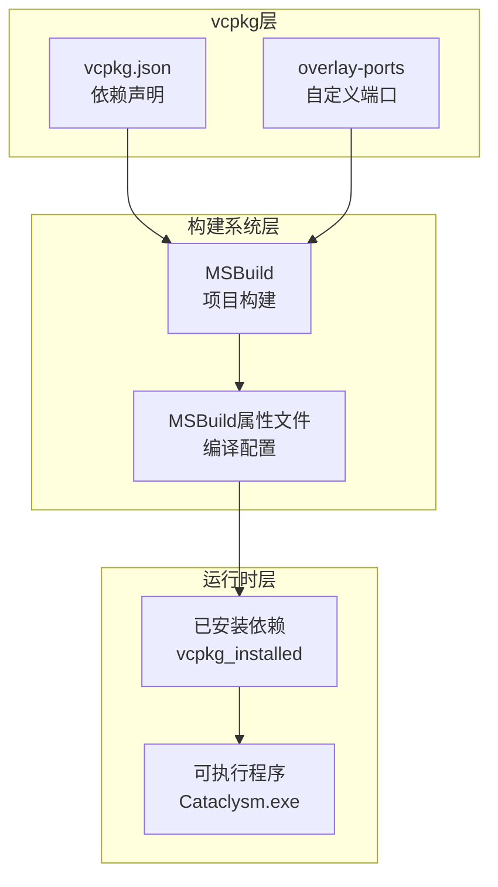
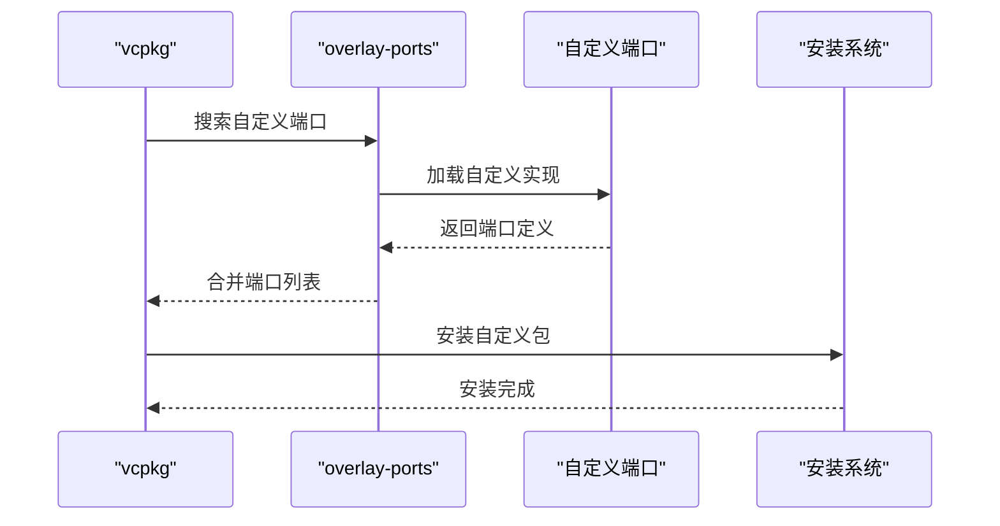
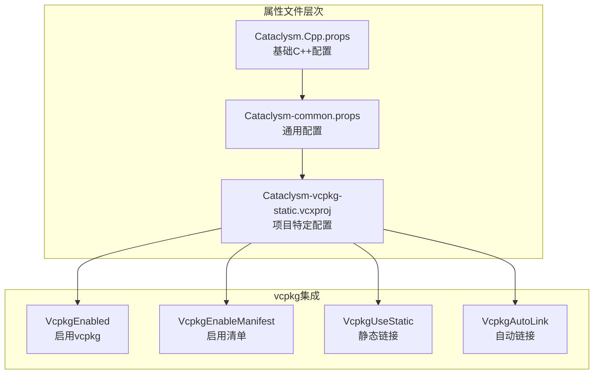
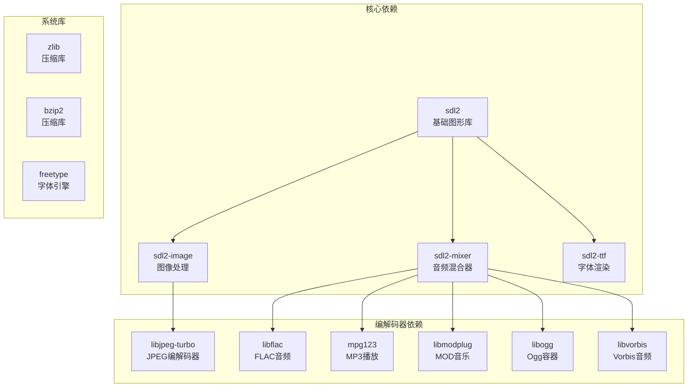
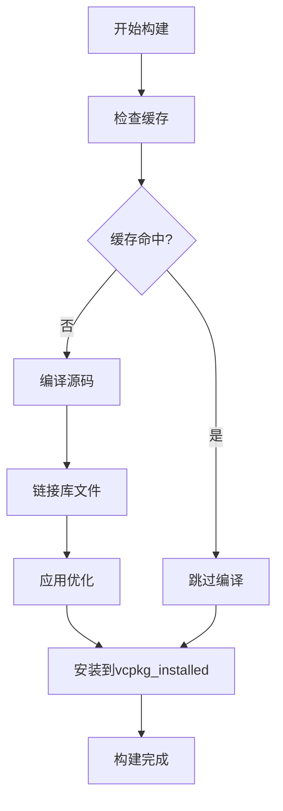

# vcpkg配置详解

<cite>
**本文档引用的文件**
- [vcpkg.json](file://vcpkg.json)
- [Cataclysm-vcpkg-static.vcxproj](file://Cataclysm-vcpkg-static.vcxproj)
- [Cataclysm-lib-vcpkg-static.vcxproj](file://Cataclysm-lib-vcpkg-static.vcxproj)
- [Cataclysm-common.props](file://Cataclysm-common.props)
- [Cataclysm.Cpp.props](file://Cataclysm.Cpp.props)
- [prebuild.cmd](file://prebuild.cmd)
</cite>

## 目录
1. [简介](#简介)
2. [项目结构](#项目结构)
3. [核心组件](#核心组件)
4. [架构概览](#架构概览)
5. [详细组件分析](#详细组件分析)
6. [依赖关系分析](#依赖关系分析)
7. [性能考虑](#性能考虑)
8. [故障排除指南](#故障排除指南)
9. [结论](#结论)

## 简介

本项目是一个基于vcpkg包管理器的C++项目配置示例，展示了如何在Visual Studio环境中使用vcpkg进行依赖管理。该项目专注于游戏《Cataclysm: Dark Days Ahead》的编译配置，特别是静态链接库的构建方式。

vcpkg是一个跨平台的C++包管理器，允许开发者声明性地管理第三方库依赖。本项目通过vcpkg.json配置文件定义了所有依赖项，并通过MSBuild属性文件集成到Visual Studio构建系统中。

## 项目结构

该项目采用模块化的设计，将vcpkg配置与Visual Studio项目配置分离：



**图表来源**
- [vcpkg.json:1-22](file://vcpkg.json#L1-L22)
- [Cataclysm-vcpkg-static.vcxproj:1-236](file://Cataclysm-vcpkg-static.vcxproj#L1-L236)
- [Cataclysm-lib-vcpkg-static.vcxproj:1-191](file://Cataclysm-lib-vcpkg-static.vcxproj#L1-L191)

**章节来源**
- [vcpkg.json:1-22](file://vcpkg.json#L1-L22)
- [Cataclysm-vcpkg-static.vcxproj:1-236](file://Cataclysm-vcpkg-static.vcxproj#L1-L236)
- [Cataclysm-lib-vcpkg-static.vcxproj:1-191](file://Cataclysm-lib-vcpkg-static.vcxproj#L1-L191)

## 核心组件

### vcpkg.json配置文件

vcpkg.json是vcpkg的清单文件，定义了项目的依赖关系和配置选项。该文件包含以下关键组件：

#### 基础配置字段

- **name**: 定义包的名称，用于标识vcpkg清单
- **version-string**: 定义包的版本字符串，支持语义化版本格式
- **dependencies**: 数组形式定义所有依赖项
- **vcpkg-configuration**: 配置vcpkg行为的高级选项

#### 依赖项声明语法

依赖项可以采用两种形式：
1. **简单依赖**: 直接指定包名的字符串
2. **复杂依赖**: 对象形式，包含包名和特性列表

**章节来源**
- [vcpkg.json:1-22](file://vcpkg.json#L1-L22)

## 架构概览

该项目采用分层架构，将vcpkg配置与构建系统分离：



**图表来源**
- [vcpkg.json:16-20](file://vcpkg.json#L16-L20)
- [Cataclysm-vcpkg-static.vcxproj:63-73](file://Cataclysm-vcpkg-static.vcxproj#L63-L73)

## 详细组件分析

### vcpkg.json配置详解

#### 基础字段分析

**name字段**
- 作用：唯一标识vcpkg清单包
- 设置方法：使用有意义的包名，避免与现有vcpkg包冲突
- 最佳实践：使用项目名称或功能描述作为前缀

**version-string字段**
- 作用：定义包的版本信息
- 支持格式：语义化版本（如"1.0.0"）或自定义字符串
- 使用场景：标记依赖集合的版本，便于追踪和回溯

#### 依赖项配置

**简单依赖声明**
```json
"sdl2"
```
这种形式适用于不需要额外特性的标准包。

**复杂依赖声明**
```json
{
  "name": "sdl2-image",
  "features": [ "libjpeg-turbo" ]
}
```
这种形式允许精确控制包的特性组合。

**依赖项类型分析**

1. **sdl2**: 基础图形和输入处理库
2. **sdl2-image**: 图像处理扩展，启用libjpeg-turbo特性
3. **sdl2-mixer**: 音频混合器，启用多个音频编解码器特性
4. **sdl2-ttf**: TrueType字体渲染库

#### 特性配置策略

每个依赖项的特性配置遵循以下模式：
- **特性选择**: 仅启用必要的特性，减少二进制大小
- **编解码器特性**: 音频和图像编解码器按需启用
- **兼容性考虑**: 确保特性组合的向后兼容性

**章节来源**
- [vcpkg.json:4-15](file://vcpkg.json#L4-L15)

### vcpkg-configuration配置

#### overlay-ports机制

overlay-ports是vcpkg的核心功能，允许用户添加自定义端口：



**图表来源**
- [vcpkg.json:16-20](file://vcpkg.json#L16-L20)

**overlay-ports配置分析**
- **路径格式**: 使用相对路径指向自定义端口目录
- **优先级**: overlay-ports中的端口优先于官方vcpkg端口
- **用途**: 添加官方未提供的包或修改现有包的行为

**章节来源**
- [vcpkg.json:16-20](file://vcpkg.json#L16-L20)

### Visual Studio集成配置

#### MSBuild属性文件体系

项目使用三层属性文件组织配置：



**图表来源**
- [Cataclysm.Cpp.props:1-11](file://Cataclysm.Cpp.props#L1-L11)
- [Cataclysm-common.props:23-40](file://Cataclysm-common.props#L23-L40)
- [Cataclysm-vcpkg-static.vcxproj:63-73](file://Cataclysm-vcpkg-static.vcxproj#L63-L73)

**章节来源**
- [Cataclysm.Cpp.props:1-11](file://Cataclysm.Cpp.props#L1-L11)
- [Cataclysm-common.props:23-40](file://Cataclysm-common.props#L23-L40)
- [Cataclysm-vcpkg-static.vcxproj:63-73](file://Cataclysm-vcpkg-static.vcxproj#L63-L73)

## 依赖关系分析

### 依赖项关系图



**图表来源**
- [vcpkg.json:4-15](file://vcpkg.json#L4-L15)

### 特性依赖关系

每个特性都对应特定的功能模块：

| 依赖项 | 特性 | 功能 |
|--------|------|------|
| sdl2-image | libjpeg-turbo | JPEG图像格式支持 |
| sdl2-mixer | libflac | FLAC无损音频格式 |
| sdl2-mixer | mpg123 | MP3音频播放 |
| sdl2-mixer | libmodplug | MOD音乐格式支持 |
| sdl2-mixer | libogg + libvorbis | Ogg/Vorbis音频格式 |

**章节来源**
- [vcpkg.json:6-14](file://vcpkg.json#L6-L14)

## 性能考虑

### 构建优化策略

#### 静态链接配置

项目采用静态链接策略，具有以下优势：
- **部署简化**: 减少运行时依赖
- **性能提升**: 避免动态加载开销
- **兼容性**: 提高不同系统的兼容性

#### 编译器优化



**图表来源**
- [Cataclysm-common.props:23-25](file://Cataclysm-common.props#L23-L25)

**章节来源**
- [Cataclysm-common.props:23-25](file://Cataclysm-common.props#L23-L25)

## 故障排除指南

### 常见问题及解决方案

#### vcpkg安装问题

**问题**: 依赖项安装失败
**解决方案**: 
1. 检查网络连接和代理设置
2. 清理vcpkg缓存
3. 更新vcpkg到最新版本

#### 版本冲突问题

**问题**: 不同依赖项要求不同版本的同一库
**解决方案**:
1. 分析依赖树，识别冲突来源
2. 调整依赖项版本约束
3. 使用overlay-ports提供兼容版本

#### 构建配置问题

**问题**: MSBuild无法找到vcpkg依赖
**解决方案**:
1. 验证VcpkgEnableManifest设置
2. 检查triplet配置是否正确
3. 确认vcpkg_installed目录存在

**章节来源**
- [Cataclysm-common.props:36-40](file://Cataclysm-common.props#L36-L40)
- [Cataclysm-vcpkg-static.vcxproj:63-73](file://Cataclysm-vcpkg-static.vcxproj#L63-L73)

## 结论

本项目展示了vcpkg在大型C++项目中的最佳实践应用。通过合理的依赖管理、特性配置和构建系统集成，实现了高效的跨平台开发体验。

### 关键要点总结

1. **依赖管理**: 使用vcpkg.json集中管理所有依赖项
2. **特性控制**: 精确控制包的特性组合，减少不必要的依赖
3. **自定义扩展**: 利用overlay-ports机制添加自定义端口
4. **构建集成**: 通过MSBuild属性文件无缝集成vcpkg到构建流程
5. **性能优化**: 采用静态链接策略提升运行时性能

### 未来改进建议

1. **依赖更新**: 定期审查和更新依赖项版本
2. **特性优化**: 进一步精简不必要的特性组合
3. **构建缓存**: 实施更完善的构建缓存策略
4. **CI集成**: 在持续集成中验证vcpkg配置的正确性