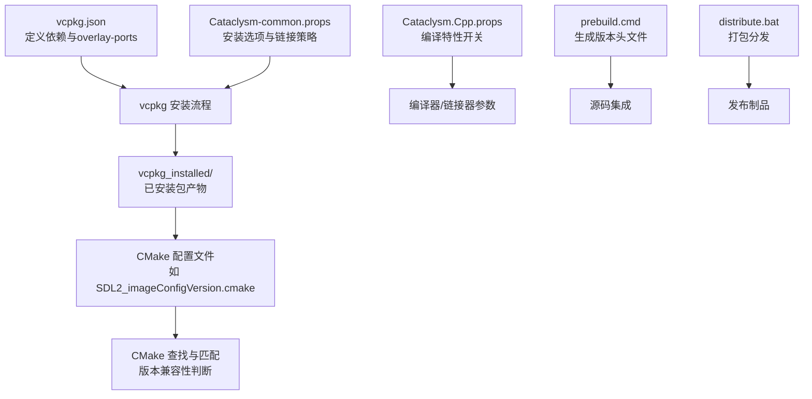
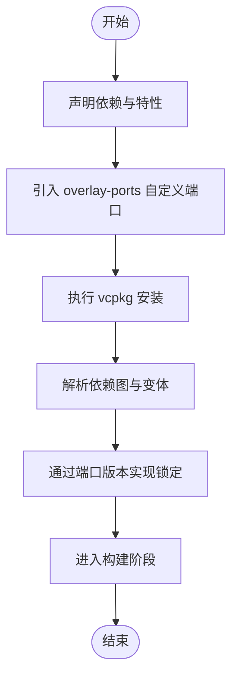
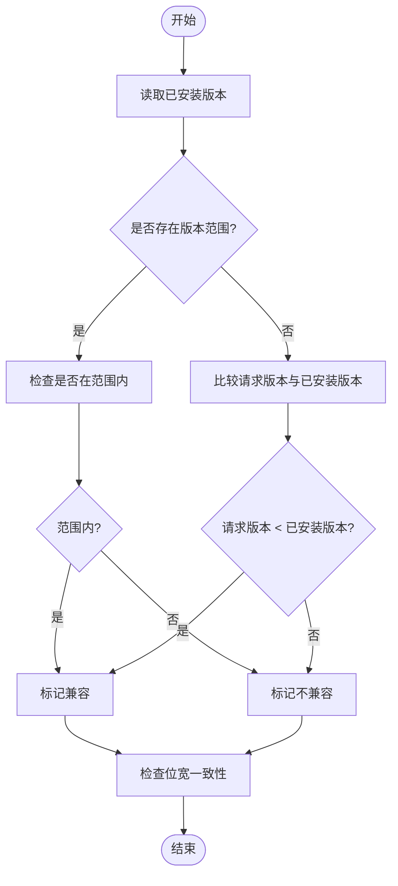
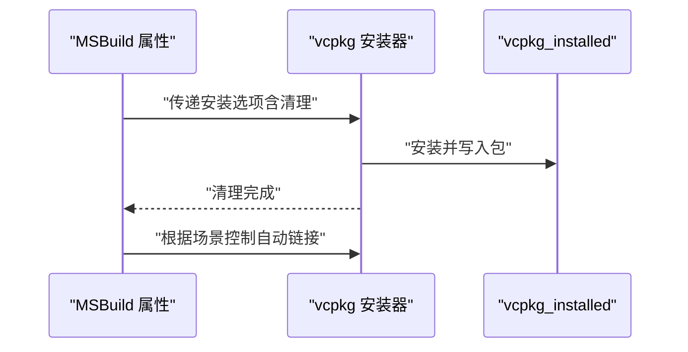
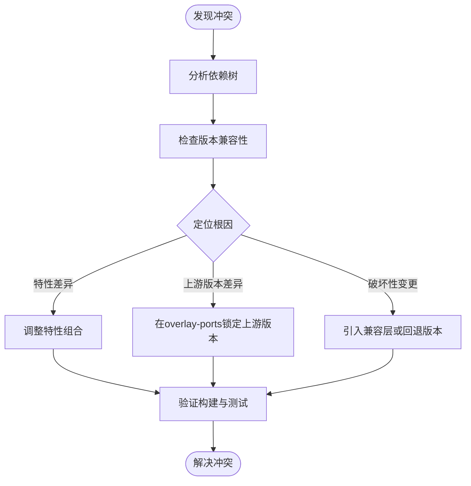
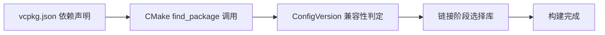

# 依赖版本管理

<cite>
**本文引用的文件**
- [vcpkg.json](file://vcpkg.json)
- [Cataclysm-common.props](file://Cataclysm-common.props)
- [Cataclysm.Cpp.props](file://Cataclysm.Cpp.props)
- [prebuild.cmd](file://prebuild.cmd)
- [distribute.bat](file://distribute.bat)
- [SDL2_imageConfigVersion.cmake](file://vcpkg_installed/x64-windows-static/x64-windows-static/share/SDL2_image/SDL2_imageConfigVersion.cmake)
- [SDL2_mixerConfigVersion.cmake](file://vcpkg_installed/x64-windows-static/x64-windows-static/share/SDL2_mixer/SDL2_mixerConfigVersion.cmake)
- [SDL2_ttfConfigVersion.cmake](file://vcpkg_installed/x64-windows-static/x64-windows-static/share/SDL2_ttf/SDL2_ttfConfigVersion.cmake)
</cite>

## 目录
1. [引言](#引言)
2. [项目结构](#项目结构)
3. [核心组件](#核心组件)
4. [架构总览](#架构总览)
5. [详细组件分析](#详细组件分析)
6. [依赖关系分析](#依赖关系分析)
7. [性能考量](#性能考量)
8. [故障排查指南](#故障排查指南)
9. [结论](#结论)
10. [附录](#附录)

## 引言
本文件围绕该vcpkg项目的依赖版本管理策略进行系统化解读，重点覆盖以下主题：
- 在该工程中，版本字符串采用“语义化版本”的思想但以字符串形式表达；如何通过vcpkg.json声明依赖及overlay-ports扩展点。
- 通过CMake配置文件展示的版本兼容性判断逻辑，帮助理解“主版本/次版本/修订版本”在查找与匹配中的实际影响。
- 版本锁定与版本范围的表达方式、依赖升级策略（安全更新、功能增强、破坏性变更）的处理思路。
- 版本冲突的诊断与解决路径（依赖树分析、版本回退策略），以及overlay-ports中自定义包版本管理与维护要点。
- 平衡依赖新旧与项目稳定性的实践建议。

## 项目结构
该项目使用vcpkg作为Windows静态链接依赖管理工具，并通过MSBuild属性文件控制安装行为与链接细节。关键文件与职责如下：
- vcpkg.json：定义项目名称、版本字符串、依赖列表与overlay-ports扩展路径。
- Cataclysm-common.props：统一的MSBuild属性与vcpkg安装选项，包含清理策略与自动链接开关等。
- Cataclysm.Cpp.props：条件化启用缓存编译等构建特性。
- SDL2系列的CMake版本文件：展示CMake Config模式下的版本匹配与兼容性判定逻辑。
- prebuild.cmd/distribute.bat：辅助脚本，用于生成版本头文件与打包分发。



**图表来源**
- [vcpkg.json:1-22](file://vcpkg.json#L1-L22)
- [Cataclysm-common.props:23-40](file://Cataclysm-common.props#L23-L40)
- [SDL2_imageConfigVersion.cmake:10-30](file://vcpkg_installed/x64-windows-static/x64-windows-static/share/SDL2_image/SDL2_imageConfigVersion.cmake#L10-L30)

**章节来源**
- [vcpkg.json:1-22](file://vcpkg.json#L1-L22)
- [Cataclysm-common.props:23-40](file://Cataclysm-common.props#L23-L40)
- [Cataclysm.Cpp.props:1-11](file://Cataclysm.Cpp.props#L1-L11)

## 核心组件
- 项目版本字符串与依赖声明
  - 项目自身使用“version-string”字段表达版本意图，当前值为字符串形式，体现“开发分支/实验性”风格。
  - 依赖通过数组声明，部分包以对象形式附加特性（如sdl2-image的libjpeg-turbo特性）。
  - overlay-ports指向共享的自定义端口目录，便于集中维护第三方包补丁或定制版本。
- vcpkg安装与清理策略
  - 通过MSBuild属性传递额外安装参数，启用“安装后清理”，有助于减少磁盘占用并保持环境整洁。
  - 在特定链接器场景下关闭自动链接，改用手动枚举库，确保与工具链兼容。
- CMake版本文件的兼容性判定
  - 各依赖包的ConfigVersion文件负责比较“请求版本”与“已安装版本”，决定是否兼容或精确匹配。

**章节来源**
- [vcpkg.json:1-22](file://vcpkg.json#L1-L22)
- [Cataclysm-common.props:23-40](file://Cataclysm-common.props#L23-L40)
- [SDL2_imageConfigVersion.cmake:10-30](file://vcpkg_installed/x64-windows-static/x64-windows-static/share/SDL2_image/SDL2_imageConfigVersion.cmake#L10-L30)

## 架构总览
下图展示了从vcpkg.json到CMake查找、再到最终链接的完整流程，以及版本字符串与版本兼容性在其中的作用。

```mermaid
sequenceDiagram
participant Dev as "开发者"
participant VConf as "vcpkg.json"
participant VInst as "vcpkg 安装器"
participant Store as "vcpkg_installed 存储"
participant CMake as "CMake 查找"
participant CVer as "ConfigVersion 文件"
participant Link as "链接阶段"
Dev->>VConf : "声明依赖与overlay-ports"
VConf->>VInst : "解析依赖图并安装"
VInst->>Store : "写入包与配置文件"
Dev->>CMake : "调用 find_package(…)"
CMake->>CVer : "读取版本信息与兼容性规则"
CVer-->>CMake : "返回兼容性结果"
CMake-->>Link : "选择满足条件的包版本"
Link-->>Dev : "完成构建与链接"
```

**图表来源**
- [vcpkg.json:1-22](file://vcpkg.json#L1-L22)
- [SDL2_imageConfigVersion.cmake:10-30](file://vcpkg_installed/x64-windows-static/x64-windows-static/share/SDL2_image/SDL2_imageConfigVersion.cmake#L10-L30)
- [SDL2_mixerConfigVersion.cmake:10-30](file://vcpkg_installed/x64-windows-static/x64-windows-static/share/SDL2_mixer/SDL2_mixerConfigVersion.cmake#L10-L30)
- [SDL2_ttfConfigVersion.cmake:10-30](file://vcpkg_installed/x64-windows-static/x64-windows-static/share/SDL2_ttf/SDL2_ttfConfigVersion.cmake#L10-L30)

## 详细组件分析

### 组件A：版本字符串与依赖声明
- 版本字符串
  - 工程使用“version-string”字段表达版本意图，当前值为字符串形式，体现对实验性或开发分支的强调。
  - 在语义化版本实践中，该字段可作为“项目级版本标签”，用于标识整体构建的版本上下文。
- 依赖声明
  - 基础依赖直接以名称列出；复杂包通过对象形式声明，允许指定特性集合，从而影响所选变体与下游兼容性。
  - 通过“overlay-ports”引入自定义端口，便于在不修改上游vcpkg仓库的情况下维护定制版本或补丁。
- 版本锁定与范围
  - vcpkg.json本身不直接支持“版本范围”语法；版本锁定通常通过固定提交或分支、以及overlay-ports中的特定端口版本来实现。
  - 若需严格锁定，可在CI中固定vcpkg提交ID与overlay-ports路径，确保可重复构建。



**图表来源**
- [vcpkg.json:1-22](file://vcpkg.json#L1-L22)

**章节来源**
- [vcpkg.json:1-22](file://vcpkg.json#L1-L22)

### 组件B：CMake版本兼容性判定
- 判定逻辑
  - 已安装版本与请求版本比较，决定是否“完全匹配”和“兼容”。
  - 支持版本范围查询（最小/最大边界），并考虑位宽一致性检查。
- 实际影响
  - 当请求版本低于已安装版本时，通常视为兼容；当请求版本高于已安装版本时，可能触发不兼容。
  - 对于破坏性变更（如主版本升级），应结合特性开关与接口变化进行评估，必要时通过overlay-ports提供兼容层或回退版本。



**图表来源**
- [SDL2_imageConfigVersion.cmake:10-44](file://vcpkg_installed/x64-windows-static/x64-windows-static/share/SDL2_image/SDL2_imageConfigVersion.cmake#L10-L44)
- [SDL2_mixerConfigVersion.cmake:10-44](file://vcpkg_installed/x64-windows-static/x64-windows-static/share/SDL2_mixer/SDL2_mixerConfigVersion.cmake#L10-L44)
- [SDL2_ttfConfigVersion.cmake:10-44](file://vcpkg_installed/x64-windows-static/x64-windows-static/share/SDL2_ttf/SDL2_ttfConfigVersion.cmake#L10-L44)

**章节来源**
- [SDL2_imageConfigVersion.cmake:10-44](file://vcpkg_installed/x64-windows-static/x64-windows-static/share/SDL2_image/SDL2_imageConfigVersion.cmake#L10-L44)
- [SDL2_mixerConfigVersion.cmake:10-44](file://vcpkg_installed/x64-windows-static/x64-windows-static/share/SDL2_mixer/SDL2_mixerConfigVersion.cmake#L10-L44)
- [SDL2_ttfConfigVersion.cmake:10-44](file://vcpkg_installed/x64-windows-static/x64-windows-static/share/SDL2_ttf/SDL2_ttfConfigVersion.cmake#L10-L44)

### 组件C：安装与清理策略
- 清理策略
  - 通过MSBuild属性传递“安装后清理”选项，降低存储占用并避免历史残留影响后续安装。
- 自动链接控制
  - 在某些链接器场景下关闭自动链接，改为手动列举库，确保与工具链兼容并避免参数传递问题。
- 与overlay-ports协作
  - overlay-ports中的自定义端口版本可与清理策略配合，形成“可重复、可控”的依赖环境。



**图表来源**
- [Cataclysm-common.props:23-40](file://Cataclysm-common.props#L23-L40)

**章节来源**
- [Cataclysm-common.props:23-40](file://Cataclysm-common.props#L23-L40)

### 组件D：版本冲突诊断与解决
- 诊断步骤
  - 依赖树分析：确认哪些包同时依赖不同版本的同一上游库；定位冲突根因。
  - 版本范围与兼容性：结合CMake ConfigVersion文件的判定逻辑，识别“请求版本过高/过低”导致的不兼容。
  - 变体与特性：检查特性组合是否导致了不同的变体选择，进而引发冲突。
- 解决策略
  - 版本回退：在overlay-ports中提供较低版本的端口，或锁定到已知稳定的版本。
  - 升级路径：优先进行安全更新与小版本增强；对破坏性变更，先在隔离环境中验证兼容性。
  - 依赖裁剪：移除不必要的特性或替换为更稳定的替代方案。



**图表来源**
- [vcpkg.json:1-22](file://vcpkg.json#L1-L22)
- [SDL2_imageConfigVersion.cmake:10-44](file://vcpkg_installed/x64-windows-static/x64-windows-static/share/SDL2_image/SDL2_imageConfigVersion.cmake#L10-L44)

**章节来源**
- [vcpkg.json:1-22](file://vcpkg.json#L1-L22)

### 组件E：overlay-ports中的自定义包版本管理
- 管理方式
  - 通过“overlay-ports”集中存放自定义端口，便于版本化管理与复用。
  - 可针对特定需求提供补丁、定制版本或与上游不一致的变体。
- 维护与更新
  - 建议为每个自定义端口建立独立分支或标签，明确版本与变更记录。
  - 在CI中固定overlay-ports的提交ID，确保可重复构建。
  - 更新时先在隔离环境中验证兼容性，再批量推广。

**章节来源**
- [vcpkg.json:16-20](file://vcpkg.json#L16-L20)

### 组件F：平衡依赖新旧与项目稳定性
- 策略建议
  - 稳定期：优先采用已验证的稳定版本，减少破坏性变更风险。
  - 进步期：对安全更新与关键修复采用快速通道，结合自动化测试保障回归。
  - 开发期：通过overlay-ports与特性开关控制实验性变更的影响面。
- 工具与流程
  - 使用“安装后清理”与“固定提交ID”的CI流程，确保可重复构建。
  - 结合CMake版本兼容性判定，提前发现潜在不兼容。

**章节来源**
- [Cataclysm-common.props:23-40](file://Cataclysm-common.props#L23-L40)
- [vcpkg.json:1-22](file://vcpkg.json#L1-L22)

## 依赖关系分析
- 依赖声明与特性
  - 项目声明了若干基础图形/音频/字体相关依赖，并通过特性开关选择具体实现（如图像库的JPEG Turbo变体）。
- CMake配置文件的约束
  - 各依赖包的ConfigVersion文件决定了“请求版本”与“已安装版本”的匹配关系，直接影响能否成功找到并使用目标包。
- 安装与链接的耦合
  - vcpkg安装的包版本与CMake查找的版本必须一致或满足兼容性条件；否则需要调整依赖声明或通过overlay-ports提供适配版本。



**图表来源**
- [vcpkg.json:4-15](file://vcpkg.json#L4-L15)
- [SDL2_imageConfigVersion.cmake:10-30](file://vcpkg_installed/x64-windows-static/x64-windows-static/share/SDL2_image/SDL2_imageConfigVersion.cmake#L10-L30)

**章节来源**
- [vcpkg.json:4-15](file://vcpkg.json#L4-L15)
- [SDL2_imageConfigVersion.cmake:10-30](file://vcpkg_installed/x64-windows-static/x64-windows-static/share/SDL2_image/SDL2_imageConfigVersion.cmake#L10-L30)

## 性能考量
- 安装后清理可显著减少磁盘占用，缩短后续安装时间。
- 在特定链接器场景下禁用自动链接并手动列举库，可避免参数传递问题，提升构建稳定性。
- overlay-ports集中管理可减少重复下载与编译，提高整体效率。

**章节来源**
- [Cataclysm-common.props:23-40](file://Cataclysm-common.props#L23-L40)

## 故障排查指南
- 常见问题与定位
  - 找不到包：检查vcpkg.json中的依赖名称与特性是否正确，确认overlay-ports路径有效。
  - 版本不兼容：查看对应包的ConfigVersion文件，确认请求版本与已安装版本的关系。
  - 链接失败：在使用特定链接器时，确认是否启用了手动枚举库的设置。
- 处理步骤
  - 回溯依赖树，定位冲突根因。
  - 通过overlay-ports锁定或替换版本，验证构建。
  - 在CI中固定vcpkg与overlay-ports的提交ID，确保可重复构建。

**章节来源**
- [vcpkg.json:1-22](file://vcpkg.json#L1-L22)
- [Cataclysm-common.props:36-40](file://Cataclysm-common.props#L36-L40)
- [SDL2_imageConfigVersion.cmake:10-44](file://vcpkg_installed/x64-windows-static/x64-windows-static/share/SDL2_image/SDL2_imageConfigVersion.cmake#L10-L44)

## 结论
本项目采用“版本字符串+overlay-ports”的组合策略管理依赖版本：通过vcpkg.json声明依赖与扩展点，借助CMake ConfigVersion文件实现版本兼容性判定，并以MSBuild属性控制安装与链接行为。在实践中，建议：
- 将overlay-ports作为版本锁定与定制的核心手段；
- 以“稳定优先、渐进更新”为原则，结合自动化测试与CI固定提交ID；
- 遇到冲突时，先进行依赖树分析与兼容性评估，再采取回退或升级策略。

## 附录
- 生成版本头文件与打包分发脚本用于构建产物的版本化与交付，可与vcpkg的版本管理策略协同工作，确保构建产物与依赖版本的一致性。

**章节来源**
- [prebuild.cmd:1-16](file://prebuild.cmd#L1-L16)
- [distribute.bat:1-11](file://distribute.bat#L1-L11)