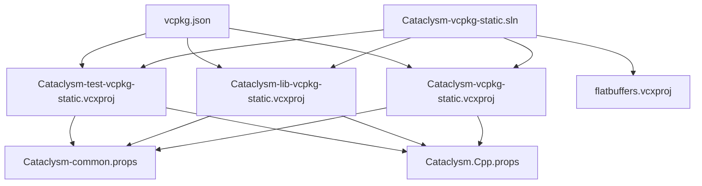
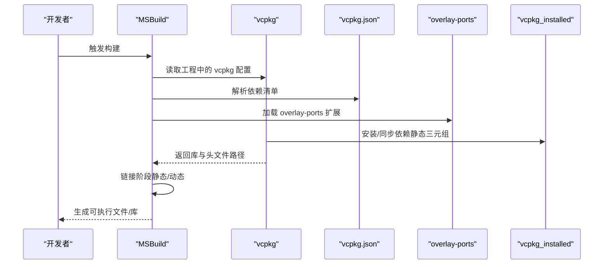
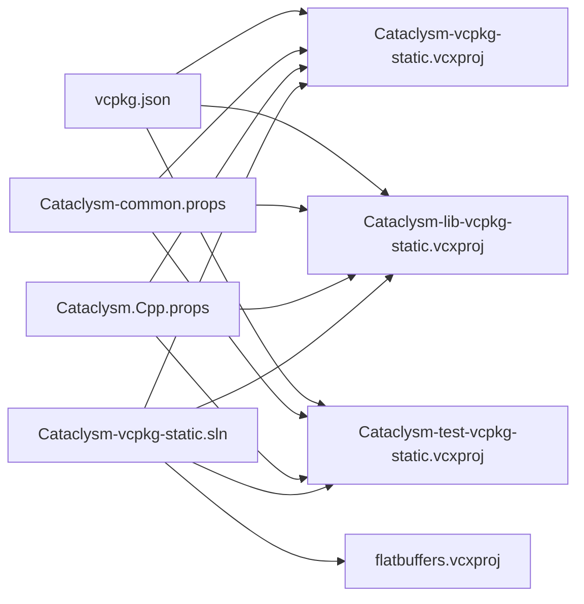

# 依赖管理系统

<cite>
**本文引用的文件**
- [vcpkg.json](file://vcpkg.json)
- [Cataclysm-common.props](file://Cataclysm-common.props)
- [Cataclysm-vcpkg-static.vcxproj](file://Cataclysm-vcpkg-static.vcxproj)
- [Cataclysm-lib-vcpkg-static.vcxproj](file://Cataclysm-lib-vcpkg-static.vcxproj)
- [Cataclysm-test-vcpkg-static.vcxproj](file://Cataclysm-test-vcpkg-static.vcxproj)
- [Cataclysm-vcpkg-static.sln](file://Cataclysm-vcpkg-static.sln)
- [Cataclysm.Cpp.props](file://Cataclysm.Cpp.props)
</cite>

## 目录
1. [简介](#简介)
2. [项目结构](#项目结构)
3. [核心组件](#核心组件)
4. [架构总览](#架构总览)
5. [详细组件分析](#详细组件分析)
6. [依赖关系分析](#依赖关系分析)
7. [性能考量](#性能考量)
8. [故障排查指南](#故障排查指南)
9. [结论](#结论)
10. [附录](#附录)

## 简介
本文件系统性阐述 MSVC Full Features 项目的依赖管理策略，聚焦于 vcpkg.json 配置、SDL2 生态组件的选型与特性开关、overlay-ports 自定义端口机制、版本管理与锁定策略、依赖更新最佳实践、冲突处理方法，以及静态链接对依赖树与最终二进制体积的影响与优化建议。文档同时提供面向非专业读者的可读性说明与面向工程实践的可视化图示。

## 项目结构
该仓库采用 MSBuild 解决方案组织，通过 vcpkg 清单驱动依赖安装与构建集成。核心结构如下：
- vcpkg.json：声明依赖集合与 overlay-ports 路径，作为依赖管理入口
- .props 属性文件：集中定义编译器、链接器与 vcpkg 行为参数
- 多个 .vcxproj 工程：分别对应主程序、库、测试与工具模块
- 解决方案文件：统一编排所有工程

图表来源
- [Cataclysm-vcpkg-static.sln:1-189](file://Cataclysm-vcpkg-static.sln#L1-L189)
- [Cataclysm-vcpkg-static.vcxproj:60-73](file://Cataclysm-vcpkg-static.vcxproj#L60-L73)
- [Cataclysm-lib-vcpkg-static.vcxproj:60-71](file://Cataclysm-lib-vcpkg-static.vcxproj#L60-L71)
- [Cataclysm-test-vcpkg-static.vcxproj:60-73](file://Cataclysm-test-vcpkg-static.vcxproj#L60-L73)
- [Cataclysm-common.props:23-40](file://Cataclysm-common.props#L23-L40)
- [vcpkg.json:1-21](file://vcpkg.json#L1-L21)

章节来源
- [Cataclysm-vcpkg-static.sln:1-189](file://Cataclysm-vcpkg-static.sln#L1-L189)
- [Cataclysm-vcpkg-static.vcxproj:60-73](file://Cataclysm-vcpkg-static.vcxproj#L60-L73)
- [Cataclysm-lib-vcpkg-static.vcxproj:60-71](file://Cataclysm-lib-vcpkg-static.vcxproj#L60-L71)
- [Cataclysm-test-vcpkg-static.vcxproj:60-73](file://Cataclysm-test-vcpkg-static.vcxproj#L60-L73)
- [Cataclysm-common.props:23-40](file://Cataclysm-common.props#L23-L40)
- [vcpkg.json:1-21](file://vcpkg.json#L1-L21)

## 核心组件
- vcpkg 清单与 overlay-ports
  - 清单定义了依赖集合与 vcpkg 配置（如 overlay-ports），用于扩展或覆盖默认端口
  - 通过 VcpkgEnableManifest/VcpkgManifestInstall 控制是否启用清单与自动安装
- 属性文件与工程配置
  - .props 文件集中设置 vcpkg 行为、工具链路径、静态链接与链接器选项
  - 各工程按平台选择 x86/x64 静态三元组，并在不同配置下控制调试/发布行为
- 静态链接策略
  - 明确启用静态链接，减少运行时依赖，便于分发
  - 在使用 LLD 链接器时禁用自动链接并手动枚举依赖库，确保兼容性

章节来源
- [vcpkg.json:1-21](file://vcpkg.json#L1-L21)
- [Cataclysm-common.props:23-40](file://Cataclysm-common.props#L23-L40)
- [Cataclysm-vcpkg-static.vcxproj:60-73](file://Cataclysm-vcpkg-static.vcxproj#L60-L73)
- [Cataclysm-lib-vcpkg-static.vcxproj:60-71](file://Cataclysm-lib-vcpkg-static.vcxproj#L60-L71)
- [Cataclysm-test-vcpkg-static.vcxproj:60-73](file://Cataclysm-test-vcpkg-static.vcxproj#L60-L73)

## 架构总览
vcpkg 作为依赖管理与安装后处理的核心，与 MSBuild 工程紧密耦合。其工作流概览如下：

图表来源
- [vcpkg.json:16-20](file://vcpkg.json#L16-L20)
- [Cataclysm-vcpkg-static.vcxproj:60-73](file://Cataclysm-vcpkg-static.vcxproj#L60-L73)
- [Cataclysm-lib-vcpkg-static.vcxproj:60-71](file://Cataclysm-lib-vcpkg-static.vcxproj#L60-L71)
- [Cataclysm-test-vcpkg-static.vcxproj:60-73](file://Cataclysm-test-vcpkg-static.vcxproj#L60-L73)
- [Cataclysm-common.props:23-40](file://Cataclysm-common.props#L23-L40)

## 详细组件分析

### vcpkg.json 配置与依赖项
- 名称与版本字符串
  - 使用语义化版本字符串标识依赖集版本，便于追踪与回溯
- 依赖声明
  - 基础图形与输入库：SDL2、SDL2-image（启用 libjpeg-turbo）、SDL2-mixer（启用 libflac、mpg123、libmodplug）、SDL2-ttf
  - 这些组件共同构成图形界面、音效播放与字体渲染的基础能力
- vcpkg 配置
  - overlay-ports 指向 .github/vcpkg_ports，允许引入自定义端口或补丁

章节来源
- [vcpkg.json:1-21](file://vcpkg.json#L1-L21)

### SDL2 生态组件功能与配置要点
- SDL2
  - 提供跨平台基础窗口、事件与渲染上下文接口
- SDL2-image
  - 图像加载与编解码；启用 libjpeg-turbo 提升 JPEG 性能
- SDL2-mixer
  - 音频混合与播放；启用 libflac、mpg123、libmodplug 支持多种音频格式
- SDL2-ttf
  - 字体渲染与文本绘制

章节来源
- [vcpkg.json:4-15](file://vcpkg.json#L4-L15)

### overlay-ports 机制与自定义包
- overlay-ports 的作用
  - 将自定义端口目录加入 vcpkg 搜索路径，优先于默认端口
  - 可用于引入尚未进入官方库的包、应用项目特定补丁或定制版本
- 使用方式
  - 在 vcpkg.json 中通过 vcpkg-configuration.overlay-ports 指定相对路径
  - 工程侧通过 VcpkgEnableManifest/VcpkgManifestInstall 控制清单启用与安装流程

章节来源
- [vcpkg.json:16-20](file://vcpkg.json#L16-L20)
- [Cataclysm-vcpkg-static.vcxproj:60-73](file://Cataclysm-vcpkg-static.vcxproj#L60-L73)
- [Cataclysm-lib-vcpkg-static.vcxproj:60-71](file://Cataclysm-lib-vcpkg-static.vcxproj#L60-L71)
- [Cataclysm-test-vcpkg-static.vcxproj:60-73](file://Cataclysm-test-vcpkg-static.vcxproj#L60-L73)

### 依赖版本管理策略
- 版本字符串
  - vcpkg.json 中的 version-string 用于标识依赖集版本，便于追踪与回滚
- 三元组与静态链接
  - 工程针对 Win32/x64/ARM64EC 平台选择 x86-windows-static 或 x64-windows-static 静态三元组，确保静态链接一致性
- 链接器与自动链接
  - 当启用 LLD 链接器时，禁用 VcpkgAutoLink 并手动列举依赖库，避免通配符不被 lld-link 接受的问题

章节来源
- [vcpkg.json:2-3](file://vcpkg.json#L2-L3)
- [Cataclysm-vcpkg-static.vcxproj:60-73](file://Cataclysm-vcpkg-static.vcxproj#L60-L73)
- [Cataclysm-lib-vcpkg-static.vcxproj:60-71](file://Cataclysm-lib-vcpkg-static.vcxproj#L60-L71)
- [Cataclysm-test-vcpkg-static.vcxproj:60-73](file://Cataclysm-test-vcpkg-static.vcxproj#L60-L73)
- [Cataclysm-common.props:33-40](file://Cataclysm-common.props#L33-L40)

### 依赖更新最佳实践
- 清单驱动更新
  - 通过修改 vcpkg.json 的依赖列表与版本字符串，结合 overlay-ports 引入定制端口
- 三元组一致性
  - 统一使用静态三元组，避免混用动态库导致的运行时问题
- 链接器兼容性
  - 若使用 LLD 链接器，保持手动枚举依赖库的策略，确保链接稳定
- 清理与缓存
  - 利用属性文件中的清理选项，在构建后清理安装产物，减少磁盘占用

章节来源
- [vcpkg.json:1-21](file://vcpkg.json#L1-L21)
- [Cataclysm-common.props:23-25](file://Cataclysm-common.props#L23-L25)
- [Cataclysm-vcpkg-static.vcxproj:60-73](file://Cataclysm-vcpkg-static.vcxproj#L60-L73)
- [Cataclysm-lib-vcpkg-static.vcxproj:60-71](file://Cataclysm-lib-vcpkg-static.vcxproj#L60-L71)
- [Cataclysm-test-vcpkg-static.vcxproj:60-73](file://Cataclysm-test-vcpkg-static.vcxproj#L60-L73)

### 依赖冲突处理
- 三元组与平台一致性
  - 为 Win32/x64/ARM64EC 统一指定静态三元组，避免不同平台三元组导致的 ABI 不匹配
- 静态链接优先
  - 全面启用静态链接，减少 DLL 冲突与运行时缺失问题
- 手动依赖枚举
  - 在 LLD 链接器场景下禁用自动链接并手动列出依赖库，规避通配符兼容性问题

章节来源
- [Cataclysm-vcpkg-static.vcxproj:60-73](file://Cataclysm-vcpkg-static.vcxproj#L60-L73)
- [Cataclysm-lib-vcpkg-static.vcxproj:60-71](file://Cataclysm-lib-vcpkg-static.vcxproj#L60-L71)
- [Cataclysm-test-vcpkg-static.vcxproj:60-73](file://Cataclysm-test-vcpkg-static.vcxproj#L60-L73)
- [Cataclysm-common.props:33-40](file://Cataclysm-common.props#L33-L40)

### 静态链接对依赖管理的影响与优化
- 影响
  - 静态链接使最终二进制包含所需运行时代码，减少外部依赖，提升分发便利性
  - 需要确保所有依赖均为静态库或可静态链接版本
- 优化建议
  - 仅启用必要的 SDL2 功能与特性，减少额外依赖
  - 使用 LLD 链接器与薄归档等工具链优化，降低二进制体积
  - 在 Release 构建中开启链接器优化与调试信息剥离，进一步减小体积

章节来源
- [Cataclysm-common.props:29-40](file://Cataclysm-common.props#L29-L40)
- [Cataclysm-vcpkg-static.vcxproj:188-212](file://Cataclysm-vcpkg-static.vcxproj#L188-L212)
- [Cataclysm-lib-vcpkg-static.vcxproj:143-169](file://Cataclysm-lib-vcpkg-static.vcxproj#L143-L169)

## 依赖关系分析
以下图示展示工程、属性文件与 vcpkg 清单之间的依赖关系：

图表来源
- [vcpkg.json:1-21](file://vcpkg.json#L1-L21)
- [Cataclysm-vcpkg-static.vcxproj:60-73](file://Cataclysm-vcpkg-static.vcxproj#L60-L73)
- [Cataclysm-lib-vcpkg-static.vcxproj:60-71](file://Cataclysm-lib-vcpkg-static.vcxproj#L60-L71)
- [Cataclysm-test-vcpkg-static.vcxproj:60-73](file://Cataclysm-test-vcpkg-static.vcxproj#L60-L73)
- [Cataclysm-common.props:23-40](file://Cataclysm-common.props#L23-L40)
- [Cataclysm.Cpp.props:1-11](file://Cataclysm.Cpp.props#L1-L11)
- [Cataclysm-vcpkg-static.sln:1-189](file://Cataclysm-vcpkg-static.sln#L1-L189)

章节来源
- [vcpkg.json:1-21](file://vcpkg.json#L1-L21)
- [Cataclysm-vcpkg-static.sln:1-189](file://Cataclysm-vcpkg-static.sln#L1-L189)
- [Cataclysm-common.props:23-40](file://Cataclysm-common.props#L23-L40)

## 性能考量
- 链接器与工具链
  - 在支持场景下启用 LLD 链接器与 LLVM thin archives，有助于加速链接与减小体积
- 编译与链接优化
  - Release 构建中启用链接器优化与调试信息剥离，平衡体积与调试需求
- 依赖裁剪
  - 仅启用必要的 SDL2 特性，避免引入不必要的第三方库

章节来源
- [Cataclysm-common.props:29-40](file://Cataclysm-common.props#L29-L40)
- [Cataclysm-vcpkg-static.vcxproj:188-212](file://Cataclysm-vcpkg-static.vcxproj#L188-L212)
- [Cataclysm-lib-vcpkg-static.vcxproj:143-169](file://Cataclysm-lib-vcpkg-static.vcxproj#L143-L169)

## 故障排查指南
- LLD 链接器兼容性
  - 症状：使用 LLD 链接器时报错，提示无法接受通配符依赖
  - 处理：禁用 VcpkgAutoLink 并手动枚举依赖库，确保每个静态库显式列出
- 三元组不一致
  - 症状：不同平台三元组导致链接失败或运行时异常
  - 处理：统一使用静态三元组（x86-windows-static 或 x64-windows-static），并在 ARM64EC 场景映射到 x64
- 清理与缓存
  - 建议：在构建后清理安装产物，避免旧版本残留影响后续构建

章节来源
- [Cataclysm-common.props:33-40](file://Cataclysm-common.props#L33-L40)
- [Cataclysm-vcpkg-static.vcxproj:60-73](file://Cataclysm-vcpkg-static.vcxproj#L60-L73)
- [Cataclysm-lib-vcpkg-static.vcxproj:60-71](file://Cataclysm-lib-vcpkg-static.vcxproj#L60-L71)
- [Cataclysm-test-vcpkg-static.vcxproj:60-73](file://Cataclysm-test-vcpkg-static.vcxproj#L60-L73)
- [Cataclysm-common.props:23-25](file://Cataclysm-common.props#L23-L25)

## 结论
本项目通过 vcpkg 清单与 overlay-ports 实现了清晰、可追溯且可扩展的依赖管理。结合静态链接、统一三元组与 LLD 链接器策略，有效降低了运行时依赖复杂度与冲突风险。建议在更新依赖时遵循清单驱动与最小化原则，并在需要时利用自定义端口满足特殊需求。

## 附录
- 关键配置要点速查
  - vcpkg 清单：依赖列表、版本字符串、overlay-ports
  - 工程三元组：Win32/x64/ARM64EC 对应静态三元组
  - 链接器：LLD 链接器需禁用自动链接并手动枚举依赖
  - 清理：构建后清理安装产物

章节来源
- [vcpkg.json:1-21](file://vcpkg.json#L1-L21)
- [Cataclysm-common.props:23-40](file://Cataclysm-common.props#L23-L40)
- [Cataclysm-vcpkg-static.vcxproj:60-73](file://Cataclysm-vcpkg-static.vcxproj#L60-L73)
- [Cataclysm-lib-vcpkg-static.vcxproj:60-71](file://Cataclysm-lib-vcpkg-static.vcxproj#L60-L71)
- [Cataclysm-test-vcpkg-static.vcxproj:60-73](file://Cataclysm-test-vcpkg-static.vcxproj#L60-L73)