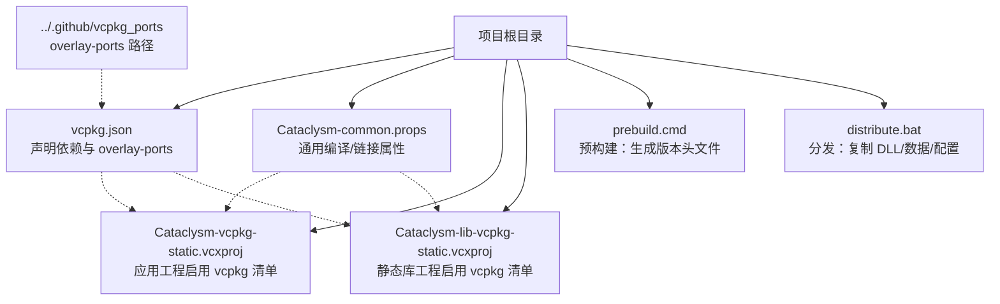
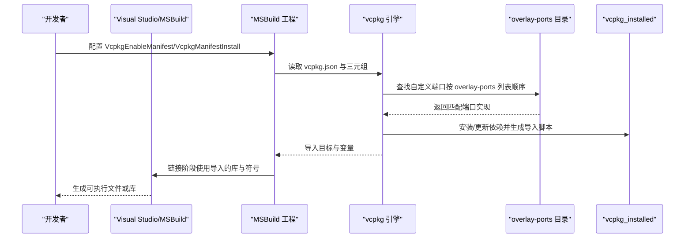
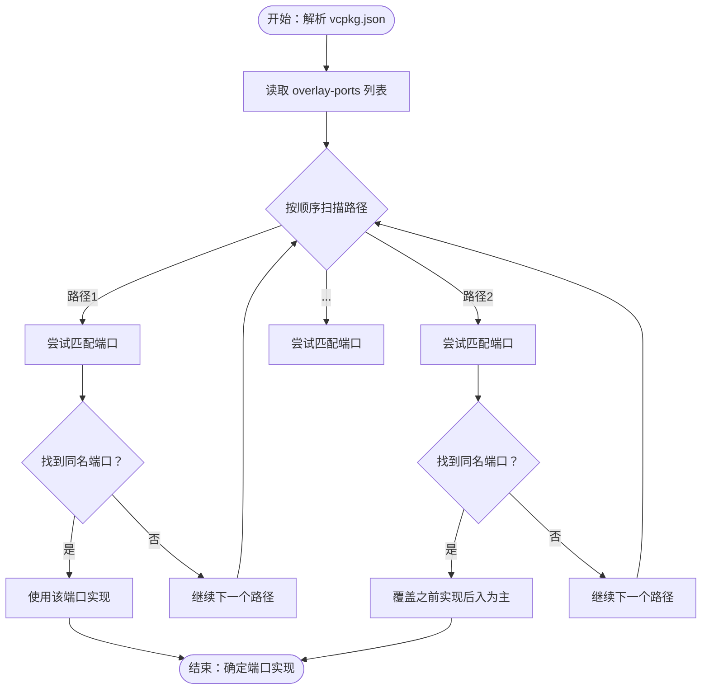
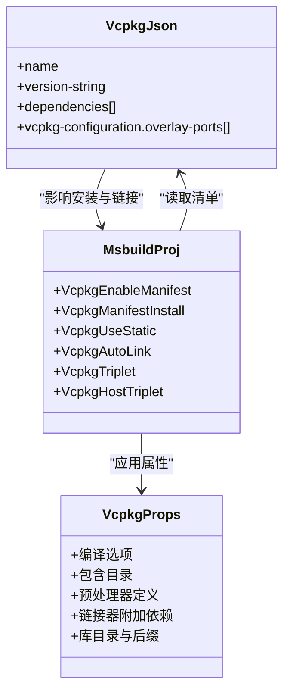
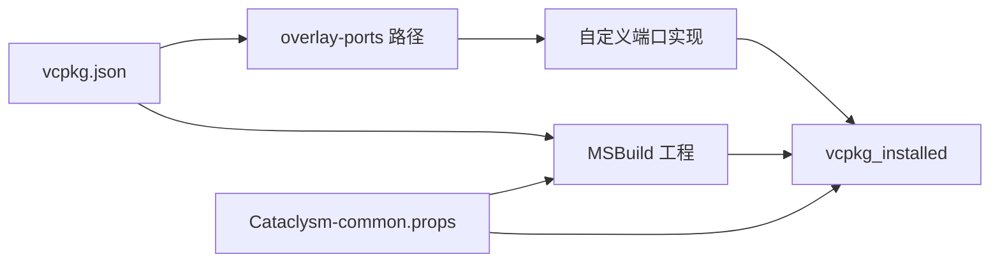

# 自定义端口开发

<cite>
**本文引用的文件**
- [vcpkg.json](file://vcpkg.json)
- [Cataclysm-common.props](file://Cataclysm-common.props)
- [Cataclysm-vcpkg-static.vcxproj](file://Cataclysm-vcpkg-static.vcxproj)
- [Cataclysm-lib-vcpkg-static.vcxproj](file://Cataclysm-lib-vcpkg-static.vcxproj)
- [prebuild.cmd](file://prebuild.cmd)
- [distribute.bat](file://distribute.bat)
</cite>

## 目录
1. [简介](#简介)
2. [项目结构](#项目结构)
3. [核心组件](#核心组件)
4. [架构总览](#架构总览)
5. [详细组件分析](#详细组件分析)
6. [依赖关系分析](#依赖关系分析)
7. [性能考虑](#性能考虑)
8. [故障排查指南](#故障排查指南)
9. [结论](#结论)
10. [附录](#附录)

## 简介
本文件面向需要在 Windows 平台上使用 vcpkg 的开发者，系统性讲解如何开发与维护自定义端口（port），重点围绕 overlay-ports 机制的工作原理与配置方法，覆盖从端口模板编写到测试验证的全流程；同时给出端口文件标准结构（portfile.cmake、vcpkg.json、CONTROL）的职责与规范，解析依赖声明、编译选项与安装路径设置，并提供常见问题的调试思路与最佳实践。

## 项目结构
该仓库采用 MSBuild 工程与 vcpkg 清单配合的方式进行依赖管理与构建集成。关键点如下：
- vcpkg 清单位于根目录，声明依赖与 overlay-ports 路径，用于引入自定义端口。
- 多个 MSBuild 工程通过 Vcpkg 属性启用清单模式、静态链接、自动链接等行为。
- 通用属性文件集中定义编译器、链接器与第三方库依赖列表，便于统一维护。
- 预构建脚本负责版本号注入，分发脚本负责打包运行时产物。

图表来源
- [vcpkg.json:16-20](file://vcpkg.json#L16-L20)
- [Cataclysm-common.props:23-40](file://Cataclysm-common.props#L23-L40)
- [Cataclysm-vcpkg-static.vcxproj:63-72](file://Cataclysm-vcpkg-static.vcxproj#L63-L72)
- [Cataclysm-lib-vcpkg-static.vcxproj:60-71](file://Cataclysm-lib-vcpkg-static.vcxproj#L60-L71)

章节来源
- [vcpkg.json:1-21](file://vcpkg.json#L1-L21)
- [Cataclysm-common.props:1-154](file://Cataclysm-common.props#L1-L154)
- [Cataclysm-vcpkg-static.vcxproj:1-236](file://Cataclysm-vcpkg-static.vcxproj#L1-L236)
- [Cataclysm-lib-vcpkg-static.vcxproj:1-191](file://Cataclysm-lib-vcpkg-static.vcxproj#L1-L191)
- [prebuild.cmd:1-16](file://prebuild.cmd#L1-L16)
- [distribute.bat:1-11](file://distribute.bat#L1-L11)

## 核心组件
- vcpkg 清单（vcpkg.json）
  - 声明包名、版本与依赖项，支持为依赖指定特性（features）。
  - 通过 vcpkg-configuration.overlay-ports 指定自定义端口目录，实现 overlay-ports 机制。
- MSBuild 工程中的 vcpkg 集成
  - 启用 VcpkgEnableManifest、VcpkgManifestInstall、VcpkgUseStatic、VcpkgAutoLink 等属性，控制是否使用清单、安装方式、链接模式与自动链接行为。
  - 通过 VcpkgTriplet/VcpkgHostTriplet 指定目标三元组。
- 通用属性文件（.props）
  - 统一编译选项、包含目录、预处理器定义、链接器附加依赖与库目录。
  - 在特定工具链（如 lld-link）下禁用自动链接并手动列举依赖，确保兼容性。
- 预构建与分发脚本
  - 预构建脚本根据 Git 描述生成版本头文件，保证运行时信息一致。
  - 分发脚本复制运行时 DLL、数据、配置与资源，便于打包发布。

章节来源
- [vcpkg.json:1-21](file://vcpkg.json#L1-L21)
- [Cataclysm-common.props:23-40](file://Cataclysm-common.props#L23-L40)
- [Cataclysm-vcpkg-static.vcxproj:63-72](file://Cataclysm-vcpkg-static.vcxproj#L63-L72)
- [Cataclysm-lib-vcpkg-static.vcxproj:60-71](file://Cataclysm-lib-vcpkg-static.vcxproj#L60-L71)
- [prebuild.cmd:1-16](file://prebuild.cmd#L1-L16)
- [distribute.bat:1-11](file://distribute.bat#L1-L11)

## 架构总览
下图展示从工程配置到 vcpkg 安装与链接的整体流程，以及 overlay-ports 的介入位置。

图表来源
- [vcpkg.json:16-20](file://vcpkg.json#L16-L20)
- [Cataclysm-vcpkg-static.vcxproj:63-72](file://Cataclysm-vcpkg-static.vcxproj#L63-L72)
- [Cataclysm-lib-vcpkg-static.vcxproj:60-71](file://Cataclysm-lib-vcpkg-static.vcxproj#L60-L71)

## 详细组件分析

### overlay-ports 机制与配置
- 工作原理
  - vcpkg 在解析依赖时，会先查找内置端口，若未找到，则按 vcpkg-configuration.overlay-ports 中列出的路径顺序查找自定义端口实现。
  - 若多个 overlay-ports 下存在同名端口，后者会覆盖前者，体现“后入为主”的优先级规则。
- 配置方法
  - 在 vcpkg.json 的 vcpkg-configuration.overlay-ports 中添加相对路径，确保与仓库根目录的相对关系正确。
  - 通常将 overlay-ports 放置于仓库外或受控目录，避免与上游端口冲突。
- 实际示例
  - 本仓库通过 vcpkg.json 指定 overlay-ports 为 ../.github/vcpkg_ports，从而在构建时优先使用该目录下的自定义端口实现。

图表来源
- [vcpkg.json:16-20](file://vcpkg.json#L16-L20)

章节来源
- [vcpkg.json:16-20](file://vcpkg.json#L16-L20)

### 端口文件标准结构与职责
- vcpkg.json（清单）
  - 作用：声明包名、版本、依赖与 vcpkg-configuration（含 overlay-ports）。
  - 规范：字段命名与类型需符合 vcpkg 规范；overlay-ports 使用数组形式，路径相对于清单文件所在目录。
- portfile.cmake（端口实现）
  - 作用：定义源码获取、补丁应用、编译与安装步骤；生成导入脚本与 ABI 标签。
  - 规范：遵循 vcpkg 端口模板约定，处理依赖、编译选项、安装路径与文件布局。
- CONTROL（元数据）
  - 作用：记录上游版本、摘要、依赖关系、维护者信息等。
  - 规范：字段与格式需满足 vcpkg 控制文件要求，便于包管理与审计。

章节来源
- [vcpkg.json:1-21](file://vcpkg.json#L1-L21)

### 依赖声明、编译选项与安装路径
- 依赖声明
  - 在 vcpkg.json 的 dependencies 数组中声明依赖包；对需要特定特性的包以对象形式指定 features。
  - 示例：为 sdl2-image 指定 libjpeg-turbo 特性，为 sdl2-mixer 指定 libflac、mpg123、libmodplug 等特性。
- 编译选项配置
  - 通过 .props 文件统一设置语言标准、警告级别、包含目录、预处理器定义与禁用特定警告。
  - 在工程属性中开启 VcpkgAutoLink 以自动链接 vcpkg 提供的库；在使用 lld-link 时禁用自动链接并手动列举依赖，确保链接器接受所需参数。
- 安装路径设置
  - 通过 VcpkgUseStatic 控制静态链接；通过 VcpkgTriplet/VcpkgHostTriplet 指定目标三元组，确保安装与链接的一致性。
  - 在 .props 中为 lld-link 设置库目录与库后缀，保证 Debug/Release 与静态库后缀的正确拼接。

图表来源
- [Cataclysm-common.props:23-40](file://Cataclysm-common.props#L23-L40)
- [vcpkg.json:1-21](file://vcpkg.json#L1-L21)
- [Cataclysm-vcpkg-static.vcxproj:63-72](file://Cataclysm-vcpkg-static.vcxproj#L63-L72)
- [Cataclysm-lib-vcpkg-static.vcxproj:60-71](file://Cataclysm-lib-vcpkg-static.vcxproj#L60-L71)

章节来源
- [vcpkg.json:4-15](file://vcpkg.json#L4-L15)
- [Cataclysm-common.props:41-140](file://Cataclysm-common.props#L41-L140)
- [Cataclysm-vcpkg-static.vcxproj:63-72](file://Cataclysm-vcpkg-static.vcxproj#L63-L72)
- [Cataclysm-lib-vcpkg-static.vcxproj:60-71](file://Cataclysm-lib-vcpkg-static.vcxproj#L60-L71)

### 创建新端口的完整流程
- 准备工作
  - 确认 overlay-ports 目录已正确配置于 vcpkg.json 的 vcpkg-configuration.overlay-ports。
  - 在本地创建端口目录，准备 portfile.cmake、vcpkg.json（端口自身清单）、CONTROL 等文件。
- 编写端口实现
  - 在 portfile.cmake 中实现下载、解压、打补丁、编译与安装逻辑；确保安装路径与导入脚本生成符合规范。
  - 在 CONTROL 中填写上游版本、摘要、依赖与维护者信息。
- 验证与测试
  - 使用 vcpkg 安装命令验证端口能否成功构建与安装。
  - 在 MSBuild 工程中启用 VcpkgEnableManifest 与 VcpkgManifestInstall，确认端口被正确解析与链接。
- 回归与优化
  - 在不同三元组（如 x86-windows-static、x64-windows-static）上重复验证。
  - 优化编译选项与安装路径，减少不必要的依赖与二进制体积。

章节来源
- [vcpkg.json:16-20](file://vcpkg.json#L16-L20)

### 常见端口开发问题与调试
- 编译失败
  - 检查 portfile.cmake 中的编译选项与工具链版本是否与工程一致。
  - 确认 CONTROL 与 portfile.cmake 的版本信息一致，避免 ABI 不匹配。
- 链接错误
  - 若使用 lld-link，禁用 VcpkgAutoLink 并在 .props 中手动列举所有依赖库与库后缀。
  - 核对 VcpkgTriplet 与 VcpkgHostTriplet 是否一致，避免交叉链接。
- 运行时问题
  - 使用 distribute.bat 或类似脚本复制运行时 DLL 至输出目录，确保程序启动时能找到所需动态库。
  - 通过 prebuild.cmd 注入版本信息，避免运行时因版本不一致导致的异常。

章节来源
- [Cataclysm-common.props:33-40](file://Cataclysm-common.props#L33-L40)
- [Cataclysm-common.props:91-139](file://Cataclysm-common.props#L91-L139)
- [distribute.bat:1-11](file://distribute.bat#L1-L11)
- [prebuild.cmd:1-16](file://prebuild.cmd#L1-L16)

### 贡献与维护最佳实践
- 贡献给社区
  - 将自定义端口提交至官方 vcpkg ports 仓库或组织内的共享仓库，遵循上游端口模板与规范。
  - 在提交前完成多平台验证与 ABI 兼容性检查，提供清晰的 CONTROL 与变更日志。
- 维护策略
  - 保持端口与上游版本同步，及时应用安全补丁与功能修复。
  - 在 overlay-ports 中仅放置必要的定制化端口，避免与上游端口产生冲突。
  - 通过 CI 流水线自动化验证不同三元组与配置下的构建结果。

## 依赖关系分析
- 工程与 vcpkg 的耦合
  - MSBuild 工程通过 VcpkgEnableManifest 与 VcpkgManifestInstall 与 vcpkg 清单建立强耦合，确保依赖解析与安装过程可控。
  - 通过 VcpkgUseStatic 与 VcpkgTriplet/VcpkgHostTriplet 统一静态链接与三元组，降低跨平台差异带来的风险。
- overlay-ports 的依赖注入
  - vcpkg.json 的 overlay-ports 列表决定自定义端口的可见性与优先级，影响最终安装与链接结果。
- 链接阶段的依赖
  - .props 文件中列出的附加依赖与库目录直接影响链接器行为，需与端口安装的库结构保持一致。

图表来源
- [vcpkg.json:16-20](file://vcpkg.json#L16-L20)
- [Cataclysm-vcpkg-static.vcxproj:63-72](file://Cataclysm-vcpkg-static.vcxproj#L63-L72)
- [Cataclysm-lib-vcpkg-static.vcxproj:60-71](file://Cataclysm-lib-vcpkg-static.vcxproj#L60-L71)
- [Cataclysm-common.props:91-139](file://Cataclysm-common.props#L91-L139)

章节来源
- [vcpkg.json:16-20](file://vcpkg.json#L16-L20)
- [Cataclysm-vcpkg-static.vcxproj:63-72](file://Cataclysm-vcpkg-static.vcxproj#L63-L72)
- [Cataclysm-lib-vcpkg-static.vcxproj:60-71](file://Cataclysm-lib-vcpkg-static.vcxproj#L60-L71)
- [Cataclysm-common.props:91-139](file://Cataclysm-common.props#L91-L139)

## 性能考虑
- 构建性能
  - 合理使用 VcpkgAdditionalInstallOptions（如清理策略）减少磁盘占用与重复安装时间。
  - 在 CI 中缓存 vcpkg_installed 与工具链，缩短构建时间。
- 链接性能
  - 在使用 lld-link 时禁用自动链接并手动列举依赖，避免链接器参数不兼容导致的重试与失败。
  - 统一三元组与静态链接策略，减少重复安装与 ABI 不匹配引发的二次构建。

## 故障排查指南
- 依赖未找到或版本不匹配
  - 检查 overlay-ports 路径是否正确，确认端口名称与版本在 CONTROL 与 portfile.cmake 中一致。
- 链接失败（lld-link）
  - 禁用 VcpkgAutoLink 并在 .props 中手动列出所有依赖库与库后缀，确保 Debug/Release 与静态库后缀拼接正确。
- 运行时缺失 DLL
  - 使用 distribute.bat 复制运行时 DLL 至输出目录，或在工程中配置 Post-Build 步骤自动复制。
- 版本信息不一致
  - 通过 prebuild.cmd 生成版本头文件，确保运行时版本与构建信息一致。

章节来源
- [Cataclysm-common.props:33-40](file://Cataclysm-common.props#L33-L40)
- [Cataclysm-common.props:91-139](file://Cataclysm-common.props#L91-L139)
- [distribute.bat:1-11](file://distribute.bat#L1-L11)
- [prebuild.cmd:1-16](file://prebuild.cmd#L1-L16)

## 结论
通过 overlay-ports 机制与 vcpkg 清单的协同，可以在不修改上游端口的前提下灵活扩展与定制依赖。结合 MSBuild 工程的 vcpkg 集成属性与 .props 文件的统一配置，能够实现跨平台、可复现且易于维护的依赖管理。建议在团队内统一端口模板与 CI 验证流程，持续改进性能与稳定性。

## 附录
- 快速参考
  - vcpkg.json：声明依赖与 overlay-ports
  - portfile.cmake：实现下载、编译、安装与导入脚本生成
  - CONTROL：记录元数据与依赖
  - .props：统一编译/链接选项与依赖列表
  - MSBuild 工程：启用 VcpkgEnableManifest/VcpkgManifestInstall/VcpkgUseStatic/VcpkgAutoLink/VcpkgTriplet