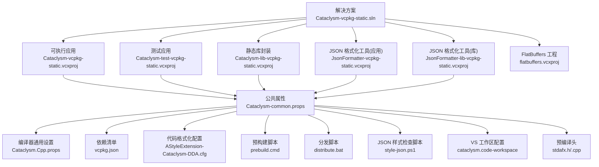
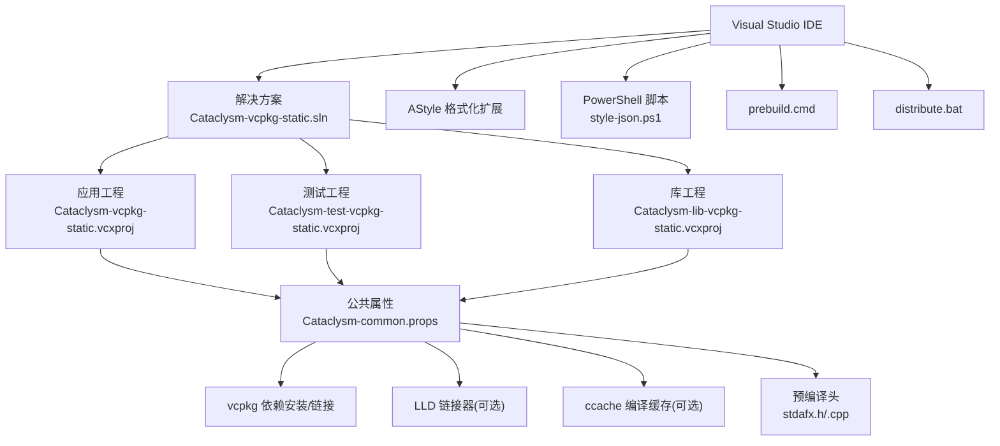
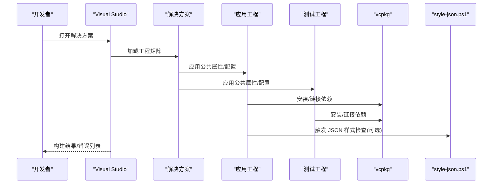
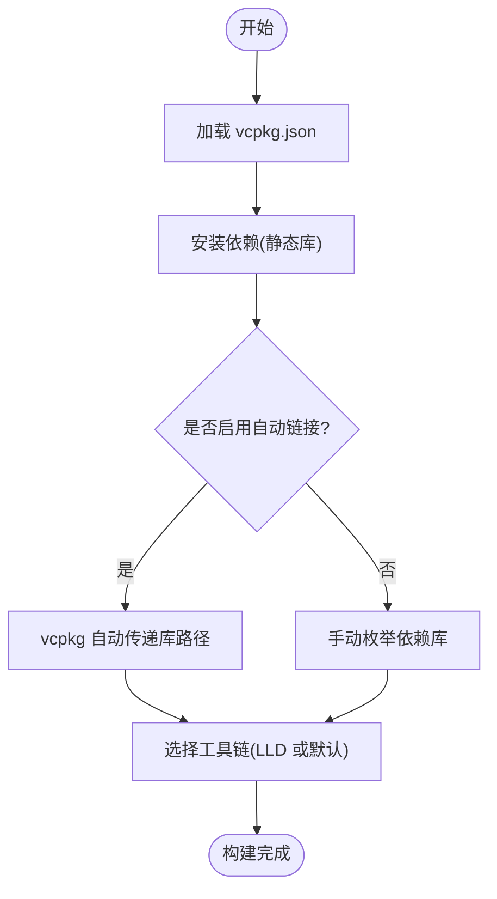
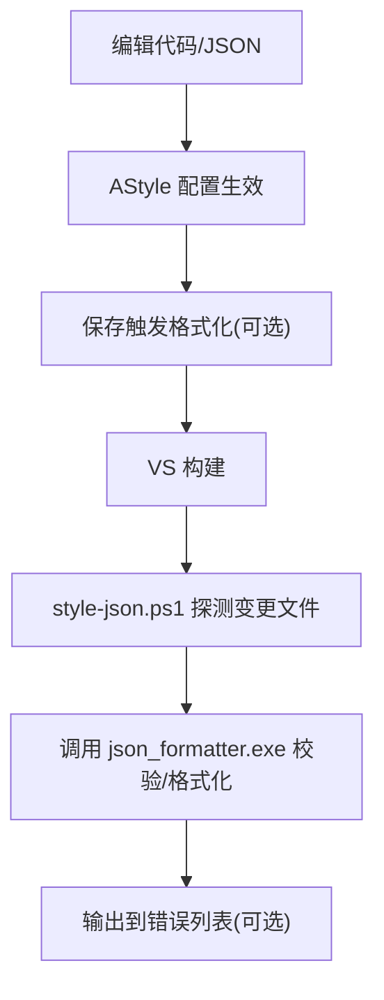
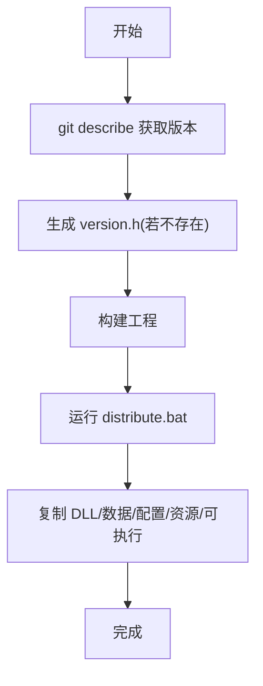
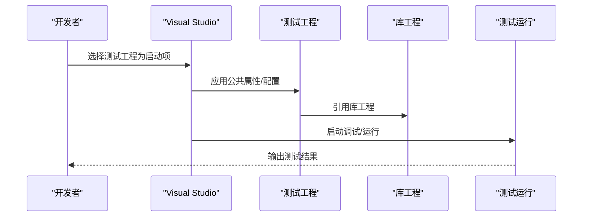
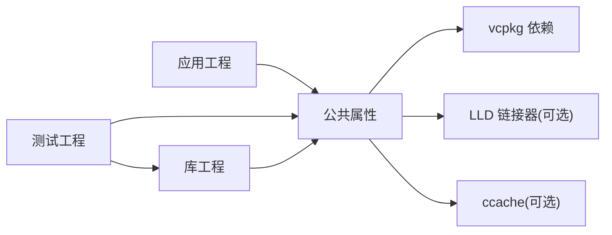

# 开发工作流

<cite>
**本文引用的文件**
- [Cataclysm-vcpkg-static.sln](file://Cataclysm-vcpkg-static.sln)
- [vcpkg.json](file://vcpkg.json)
- [Cataclysm.Cpp.props](file://Cataclysm.Cpp.props)
- [Cataclysm-common.props](file://Cataclysm-common.props)
- [AStyleExtension-Cataclysm-DDA.cfg](file://AStyleExtension-Cataclysm-DDA.cfg)
- [prebuild.cmd](file://prebuild.cmd)
- [distribute.bat](file://distribute.bat)
- [style-json.ps1](file://style-json.ps1)
- [cataclysm.code-workspace](file://cataclysm.code-workspace)
- [Cataclysm-vcpkg-static.vcxproj](file://Cataclysm-vcpkg-static.vcxproj)
- [Cataclysm-test-vcpkg-static.vcxproj](file://Cataclysm-test-vcpkg-static.vcxproj)
- [stdafx.h](file://stdafx.h)
- [stdafx.cpp](file://stdafx.cpp)
</cite>

## 目录
1. [简介](#简介)
2. [项目结构](#项目结构)
3. [核心组件](#核心组件)
4. [架构总览](#架构总览)
5. [详细组件分析](#详细组件分析)
6. [依赖关系分析](#依赖关系分析)
7. [性能考虑](#性能考虑)
8. [故障排查指南](#故障排查指南)
9. [结论](#结论)
10. [附录](#附录)

## 简介
本指南面向在 MSVC Full Features 工作区进行开发的团队与个人，覆盖从日常编码、编译、测试到调试的完整流程；解释 Visual Studio 解决方案与项目配置、团队协作最佳实践；落地代码规范与风格（含 AStyle 配置与自动化）；提供调试与性能分析建议；说明版本控制集成与分支策略；并给出开发环境个性化配置与效率提升技巧。

## 项目结构
该工作区以 Visual Studio 解决方案为中心，通过 .vcxproj 项目定义构建目标，配合 vcpkg 进行依赖管理，并提供预构建脚本、分发脚本与 JSON 样式检查脚本，形成“写码—编译—测试—分发”的闭环。

图表来源
- [Cataclysm-vcpkg-static.sln:17-28](file://Cataclysm-vcpkg-static.sln#L17-L28)
- [Cataclysm-common.props:1-154](file://Cataclysm-common.props#L1-L154)
- [Cataclysm.Cpp.props:1-11](file://Cataclysm.Cpp.props#L1-L11)
- [vcpkg.json:1-22](file://vcpkg.json#L1-L22)
- [AStyleExtension-Cataclysm-DDA.cfg:1-8](file://AStyleExtension-Cataclysm-DDA.cfg#L1-L8)
- [prebuild.cmd:1-16](file://prebuild.cmd#L1-L16)
- [distribute.bat:1-11](file://distribute.bat#L1-L11)
- [style-json.ps1:1-78](file://style-json.ps1#L1-L78)
- [cataclysm.code-workspace:1-22](file://cataclysm.code-workspace#L1-L22)
- [stdafx.h:1-96](file://stdafx.h#L1-L96)
- [stdafx.cpp:1-2](file://stdafx.cpp#L1-L2)

章节来源
- [Cataclysm-vcpkg-static.sln:1-189](file://Cataclysm-vcpkg-static.sln#L1-L189)
- [Cataclysm-common.props:1-154](file://Cataclysm-common.props#L1-L154)

## 核心组件
- 解决方案与多目标工程：一个 .sln 管理多个 .vcxproj，分别对应主程序、测试程序、静态库与工具工程，覆盖不同构建变体（如带/不带贴图、不同平台）。
- 依赖管理：vcpkg 清单集中声明 SDL2 及其特性（图像、音频、字体），并指定 overlay ports 路径。
- 公共属性：统一编译选项、警告级别、语言标准、包含目录、预编译头、链接器参数等；支持 LLD 链接、Thin Archives、ccache 等优化开关。
- 构建前/后脚本：prebuild.cmd 生成版本头；style-json.ps1 在 MSBuild 中触发 JSON 样式检查；distribute.bat 组织发行包。
- 代码风格：AStyle 配置提供统一缩进、断行、对齐等规则；VS 工作区关闭内建格式化，避免与 AStyle 冲突。
- 预编译头：stdafx.h 汇集常用 STL 与平台头，加速编译；stdafx.cpp 作为 pch 源文件。

章节来源
- [Cataclysm-vcpkg-static.sln:17-28](file://Cataclysm-vcpkg-static.sln#L17-L28)
- [vcpkg.json:1-22](file://vcpkg.json#L1-L22)
- [Cataclysm-common.props:41-144](file://Cataclysm-common.props#L41-L144)
- [AStyleExtension-Cataclysm-DDA.cfg:1-8](file://AStyleExtension-Cataclysm-DDA.cfg#L1-L8)
- [prebuild.cmd:1-16](file://prebuild.cmd#L1-L16)
- [style-json.ps1:1-78](file://style-json.ps1#L1-L78)
- [distribute.bat:1-11](file://distribute.bat#L1-L11)
- [cataclysm.code-workspace:1-22](file://cataclysm.code-workspace#L1-L22)
- [stdafx.h:1-96](file://stdafx.h#L1-L96)
- [stdafx.cpp:1-2](file://stdafx.cpp#L1-L2)

## 架构总览
下图展示 MSVC 工程在 Visual Studio 中的构建与运行路径，以及与外部工具（vcpkg、LLD、AStyle、PowerShell）的交互。

图表来源
- [Cataclysm-vcpkg-static.sln:17-28](file://Cataclysm-vcpkg-static.sln#L17-L28)
- [Cataclysm-common.props:23-40](file://Cataclysm-common.props#L23-L40)
- [Cataclysm.Cpp.props:4-10](file://Cataclysm.Cpp.props#L4-L10)
- [AStyleExtension-Cataclysm-DDA.cfg:1-8](file://AStyleExtension-Cataclysm-DDA.cfg#L1-L8)
- [style-json.ps1:1-78](file://style-json.ps1#L1-L78)
- [prebuild.cmd:1-16](file://prebuild.cmd#L1-L16)
- [distribute.bat:1-11](file://distribute.bat#L1-L11)
- [stdafx.h:1-96](file://stdafx.h#L1-L96)

## 详细组件分析

### 组件一：解决方案与工程矩阵
- 解决方案包含多个工程，覆盖应用、测试、库与工具，支持多种配置（Debug/Release、NoTiles 变体）与平台（Win32/x64/ARM64EC）。
- 工程共享公共属性，确保一致的编译与链接行为；部分工程启用自定义构建步骤（如 JSON 样式检查）。

图表来源
- [Cataclysm-vcpkg-static.sln:17-28](file://Cataclysm-vcpkg-static.sln#L17-L28)
- [Cataclysm-vcpkg-static.vcxproj:166-171](file://Cataclysm-vcpkg-static.vcxproj#L166-L171)
- [style-json.ps1:1-78](file://style-json.ps1#L1-L78)

章节来源
- [Cataclysm-vcpkg-static.sln:17-28](file://Cataclysm-vcpkg-static.sln#L17-L28)
- [Cataclysm-vcpkg-static.vcxproj:166-171](file://Cataclysm-vcpkg-static.vcxproj#L166-L171)

### 组件二：依赖管理与工具链
- vcpkg 清单声明 SDL2 及其特性（图像、音频、字体），并使用 overlay ports 覆盖本地端口。
- 公共属性中可启用 LLD 链接器与 Thin Archives，或使用 ccache 提升编译速度；自动链接在 LLD 模式下需手动枚举依赖。

图表来源
- [vcpkg.json:1-22](file://vcpkg.json#L1-L22)
- [Cataclysm-common.props:23-40](file://Cataclysm-common.props#L23-L40)

章节来源
- [vcpkg.json:1-22](file://vcpkg.json#L1-L22)
- [Cataclysm-common.props:23-40](file://Cataclysm-common.props#L23-L40)

### 组件三：代码规范与格式化自动化
- AStyle 配置提供统一风格（缩进、断行、对齐、最大行长等），并可在保存时格式化（可按需开启）。
- VS 工作区关闭内建格式化，推荐使用 AStyle 扩展；同时 PowerShell 脚本在 MSBuild 中对变更的 JSON 文件进行样式检查与输出。

图表来源
- [AStyleExtension-Cataclysm-DDA.cfg:1-8](file://AStyleExtension-Cataclysm-DDA.cfg#L1-L8)
- [cataclysm.code-workspace:9-13](file://cataclysm.code-workspace#L9-L13)
- [style-json.ps1:1-78](file://style-json.ps1#L1-L78)

章节来源
- [AStyleExtension-Cataclysm-DDA.cfg:1-8](file://AStyleExtension-Cataclysm-DDA.cfg#L1-L8)
- [cataclysm.code-workspace:9-13](file://cataclysm.code-workspace#L9-L13)
- [style-json.ps1:1-78](file://style-json.ps1#L1-L78)

### 组件四：预构建与发行流程
- prebuild.cmd 基于 Git 描述信息生成版本头，便于运行时显示版本。
- distribute.bat 将 DLL、数据、配置、资源与可执行文件复制到 distribution 目录，便于打包发布。

图表来源
- [prebuild.cmd:1-16](file://prebuild.cmd#L1-16)
- [distribute.bat:1-11](file://distribute.bat#L1-L11)

章节来源
- [prebuild.cmd:1-16](file://prebuild.cmd#L1-L16)
- [distribute.bat:1-11](file://distribute.bat#L1-L11)

### 组件五：测试工程与运行
- 测试工程继承公共属性，启用控制台子系统与特定预处理宏；引用主库工程以复用实现。
- 支持 Debug/Release 与 NoTiles 变体，便于快速验证功能与回归。

图表来源
- [Cataclysm-test-vcpkg-static.vcxproj:180-191](file://Cataclysm-test-vcpkg-static.vcxproj#L180-L191)
- [Cataclysm-test-vcpkg-static.vcxproj:123-174](file://Cataclysm-test-vcpkg-static.vcxproj#L123-L174)

章节来源
- [Cataclysm-test-vcpkg-static.vcxproj:180-191](file://Cataclysm-test-vcpkg-static.vcxproj#L180-L191)
- [Cataclysm-test-vcpkg-static.vcxproj:123-174](file://Cataclysm-test-vcpkg-static.vcxproj#L123-L174)

## 依赖关系分析
- 工程耦合：测试工程显式引用库工程；应用工程独立构建，但共享公共属性。
- 外部依赖：vcpkg 统一管理 SDL2 生态（图像、音频、字体），并在 LLD 模式下手动枚举依赖。
- 工具链：可选启用 LLD 链接器与 Thin Archives；可选启用 ccache；VS 版本差异导致 DebugFastLink 的兼容性处理。

图表来源
- [Cataclysm-test-vcpkg-static.vcxproj:188-190](file://Cataclysm-test-vcpkg-static.vcxproj#L188-L190)
- [Cataclysm-common.props:23-40](file://Cataclysm-common.props#L23-L40)

章节来源
- [Cataclysm-test-vcpkg-static.vcxproj:188-190](file://Cataclysm-test-vcpkg-static.vcxproj#L188-L190)
- [Cataclysm-common.props:23-40](file://Cataclysm-common.props#L23-L40)

## 性能考虑
- 编译性能
  - 启用多核编译与预编译头，减少重复包含开销。
  - 在满足条件时启用 LLD 链接器与 Thin Archives，缩短链接时间。
  - 可选启用 ccache，加速重复编译。
- 调试体验
  - 使用 DebugFastLink（在 VS 版本兼容前提下）提升调试启动速度；否则回退为 DebugFull。
  - 合理使用链接增量与 PDB 生成策略，平衡启动速度与符号完整性。
- 构建稳定性
  - 在 LLD 模式下禁用 vcpkg 自动链接，改为手动枚举依赖，避免链接器不兼容问题。
  - 控制 JSON 样式检查的超时阈值，避免长时间阻塞构建。

章节来源
- [Cataclysm-common.props:41-144](file://Cataclysm-common.props#L41-L144)
- [Cataclysm.Cpp.props:4-10](file://Cataclysm.Cpp.props#L4-L10)
- [style-json.ps1:20-22](file://style-json.ps1#L20-L22)

## 故障排查指南
- 版本头未生成
  - 现象：运行时无法显示版本号。
  - 排查：确认 Git 工具可用且仓库存在标签；检查 prebuild.cmd 是否成功生成 version.h。
- JSON 样式检查失败
  - 现象：MSBuild 报告样式检查警告或跳过。
  - 排查：确认 json_formatter.exe 存在且未被占用；检查 style-json.ps1 的执行日志；必要时提高超时阈值。
- LLD 链接报错
  - 现象：使用 LLD 时链接失败。
  - 排查：确认已禁用 vcpkg 自动链接并手动枚举所有依赖；检查 triplet 与库后缀匹配。
- 调试器崩溃或启动缓慢
  - 现象：VS 调试器异常或启动慢。
  - 排查：检查 VS 版本与工具集；在 VS 2022 17.7 之前，避免使用 DebugFastLink；必要时改用 DebugFull。

章节来源
- [prebuild.cmd:1-16](file://prebuild.cmd#L1-L16)
- [style-json.ps1:11-18](file://style-json.ps1#L11-L18)
- [Cataclysm-common.props:33-40](file://Cataclysm-common.props#L33-L40)
- [Cataclysm-common.props:81-85](file://Cataclysm-common.props#L81-L85)

## 结论
本工作区通过统一的公共属性、清晰的工程矩阵与完善的脚本体系，实现了稳定的 MSVC 构建与开发流程。结合 vcpkg 依赖管理、AStyle 代码风格与 JSON 样式检查，能够有效提升团队协作效率与代码质量。建议在日常开发中遵循本文流程与最佳实践，按需启用 LLD/Thin Archives/ccache 等优化手段，并持续完善分支与版本控制策略。

## 附录

### 日常开发流程清单
- 编码阶段
  - 使用 AStyle 扩展保持一致风格；VS 关闭内建格式化。
  - 修改 JSON 时，确保 style-json.ps1 能探测到变更并正确格式化。
- 构建阶段
  - 选择目标配置（Debug/Release、NoTiles）与平台（Win32/x64/ARM64EC）。
  - 若启用 LLD/Thin Archives/ccache，请确保环境变量与路径正确。
- 测试阶段
  - 切换测试工程为启动项，运行单元测试与基准测试。
  - 关注错误列表中的样式检查与链接器警告。
- 调试阶段
  - 使用断点、监视与调用堆栈定位问题；必要时启用回溯宏。
  - 对性能敏感模块，使用内置性能计数器或外部分析工具。
- 发布阶段
  - 运行 distribute.bat 组织发行包；核对 DLL、数据与可执行文件齐全。

### 团队协作最佳实践
- 分支策略
  - 主干保护：仅允许通过 MR/PR 合并；要求 CI 通过与至少一次审查。
  - 功能分支：基于 master 创建短期功能分支，定期 rebase 主干。
  - JSON 变更：优先在上游分支进行样式化后再合并，减少噪音。
- 版本控制集成
  - prebuild.cmd 依赖 Git；确保团队成员本地 Git 可用且配置一致。
  - 使用 vcpkg overlay ports 时，保持端口更新同步。
- 开发环境个性化
  - VS 工作区已关闭内建格式化，推荐安装 AStyle 扩展并导入 AStyle 配置。
  - 可根据需要启用 ccache 并设置工具路径；在 LLD 模式下注意依赖枚举。

### 调试技巧与性能分析
- 调试技巧
  - 使用条件断点与数据断点；利用即时窗口与监视表达式。
  - 对跨模块问题，启用模块符号与源映射；必要时使用回溯宏。
- 性能分析
  - 使用 Visual Studio 内置性能探查器；关注热点函数与内存分配。
  - 对 I/O 密集型场景（资源加载），关注磁盘与网络延迟。
  - 对音频/图形相关模块，结合第三方工具进行帧率与 GPU 占用分析。