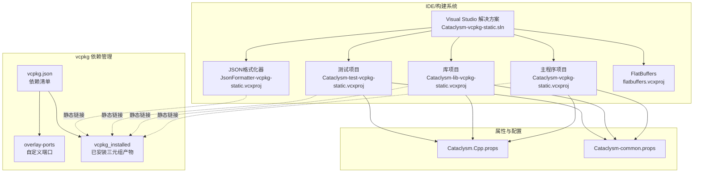
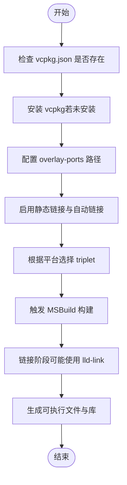
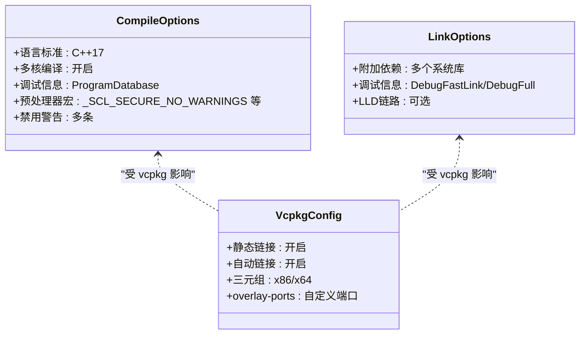
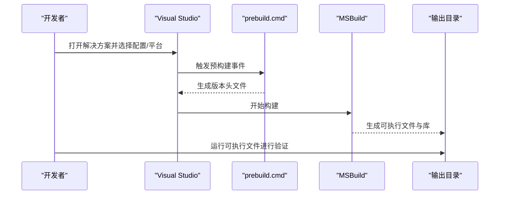
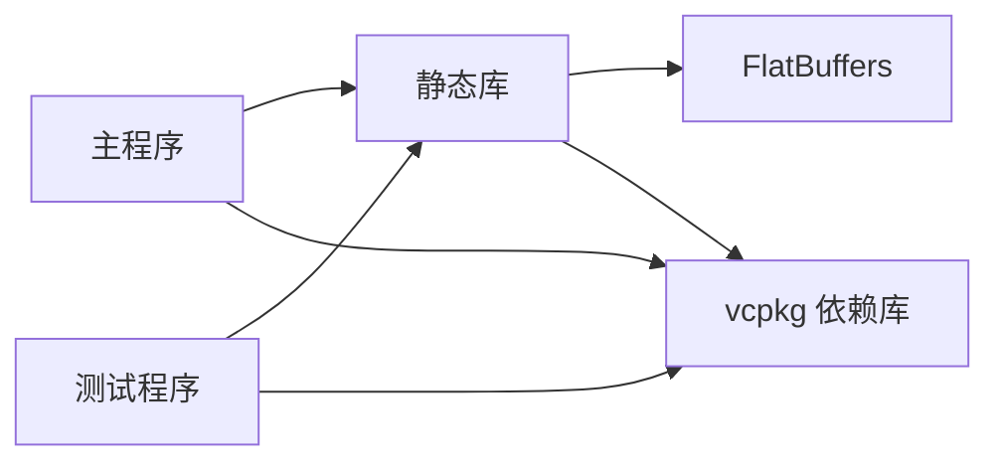

# 快速开始

<cite>
**本文引用的文件**
- [vcpkg.json](file://vcpkg.json)
- [Cataclysm-vcpkg-static.sln](file://Cataclysm-vcpkg-static.sln)
- [Cataclysm.Cpp.props](file://Cataclysm.Cpp.props)
- [Cataclysm-common.props](file://Cataclysm-common.props)
- [prebuild.cmd](file://prebuild.cmd)
- [distribute.bat](file://distribute.bat)
- [Cataclysm-vcpkg-static.vcxproj](file://Cataclysm-vcpkg-static.vcxproj)
- [Cataclysm-lib-vcpkg-static.vcxproj](file://Cataclysm-lib-vcpkg-static.vcxproj)
- [Cataclysm-test-vcpkg-static.vcxproj](file://Cataclysm-test-vcpkg-static.vcxproj)
- [flatbuffers.vcxproj](file://flatbuffers.vcxproj)
</cite>

## 目录
1. [简介](#简介)
2. [项目结构](#项目结构)
3. [核心组件](#核心组件)
4. [架构总览](#架构总览)
5. [详细组件分析](#详细组件分析)
6. [依赖关系分析](#依赖关系分析)
7. [性能注意事项](#性能注意事项)
8. [故障排查指南](#故障排查指南)
9. [结论](#结论)
10. [附录](#附录)

## 简介
本指南面向首次接触 MSVC Full Features（vcpkg 静态链接）项目的开发者，帮助你在 Windows 上完成从环境准备、vcpkg 包管理器安装与配置，到首次构建与运行的全流程。你将了解：
- Visual Studio 与 Windows SDK 的必备配置
- vcpkg 安装与配置，以及如何正确解析项目依赖
- 从克隆仓库到成功运行可执行程序的完整步骤
- 常见环境问题与解决方案
- 如何验证安装是否成功

## 项目结构
该仓库是一个基于 MSVC 的 Visual Studio 解决方案，使用 vcpkg 进行静态链接依赖管理，并通过 .props 属性文件统一编译与链接配置。主要文件与角色如下：
- 解决方案文件：定义了多个项目（主程序、库、测试、JSON 格式化器、FlatBuffers 工程）
- 属性文件：集中定义编译选项、预处理器宏、包含目录、链接器参数等
- vcpkg 清单：声明依赖项与 overlay ports 路径
- 构建辅助脚本：版本生成与分发打包

```mermaid
graph TB
sol["Cataclysm-vcpkg-static.sln<br/>解决方案"] --> app["Cataclysm-vcpkg-static.vcxproj<br/>主程序"]
sol --> lib["Cataclysm-lib-vcpkg-static.vcxproj<br/>静态库"]
sol --> test["Cataclysm-test-vcpkg-static.vcxproj<br/>测试程序"]
sol --> fmt["JsonFormatter-vcpkg-static.vcxproj<br/>JSON格式化器"]
sol --> fb["flatbuffers.vcxproj<br/>FlatBuffers"]
app --> props1["Cataclysm.Cpp.props"]
app --> props2["Cataclysm-common.props"]
lib --> props1
lib --> props2
test --> props1
test --> props2
app -. 使用 .props .-> props2
lib -. 使用 .props .-> props2
test -. 使用 .props .-> props2
app -. 依赖 .-> lib
test -. 依赖 .-> lib
lib -. 依赖 .-> fb
```

图表来源
- [Cataclysm-vcpkg-static.sln:17-28](file://Cataclysm-vcpkg-static.sln#L17-L28)
- [Cataclysm-vcpkg-static.vcxproj:101-104](file://Cataclysm-vcpkg-static.vcxproj#L101-L104)
- [Cataclysm-lib-vcpkg-static.vcxproj:99-102](file://Cataclysm-lib-vcpkg-static.vcxproj#L99-L102)
- [Cataclysm-test-vcpkg-static.vcxproj:99-104](file://Cataclysm-test-vcpkg-static.vcxproj#L99-L104)
- [Cataclysm.Cpp.props:1-11](file://Cataclysm.Cpp.props#L1-L11)
- [Cataclysm-common.props:1-154](file://Cataclysm-common.props#L1-L154)

章节来源
- [Cataclysm-vcpkg-static.sln:1-189](file://Cataclysm-vcpkg-static.sln#L1-L189)
- [Cataclysm-vcpkg-static.vcxproj:1-236](file://Cataclysm-vcpkg-static.vcxproj#L1-L236)
- [Cataclysm-lib-vcpkg-static.vcxproj:1-191](file://Cataclysm-lib-vcpkg-static.vcxproj#L1-L191)
- [Cataclysm-test-vcpkg-static.vcxproj:1-195](file://Cataclysm-test-vcpkg-static.vcxproj#L1-L195)

## 核心组件
- vcpkg 清单与依赖
  - 通过 vcpkg.json 声明依赖：SDL2、SDL2_image（带 libjpeg-turbo 特性）、SDL2_mixer（带 libflac、mpg123、libmodplug 特性）、SDL2_ttf，并指定 overlay ports 路径。
  - 参考路径：[vcpkg.json:1-22](file://vcpkg.json#L1-L22)

- 属性文件
  - Cataclysm.Cpp.props：控制缓存编译开关等通用 C++ 行为。
    - 参考路径：[Cataclysm.Cpp.props:1-11](file://Cataclysm.Cpp.props#L1-L11)
  - Cataclysm-common.props：集中定义工程根目录、中间目录、输出目录、编译标准、预处理器宏、包含目录、链接器附加依赖、LLD 链接器支持、vcpkg 自动链接与库后缀等。
    - 参考路径：[Cataclysm-common.props:1-154](file://Cataclysm-common.props#L1-L154)

- 构建脚本
  - prebuild.cmd：在构建前生成版本头文件，确保版本号与 Git 描述一致。
    - 参考路径：[prebuild.cmd:1-16](file://prebuild.cmd#L1-L16)
  - distribute.bat：将 DLL、数据、配置、资源与可执行文件复制到 distribution 目录，便于分发。
    - 参考路径：[distribute.bat:1-11](file://distribute.bat#L1-L11)

- 项目文件
  - 主程序、库、测试、JSON 格式化器、FlatBuffers 工程均启用 vcpkg 静态链接，使用 x86-windows-static 或 x64-windows-static triplet，并导入公共属性文件。
  - 参考路径：
    - [Cataclysm-vcpkg-static.vcxproj:59-73](file://Cataclysm-vcpkg-static.vcxproj#L59-L73)
    - [Cataclysm-lib-vcpkg-static.vcxproj:60-71](file://Cataclysm-lib-vcpkg-static.vcxproj#L60-L71)
    - [Cataclysm-test-vcpkg-static.vcxproj:59-72](file://Cataclysm-test-vcpkg-static.vcxproj#L59-L72)
    - [flatbuffers.vcxproj:87-89](file://flatbuffers.vcxproj#L87-L89)

章节来源
- [vcpkg.json:1-22](file://vcpkg.json#L1-L22)
- [Cataclysm.Cpp.props:1-11](file://Cataclysm.Cpp.props#L1-L11)
- [Cataclysm-common.props:1-154](file://Cataclysm-common.props#L1-L154)
- [prebuild.cmd:1-16](file://prebuild.cmd#L1-L16)
- [distribute.bat:1-11](file://distribute.bat#L1-L11)
- [Cataclysm-vcpkg-static.vcxproj:59-73](file://Cataclysm-vcpkg-static.vcxproj#L59-L73)
- [Cataclysm-lib-vcpkg-static.vcxproj:60-71](file://Cataclysm-lib-vcpkg-static.vcxproj#L60-L71)
- [Cataclysm-test-vcpkg-static.vcxproj:59-72](file://Cataclysm-test-vcpkg-static.vcxproj#L59-L72)
- [flatbuffers.vcxproj:87-89](file://flatbuffers.vcxproj#L87-L89)

## 架构总览
下图展示了 MSVC 构建系统、vcpkg 依赖管理与项目之间的交互关系，以及关键的编译与链接阶段。



图表来源
- [Cataclysm-vcpkg-static.sln:17-28](file://Cataclysm-vcpkg-static.sln#L17-L28)
- [vcpkg.json:16-20](file://vcpkg.json#L16-L20)
- [Cataclysm-common.props:23-40](file://Cataclysm-common.props#L23-L40)
- [Cataclysm-vcpkg-static.vcxproj:63-73](file://Cataclysm-vcpkg-static.vcxproj#L63-L73)
- [Cataclysm-lib-vcpkg-static.vcxproj:60-71](file://Cataclysm-lib-vcpkg-static.vcxproj#L60-L71)
- [Cataclysm-test-vcpkg-static.vcxproj:63-72](file://Cataclysm-test-vcpkg-static.vcxproj#L63-L72)

## 详细组件分析

### 组件一：vcpkg 依赖与静态链接配置
- 依赖声明
  - SDL2、SDL2_image（libjpeg-turbo）、SDL2_mixer（libflac、mpg123、libmodplug）、SDL2_ttf
  - overlay-ports 指向 .github/vcpkg_ports，用于自定义端口或补丁
  - 参考路径：[vcpkg.json:4-20](file://vcpkg.json#L4-L20)

- 三元组与静态链接
  - Win32/x64/ARM64EC 对应 x86-windows-static / x64-windows-static
  - 启用 VcpkgUseStatic 与 VcpkgAutoLink，确保静态链接与自动链接行为
  - 参考路径：
    - [Cataclysm-vcpkg-static.vcxproj:59-73](file://Cataclysm-vcpkg-static.vcxproj#L59-L73)
    - [Cataclysm-lib-vcpkg-static.vcxproj:60-71](file://Cataclysm-lib-vcpkg-static.vcxproj#L60-L71)
    - [Cataclysm-test-vcpkg-static.vcxproj:59-72](file://Cataclysm-test-vcpkg-static.vcxproj#L59-L72)

- LLD 链接器支持
  - 当启用 Thin Archives 或 LLD 链接时，会切换到 lld-link 并手动枚举依赖库，避免通配符不被接受的问题
  - 参考路径：[Cataclysm-common.props:33-40](file://Cataclysm-common.props#L33-L40)



图表来源
- [vcpkg.json:16-20](file://vcpkg.json#L16-L20)
- [Cataclysm-common.props:33-40](file://Cataclysm-common.props#L33-L40)
- [Cataclysm-vcpkg-static.vcxproj:59-73](file://Cataclysm-vcpkg-static.vcxproj#L59-L73)

章节来源
- [vcpkg.json:1-22](file://vcpkg.json#L1-L22)
- [Cataclysm-vcpkg-static.vcxproj:59-73](file://Cataclysm-vcpkg-static.vcxproj#L59-L73)
- [Cataclysm-lib-vcpkg-static.vcxproj:60-71](file://Cataclysm-lib-vcpkg-static.vcxproj#L60-L71)
- [Cataclysm-test-vcpkg-static.vcxproj:59-72](file://Cataclysm-test-vcpkg-static.vcxproj#L59-L72)
- [Cataclysm-common.props:33-40](file://Cataclysm-common.props#L33-L40)

### 组件二：编译与链接配置（属性文件）
- 编译器设置
  - C++17 标准、多核编译、禁用最小重排、UTF-8、大对象支持、禁用特定警告
  - 预处理器宏：_SCL_SECURE_NO_WARNINGS、_CRT_SECURE_NO_WARNINGS、WIN32_LEAN_AND_MEAN、LOCALIZE、USE_VCPKG 等
  - 参考路径：[Cataclysm-common.props:51-58](file://Cataclysm-common.props#L51-L58)

- 链接器设置
  - 默认附加依赖：dbghelp、winmm、imm32、version、kernel32、user32、gdi32、winspool、comdlg32、advapi32、shell32、ole32、oleaut32、uuid、odbc32、odbccp32、setupapi、shlwapi
  - DebugFastLink 在特定 VS 版本下回退到 DebugFull 以避免崩溃
  - 参考路径：[Cataclysm-common.props:74-90](file://Cataclysm-common.props#L74-L90)

- LLD 链接器与 Thin Archives
  - 切换到 lld-link 时，手动列出所有 vcpkg 依赖库与 Windows 库
  - 参考路径：[Cataclysm-common.props:91-140](file://Cataclysm-common.props#L91-L140)



图表来源
- [Cataclysm-common.props:51-58](file://Cataclysm-common.props#L51-L58)
- [Cataclysm-common.props:74-90](file://Cataclysm-common.props#L74-L90)
- [Cataclysm-common.props:91-140](file://Cataclysm-common.props#L91-L140)
- [vcpkg.json:16-20](file://vcpkg.json#L16-L20)

章节来源
- [Cataclysm-common.props:51-140](file://Cataclysm-common.props#L51-L140)
- [vcpkg.json:16-20](file://vcpkg.json#L16-L20)

### 组件三：构建流程与版本生成
- 预构建步骤
  - prebuild.cmd 会在构建前生成版本头文件，确保版本号与 Git 描述一致
  - 参考路径：[prebuild.cmd:1-16](file://prebuild.cmd#L1-L16)

- 分发打包
  - distribute.bat 将 DLL、数据、配置、资源与可执行文件复制到 distribution 目录
  - 参考路径：[distribute.bat:1-11](file://distribute.bat#L1-L11)



图表来源
- [prebuild.cmd:12-15](file://prebuild.cmd#L12-L15)
- [Cataclysm-lib-vcpkg-static.vcxproj:123-125](file://Cataclysm-lib-vcpkg-static.vcxproj#L123-L125)

章节来源
- [prebuild.cmd:1-16](file://prebuild.cmd#L1-L16)
- [distribute.bat:1-11](file://distribute.bat#L1-L11)
- [Cataclysm-lib-vcpkg-static.vcxproj:123-125](file://Cataclysm-lib-vcpkg-static.vcxproj#L123-L125)

## 依赖关系分析
- 项目间依赖
  - 主程序依赖静态库；测试程序依赖静态库；静态库依赖 FlatBuffers
  - 参考路径：
    - [Cataclysm-vcpkg-static.vcxproj:101-104](file://Cataclysm-vcpkg-static.vcxproj#L101-L104)
    - [Cataclysm-test-vcpkg-static.vcxproj:188-191](file://Cataclysm-test-vcpkg-static.vcxproj#L188-L191)
    - [Cataclysm-lib-vcpkg-static.vcxproj:182-185](file://Cataclysm-lib-vcpkg-static.vcxproj#L182-L185)

- vcpkg 依赖树
  - SDL2、SDL2_image、SDL2_mixer、SDL2_ttf 作为静态库被链接
  - 参考路径：[vcpkg.json:4-15](file://vcpkg.json#L4-L15)



图表来源
- [Cataclysm-vcpkg-static.vcxproj:101-104](file://Cataclysm-vcpkg-static.vcxproj#L101-L104)
- [Cataclysm-test-vcpkg-static.vcxproj:188-191](file://Cataclysm-test-vcpkg-static.vcxproj#L188-L191)
- [Cataclysm-lib-vcpkg-static.vcxproj:182-185](file://Cataclysm-lib-vcpkg-static.vcxproj#L182-L185)
- [vcpkg.json:4-15](file://vcpkg.json#L4-L15)

章节来源
- [Cataclysm-vcpkg-static.vcxproj:101-104](file://Cataclysm-vcpkg-static.vcxproj#L101-L104)
- [Cataclysm-test-vcpkg-static.vcxproj:188-191](file://Cataclysm-test-vcpkg-static.vcxproj#L188-L191)
- [Cataclysm-lib-vcpkg-static.vcxproj:182-185](file://Cataclysm-lib-vcpkg-static.vcxproj#L182-L185)
- [vcpkg.json:4-15](file://vcpkg.json#L4-L15)

## 性能注意事项
- 编译性能
  - 启用多核编译与 C++17 标准有助于提升编译速度与兼容性
  - 参考路径：[Cataclysm-common.props:46-51](file://Cataclysm-common.props#L46-L51)

- 链接性能
  - 在支持的情况下使用 LLD 链接器可显著缩短链接时间
  - 参考路径：[Cataclysm-common.props:33-40](file://Cataclysm-common.props#L33-L40)

- 优化建议
  - Debug 配置保持禁用优化，Release 配置启用优化与链接时代码生成
  - 参考路径：
    - [Cataclysm-vcpkg-static.vcxproj:172-200](file://Cataclysm-vcpkg-static.vcxproj#L172-L200)
    - [Cataclysm-lib-vcpkg-static.vcxproj:127-169](file://Cataclysm-lib-vcpkg-static.vcxproj#L127-L169)

章节来源
- [Cataclysm-common.props:46-51](file://Cataclysm-common.props#L46-L51)
- [Cataclysm-common.props:33-40](file://Cataclysm-common.props#L33-L40)
- [Cataclysm-vcpkg-static.vcxproj:172-200](file://Cataclysm-vcpkg-static.vcxproj#L172-L200)
- [Cataclysm-lib-vcpkg-static.vcxproj:127-169](file://Cataclysm-lib-vcpkg-static.vcxproj#L127-L169)

## 故障排查指南
- vcpkg 未安装或未找到
  - 症状：构建失败提示找不到 vcpkg 或无法解析依赖
  - 处理：安装 vcpkg 并确保其位于 PATH 中，或在项目中显式配置 vcpkg 路径
  - 参考路径：[vcpkg.json:16-20](file://vcpkg.json#L16-L20)

- 三元组不匹配
  - 症状：链接错误或运行时库不匹配
  - 处理：确认平台（Win32/x64/ARM64EC）与 triplet（x86-windows-static / x64-windows-static）一致
  - 参考路径：
    - [Cataclysm-vcpkg-static.vcxproj:59-61](file://Cataclysm-vcpkg-static.vcxproj#L59-L61)
    - [Cataclysm-lib-vcpkg-static.vcxproj:66-68](file://Cataclysm-lib-vcpkg-static.vcxproj#L66-L68)
    - [Cataclysm-test-vcpkg-static.vcxproj:59-61](file://Cataclysm-test-vcpkg-static.vcxproj#L59-L61)

- LLD 链接器报错
  - 症状：lld-link 不接受通配符或找不到依赖库
  - 处理：启用 LLD 时，按属性文件中的清单手动列出所有依赖库
  - 参考路径：[Cataclysm-common.props:91-140](file://Cataclysm-common.props#L91-L140)

- 版本头文件缺失
  - 症状：运行时报错或版本号异常
  - 处理：确保 Git 已安装且可用，prebuild.cmd 能生成版本头文件
  - 参考路径：[prebuild.cmd:5-15](file://prebuild.cmd#L5-L15)

- 分发目录缺少 DLL
  - 症状：运行时报错缺少 DLL
  - 处理：使用 distribute.bat 将 DLL 与资源复制到 distribution 目录
  - 参考路径：[distribute.bat:1-11](file://distribute.bat#L1-L11)

章节来源
- [vcpkg.json:16-20](file://vcpkg.json#L16-L20)
- [Cataclysm-vcpkg-static.vcxproj:59-61](file://Cataclysm-vcpkg-static.vcxproj#L59-L61)
- [Cataclysm-lib-vcpkg-static.vcxproj:66-68](file://Cataclysm-lib-vcpkg-static.vcxproj#L66-L68)
- [Cataclysm-test-vcpkg-static.vcxproj:59-61](file://Cataclysm-test-vcpkg-static.vcxproj#L59-L61)
- [Cataclysm-common.props:91-140](file://Cataclysm-common.props#L91-L140)
- [prebuild.cmd:5-15](file://prebuild.cmd#L5-L15)
- [distribute.bat:1-11](file://distribute.bat#L1-L11)

## 结论
通过本指南，你可以完成 MSVC Full Features 项目的环境准备与首次构建。关键在于：
- 正确安装并配置 vcpkg，确保静态链接依赖可用
- 理解并应用公共属性文件中的编译与链接策略
- 使用预构建脚本与分发脚本保证版本与资源完整性
- 遇到问题时，依据本指南逐项排查

## 附录

### A. 开发环境准备清单
- 安装 Visual Studio（含 MSVC 工具集与 Windows SDK）
- 安装 Git（用于版本生成）
- 准备 vcpkg（可选：启用 overlay-ports）

章节来源
- [prebuild.cmd:5-8](file://prebuild.cmd#L5-L8)
- [vcpkg.json:16-20](file://vcpkg.json#L16-L20)

### B. vcpkg 安装与配置步骤
- 获取 vcpkg
  - 克隆仓库并运行 bootstrap
  - 将 vcpkg 添加到 PATH 或在项目中显式配置
  - 参考路径：[vcpkg.json:16-20](file://vcpkg.json#L16-L20)

- 配置 overlay-ports
  - 确保 .github/vcpkg_ports 路径有效
  - 参考路径：[vcpkg.json:16-20](file://vcpkg.json#L16-L20)

- 验证安装
  - 打开解决方案，选择任意配置/平台进行一次 Clean + Rebuild
  - 若无 vcpkg 错误即表示安装成功

章节来源
- [vcpkg.json:16-20](file://vcpkg.json#L16-L20)
- [Cataclysm-vcpkg-static.sln:1-189](file://Cataclysm-vcpkg-static.sln#L1-L189)

### C. 首次构建与运行步骤
- 打开解决方案
  - 使用 Visual Studio 打开 Cataclysm-vcpkg-static.sln
  - 参考路径：[Cataclysm-vcpkg-static.sln:1-189](file://Cataclysm-vcpkg-static.sln#L1-L189)

- 选择配置与平台
  - 推荐：x64 + Release 或 Debug
  - 参考路径：
    - [Cataclysm-vcpkg-static.vcxproj:119-158](file://Cataclysm-vcpkg-static.vcxproj#L119-L158)
    - [Cataclysm-lib-vcpkg-static.vcxproj:107-118](file://Cataclysm-lib-vcpkg-static.vcxproj#L107-L118)
    - [Cataclysm-test-vcpkg-static.vcxproj:111-122](file://Cataclysm-test-vcpkg-static.vcxproj#L111-L122)

- 清理并重建
  - 先清理，再全解决方案重建
  - 参考路径：[Cataclysm-vcpkg-static.sln:1-189](file://Cataclysm-vcpkg-static.sln#L1-L189)

- 运行主程序
  - 在输出目录找到可执行文件并运行
  - 参考路径：[Cataclysm-vcpkg-static.vcxproj:107-109](file://Cataclysm-vcpkg-static.vcxproj#L107-L109)

- 验证分发
  - 使用 distribute.bat 生成 distribution 目录，检查 DLL 与资源是否齐全
  - 参考路径：[distribute.bat:1-11](file://distribute.bat#L1-L11)

章节来源
- [Cataclysm-vcpkg-static.sln:1-189](file://Cataclysm-vcpkg-static.sln#L1-L189)
- [Cataclysm-vcpkg-static.vcxproj:107-109](file://Cataclysm-vcpkg-static.vcxproj#L107-L109)
- [distribute.bat:1-11](file://distribute.bat#L1-L11)

### D. 常见问题与解决方案对照表
- 问题：找不到 vcpkg 或依赖
  - 解决：安装 vcpkg 并配置 overlay-ports
  - 参考路径：[vcpkg.json:16-20](file://vcpkg.json#L16-L20)

- 问题：三元组不匹配导致链接失败
  - 解决：确保平台与 triplet 一致
  - 参考路径：
    - [Cataclysm-vcpkg-static.vcxproj:59-61](file://Cataclysm-vcpkg-static.vcxproj#L59-L61)
    - [Cataclysm-lib-vcpkg-static.vcxproj:66-68](file://Cataclysm-lib-vcpkg-static.vcxproj#L66-L68)
    - [Cataclysm-test-vcpkg-static.vcxproj:59-61](file://Cataclysm-test-vcpkg-static.vcxproj#L59-L61)

- 问题：LLD 链接器报错
  - 解决：按属性文件清单手动列出依赖库
  - 参考路径：[Cataclysm-common.props:91-140](file://Cataclysm-common.props#L91-L140)

- 问题：版本号异常或运行时报错
  - 解决：确保 Git 可用，prebuild.cmd 成功生成版本头文件
  - 参考路径：[prebuild.cmd:5-15](file://prebuild.cmd#L5-L15)

- 问题：分发目录缺少 DLL
  - 解决：执行 distribute.bat
  - 参考路径：[distribute.bat:1-11](file://distribute.bat#L1-L11)

章节来源
- [vcpkg.json:16-20](file://vcpkg.json#L16-L20)
- [Cataclysm-vcpkg-static.vcxproj:59-61](file://Cataclysm-vcpkg-static.vcxproj#L59-L61)
- [Cataclysm-lib-vcpkg-static.vcxproj:66-68](file://Cataclysm-lib-vcpkg-static.vcxproj#L66-L68)
- [Cataclysm-test-vcpkg-static.vcxproj:59-61](file://Cataclysm-test-vcpkg-static.vcxproj#L59-L61)
- [Cataclysm-common.props:91-140](file://Cataclysm-common.props#L91-L140)
- [prebuild.cmd:5-15](file://prebuild.cmd#L5-L15)
- [distribute.bat:1-11](file://distribute.bat#L1-L11)