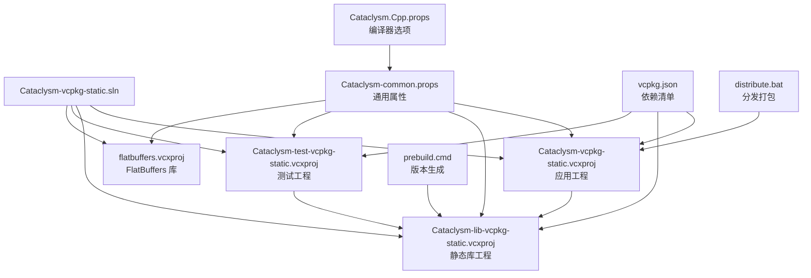
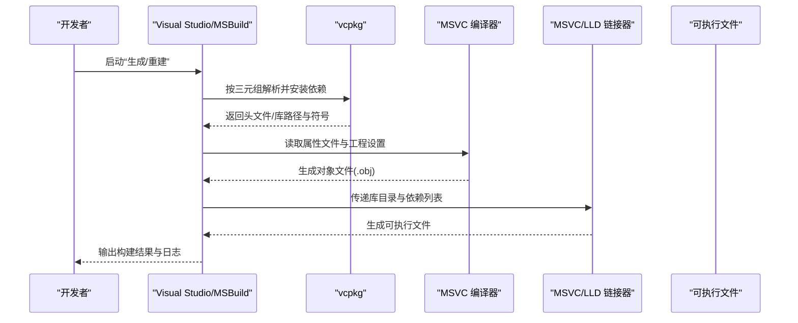
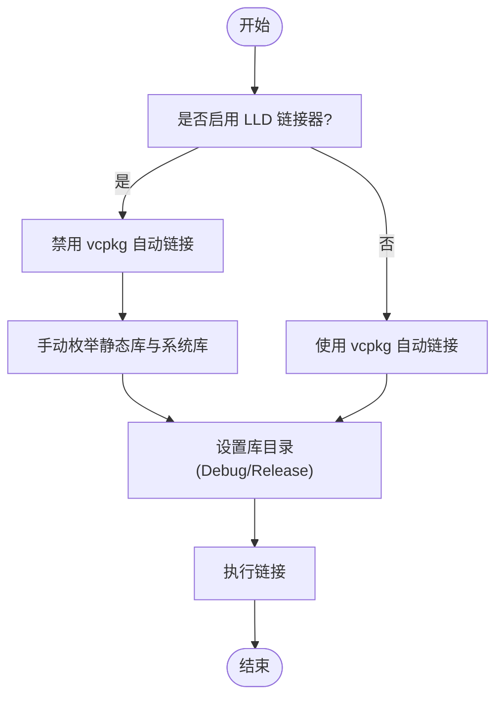
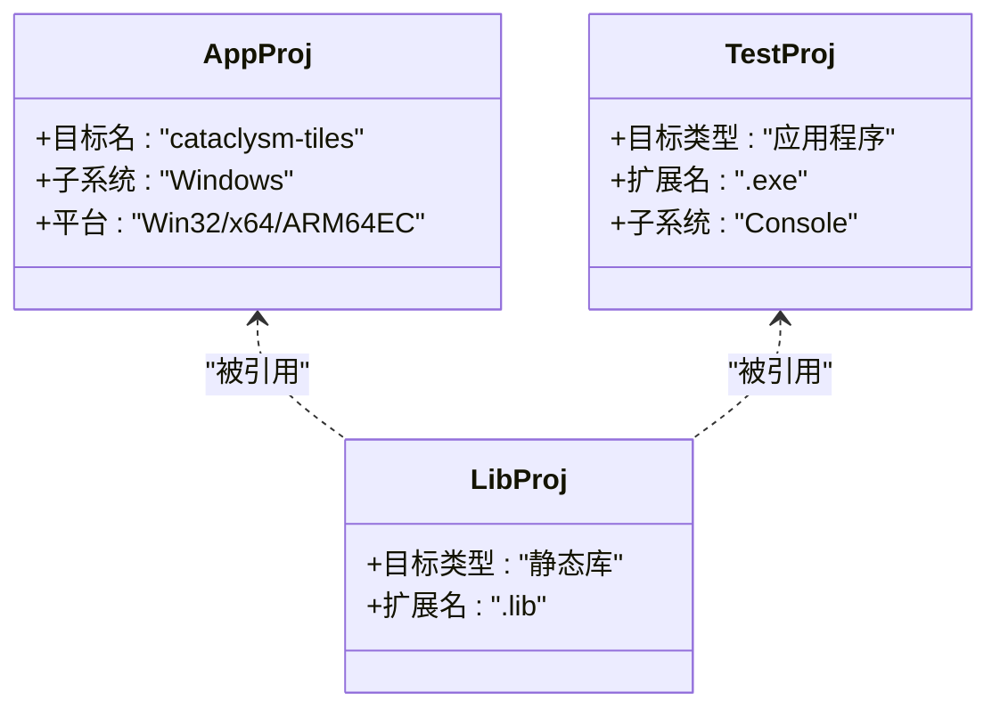
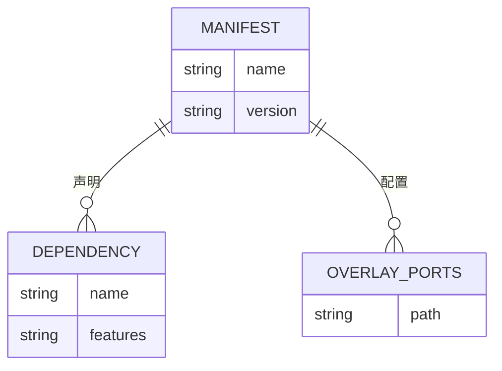
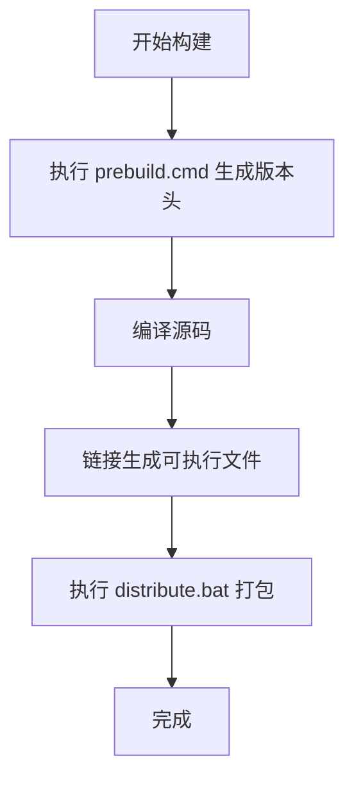
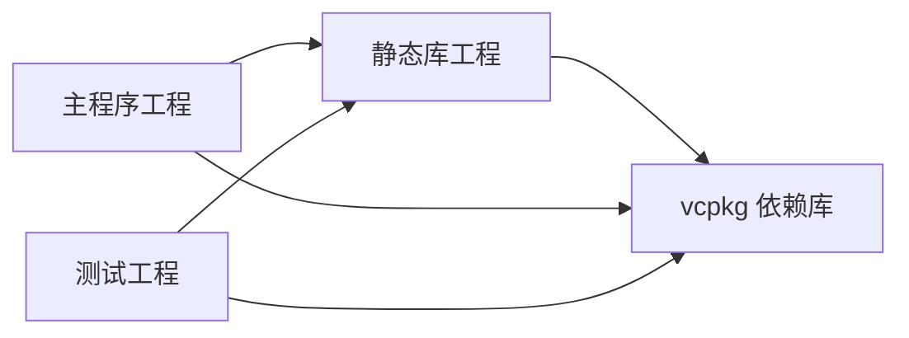

# 故障排除

<cite>
**本文引用的文件**
- [vcpkg.json](file://vcpkg.json)
- [Cataclysm-vcpkg-static.sln](file://Cataclysm-vcpkg-static.sln)
- [Cataclysm.Cpp.props](file://Cataclysm.Cpp.props)
- [Cataclysm-common.props](file://Cataclysm-common.props)
- [Cataclysm-vcpkg-static.vcxproj](file://Cataclysm-vcpkg-static.vcxproj)
- [Cataclysm-lib-vcpkg-static.vcxproj](file://Cataclysm-lib-vcpkg-static.vcxproj)
- [Cataclysm-test-vcpkg-static.vcxproj](file://Cataclysm-test-vcpkg-static.vcxproj)
- [flatbuffers.vcxproj](file://flatbuffers.vcxproj)
- [prebuild.cmd](file://prebuild.cmd)
- [distribute.bat](file://distribute.bat)
- [stdafx.h](file://stdafx.h)
- [stdafx.cpp](file://stdafx.cpp)
- [style-json.ps1](file://style-json.ps1)
</cite>

## 目录
1. [简介](#简介)
2. [项目结构](#项目结构)
3. [核心组件](#核心组件)
4. [架构总览](#架构总览)
5. [详细组件分析](#详细组件分析)
6. [依赖关系分析](#依赖关系分析)
7. [性能考虑](#性能考虑)
8. [故障排除指南](#故障排除指南)
9. [结论](#结论)
10. [附录](#附录)

## 简介
本指南面向使用 MSVC Full Features（vcpkg 静态链接）构建系统的开发者，聚焦于常见构建错误与解决方案，涵盖编译器错误、链接器错误、依赖缺失问题；深入解析 vcpkg 包安装失败、版本冲突与网络问题；提供调试技巧与工具使用建议（Visual Studio 调试器、性能分析器、内存检查工具）；并给出静态链接相关复杂问题的诊断与解决思路，以及日志分析与错误信息解读的实用方法。

## 项目结构
该仓库为基于 vcpkg 的 MSVC 解决方案，采用统一的属性文件集中管理编译与链接行为，并通过多个 vcxproj 项目分别构建主程序、静态库、测试程序与 FlatBuffers 工具库。关键特性包括：
- 使用 vcpkg 静态三元组（x86/x64-windows-static）进行静态链接
- 统一的预处理器定义、包含目录、警告级别与语言标准
- 在特定条件下启用 LLD 链接器以提升链接效率
- 自动化版本生成脚本与分发打包脚本

图表来源
- [Cataclysm-vcpkg-static.sln:17-28](file://Cataclysm-vcpkg-static.sln#L17-L28)
- [Cataclysm-vcpkg-static.vcxproj:53-73](file://Cataclysm-vcpkg-static.vcxproj#L53-L73)
- [Cataclysm-lib-vcpkg-static.vcxproj:53-71](file://Cataclysm-lib-vcpkg-static.vcxproj#L53-L71)
- [Cataclysm-test-vcpkg-static.vcxproj:53-72](file://Cataclysm-test-vcpkg-static.vcxproj#L53-L72)
- [flatbuffers.vcxproj:55-83](file://flatbuffers.vcxproj#L55-L83)
- [Cataclysm-common.props:41-144](file://Cataclysm-common.props#L41-L144)
- [Cataclysm.Cpp.props:1-11](file://Cataclysm.Cpp.props#L1-L11)
- [vcpkg.json:1-22](file://vcpkg.json#L1-L22)
- [prebuild.cmd:1-16](file://prebuild.cmd#L1-L16)
- [distribute.bat:1-11](file://distribute.bat#L1-L11)

章节来源
- [Cataclysm-vcpkg-static.sln:17-28](file://Cataclysm-vcpkg-static.sln#L17-L28)
- [Cataclysm-common.props:41-144](file://Cataclysm-common.props#L41-L144)
- [vcpkg.json:1-22](file://vcpkg.json#L1-L22)

## 核心组件
- 通用属性与编译设置：集中于 Cataclysm-common.props，统一控制包含目录、预处理器定义、警告级别、语言标准、调试信息格式、链接器行为等。
- 编译器开关：Cataclysm.Cpp.props 提供缓存编译与多工具任务支持等可选优化。
- vcpkg 集成：各工程通过 Vcpkg* 属性启用静态三元组、自动链接、清单安装等。
- 版本生成与分发：prebuild.cmd 生成版本头文件；distribute.bat 打包运行时所需资源与可执行文件。

章节来源
- [Cataclysm-common.props:41-144](file://Cataclysm-common.props#L41-L144)
- [Cataclysm.Cpp.props:1-11](file://Cataclysm.Cpp.props#L1-L11)
- [Cataclysm-vcpkg-static.vcxproj:63-73](file://Cataclysm-vcpkg-static.vcxproj#L63-L73)
- [Cataclysm-lib-vcpkg-static.vcxproj:60-71](file://Cataclysm-lib-vcpkg-static.vcxproj#L60-L71)
- [Cataclysm-test-vcpkg-static.vcxproj:63-73](file://Cataclysm-test-vcpkg-static.vcxproj#L63-L73)
- [prebuild.cmd:1-16](file://prebuild.cmd#L1-L16)
- [distribute.bat:1-11](file://distribute.bat#L1-L11)

## 架构总览
下图展示从源码到可执行文件的关键流程：MSBuild 加载属性文件与工程，调用 vcpkg 安装/解析依赖，编译器生成对象文件，链接器生成最终二进制，必要时触发自定义构建步骤（如 JSON 样式检查）。

图表来源
- [Cataclysm-common.props:23-40](file://Cataclysm-common.props#L23-L40)
- [Cataclysm-vcpkg-static.vcxproj:63-73](file://Cataclysm-vcpkg-static.vcxproj#L63-L73)
- [Cataclysm-lib-vcpkg-static.vcxproj:60-71](file://Cataclysm-lib-vcpkg-static.vcxproj#L60-L71)
- [Cataclysm-test-vcpkg-static.vcxproj:63-73](file://Cataclysm-test-vcpkg-static.vcxproj#L63-L73)

## 详细组件分析

### 组件A：静态链接与 vcpkg 配置
- 三元组与静态链接：Win32/x64 平台使用 x86/x64-windows-static；ARM64EC 映射为 x64-windows-static。
- 自动链接与库后缀：在启用 LLD 链接器时禁用 vcpkg 自动链接，改为手动枚举静态库并根据配置选择 debug/release 后缀。
- 额外库目录：按 Debug/Release 分别指向 vcpkg 安装目录下的 lib 或 debug/lib。
- 额外依赖：显式列出所有 vcpkg 提供的静态库与 Windows 系统库。

图表来源
- [Cataclysm-common.props:33-40](file://Cataclysm-common.props#L33-L40)
- [Cataclysm-common.props:91-140](file://Cataclysm-common.props#L91-L140)

章节来源
- [Cataclysm-common.props:23-40](file://Cataclysm-common.props#L23-L40)
- [Cataclysm-common.props:91-140](file://Cataclysm-common.props#L91-L140)

### 组件B：工程与目标名称映射
- 主程序工程输出目标名统一为“cataclysm-tiles”，并根据平台设置 SubSystem。
- 测试工程与静态库工程分别输出 .exe 与 .lib，便于集成与验证。

图表来源
- [Cataclysm-vcpkg-static.vcxproj:106-158](file://Cataclysm-vcpkg-static.vcxproj#L106-L158)
- [Cataclysm-lib-vcpkg-static.vcxproj:103-118](file://Cataclysm-lib-vcpkg-static.vcxproj#L103-L118)
- [Cataclysm-test-vcpkg-static.vcxproj:105-122](file://Cataclysm-test-vcpkg-static.vcxproj#L105-L122)

章节来源
- [Cataclysm-vcpkg-static.vcxproj:106-158](file://Cataclysm-vcpkg-static.vcxproj#L106-L158)
- [Cataclysm-lib-vcpkg-static.vcxproj:103-118](file://Cataclysm-lib-vcpkg-static.vcxproj#L103-L118)
- [Cataclysm-test-vcpkg-static.vcxproj:105-122](file://Cataclysm-test-vcpkg-static.vcxproj#L105-L122)

### 组件C：依赖清单与覆盖端口
- 依赖项：SDL2、SDL2-image（libjpeg-turbo）、SDL2-mixer（libflac、mpg123、libmodplug）、SDL2-ttf。
- 覆盖端口：通过 overlay-ports 引入自定义端口目录，便于本地定制或修复上游问题。

图表来源
- [vcpkg.json:4-15](file://vcpkg.json#L4-L15)
- [vcpkg.json:16-20](file://vcpkg.json#L16-L20)

章节来源
- [vcpkg.json:1-22](file://vcpkg.json#L1-L22)

### 组件D：预构建与版本生成
- 预构建脚本：在构建前生成版本头文件，确保运行时版本信息正确。
- 分发脚本：复制 DLL、数据、配置、图形、语言资源与可执行文件至 distribution 目录。

图表来源
- [prebuild.cmd:1-16](file://prebuild.cmd#L1-L16)
- [distribute.bat:1-11](file://distribute.bat#L1-L11)

章节来源
- [prebuild.cmd:1-16](file://prebuild.cmd#L1-L16)
- [distribute.bat:1-11](file://distribute.bat#L1-L11)

## 依赖关系分析
- 工程间依赖：测试工程引用静态库工程；主程序工程引用静态库工程。
- 外部依赖：通过 vcpkg 静态三元组引入 SDL2 生态与系统库。
- 链接策略：在启用 LLD 时禁用 vcpkg 自动链接，改用手动枚举库，避免不兼容的通配符参数。

图表来源
- [Cataclysm-vcpkg-static.vcxproj:226-228](file://Cataclysm-vcpkg-static.vcxproj#L226-L228)
- [Cataclysm-test-vcpkg-static.vcxproj:188-190](file://Cataclysm-test-vcpkg-static.vcxproj#L188-L190)
- [Cataclysm-lib-vcpkg-static.vcxproj:182-185](file://Cataclysm-lib-vcpkg-static.vcxproj#L182-L185)

章节来源
- [Cataclysm-vcpkg-static.vcxproj:226-228](file://Cataclysm-vcpkg-static.vcxproj#L226-L228)
- [Cataclysm-test-vcpkg-static.vcxproj:188-190](file://Cataclysm-test-vcpkg-static.vcxproj#L188-L190)
- [Cataclysm-lib-vcpkg-static.vcxproj:182-185](file://Cataclysm-lib-vcpkg-static.vcxproj#L182-L185)

## 性能考虑
- 编译器并行与大对象：启用多核编译与 /bigobj，有助于大型项目编译。
- 链接器选择：在满足条件时使用 LLD 链接器，减少链接时间；同时需注意手动枚举库的开销。
- 调试信息：根据 VS 版本调整 DebugFastLink 与 DebugFull，避免已知崩溃问题。
- 缓存编译：可选启用 ccache，但会改变调试信息格式与预编译头策略。

章节来源
- [Cataclysm-common.props:46-50](file://Cataclysm-common.props#L46-L50)
- [Cataclysm-common.props:81-85](file://Cataclysm-common.props#L81-L85)
- [Cataclysm.Cpp.props:1-11](file://Cataclysm.Cpp.props#L1-L11)

## 故障排除指南

### 一、编译器错误（C1xx/C2xxx）
常见症状
- 语法错误、未定义标识符、包含路径错误、语言标准不匹配。
- 预编译头相关错误（stdafx）。

排查步骤
- 检查语言标准与警告级别是否符合预期。
- 确认包含目录与预处理器定义一致。
- 若启用 ccache，确认其与预编译头策略的兼容性。
- 若使用 LLD 链接器，确认未误用通配符参数导致的链接失败。

章节来源
- [Cataclysm-common.props:41-58](file://Cataclysm-common.props#L41-L58)
- [Cataclysm-common.props:62-70](file://Cataclysm-common.props#L62-L70)
- [Cataclysm.Cpp.props:1-11](file://Cataclysm.Cpp.props#L1-L11)

### 二、链接器错误（LNKxxxx）
常见症状
- 未解析的外部符号、重复定义、库顺序问题、平台不匹配。
- LLD 链接器报错或不接受 vcpkg 传入的通配符参数。

排查步骤
- 确认三元组与平台一致（Win32/x64/ARM64EC 映射）。
- 在启用 LLD 时，检查是否禁用了 vcpkg 自动链接并手动枚举了全部静态库。
- 根据 Debug/Release 设置正确的库目录与库后缀。
- 若出现 VS 调试链接器崩溃，检查平台工具集版本并调整调试信息格式。

章节来源
- [Cataclysm-common.props:33-40](file://Cataclysm-common.props#L33-L40)
- [Cataclysm-common.props:91-140](file://Cataclysm-common.props#L91-L140)
- [Cataclysm-common.props:81-85](file://Cataclysm-common.props#L81-L85)

### 三、依赖缺失与 vcpkg 相关问题
常见症状
- 无法找到头文件或库文件。
- vcpkg 安装失败、版本冲突、网络超时。
- 覆盖端口未生效或端口版本不匹配。

排查步骤
- 确认 vcpkg.json 中的依赖与特性配置正确。
- 检查 overlay-ports 路径是否有效且端口存在。
- 清理 vcpkg 缓存与安装目录，重新安装指定三元组。
- 如遇网络问题，尝试代理或离线安装；必要时手动下载端口与二进制。
- 若出现版本冲突，锁定版本或使用自定义端口修复。

章节来源
- [vcpkg.json:1-22](file://vcpkg.json#L1-L22)
- [Cataclysm-common.props:23-25](file://Cataclysm-common.props#L23-L25)

### 四、静态链接复杂问题诊断
- 三元组一致性：确保所有工程使用相同的 VcpkgTriplet。
- 库顺序与依赖：静态库应按依赖顺序排列，避免符号未解析。
- 系统库补充：在 LLD 模式下需显式添加 Windows 系统库。
- 调试与发布后缀：根据配置选择正确的库后缀（Debug 带 d 后缀）。

章节来源
- [Cataclysm-common.props:33-40](file://Cataclysm-common.props#L33-L40)
- [Cataclysm-common.props:91-140](file://Cataclysm-common.props#L91-L140)

### 五、调试技巧与工具使用
- Visual Studio 调试器
  - 设置工作目录与启动参数，确保资源路径正确。
  - 在 Debug 配置下使用完整调试信息，必要时切换为 DebugFull 以规避已知崩溃。
- 性能分析器
  - 使用内置性能分析工具定位热点函数与内存分配。
- 内存检查工具
  - 使用 AddressSanitizer 或 Visual Leak Detector 检测内存泄漏与越界访问。

章节来源
- [Cataclysm-common.props:81-85](file://Cataclysm-common.props#L81-L85)

### 六、日志分析与错误信息解读
- 构建日志
  - 关注 vcpkg 安装阶段的网络与权限错误。
  - 注意链接器输出的未解析符号与库路径提示。
- PowerShell 自定义步骤
  - JSON 样式检查脚本会在超时或无变更时输出明确提示，便于快速定位问题。

章节来源
- [style-json.ps1:34-63](file://style-json.ps1#L34-L63)
- [Cataclysm-vcpkg-static.vcxproj:166-170](file://Cataclysm-vcpkg-static.vcxproj#L166-L170)

### 七、版本生成与分发问题
- 版本生成
  - 确保 Git 可用且仓库包含标签；若无标签则生成文件内容会提示安装 Git。
- 分发打包
  - 检查 DLL、数据、配置、图形、语言资源复制是否成功。

章节来源
- [prebuild.cmd:1-16](file://prebuild.cmd#L1-L16)
- [distribute.bat:1-11](file://distribute.bat#L1-L11)

## 结论
本指南围绕 MSVC Full Features 项目中的 vcpkg 静态链接构建体系，系统梳理了编译、链接、依赖与调试等环节的常见问题与解决策略。通过统一的属性文件与工程配置，结合 LLD 链接器与手动库枚举，在保证构建稳定性的同时提升效率。建议在团队内统一三元组与工具链版本，规范依赖管理与版本生成流程，以降低跨平台与跨环境的构建差异风险。

## 附录
- 快速检查清单
  - 三元组与平台一致
  - vcpkg 依赖安装成功
  - LLD 模式下手动枚举库
  - Debug/Release 库目录与后缀正确
  - 预编译头与 ccache 策略匹配
  - VS 链接器版本兼容性