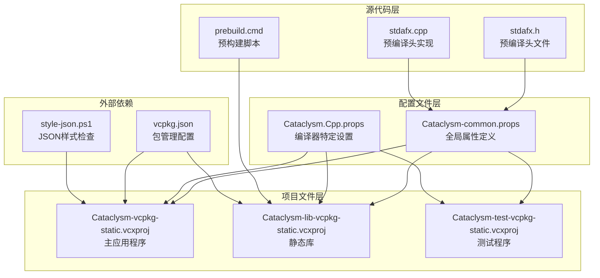
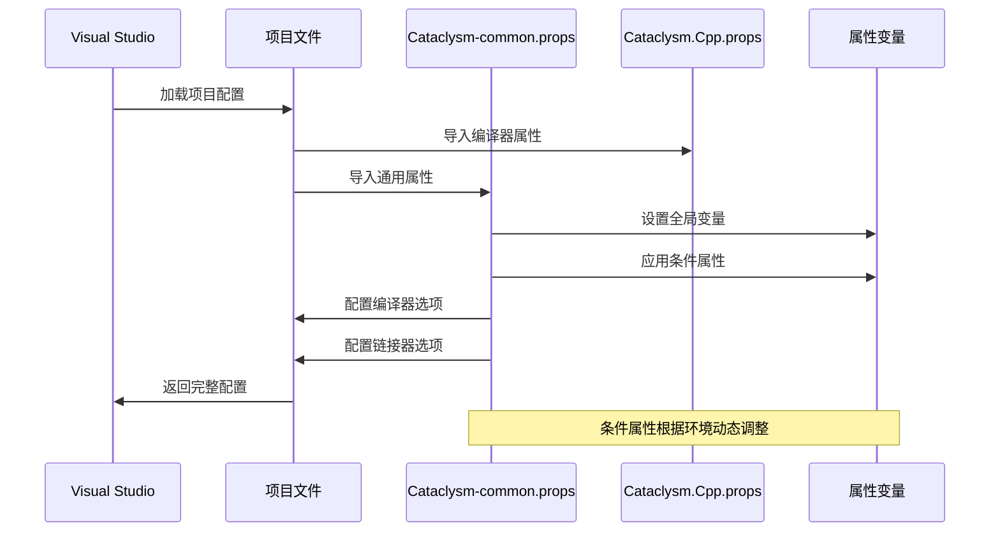
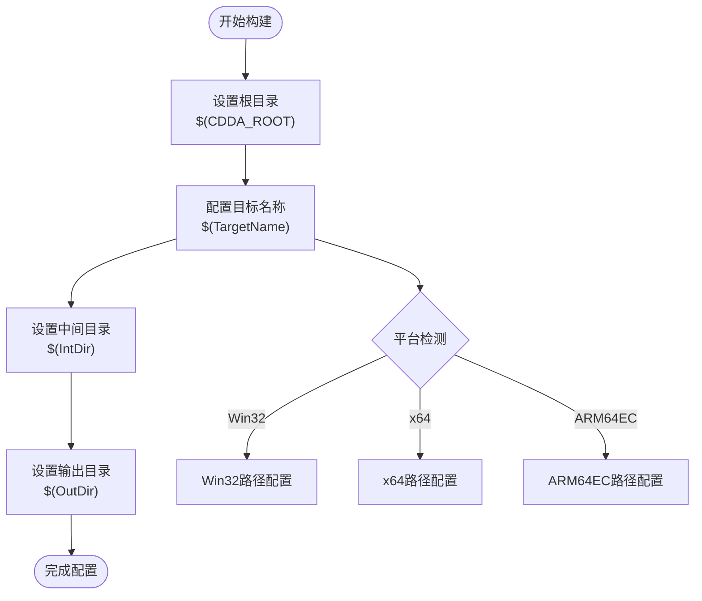
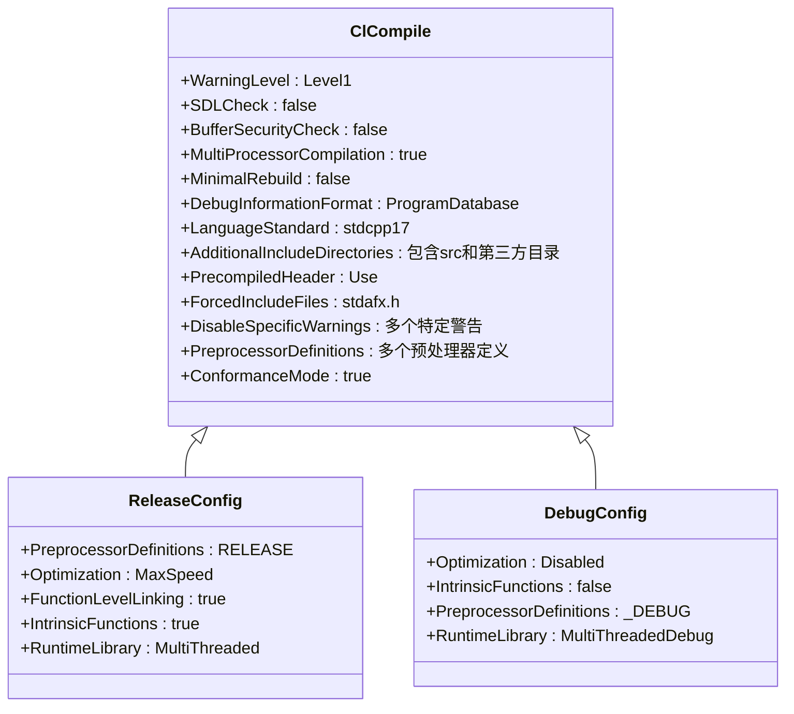
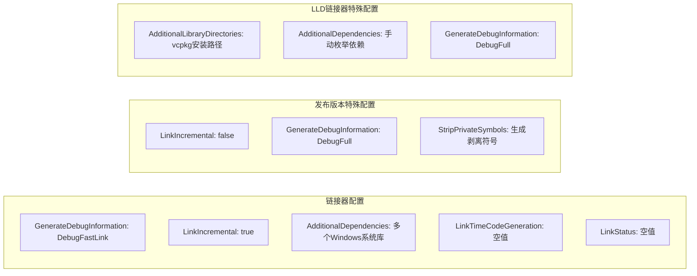
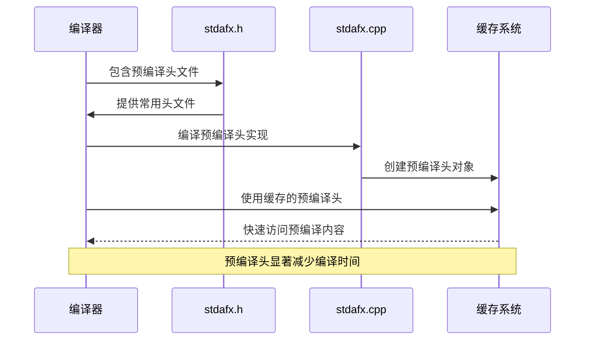
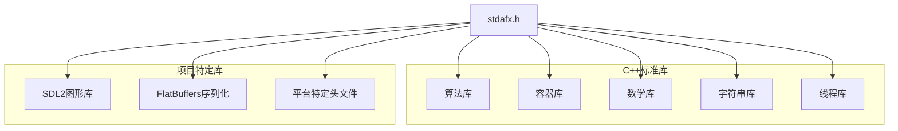
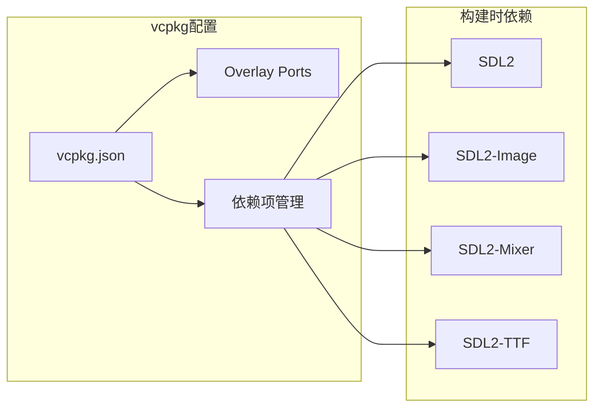
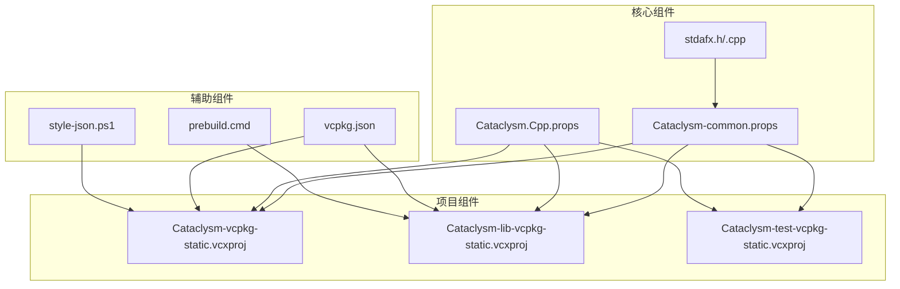

# MSBuild配置详解

<cite>
**本文档引用的文件**
- [Cataclysm-common.props](file://Cataclysm-common.props)
- [Cataclysm.Cpp.props](file://Cataclysm.Cpp.props)
- [Cataclysm-vcpkg-static.vcxproj](file://Cataclysm-vcpkg-static.vcxproj)
- [Cataclysm-lib-vcpkg-static.vcxproj](file://Cataclysm-lib-vcpkg-static.vcxproj)
- [Cataclysm-test-vcpkg-static.vcxproj](file://Cataclysm-test-vcpkg-static.vcxproj)
- [stdafx.h](file://stdafx.h)
- [stdafx.cpp](file://stdafx.cpp)
- [prebuild.cmd](file://prebuild.cmd)
- [vcpkg.json](file://vcpkg.json)
- [style-json.ps1](file://style-json.ps1)
- [distribute.bat](file://distribute.bat)
</cite>

## 目录
1. [简介](#简介)
2. [项目结构](#项目结构)
3. [核心组件](#核心组件)
4. [架构概览](#架构概览)
5. [详细组件分析](#详细组件分析)
6. [依赖关系分析](#依赖关系分析)
7. [性能考虑](#性能考虑)
8. [故障排除指南](#故障排除指南)
9. [结论](#结论)

## 简介

本文件详细解析了Cataclysm Medieval项目中的MSBuild配置系统。该系统采用分层属性文件架构，通过Cataclysm-common.props提供全局配置，Cataclysm.Cpp.props处理特定编译器选项，各项目文件实现具体配置。系统支持多种构建配置（Debug/Release），平台（Win32/x64/ARM64EC），以及不同的功能变体（带/不带图形界面）。

## 项目结构

该项目采用标准的Visual Studio MSBuild项目组织方式，包含以下关键组件：



**图表来源**
- [Cataclysm-common.props:1-154](file://Cataclysm-common.props#L1-L154)
- [Cataclysm-vcpkg-static.vcxproj:1-236](file://Cataclysm-vcpkg-static.vcxproj#L1-L236)
- [Cataclysm-lib-vcpkg-static.vcxproj:1-191](file://Cataclysm-lib-vcpkg-static.vcxproj#L1-L191)

**章节来源**
- [Cataclysm-common.props:1-154](file://Cataclysm-common.props#L1-L154)
- [Cataclysm-vcpkg-static.vcxproj:1-236](file://Cataclysm-vcpkg-static.vcxproj#L1-L236)

## 核心组件

### 全局属性文件 (Cataclysm-common.props)

这是整个配置系统的核心，负责：
- 定义基础路径和输出目录
- 设置条件属性和环境变量
- 配置编译器和链接器选项
- 管理预编译头文件

### 编译器属性文件 (Cataclysm.Cpp.props)

专门处理编译器相关的配置：
- 控制缓存工具的使用
- 配置多工具任务支持
- 管理编译器特定的优化选项

### 项目配置文件

三个主要项目文件分别对应不同的构建目标：
- 主应用程序：包含完整的图形界面
- 静态库：提供核心功能库
- 测试程序：用于单元测试和基准测试

**章节来源**
- [Cataclysm-common.props:1-154](file://Cataclysm-common.props#L1-L154)
- [Cataclysm.Cpp.props:1-11](file://Cataclysm.Cpp.props#L1-L11)

## 架构概览

MSBuild配置系统采用分层设计模式，实现了高度的模块化和可维护性：



**图表来源**
- [Cataclysm-common.props:26-40](file://Cataclysm-common.props#L26-L40)
- [Cataclysm.Cpp.props:4-10](file://Cataclysm.Cpp.props#L4-L10)

### 属性继承机制

系统实现了多层次的属性继承：

1. **基础属性**：在Cataclysm-common.props中定义
2. **条件属性**：根据环境变量动态启用
3. **项目特定属性**：在各个.vcxproj文件中覆盖
4. **平台特定属性**：针对不同平台的差异化配置

**章节来源**
- [Cataclysm-common.props:5-22](file://Cataclysm-common.props#L5-L22)
- [Cataclysm-vcpkg-static.vcxproj:74-104](file://Cataclysm-vcpkg-static.vcxproj#L74-L104)

## 详细组件分析

### 全局属性设置与作用域管理

#### 路径和输出管理
系统使用统一的路径管理策略：



**图表来源**
- [Cataclysm-common.props:6-9](file://Cataclysm-common.props#L6-L9)

#### 条件属性判断系统

系统实现了复杂的条件属性判断逻辑：

| 条件属性 | 触发条件 | 功能描述 |
|---------|---------|----------|
| _CDDA_BACKTRACE | BACKTRACE环境变量非空 | 启用回溯功能 |
| _CDDA_RELEASE_BUILD | CDDA_RELEASE_BUILD环境变量非空 | 标记发布版本 |
| _CDDA_ENABLE_THIN_ARCHIVES | CDDA_ENABLE_THIN_ARCHIVES环境变量非空 | 启用薄归档 |
| _CDDA_USE_LLD_LINK | CDDA_USE_LLD_LINK环境变量非空或启用薄归档 | 使用LLD链接器 |

**章节来源**
- [Cataclysm-common.props:12-21](file://Cataclysm-common.props#L12-L21)

### 编译器配置选项

#### 编译器基础设置

系统为所有项目提供了统一的编译器配置：



**图表来源**
- [Cataclysm-common.props:42-58](file://Cataclysm-common.props#L42-L58)
- [Cataclysm-vcpkg-static.vcxproj:172-212](file://Cataclysm-vcpkg-static.vcxproj#L172-L212)

#### 预处理器定义分析

系统使用了丰富的预处理器定义来控制编译行为：

| 宏定义 | 条件 | 功能 |
|--------|------|------|
| _SCL_SECURE_NO_WARNINGS |  st | 禁用安全警告 |
| _CRT_SECURE_NO_WARNINGS | 始终 | 禁用C运行时警告 |
| WIN32_LEAN_AND_MEAN | 始终 | 减少Windows头文件大小 |
| LOCALIZE | 始终 | 启用本地化支持 |
| USE_VCPKG | 始终 | 启用vcpkg包管理 |
| RELEASE | 发布配置 | 标识发布版本 |
| BACKTRACE | 启用回溯 | 启用错误回溯功能 |
| TILES | 图形界面 | 启用图形界面功能 |
| _DEBUG | 调试配置 | 标识调试版本 |

**章节来源**
- [Cataclysm-common.props:56](file://Cataclysm-common.props#L56)
- [Cataclysm-vcpkg-static.vcxproj:176](file://Cataclysm-vcpkg-static.vcxproj#L176)

### 链接器配置选项

#### 基础链接器设置

系统为链接器提供了全面的配置选项：



**图表来源**
- [Cataclysm-common.props:74-140](file://Cataclysm-common.props#L74-L140)

#### 平台特定链接器配置

针对不同平台的链接器配置差异：

| 平台 | 特殊配置 | 依赖库 |
|------|----------|--------|
| Win32 | WIN32宏定义 | 32位系统库 |
| x64 | 64位优化 | 64位系统库 |
| ARM64EC | ARM64EC支持 | 混合模式库 |

**章节来源**
- [Cataclysm-vcpkg-static.vcxproj:213-217](file://Cataclysm-vcpkg-static.vcxproj#L213-L217)

### 预编译头文件策略

#### 预编译头文件架构

系统采用了高效的预编译头文件策略：



**图表来源**
- [Cataclysm-common.props:146-151](file://Cataclysm-common.props#L146-L151)
- [stdafx.h:1-96](file://stdafx.h#L1-L96)

#### 预编译头文件内容分析

预编译头文件包含了大量常用的C++标准库和项目特定头文件：



**图表来源**
- [stdafx.h:3-95](file://stdafx.h#L3-L95)

**章节来源**
- [Cataclysm-common.props:53-54](file://Cataclysm-common.props#L53-L54)
- [Cataclysm-common.props:146-151](file://Cataclysm-common.props#L146-L151)

### 不同配置的差异化设置

#### Debug配置特点

Debug配置专注于开发效率和调试能力：

- **优化设置**：禁用优化以提高调试体验
- **运行时库**：使用多线程调试版本
- **调试信息**：生成完整的调试信息
- **预处理器定义**：包含_DEBUG宏

#### Release配置特点

Release配置专注于最终产品的性能和体积：

- **优化设置**：启用最大优化
- **运行时库**：使用多线程版本
- **调试信息**：生成快速链接的调试信息
- **预处理器定义**：包含RELEASE宏

#### 特殊配置变体

系统还支持特殊的配置变体：

- **Debug-NoTiles**：调试版本但禁用图形界面
- **Release-NoTiles**：发布版本但禁用图形界面

**章节来源**
- [Cataclysm-vcpkg-static.vcxproj:172-212](file://Cataclysm-vcpkg-static.vcxproj#L172-L212)
- [Cataclysm-lib-vcpkg-static.vcxproj:127-169](file://Cataclysm-lib-vcpkg-static.vcxproj#L127-L169)

## 依赖关系分析

### 外部依赖管理

#### vcpkg集成

系统通过vcpkg进行包管理：



**图表来源**
- [vcpkg.json:4-15](file://vcpkg.json#L4-L15)

#### 自定义构建步骤

系统集成了多个自定义构建步骤：

| 步骤 | 目标 | 触发条件 |
|------|------|----------|
| 预构建版本生成 | 生成版本信息 | 每次构建 |
| JSON样式检查 | 验证数据文件 | MSBuild调用 |
| 分发打包 | 准备发布文件 | 手动执行 |

**章节来源**
- [prebuild.cmd:6-15](file://prebuild.cmd#L6-L15)
- [style-json.ps1:36-51](file://style-json.ps1#L36-L51)

### 内部组件依赖



**图表来源**
- [Cataclysm-vcpkg-static.vcxproj:97-104](file://Cataclysm-vcpkg-static.vcxproj#L97-L104)
- [Cataclysm-lib-vcpkg-static.vcxproj:95-102](file://Cataclysm-lib-vcpkg-static.vcxproj#L95-L102)

## 性能考虑

### 编译性能优化

系统采用了多项性能优化策略：

#### 预编译头优化
- 统一包含常用头文件，减少重复编译
- 在缓存模式下禁用预编译头以提高缓存效率
- 使用标准化的预编译头实现

#### 多进程编译
- 启用多处理器编译以利用多核CPU
- 配置适当的并发编译任务数

#### 缓存系统集成


**图表来源**
- [Cataclysm.Cpp.props:5](file://Cataclysm.Cpp.props#L5)

### 链接性能优化

#### LLD链接器支持
- 可选的LLD链接器替代MSVC链接器
- 支持薄归档以减少库文件大小
- 手动依赖管理以适应LLD限制

#### 链接器配置优化
- 条件链接增量以提高大项目的构建速度
- 针对不同平台的优化设置

**章节来源**
- [Cataclysm-common.props:29-40](file://Cataclysm-common.props#L29-L40)
- [Cataclysm-common.props:71-73](file://Cataclysm-common.props#L71-L73)

## 故障排除指南

### 常见配置问题

#### 属性继承问题
当遇到属性值不符合预期时，检查以下顺序：
1. 环境变量设置
2. 条件属性判断
3. 项目特定覆盖
4. 平台特定配置

#### 预编译头问题
如果预编译头导致编译问题：
- 确认stdafx.h包含正确的头文件
- 检查预编译头的编译顺序
- 验证缓存模式下的预编译头设置

#### 链接器问题
针对链接器错误：
- 检查依赖库路径配置
- 验证平台匹配性
- 确认链接器工具链版本

### 调试技巧

#### 属性诊断
使用MSBuild的详细日志输出来诊断属性问题：
```bash
msbuild /m /v:d Cataclysm-vcpkg-static.sln
```

#### 条件属性验证
通过检查中间属性来验证条件属性的正确性：
```bash
msbuild /m /v:d /p:Configuration=Debug Cataclysm-vcpkg-static.sln
```

**章节来源**
- [Cataclysm-common.props:26-40](file://Cataclysm-common.props#L26-L40)
- [Cataclysm.Cpp.props:26-28](file://Cataclysm.Cpp.props#L26-L28)

## 结论

Cataclysm Medieval项目的MSBuild配置系统展现了现代C++项目的最佳实践：

### 设计优势

1. **模块化架构**：通过分层属性文件实现了高度的模块化
2. **条件配置**：灵活的条件属性系统支持多种构建场景
3. **性能优化**：预编译头、多进程编译等技术提升构建效率
4. **跨平台支持**：统一的配置支持多种平台和架构

### 最佳实践建议

1. **保持配置一致性**：通过共享属性文件确保各项目的一致性
2. **合理使用条件属性**：避免过度复杂的条件判断
3. **持续优化性能**：定期评估和改进构建性能
4. **文档化配置决策**：记录重要的配置选择和原因

这个配置系统为大型C++项目提供了可扩展、可维护的构建解决方案，是MSBuild配置的优秀范例。