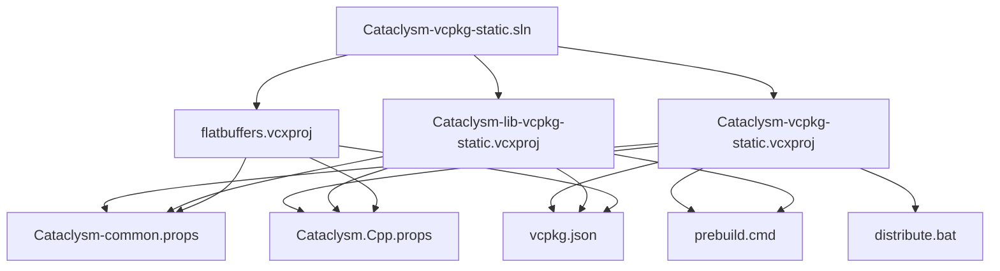
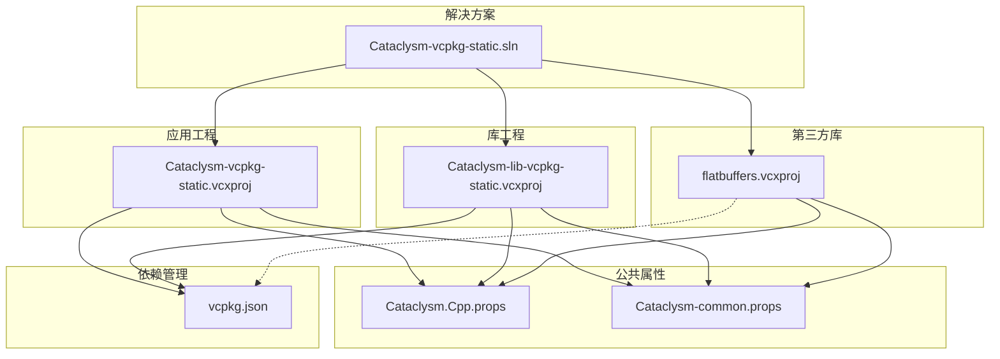
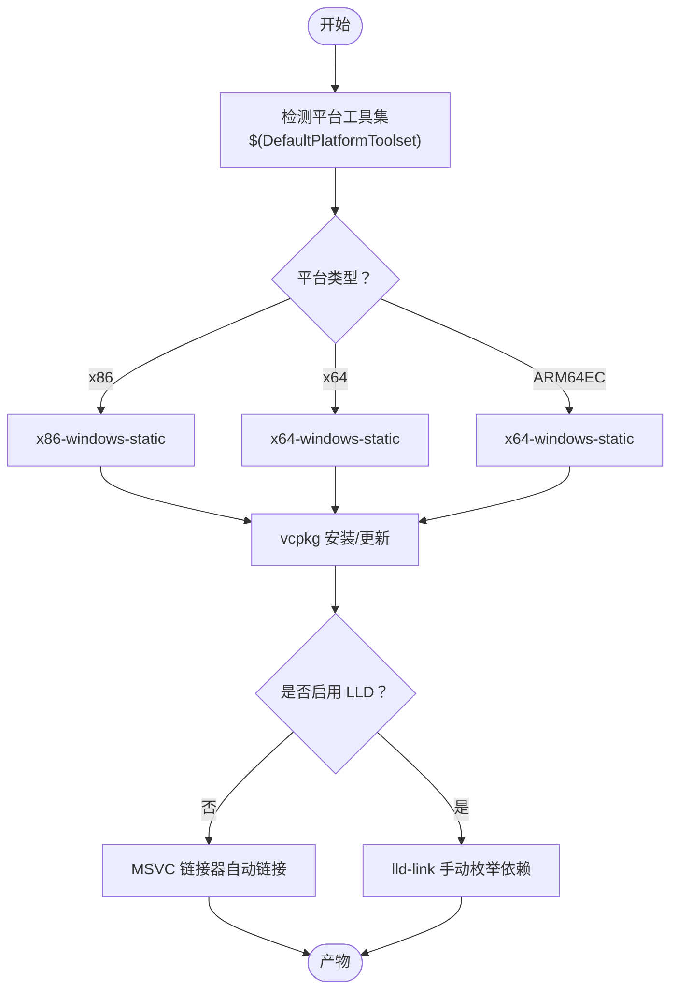

# 多平台构建支持

<cite>
**本文引用的文件**
- [Cataclysm-vcpkg-static.sln](file://Cataclysm-vcpkg-static.sln)
- [Cataclysm.Cpp.props](file://Cataclysm.Cpp.props)
- [Cataclysm-common.props](file://Cataclysm-common.props)
- [vcpkg.json](file://vcpkg.json)
- [prebuild.cmd](file://prebuild.cmd)
- [distribute.bat](file://distribute.bat)
- [stdafx.h](file://stdafx.h)
- [stdafx.cpp](file://stdafx.cpp)
- [Cataclysm-vcpkg-static.vcxproj](file://Cataclysm-vcpkg-static.vcxproj)
- [Cataclysm-lib-vcpkg-static.vcxproj](file://Cataclysm-lib-vcpkg-static.vcxproj)
- [flatbuffers.vcxproj](file://flatbuffers.vcxproj)
</cite>

## 目录
1. [简介](#简介)
2. [项目结构](#项目结构)
3. [核心组件](#核心组件)
4. [架构总览](#架构总览)
5. [详细组件分析](#详细组件分析)
6. [依赖关系分析](#依赖关系分析)
7. [性能考量](#性能考量)
8. [故障排查指南](#故障排查指南)
9. [结论](#结论)
10. [附录](#附录)

## 简介
本文件系统化梳理该仓库在 MSVC 平台下的多平台构建支持，覆盖 x86、x64、ARM64EC 的构建配置差异与适配策略，平台工具集选择与配置方法（含不同 Visual Studio 版本兼容性），平台特定编译选项与链接器参数，以及在单一解决方案中统一管理多平台配置的最佳实践与常见问题处理建议。

## 项目结构
该仓库采用“解决方案 + 多 VCXPROJ + 公共属性文件”的组织方式，通过公共属性文件集中定义编译与链接行为，再由各工程按需覆盖或扩展。核心文件如下：
- 解决方案：统一声明 Debug/Release 及 NoTiles 变体，并为 x86、x64、ARM64EC 配置所有组合
- 工程：应用工程、静态库工程、第三方库工程（flatbuffers）
- 属性文件：通用编译/链接/工具链配置，以及缓存/Thin Archive/Lld-link 切换
- vcpkg：声明式依赖管理与 overlay ports
- 构建辅助：预构建脚本、分发脚本

图表来源
- [Cataclysm-vcpkg-static.sln:17-28](file://Cataclysm-vcpkg-static.sln#L17-L28)
- [Cataclysm-vcpkg-static.vcxproj:97-104](file://Cataclysm-vcpkg-static.vcxproj#L97-L104)
- [Cataclysm-lib-vcpkg-static.vcxproj:95-102](file://Cataclysm-lib-vcpkg-static.vcxproj#L95-L102)
- [flatbuffers.vcxproj:70-79](file://flatbuffers.vcxproj#L70-L79)
- [Cataclysm-common.props:26-40](file://Cataclysm-common.props#L26-L40)
- [vcpkg.json:1-22](file://vcpkg.json#L1-L22)
- [prebuild.cmd:12-15](file://prebuild.cmd#L12-L15)
- [distribute.bat:1-11](file://distribute.bat#L1-L11)

章节来源
- [Cataclysm-vcpkg-static.sln:29-181](file://Cataclysm-vcpkg-static.sln#L29-L181)
- [Cataclysm-vcpkg-static.vcxproj:52-104](file://Cataclysm-vcpkg-static.vcxproj#L52-L104)
- [Cataclysm-lib-vcpkg-static.vcxproj:98-102](file://Cataclysm-lib-vcpkg-static.vcxproj#L98-L102)
- [flatbuffers.vcxproj:76-79](file://flatbuffers.vcxproj#L76-L79)

## 核心组件
- 解决方案层：集中声明所有平台/配置组合，确保跨平台一致性
- 工程层：应用工程负责最终可执行文件；静态库工程聚合业务源码；第三方库工程独立维护
- 属性层：公共 props 统一编译/链接/工具链路径与行为；支持 ccache、Thin Archive、LLD Link 切换
- 依赖层：vcpkg 声明式安装与自动链接控制；overlay ports 扩展
- 辅助层：预构建生成版本头；分发打包脚本

章节来源
- [Cataclysm-vcpkg-static.sln:29-181](file://Cataclysm-vcpkg-static.sln#L29-L181)
- [Cataclysm-common.props:23-40](file://Cataclysm-common.props#L23-L40)
- [vcpkg.json:1-22](file://vcpkg.json#L1-L22)
- [prebuild.cmd:12-15](file://prebuild.cmd#L12-L15)
- [distribute.bat:1-11](file://distribute.bat#L1-L11)

## 架构总览
下图展示从解决方案到具体工程、再到公共属性与工具链的整体关系：

图表来源
- [Cataclysm-vcpkg-static.sln:17-28](file://Cataclysm-vcpkg-static.sln#L17-L28)
- [Cataclysm-vcpkg-static.vcxproj:97-104](file://Cataclysm-vcpkg-static.vcxproj#L97-L104)
- [Cataclysm-lib-vcpkg-static.vcxproj:95-102](file://Cataclysm-lib-vcpkg-static.vcxproj#L95-L102)
- [flatbuffers.vcxproj:70-79](file://flatbuffers.vcxproj#L70-L79)
- [Cataclysm-common.props:26-40](file://Cataclysm-common.props#L26-L40)
- [vcpkg.json:16-20](file://vcpkg.json#L16-L20)

## 详细组件分析

### 平台与配置矩阵
- 支持平台：x86（Win32）、x64、ARM64EC
- 支持配置：Debug、Release 及其变体 Debug-NoTiles、Release-NoTiles
- 解决方案层面统一声明所有组合，确保 IDE/命令行构建一致性

章节来源
- [Cataclysm-vcpkg-static.sln:30-43](file://Cataclysm-vcpkg-static.sln#L30-L43)

### 工具集与平台工具集选择
- 默认使用 $(DefaultPlatformToolset)，由当前 VS 版本决定
- ARM64EC 在工程层映射为 x64 三元组，以复用现有 x64 静态库生态
- vcpkg 三元组与主机三元组均指向 x64-windows-static，保证静态链接一致性

章节来源
- [Cataclysm-vcpkg-static.vcxproj:59-72](file://Cataclysm-vcpkg-static.vcxproj#L59-L72)
- [Cataclysm-lib-vcpkg-static.vcxproj:66-71](file://Cataclysm-lib-vcpkg-static.vcxproj#L66-L71)

### 编译选项与预处理器宏
- 语言标准：C++17
- 警告级别：Level1（可按需提升）
- 关闭部分特定警告，提升可读性与稳定性
- 预处理器宏：
  - Windows 相关：WIN32_LEAN_AND_MEAN、_CRT_SECURE_NO_WARNINGS 等
  - 功能开关：LOCALIZE、USE_VCPKG、RELEASE（发布时）、BACKTRACE（可选）
  - 应用特有：_SCL_SECURE_NO_WARNINGS、TILES（含贴图版）、_DEBUG（调试时）
- 预编译头：stdafx.h，启用以加速编译

章节来源
- [Cataclysm-common.props:50-57](file://Cataclysm-common.props#L50-L57)
- [Cataclysm-common.props:59-64](file://Cataclysm-common.props#L59-L64)
- [Cataclysm-vcpkg-static.vcxproj:172-178](file://Cataclysm-vcpkg-static.vcxproj#L172-L178)
- [Cataclysm-lib-vcpkg-static.vcxproj:127-133](file://Cataclysm-lib-vcpkg-static.vcxproj#L127-L133)
- [stdafx.h:75-95](file://stdafx.h#L75-L95)

### 链接器参数与运行时库
- 子系统：Windows（GUI 应用）
- 运行时库：
  - Debug：MultiThreadedDebug
  - Release：MultiThreaded
- 链接增量：Debug 开启，Release 关闭（Release-NoTiles 同理）
- 额外依赖：大量 Windows API 与系统库（详见公共属性）
- 特殊处理：VS2022 某版本 DebugFastLink 崩溃，通过条件分支回退至 DebugFull

章节来源
- [Cataclysm-vcpkg-static.vcxproj:163-165](file://Cataclysm-vcpkg-static.vcxproj#L163-L165)
- [Cataclysm-vcpkg-static.vcxproj:172-212](file://Cataclysm-vcpkg-static.vcxproj#L172-L212)
- [Cataclysm-lib-vcpkg-static.vcxproj:127-169](file://Cataclysm-lib-vcpkg-static.vcxproj#L127-L169)
- [Cataclysm-common.props:81-85](file://Cataclysm-common.props#L81-L85)

### LLD 链接器与 Thin Archive 支持
- 可通过环境变量或属性触发 LLD Link 与 Thin Archive
- 触发条件：启用 Thin Archives 或显式要求 LLD Link
- 行为变更：
  - 自动链接关闭，改为手动列举 vcpkg 安装的静态库
  - 指定 lld-link.exe 作为链接器，llvm-lib.exe 作为归档器
  - 额外补充 Windows API 依赖项

章节来源
- [Cataclysm-common.props:18-21](file://Cataclysm-common.props#L18-L21)
- [Cataclysm-common.props:29-40](file://Cataclysm-common.props#L29-L40)
- [Cataclysm-common.props:91-140](file://Cataclysm-common.props#L91-L140)

### 缓存编译（ccache）集成
- 可通过环境变量开启 ccache
- 开启后：
  - 使用自定义 ClToolPath 指向 ccache
  - 关闭预编译头与强制包含，改用旧式调试信息格式
  - 重定向对象文件输出路径，避免缓存污染

章节来源
- [Cataclysm.Cpp.props:4-10](file://Cataclysm.Cpp.props#L4-L10)
- [Cataclysm-common.props:26-32](file://Cataclysm-common.props#L26-L32)
- [Cataclysm-common.props:65-70](file://Cataclysm-common.props#L65-L70)

### vcpkg 依赖与三元组
- 依赖：SDL2 及其图像/音频/字体子包
- 三元组：x86-windows-static（x86）、x64-windows-static（x64/ARM64EC）
- 主机三元组与目标三元组一致，确保静态链接与 ABI 一致
- 自动链接：默认开启，LLD 模式下关闭以手动枚举依赖

章节来源
- [vcpkg.json:4-15](file://vcpkg.json#L4-L15)
- [Cataclysm-lib-vcpkg-static.vcxproj:66-71](file://Cataclysm-lib-vcpkg-static.vcxproj#L66-L71)
- [Cataclysm-vcpkg-static.vcxproj:69-72](file://Cataclysm-vcpkg-static.vcxproj#L69-L72)
- [Cataclysm-common.props:37-40](file://Cataclysm-common.props#L37-L40)

### 预构建与版本生成
- 预构建脚本在生成前根据 Git 描述符写入版本头
- 若未找到 Git，则生成占位版本号，避免构建失败

章节来源
- [prebuild.cmd:6-15](file://prebuild.cmd#L6-L15)

### 分发打包
- 将 DLL、数据、配置、资源等复制到 distribution 目录，便于测试与发布

章节来源
- [distribute.bat:1-11](file://distribute.bat#L1-L11)

### 组件间关系与依赖
- 应用工程依赖静态库工程；静态库工程依赖 flatbuffers
- 通过 ProjectReference 控制库依赖链接

图表来源
- [Cataclysm-vcpkg-static.vcxproj:226-228](file://Cataclysm-vcpkg-static.vcxproj#L226-L228)
- [Cataclysm-lib-vcpkg-static.vcxproj:182-185](file://Cataclysm-lib-vcpkg-static.vcxproj#L182-L185)

## 依赖关系分析
- 平台映射：
  - Win32 → x86-windows-static
  - x64 → x64-windows-static
  - ARM64EC → x64-windows-static（工程层统一）
- 工具链：
  - 默认 Toolset 来自 $(DefaultPlatformToolset)
  - 可切换至 LLVM 工具链（clang-cl、lld-link、llvm-lib）
- 依赖管理：
  - vcpkg manifest 驱动安装
  - overlay ports 提供定制端口
- 链接策略：
  - 默认：MSVC 链接器 + 自动链接
  - LLD：手动列举依赖 + 额外系统库

图表来源
- [Cataclysm-vcpkg-static.vcxproj:59-72](file://Cataclysm-vcpkg-static.vcxproj#L59-L72)
- [Cataclysm-lib-vcpkg-static.vcxproj:66-71](file://Cataclysm-lib-vcpkg-static.vcxproj#L66-L71)
- [Cataclysm-common.props:33-40](file://Cataclysm-common.props#L33-L40)

章节来源
- [Cataclysm-vcpkg-static.vcxproj:59-72](file://Cataclysm-vcpkg-static.vcxproj#L59-L72)
- [Cataclysm-lib-vcpkg-static.vcxproj:66-71](file://Cataclysm-lib-vcpkg-static.vcxproj#L66-L71)
- [Cataclysm-common.props:33-40](file://Cataclysm-common.props#L33-L40)

## 性能考量
- 预编译头：启用以减少重复编译开销
- 多进程编译：默认开启，提升编译速度
- 链接增量：Debug 开启，Release 关闭，平衡构建时间与二进制大小
- LLD 与 Thin Archive：在大型项目中可显著缩短链接时间，但需注意依赖枚举与调试符号处理
- ccache：在频繁迭代场景下可显著加速二次构建，但需注意与预编译头的兼容性

章节来源
- [Cataclysm-common.props:46-48](file://Cataclysm-common.props#L46-L48)
- [Cataclysm-common.props:65-70](file://Cataclysm-common.props#L65-L70)
- [Cataclysm-common.props:71-73](file://Cataclysm-common.props#L71-L73)
- [Cataclysm-common.props:86-90](file://Cataclysm-common.props#L86-L90)

## 故障排查指南
- VS2022 DebugFastLink 崩溃
  - 现象：VS2022 某版本 DebugFastLink 导致崩溃
  - 处理：当平台工具集版本为 143 且 VCToolsVersion 不高于 14.37 时，回退为 DebugFull
  - 参考：公共属性中的条件链接段落
- ARM64EC 构建异常
  - 确认三元组映射为 x64-windows-static，避免使用 Win32 三元组
  - 确认 vcpkg 自动链接在 LLD 模式下已关闭并手动列举依赖
- LLD 模式下链接失败
  - 检查 AdditionalDependencies 是否包含所有 vcpkg 安装的静态库及 Windows API 依赖
  - 确认 vcpkgInstalled 路径与三元组匹配
- 预构建版本号缺失
  - 确保 Git 可用，或预构建脚本能生成占位版本头
- 分发目录不完整
  - 检查 distribute.bat 中的拷贝路径与目标目录是否存在

章节来源
- [Cataclysm-common.props:81-85](file://Cataclysm-common.props#L81-L85)
- [Cataclysm-common.props:91-140](file://Cataclysm-common.props#L91-L140)
- [prebuild.cmd:6-15](file://prebuild.cmd#L6-L15)
- [distribute.bat:1-11](file://distribute.bat#L1-L11)

## 结论
该仓库通过公共属性文件与 vcpkg 清单实现了对 x86、x64、ARM64EC 的统一多平台支持。ARM64EC 在工程层映射为 x64 三元组，结合 vcpkg 静态库与可选的 LLD/Thin Archive/CCache，既保证了构建一致性，又提供了灵活的性能优化手段。建议在团队内统一工具集版本与三元组策略，并在 CI 中明确 LLD/Thin Archive 的启用条件，以获得最佳的构建体验与产物质量。

## 附录

### 平台工具集与 Visual Studio 兼容性
- 默认 Toolset：来自 $(DefaultPlatformToolset)，由所选 VS 版本决定
- 版本检查：针对 VS2022 17.7 之前的 DebugFastLink 崩溃进行条件修复
- 建议：在团队内固定 VS 版本，避免因工具集差异导致的构建不稳定

章节来源
- [Cataclysm-vcpkg-static.vcxproj](file://Cataclysm-vcpkg-static.vcxproj#L77)
- [Cataclysm-common.props:81-85](file://Cataclysm-common.props#L81-L85)

### 单一解决方案管理多平台配置的最佳实践
- 在解决方案层统一声明所有平台/配置组合，避免遗漏
- 将通用编译/链接/工具链配置放入公共 props，减少重复
- 对于 ARM64EC，统一映射到 x64 三元组，保持依赖一致
- 在 CI 中显式指定 Toolset 与三元组，避免本地差异

章节来源
- [Cataclysm-vcpkg-static.sln:30-43](file://Cataclysm-vcpkg-static.sln#L30-L43)
- [Cataclysm-vcpkg-static.vcxproj:59-61](file://Cataclysm-vcpkg-static.vcxproj#L59-L61)
- [Cataclysm-lib-vcpkg-static.vcxproj:66-68](file://Cataclysm-lib-vcpkg-static.vcxproj#L66-L68)