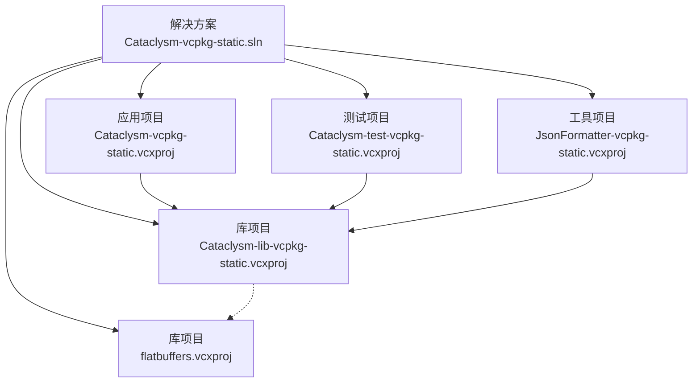
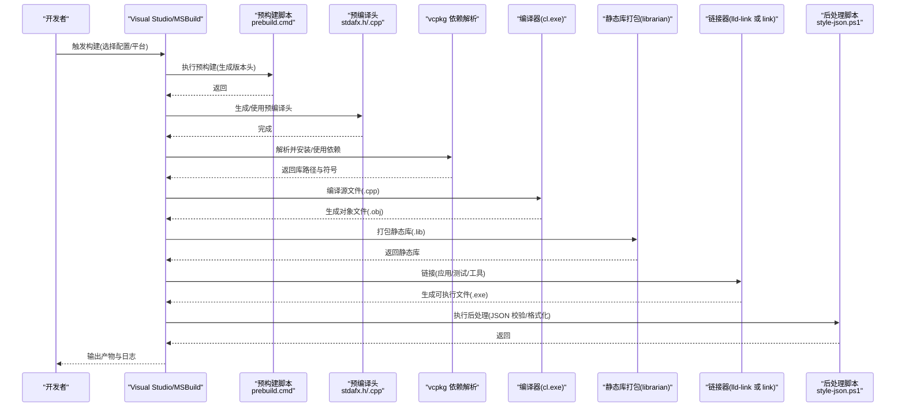
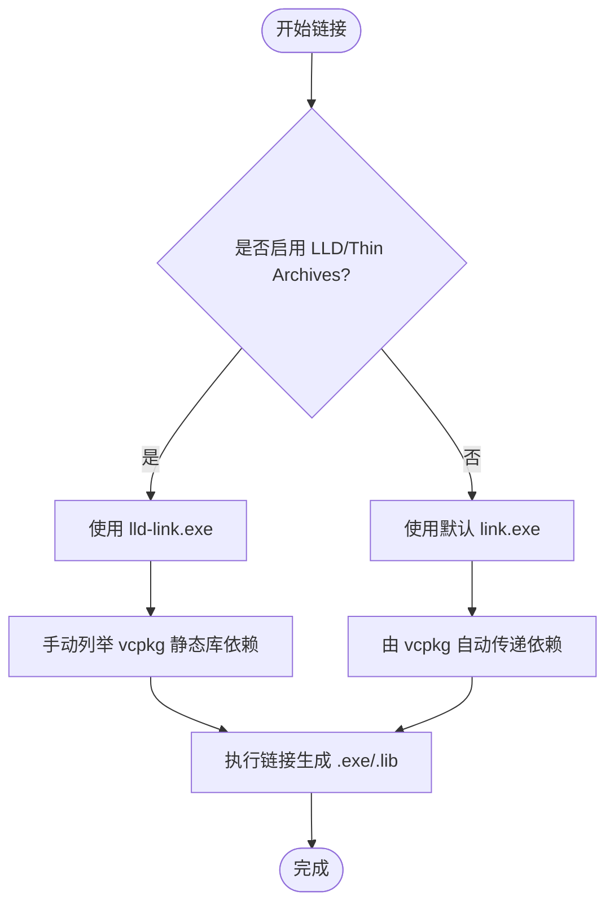
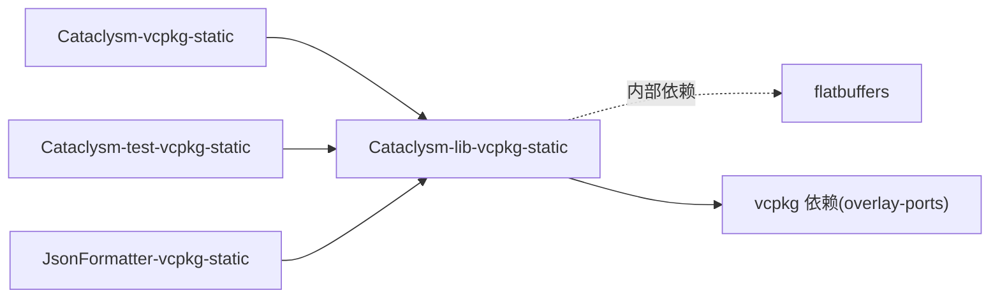

# 构建流程详解

<cite>
**本文引用的文件**
- [Cataclysm-vcpkg-static.sln](file://Cataclysm-vcpkg-static.sln)
- [Cataclysm-vcpkg-static.vcxproj](file://Cataclysm-vcpkg-static.vcxproj)
- [Cataclysm-lib-vcpkg-static.vcxproj](file://Cataclysm-lib-vcpkg-static.vcxproj)
- [Cataclysm-test-vcpkg-static.vcxproj](file://Cataclysm-test-vcpkg-static.vcxproj)
- [JsonFormatter-vcpkg-static.vcxproj](file://JsonFormatter-vcpkg-static.vcxproj)
- [flatbuffers.vcxproj](file://flatbuffers.vcxproj)
- [Cataclysm.Cpp.props](file://Cataclysm.Cpp.props)
- [Cataclysm-common.props](file://Cataclysm-common.props)
- [prebuild.cmd](file://prebuild.cmd)
- [distribute.bat](file://distribute.bat)
- [vcpkg.json](file://vcpkg.json)
- [stdafx.h](file://stdafx.h)
- [stdafx.cpp](file://stdafx.cpp)
- [style-json.ps1](file://style-json.ps1)
</cite>

## 目录
1. [简介](#简介)
2. [项目结构](#项目结构)
3. [核心组件](#核心组件)
4. [架构总览](#架构总览)
5. [详细组件分析](#详细组件分析)
6. [依赖分析](#依赖分析)
7. [性能考虑](#性能考虑)
8. [故障排查指南](#故障排查指南)
9. [结论](#结论)
10. [附录](#附录)

## 简介
本文件面向构建工程师与开发者，系统性阐述从源码到最终可执行产物的完整构建流程，覆盖预构建阶段、编译阶段、链接阶段与后处理阶段；解释项目间引用与库链接顺序；分析构建缓存与增量编译机制；给出并行编译、预编译头、编译器优化等性能优化建议；并提供构建日志分析与错误诊断方法。

## 项目结构
该仓库采用 MSBuild 解决方案组织多项目构建，核心由以下项目构成：
- 应用层：Cataclysm-vcpkg-static（主程序）
- 库层：Cataclysm-lib-vcpkg-static（静态库）、flatbuffers（静态库）
- 测试层：Cataclysm-test-vcpkg-static（测试程序）
- 工具层：JsonFormatter-vcpkg-static（JSON 格式化工具）

构建系统通过公共属性文件统一编译与链接行为，并通过 vcpkg 管理第三方依赖。

图表来源
- [Cataclysm-vcpkg-static.sln:17-28](file://Cataclysm-vcpkg-static.sln#L17-L28)
- [Cataclysm-vcpkg-static.vcxproj:226-228](file://Cataclysm-vcpkg-static.vcxproj#L226-L228)
- [Cataclysm-test-vcpkg-static.vcxproj:188-190](file://Cataclysm-test-vcpkg-static.vcxproj#L188-L190)
- [JsonFormatter-vcpkg-static.vcxproj:144-149](file://JsonFormatter-vcpkg-static.vcxproj#L144-L149)
- [Cataclysm-lib-vcpkg-static.vcxproj:182-185](file://Cataclysm-lib-vcpkg-static.vcxproj#L182-L185)

章节来源
- [Cataclysm-vcpkg-static.sln:17-28](file://Cataclysm-vcpkg-static.sln#L17-L28)

## 核心组件
- 公共属性与编译规则：Cataclysm-common.props 统一控制警告级别、包含路径、预编译头、调试信息格式、链接器附加依赖等。
- 编译器特性开关：Cataclysm.Cpp.props 控制是否启用 ccache 以及多工具任务并行编译。
- 预编译头：stdafx.h/stdafx.cpp 提供统一的预编译头入口，提升编译速度。
- vcpkg 依赖：vcpkg.json 声明 SDL2 生态相关依赖，自动安装与链接。
- 版本生成：prebuild.cmd 在构建前生成版本头文件。
- 后处理：style-json.ps1 在构建后对 JSON 进行格式化与校验；distribute.bat 打包分发文件。

章节来源
- [Cataclysm-common.props:41-143](file://Cataclysm-common.props#L41-L143)
- [Cataclysm.Cpp.props:1-11](file://Cataclysm.Cpp.props#L1-L11)
- [stdafx.h:1-96](file://stdafx.h#L1-L96)
- [stdafx.cpp:1-2](file://stdafx.cpp#L1-L2)
- [vcpkg.json:1-22](file://vcpkg.json#L1-L22)
- [prebuild.cmd:1-16](file://prebuild.cmd#L1-L16)
- [style-json.ps1:1-78](file://style-json.ps1#L1-L78)
- [distribute.bat:1-11](file://distribute.bat#L1-L11)

## 架构总览
下图展示从源码到产物的整体构建时序与依赖关系：

图表来源
- [prebuild.cmd:1-16](file://prebuild.cmd#L1-L16)
- [Cataclysm.Cpp.props:1-11](file://Cataclysm.Cpp.props#L1-L11)
- [Cataclysm-common.props:41-143](file://Cataclysm-common.props#L41-L143)
- [Cataclysm-lib-vcpkg-static.vcxproj:123-125](file://Cataclysm-lib-vcpkg-static.vcxproj#L123-L125)
- [Cataclysm-vcpkg-static.vcxproj:166-170](file://Cataclysm-vcpkg-static.vcxproj#L166-L170)
- [style-json.ps1:1-78](file://style-json.ps1#L1-L78)

## 详细组件分析

### 预构建阶段
- 版本生成：prebuild.cmd 使用 git 描述符生成版本号并写入 src/version.h，确保每次构建包含准确版本信息。
- 依赖准备：Cataclysm-lib-vcpkg-static 在编译前执行 PreBuildEvent 调用 prebuild.cmd，保证版本信息在库阶段可用。
- 可选：ccache 模式下禁用预编译头以避免与 ccache 的兼容性问题。

章节来源
- [prebuild.cmd:1-16](file://prebuild.cmd#L1-L16)
- [Cataclysm-lib-vcpkg-static.vcxproj:123-125](file://Cataclysm-lib-vcpkg-static.vcxproj#L123-L125)
- [Cataclysm.Cpp.props:1-11](file://Cataclysm.Cpp.props#L1-L11)
- [Cataclysm-common.props:65-70](file://Cataclysm-common.props#L65-L70)

### 编译阶段
- 编译器选项：Cataclysm-common.props 设置警告等级、语言标准、UTF-8 支持、/bigobj、禁用特定警告、强制包含预编译头等。
- 预编译头：stdafx.h 汇集常用头文件，stdafx.cpp 仅包含头文件以触发一次生成；在非 ccache 模式下启用“创建”预编译头。
- 平台与配置：各项目定义多种配置与平台组合，编译器按配置注入不同宏与运行库设置。

章节来源
- [Cataclysm-common.props:41-70](file://Cataclysm-common.props#L41-L70)
- [Cataclysm-common.props:145-152](file://Cataclysm-common.props#L145-L152)
- [stdafx.h:1-96](file://stdafx.h#L1-L96)
- [stdafx.cpp:1-2](file://stdafx.cpp#L1-L2)
- [Cataclysm-vcpkg-static.vcxproj:172-186](file://Cataclysm-vcpkg-static.vcxproj#L172-L186)
- [Cataclysm-lib-vcpkg-static.vcxproj:127-141](file://Cataclysm-lib-vcpkg-static.vcxproj#L127-L141)
- [Cataclysm-test-vcpkg-static.vcxproj:132-146](file://Cataclysm-test-vcpkg-static.vcxproj#L132-L146)

### 链接阶段
- 静态库：Cataclysm-lib-vcpkg-static 产出静态库(.lib)，flatbuffers 作为其内部依赖被包含但不自动链接到上层项目。
- 应用与测试：Cataclysm-vcpkg-static 与 Cataclysm-test-vcpkg-static 通过 ProjectReference 引用 Cataclysm-lib-vcpkg-static。
- 链接器选择：当启用 LLD 或 Thin Archives 时，链接器工具链切换为 lld-link.exe，并手动枚举 vcpkg 安装的静态库依赖。
- 默认系统库：Cataclysm-common.props 在 Link 节点声明常见 Windows 系统库，确保链接成功。

图表来源
- [Cataclysm-common.props:33-40](file://Cataclysm-common.props#L33-L40)
- [Cataclysm-common.props:91-140](file://Cataclysm-common.props#L91-L140)
- [Cataclysm-lib-vcpkg-static.vcxproj:182-185](file://Cataclysm-lib-vcpkg-static.vcxproj#L182-L185)

章节来源
- [Cataclysm-common.props:74-90](file://Cataclysm-common.props#L74-L90)
- [Cataclysm-common.props:91-140](file://Cataclysm-common.props#L91-L140)
- [Cataclysm-lib-vcpkg-static.vcxproj:182-185](file://Cataclysm-lib-vcpkg-static.vcxproj#L182-L185)

### 后处理阶段
- JSON 校验与格式化：构建后通过自定义步骤调用 PowerShell 脚本 style-json.ps1，仅对变更的 JSON 文件进行格式化与 lint，避免长时间阻塞。
- 分发打包：distribute.bat 将 DLL、数据、配置、资源与可执行文件复制到 distribution 目录，便于发布。

章节来源
- [Cataclysm-vcpkg-static.vcxproj:166-170](file://Cataclysm-vcpkg-static.vcxproj#L166-L170)
- [style-json.ps1:1-78](file://style-json.ps1#L1-L78)
- [distribute.bat:1-11](file://distribute.bat#L1-L11)

## 依赖分析
- 项目间依赖
  - Cataclysm-vcpkg-static → Cataclysm-lib-vcpkg-static
  - Cataclysm-test-vcpkg-static → Cataclysm-lib-vcpkg-static
  - JsonFormatter-vcpkg-static → Cataclysm-lib-vcpkg-static 与 JsonFormatter-lib-vcpkg-static
  - Cataclysm-lib-vcpkg-static → flatbuffers（内部依赖，不自动传递给上层）

- vcpkg 依赖
  - vcpkg.json 声明 SDL2 生态相关依赖，启用 overlay-ports 以支持定制端口。
  - 当使用 LLD 链接器时，需手动列举 vcpkg 安装的静态库，避免链接器不接受通配模式。

图表来源
- [Cataclysm-vcpkg-static.vcxproj:226-228](file://Cataclysm-vcpkg-static.vcxproj#L226-L228)
- [Cataclysm-test-vcpkg-static.vcxproj:188-190](file://Cataclysm-test-vcpkg-static.vcxproj#L188-L190)
- [JsonFormatter-vcpkg-static.vcxproj:144-149](file://JsonFormatter-vcpkg-static.vcxproj#L144-L149)
- [Cataclysm-lib-vcpkg-static.vcxproj:182-185](file://Cataclysm-lib-vcpkg-static.vcxproj#L182-L185)
- [vcpkg.json:16-20](file://vcpkg.json#L16-L20)

章节来源
- [vcpkg.json:1-22](file://vcpkg.json#L1-L22)
- [Cataclysm-common.props:36-40](file://Cataclysm-common.props#L36-L40)

## 性能考虑
- 并行编译
  - 多工具任务：启用 UseMultiToolTask 以并行执行多个编译任务。
  - 多处理器：开启 MultiProcessorCompilation，充分利用 CPU 核心。
- 预编译头
  - 在非 ccache 模式下启用预编译头，显著减少重复头文件解析时间。
  - ccache 模式下禁用预编译头以避免兼容性问题。
- 编译器优化
  - Release 配置启用最大优化、内联与函数级链接，减小体积并提升运行时性能。
  - 生成快速调试信息，平衡调试体验与构建时间。
- 链接器优化
  - 启用 COMDAT folding 与优化引用，减小二进制体积。
  - 使用 LLD 链接器或 LLVM Lib 工具链可获得更快的链接速度与更佳的 Thin Archive 支持。
- 构建缓存
  - 可选启用 ccache，结合多工具任务提升重复构建效率；注意与预编译头的互斥策略。

章节来源
- [Cataclysm.Cpp.props:1-11](file://Cataclysm.Cpp.props#L1-L11)
- [Cataclysm-common.props:46-50](file://Cataclysm-common.props#L46-L50)
- [Cataclysm-common.props:65-70](file://Cataclysm-common.props#L65-L70)
- [Cataclysm-common.props:71-73](file://Cataclysm-common.props#L71-L73)
- [Cataclysm-common.props:143-143](file://Cataclysm-common.props#L143-L143)
- [Cataclysm-vcpkg-static.vcxproj:188-212](file://Cataclysm-vcpkg-static.vcxproj#L188-L212)
- [Cataclysm-lib-vcpkg-static.vcxproj:143-169](file://Cataclysm-lib-vcpkg-static.vcxproj#L143-L169)

## 故障排查指南
- 预编译头冲突
  - 症状：启用 ccache 后出现头文件重定义或编译异常。
  - 处理：确认 ccache 模式下预编译头被禁用，检查属性文件中对应条件。
  - 参考
    - [Cataclysm.Cpp.props:65-70](file://Cataclysm.Cpp.props#L65-L70)
    - [Cataclysm-common.props:145-152](file://Cataclysm-common.props#L145-L152)
- 链接失败或缺少符号
  - 症状：使用 LLD 链接器时报错找不到 vcpkg 静态库。
  - 处理：确保已手动列举 vcpkg 安装的静态库依赖，检查 Debug/Release 的库目录路径。
  - 参考
    - [Cataclysm-common.props:91-140](file://Cataclysm-common.props#L91-L140)
- JSON 校验卡顿或失败
  - 症状：构建后 JSON 校验耗时过长或失败。
  - 处理：检查 style-json.ps1 的超时限制与输出格式；确认 json_formatter.exe 可用且未被锁定。
  - 参考
    - [style-json.ps1:20-34](file://style-json.ps1#L20-L34)
    - [Cataclysm-vcpkg-static.vcxproj:166-170](file://Cataclysm-vcpkg-static.vcxproj#L166-L170)
- 版本头未更新
  - 症状：运行时版本号不正确。
  - 处理：确认 prebuild.cmd 能访问 git 并生成 src/version.h。
  - 参考
    - [prebuild.cmd:1-16](file://prebuild.cmd#L1-L16)
- 调试信息异常
  - 症状：VS 2022 DebugFastLink 导致崩溃。
  - 处理：根据平台工具集版本调整为 DebugFull。
  - 参考
    - [Cataclysm-common.props:81-85](file://Cataclysm-common.props#L81-L85)

## 结论
该构建系统通过公共属性文件统一编译与链接策略，结合 vcpkg 管理第三方依赖，形成清晰的项目层次与稳定的构建流程。通过预编译头、并行编译、LLD 链接器与可选 ccache，可在保证质量的同时显著提升构建效率。后处理脚本确保代码风格一致性与产物完整性。建议在团队内统一构建参数与工具链版本，以减少环境差异带来的问题。

## 附录
- 关键构建参数速查
  - 预编译头：启用/禁用取决于 ccache 模式
  - 并行编译：UseMultiToolTask、MultiProcessorCompilation
  - 链接器：link.exe 或 lld-link.exe，按需切换
  - 调试信息：DebugFastLink 或 DebugFull
- 常见问题定位清单
  - 检查 vcpkg 安装状态与 triplet 配置
  - 确认项目引用链与 LinkLibraryDependencies 设置
  - 校验后处理脚本权限与可执行文件存在性