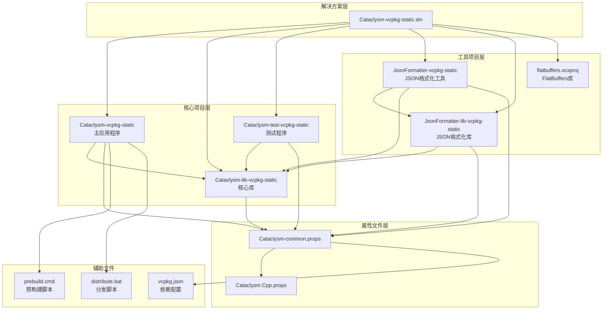
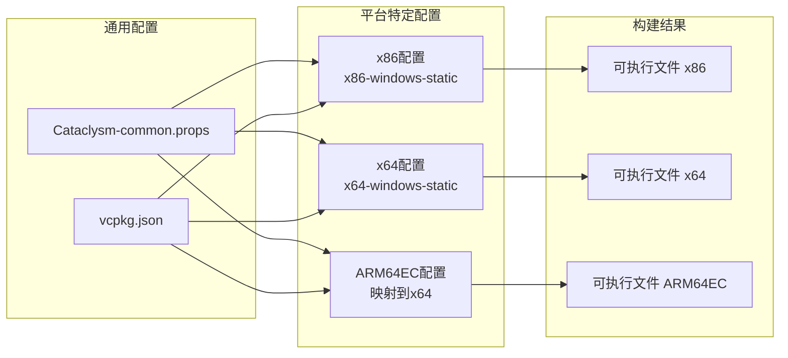
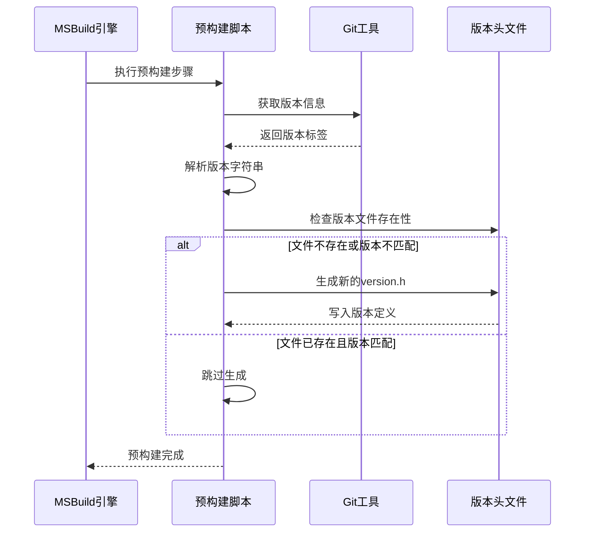
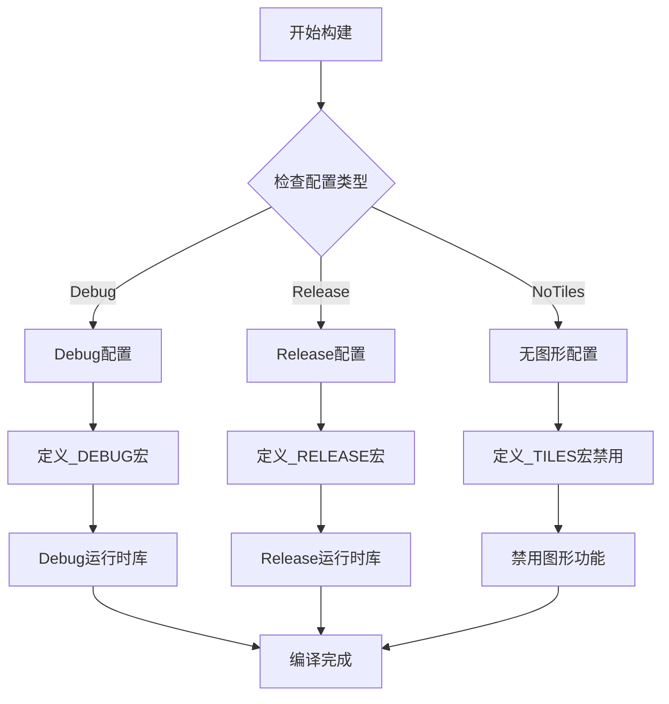
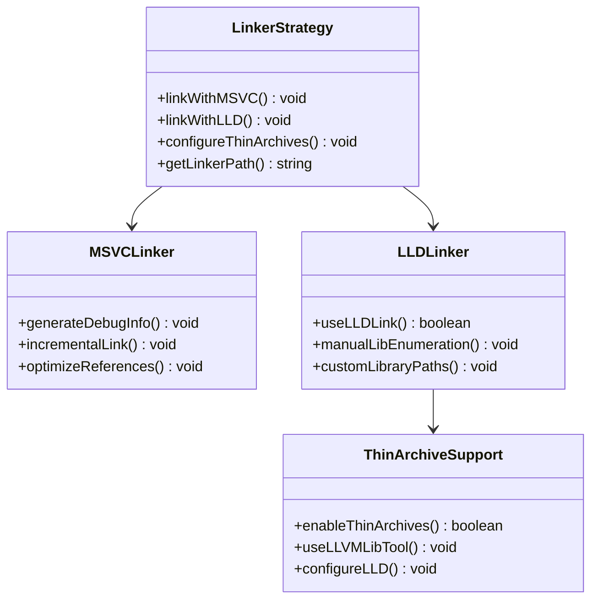
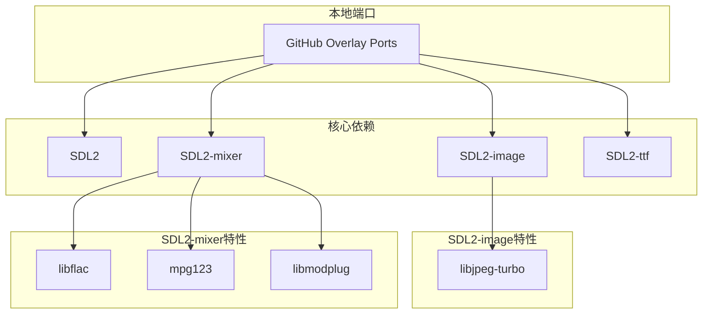
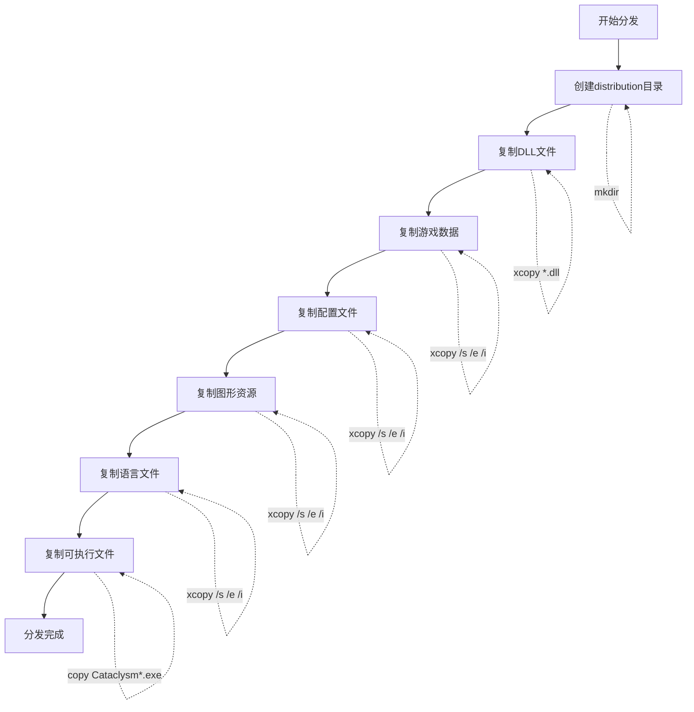
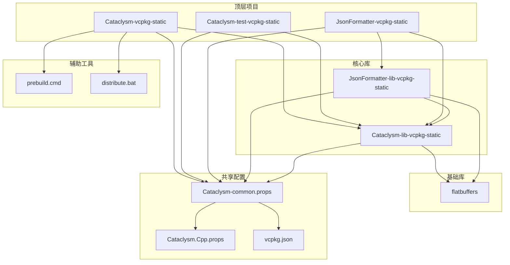

# 构建系统架构

<cite>
**本文档引用的文件**
- [Cataclysm.Cpp.props](file://Cataclysm.Cpp.props)
- [Cataclysm-common.props](file://Cataclysm-common.props)
- [vcpkg.json](file://vcpkg.json)
- [prebuild.cmd](file://prebuild.cmd)
- [distribute.bat](file://distribute.bat)
- [Cataclysm-vcpkg-static.vcxproj](file://Cataclysm-vcpkg-static.vcxproj)
- [Cataclysm-lib-vcpkg-static.vcxproj](file://Cataclysm-lib-vcpkg-static.vcxproj)
- [Cataclysm-test-vcpkg-static.vcxproj](file://Cataclysm-test-vcpkg-static.vcxproj)
- [JsonFormatter-vcpkg-static.vcxproj](file://JsonFormatter-vcpkg-static.vcxproj)
- [JsonFormatter-lib-vcpkg-static.vcxproj](file://JsonFormatter-lib-vcpkg-static.vcxproj)
- [flatbuffers.vcxproj](file://flatbuffers.vcxproj)
- [Cataclysm-vcpkg-static.sln](file://Cataclysm-vcpkg-static.sln)
- [stdafx.h](file://stdafx.h)
</cite>

## 目录
1. [简介](#简介)
2. [项目结构](#项目结构)
3. [核心组件](#核心组件)
4. [架构概览](#架构概览)
5. [详细组件分析](#详细组件分析)
6. [依赖关系分析](#依赖关系分析)
7. [性能考虑](#性能考虑)
8. [故障排除指南](#故障排除指南)
9. [结论](#结论)

## 简介

本项目是一个基于MSVC的完整构建系统，专为Cataclysm Medieval项目设计。该构建系统采用现代的MSBuild架构，通过属性文件的层次化管理和vcpkg包管理器实现跨平台的静态链接构建。系统支持多种配置（Debug/Release）和架构（x86、x64、ARM64EC），提供了完整的开发、测试和分发工作流程。

该构建系统的核心特点是：
- 统一的属性文件管理机制
- 基于vcpkg的依赖管理
- 多平台静态链接策略
- 智能的编译器和链接器参数控制
- 完整的构建优化和调试支持

## 项目结构

构建系统采用模块化的项目结构，主要包含以下核心组件：



**图表来源**
- [Cataclysm-vcpkg-static.sln:1-189](file://Cataclysm-vcpkg-static.sln#L1-L189)
- [Cataclysm-common.props:1-154](file://Cataclysm-common.props#L1-L154)

**章节来源**
- [Cataclysm-vcpkg-static.sln:1-189](file://Cataclysm-vcpkg-static.sln#L1-L189)
- [Cataclysm.Cpp.props:1-11](file://Cataclysm.Cpp.props#L1-L11)
- [Cataclysm-common.props:1-154](file://Cataclysm-common.props#L1-L154)

## 核心组件

### 属性文件管理系统

构建系统采用两层属性文件架构，实现了高度的可配置性和可维护性：

#### Cataclysm.Cpp.props - 编译器特定属性
这个文件专注于编译器相关的设置，特别是缓存支持和工具链路径配置。

#### Cataclysm-common.props - 通用构建属性
这是核心属性文件，定义了所有构建相关的通用设置，包括：
- 路径和输出目录配置
- 条件编译宏定义
- 静态链接策略
- 编译器和链接器参数
- vcpkg集成设置

### 项目配置矩阵

系统支持12种不同的构建配置组合：

| 配置类型 | 平台 | 描述 |
|---------|------|------|
| Debug | Win32/x64/ARM64EC | 调试版本，启用调试符号 |
| Debug-NoTiles | Win32/x64/ARM64EC | 调试版本，无图形界面 |
| Release | Win32/x64/ARM64EC | 发布版本，优化代码大小 |
| Release-NoTiles | Win32/x64/ARM64EC | 发布版本，无图形界面 |

**章节来源**
- [Cataclysm-vcpkg-static.vcxproj:3-51](file://Cataclysm-vcpkg-static.vcxproj#L3-L51)
- [Cataclysm-lib-vcpkg-static.vcxproj:3-51](file://Cataclysm-lib-vcpkg-static.vcxproj#L3-L51)
- [Cataclysm-test-vcpkg-static.vcxproj:3-51](file://Cataclysm-test-vcpkg-static.vcxproj#L3-L51)

## 架构概览

构建系统采用分层架构设计，确保了良好的模块化和可扩展性：

```mermaid
graph TB
subgraph "用户接口层"
IDE[Visual Studio IDE]
CLI[命令行构建]
end
subgraph "MSBuild引擎层"
MSBUILD[MSBuild核心引擎]
PROPS[属性文件系统]
TARGETS[目标文件系统]
end
subgraph "工具链层"
COMPILER[MSVC编译器]
LINKER[MSVC链接器]
LLD[LLD链接器(可选)]
LIB[LLVM Lib工具(可选)]
end
subgraph "依赖管理层"
VCPKG[vcpkg包管理器]
DEPS[第三方依赖]
end
subgraph "输出层"
EXE[可执行文件]
LIB[静态库]
DLL[动态库]
DATA[资源数据]
end
IDE --> MSBUILD
CLI --> MSBUILD
MSBUILD --> PROPS
MSBUILD --> TARGETS
PROPS --> COMPILER
PROPS --> LINKER
PROPS --> LLD
PROPS --> LIB
VCPKG --> DEPS
COMPILER --> EXE
COMPILER --> LIB
LINKER --> EXE
LLD --> EXE
LIB --> LIB
DEPS --> EXE
DEPS --> LIB
EXE --> DATA
LIB --> DATA
```

**图表来源**
- [Cataclysm-common.props:26-40](file://Cataclysm-common.props#L26-L40)
- [Cataclysm-vcpkg-static.vcxproj:63-73](file://Cataclysm-vcpkg-static.vcxproj#L63-L73)

### 多平台支持架构

系统通过统一的属性文件和条件编译实现了对不同平台的无缝支持：



**图表来源**
- [Cataclysm-vcpkg-static.vcxproj:59-61](file://Cataclysm-vcpkg-static.vcxproj#L59-L61)
- [Cataclysm-lib-vcpkg-static.vcxproj:66-68](file://Cataclysm-lib-vcpkg-static.vcxproj#L66-L68)

**章节来源**
- [Cataclysm-common.props:1-154](file://Cataclysm-common.props#L1-L154)
- [vcpkg.json:1-22](file://vcpkg.json#L1-L22)

## 详细组件分析

### 预构建系统

预构建系统负责在实际编译前准备必要的构建环境和资源：



**图表来源**
- [prebuild.cmd:1-16](file://prebuild.cmd#L1-L16)
- [Cataclysm-lib-vcpkg-static.vcxproj:123-125](file://Cataclysm-lib-vcpkg-static.vcxproj#L123-L125)

**章节来源**
- [prebuild.cmd:1-16](file://prebuild.cmd#L1-L16)
- [Cataclysm-lib-vcpkg-static.vcxproj:123-125](file://Cataclysm-lib-vcpkg-static.vcxproj#L123-L125)

### 编译器配置分析

编译器配置是构建系统的核心，通过属性文件实现了统一的编译选项管理：

#### 编译器选项配置

| 选项类别 | 配置内容 | 作用说明 |
|---------|---------|---------|
| 语言标准 | C++17 | 使用现代C++特性 |
| 警告级别 | Level1 | 控制编译警告数量 |
| 预处理器 | 多个宏定义 | 控制功能开关 |
| 包含路径 | 源码目录 | 确保头文件正确解析 |
| 预编译头 | stdafx.h | 提升编译速度 |

#### 条件编译策略

系统使用条件编译来适应不同的构建需求：



**图表来源**
- [Cataclysm-common.props:59-64](file://Cataclysm-common.props#L59-L64)
- [Cataclysm-vcpkg-static.vcxproj:172-187](file://Cataclysm-vcpkg-static.vcxproj#L172-L187)

**章节来源**
- [Cataclysm-common.props:42-70](file://Cataclysm-common.props#L42-L70)
- [Cataclysm-vcpkg-static.vcxproj:172-187](file://Cataclysm-vcpkg-static.vcxproj#L172-L187)

### 链接器配置分析

链接器配置确保了静态链接策略的有效实施和依赖项的正确处理：

#### 静态链接策略

系统采用完全静态链接的策略，通过以下方式实现：

1. **vcpkg静态链接**：所有依赖库都以静态形式链接
2. **运行时库选择**：Debug使用MultiThreadedDebug，Release使用MultiThreaded
3. **链接器优化**：启用COMDAT折叠和代码合并

#### LLD链接器支持

系统提供了对LLD链接器的支持，用于替代默认的MSVC链接器：



**图表来源**
- [Cataclysm-common.props:29-40](file://Cataclysm-common.props#L29-L40)
- [Cataclysm-common.props:91-140](file://Cataclysm-common.props#L91-L140)

**章节来源**
- [Cataclysm-common.props:74-140](file://Cataclysm-common.props#L74-L140)

### vcpkg集成分析

vcpkg作为包管理器，为构建系统提供了强大的依赖管理能力：

#### 依赖配置

系统通过vcpkg.json文件定义了核心依赖关系：



**图表来源**
- [vcpkg.json:4-21](file://vcpkg.json#L4-L21)

**章节来源**
- [vcpkg.json:1-22](file://vcpkg.json#L1-L22)

### 分发系统

分发系统负责将构建产物整理为可分发的目录结构：



**图表来源**
- [distribute.bat:1-11](file://distribute.bat#L1-L11)

**章节来源**
- [distribute.bat:1-11](file://distribute.bat#L1-L11)

## 依赖关系分析

构建系统的依赖关系体现了清晰的层次结构和模块化设计：



**图表来源**
- [Cataclysm-vcpkg-static.sln:17-27](file://Cataclysm-vcpkg-static.sln#L17-L27)
- [Cataclysm-common.props:1-154](file://Cataclysm-common.props#L1-L154)

### 依赖传递分析

系统中的依赖传递遵循严格的规则，确保了构建的一致性和可靠性：

1. **应用程序依赖核心库**：主应用程序和测试程序都依赖核心库
2. **工具依赖库**：JSON格式化工具依赖其专用库和核心库
3. **库依赖基础库**：所有库都依赖FlatBuffers基础库
4. **共享配置**：所有项目共享相同的属性配置

**章节来源**
- [Cataclysm-vcpkg-static.sln:17-27](file://Cataclysm-vcpkg-static.sln#L17-L27)
- [Cataclysm-lib-vcpkg-static.vcxproj:182-185](file://Cataclysm-lib-vcpkg-static.vcxproj#L182-L185)

## 性能考虑

构建系统在多个层面进行了性能优化：

### 编译器优化策略

1. **并行编译**：启用多处理器编译提升编译速度
2. **预编译头**：使用stdafx.h减少重复编译时间
3. **优化编译选项**：Release版本启用最大优化级别
4. **调试信息控制**：根据配置类型调整调试信息级别

### 链接器优化策略

1. **增量链接**：Debug版本启用增量链接减少链接时间
2. **COMDAT折叠**：Release版本启用代码合并优化
3. **静态链接**：避免运行时依赖减少启动时间
4. **LLD链接器**：可选的LLD链接器提供更快的链接速度

### 缓存和工具链优化

1. **CCache支持**：可选的编译缓存提升重复编译速度
2. **LLVM工具链**：可选的LLVM工具链提供更好的优化
3. **薄归档支持**：LLVM lib工具支持更高效的静态库管理

**章节来源**
- [Cataclysm.Cpp.props:1-11](file://Cataclysm.Cpp.props#L1-L11)
- [Cataclysm-common.props:26-40](file://Cataclysm-common.props#L26-L40)
- [Cataclysm-common.props:71-73](file://Cataclysm-common.props#L71-L73)

## 故障排除指南

### 常见构建问题及解决方案

#### 1. vcpkg依赖安装失败

**症状**：构建过程中出现依赖库找不到的错误

**解决方案**：
- 确认网络连接正常
- 运行`vcpkg install`手动安装依赖
- 检查vcpkg.json中的依赖配置
- 验证overlay-ports路径正确性

#### 2. 预构建脚本执行失败

**症状**：version.h文件未生成或版本信息不正确

**解决方案**：
- 确认Git工具已正确安装并添加到PATH
- 检查Git仓库状态和权限
- 验证prebuild.cmd脚本的执行权限
- 手动运行prebuild.cmd生成version.h

#### 3. 链接器错误

**症状**：链接阶段出现符号未定义或库文件找不到

**解决方案**：
- 检查vcpkg静态链接配置
- 验证库文件路径和后缀
- 确认LLD链接器配置正确
- 检查Thin Archives设置

#### 4. ARM64EC平台兼容性问题

**症状**：ARM64EC平台构建失败或运行异常

**解决方案**：
- 确认Visual Studio版本支持ARM64EC
- 验证ARM64EC工具链完整性
- 检查平台特定的编译选项
- 测试x64平台兼容性

#### 5. 编译器缓存问题

**症状**：使用CCache时编译结果异常

**解决方案**：
- 禁用CCache进行对比测试
- 清理CCache缓存
- 检查CCache配置和版本
- 验证编译器路径设置

**章节来源**
- [prebuild.cmd:1-16](file://prebuild.cmd#L1-L16)
- [Cataclysm-common.props:33-40](file://Cataclysm-common.props#L33-L40)

### 调试和诊断工具

#### 1. 构建日志分析

使用MSBuild的详细日志模式：
```bash
msbuild /m /v:d Cataclysm-vcpkg-static.sln
```

#### 2. 属性值验证

检查关键属性的计算结果：
```bash
msbuild /m /v:d /p:ShowOnlyPropertyList=true Cataclysm-vcpkg-static.sln
```

#### 3. 依赖图生成

生成项目依赖关系图：
```bash
msbuild /m /t:Rebuild /p:GenerateDependencyGraph=true Cataclysm-vcpkg-static.sln
```

## 结论

本MSVC Full Features构建系统展现了现代C++项目的最佳实践，通过精心设计的属性文件系统、vcpkg集成和多平台支持，实现了高度的可维护性和可扩展性。

### 主要优势

1. **统一配置管理**：通过属性文件实现了编译选项的集中管理
2. **多平台支持**：完整的x86、x64、ARM64EC支持
3. **静态链接策略**：确保运行时依赖的最小化
4. **性能优化**：多层优化策略提升构建效率
5. **模块化设计**：清晰的项目分离便于维护

### 技术创新点

1. **条件编译宏系统**：灵活的功能开关控制
2. **LLD链接器集成**：可选的高性能链接器支持
3. **预构建自动化**：自动版本管理和资源准备
4. **Thin Archives支持**：LLVM工具链的现代化集成

### 未来改进方向

1. **CI/CD集成**：进一步完善持续集成流程
2. **容器化构建**：支持Docker等容器化构建环境
3. **性能监控**：添加构建性能指标收集
4. **文档自动化**：生成构建系统的自文档化

该构建系统为Cataclysm Medieval项目提供了坚实的技术基础，确保了高质量的软件交付和开发体验。