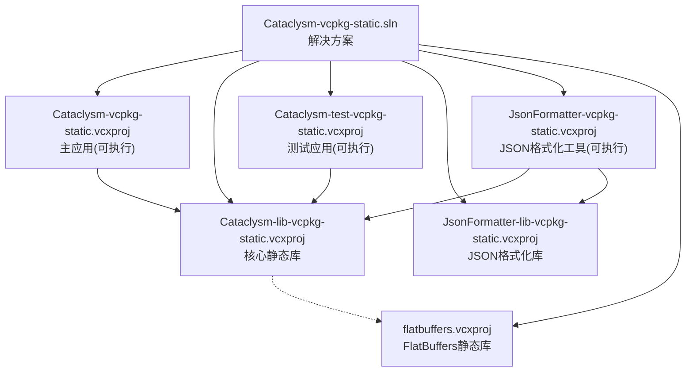
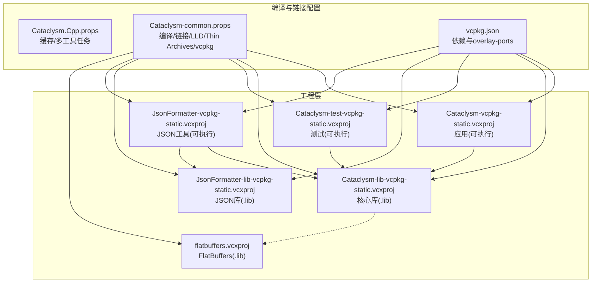
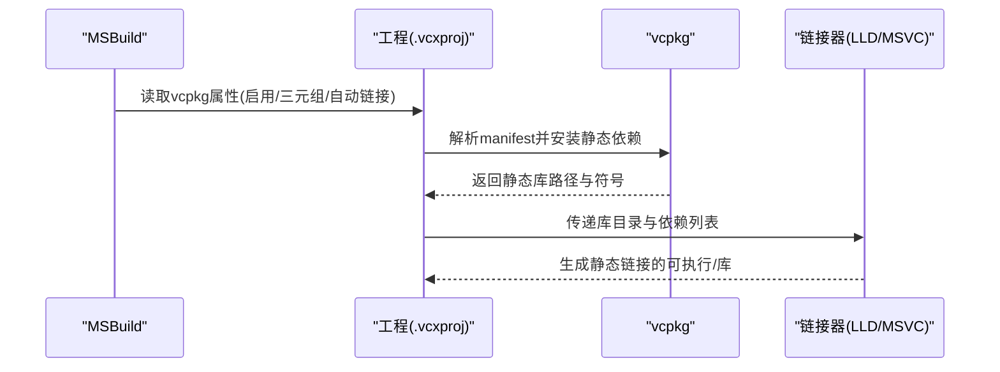
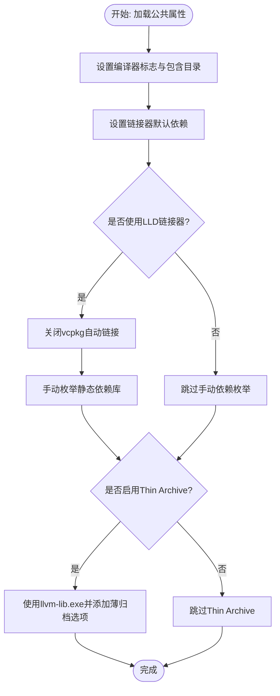
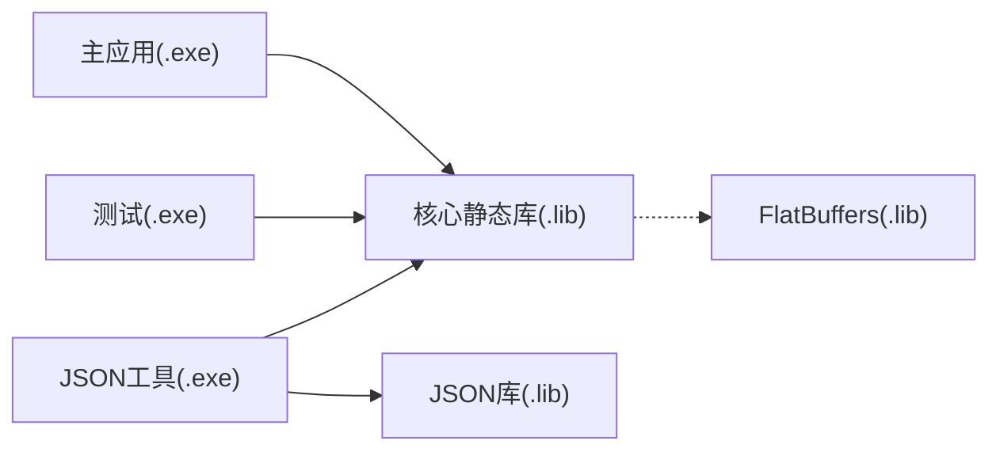
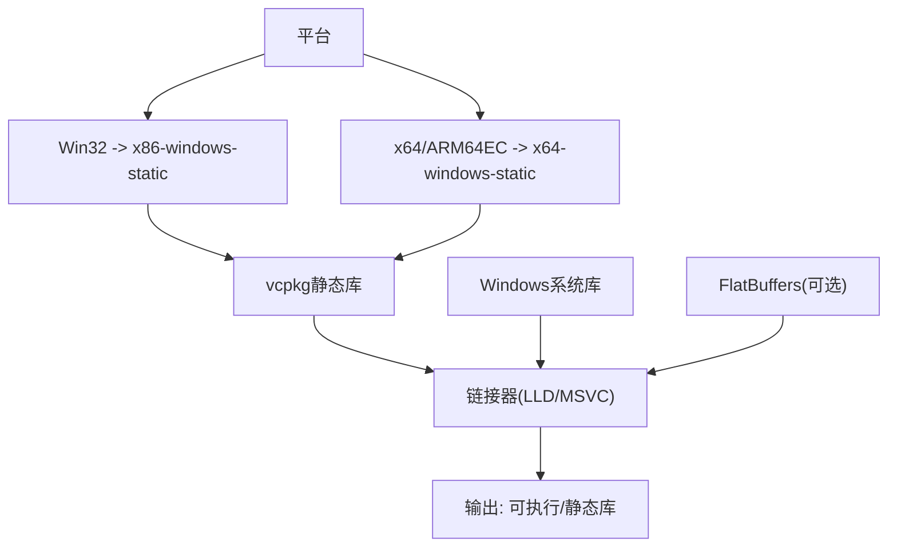

# 静态链接策略

<cite>
**本文档引用的文件**
- [Cataclysm.Cpp.props](file://Cataclysm.Cpp.props)
- [Cataclysm-common.props](file://Cataclysm-common.props)
- [vcpkg.json](file://vcpkg.json)
- [Cataclysm-vcpkg-static.sln](file://Cataclysm-vcpkg-static.sln)
- [Cataclysm-vcpkg-static.vcxproj](file://Cataclysm-vcpkg-static.vcxproj)
- [Cataclysm-lib-vcpkg-static.vcxproj](file://Cataclysm-lib-vcpkg-static.vcxproj)
- [Cataclysm-test-vcpkg-static.vcxproj](file://Cataclysm-test-vcpkg-static.vcxproj)
- [JsonFormatter-vcpkg-static.vcxproj](file://JsonFormatter-vcpkg-static.vcxproj)
- [JsonFormatter-lib-vcpkg-static.vcxproj](file://JsonFormatter-lib-vcpkg-static.vcxproj)
- [flatbuffers.vcxproj](file://flatbuffers.vcxproj)
- [prebuild.cmd](file://prebuild.cmd)
- [distribute.bat](file://distribute.bat)
</cite>

## 目录
1. [引言](#引言)
2. [项目结构](#项目结构)
3. [核心组件](#核心组件)
4. [架构总览](#架构总览)
5. [详细组件分析](#详细组件分析)
6. [依赖关系分析](#依赖关系分析)
7. [性能考量](#性能考量)
8. [故障排除指南](#故障排除指南)
9. [结论](#结论)
10. [附录](#附录)

## 引言
本文件系统化阐述该仓库中的静态链接策略，围绕以下目标展开：解释静态链接在二进制体积、运行时依赖、部署便利性等方面的优劣势；说明如何通过属性文件配置静态链接参数（库路径、依赖枚举、链接器选项）；对比静态链接与动态链接的性能与内存差异；提供基于本仓库实践的故障排除与优化建议；并详解vcpkg静态库的集成与管理方法。

## 项目结构
该工程采用MSBuild与vcpkg结合的静态链接方案，核心由一个解决方案与多个工程组成，统一通过公共属性文件集中配置编译与链接行为。关键特性包括：
- 使用x86-windows-static或x64-windows-static三元组进行静态库安装与链接
- 在使用LLD链接器时禁用自动链接并手动枚举依赖库
- 统一的预处理与调试信息生成策略
- 多个可执行与静态库工程共享同一套公共属性

**图表来源**
- [Cataclysm-vcpkg-static.sln:17-27](file://Cataclysm-vcpkg-static.sln#L17-L27)
- [Cataclysm-vcpkg-static.vcxproj:225-228](file://Cataclysm-vcpkg-static.vcxproj#L225-L228)
- [Cataclysm-test-vcpkg-static.vcxproj:187-190](file://Cataclysm-test-vcpkg-static.vcxproj#L187-L190)
- [JsonFormatter-vcpkg-static.vcxproj:143-150](file://JsonFormatter-vcpkg-static.vcxproj#L143-L150)
- [JsonFormatter-lib-vcpkg-static.vcxproj:128-132](file://JsonFormatter-lib-vcpkg-static.vcxproj#L128-L132)
- [flatbuffers.vcxproj:181-184](file://flatbuffers.vcxproj#L181-L184)

**章节来源**
- [Cataclysm-vcpkg-static.sln:1-189](file://Cataclysm-vcpkg-static.sln#L1-L189)
- [Cataclysm-vcpkg-static.vcxproj:1-236](file://Cataclysm-vcpkg-static.vcxproj#L1-L236)
- [Cataclysm-lib-vcpkg-static.vcxproj:1-191](file://Cataclysm-lib-vcpkg-static.vcxproj#L1-L191)
- [Cataclysm-test-vcpkg-static.vcxproj:1-195](file://Cataclysm-test-vcpkg-static.vcxproj#L1-L195)
- [JsonFormatter-vcpkg-static.vcxproj:1-154](file://JsonFormatter-vcpkg-static.vcxproj#L1-L154)
- [JsonFormatter-lib-vcpkg-static.vcxproj:1-137](file://JsonFormatter-lib-vcpkg-static.vcxproj#L1-L137)
- [flatbuffers.vcxproj:1-128](file://flatbuffers.vcxproj#L1-L128)

## 核心组件
- 公共属性文件
  - 统一编译选项、警告级别、包含目录、预编译头、预处理器定义
  - 链接器默认附加依赖项
  - LLD链接器切换与Thin Archive支持
  - vcpkg安装清理选项
- vcpkg清单与三元组
  - 通过manifest启用静态三元组
  - 指定overlay-ports以扩展端口
- 工程级vcpkg开关
  - 启用vcpkg、使用静态库、自动链接控制、用户三元组
- 静态库与可执行工程
  - 主应用、测试应用、JSON格式化工具、核心静态库、FlatBuffers静态库

**章节来源**
- [Cataclysm.Cpp.props:1-11](file://Cataclysm.Cpp.props#L1-L11)
- [Cataclysm-common.props:23-40](file://Cataclysm-common.props#L23-L40)
- [vcpkg.json:1-22](file://vcpkg.json#L1-L22)
- [Cataclysm-vcpkg-static.vcxproj:63-73](file://Cataclysm-vcpkg-static.vcxproj#L63-L73)
- [Cataclysm-lib-vcpkg-static.vcxproj:60-71](file://Cataclysm-lib-vcpkg-static.vcxproj#L60-L71)
- [Cataclysm-test-vcpkg-static.vcxproj:63-73](file://Cataclysm-test-vcpkg-static.vcxproj#L63-L73)
- [JsonFormatter-vcpkg-static.vcxproj:39-49](file://JsonFormatter-vcpkg-static.vcxproj#L39-L49)
- [JsonFormatter-lib-vcpkg-static.vcxproj:39-49](file://JsonFormatter-lib-vcpkg-static.vcxproj#L39-L49)

## 架构总览
下图展示静态链接策略在工程中的落地方式：公共属性文件集中定义编译与链接规则，各工程通过vcpkg三元组选择静态库，必要时通过LLD链接器并手动枚举依赖。

**图表来源**
- [Cataclysm.Cpp.props:1-11](file://Cataclysm.Cpp.props#L1-L11)
- [Cataclysm-common.props:41-144](file://Cataclysm-common.props#L41-L144)
- [vcpkg.json:1-22](file://vcpkg.json#L1-L22)
- [Cataclysm-vcpkg-static.vcxproj:97-104](file://Cataclysm-vcpkg-static.vcxproj#L97-L104)
- [Cataclysm-lib-vcpkg-static.vcxproj:95-102](file://Cataclysm-lib-vcpkg-static.vcxproj#L95-L102)
- [Cataclysm-test-vcpkg-static.vcxproj:97-104](file://Cataclysm-test-vcpkg-static.vcxproj#L97-L104)
- [JsonFormatter-vcpkg-static.vcxproj:66-73](file://JsonFormatter-vcpkg-static.vcxproj#L66-L73)
- [JsonFormatter-lib-vcpkg-static.vcxproj:66-73](file://JsonFormatter-lib-vcpkg-static.vcxproj#L66-L73)
- [flatbuffers.vcxproj:76-79](file://flatbuffers.vcxproj#L76-L79)

## 详细组件分析

### vcpkg静态库集成与管理
- 三元组选择
  - 应用与库工程均使用x86-windows-static或x64-windows-static三元组，确保从vcpkg安装静态库并参与最终链接
- manifest启用
  - 通过工程属性启用vcpkg manifest，实现依赖声明与安装的自动化
- 自动链接控制
  - 当使用LLD链接器时，为兼容其不接受通配符依赖的行为，显式关闭自动链接并手动枚举所有依赖库
- 用户三元组
  - 为不同平台指定用户三元组，保证跨平台一致性

**图表来源**
- [Cataclysm-common.props:33-40](file://Cataclysm-common.props#L33-L40)
- [Cataclysm-vcpkg-static.vcxproj:63-73](file://Cataclysm-vcpkg-static.vcxproj#L63-L73)
- [Cataclysm-lib-vcpkg-static.vcxproj:60-71](file://Cataclysm-lib-vcpkg-static.vcxproj#L60-L71)
- [Cataclysm-test-vcpkg-static.vcxproj:63-73](file://Cataclysm-test-vcpkg-static.vcxproj#L63-L73)
- [JsonFormatter-vcpkg-static.vcxproj:39-49](file://JsonFormatter-vcpkg-static.vcxproj#L39-L49)
- [JsonFormatter-lib-vcpkg-static.vcxproj:39-49](file://JsonFormatter-lib-vcpkg-static.vcxproj#L39-L49)

**章节来源**
- [vcpkg.json:1-22](file://vcpkg.json#L1-L22)
- [Cataclysm-common.props:33-40](file://Cataclysm-common.props#L33-L40)
- [Cataclysm-vcpkg-static.vcxproj:63-73](file://Cataclysm-vcpkg-static.vcxproj#L63-L73)
- [Cataclysm-lib-vcpkg-static.vcxproj:60-71](file://Cataclysm-lib-vcpkg-static.vcxproj#L60-L71)
- [Cataclysm-test-vcpkg-static.vcxproj:63-73](file://Cataclysm-test-vcpkg-static.vcxproj#L63-L73)
- [JsonFormatter-vcpkg-static.vcxproj:39-49](file://JsonFormatter-vcpkg-static.vcxproj#L39-L49)
- [JsonFormatter-lib-vcpkg-static.vcxproj:39-49](file://JsonFormatter-lib-vcpkg-static.vcxproj#L39-L49)

### 属性文件中的静态链接参数配置
- 编译器选项
  - 警告等级、SDL检查、缓冲区安全检查、多核编译、最小重编译、调试信息格式、语言标准、包含目录、预编译头、强制包含文件、禁用特定警告、预处理器定义
- 链接器选项
  - 默认附加依赖项（Windows系统库）
  - DebugFastLink与版本兼容性处理
  - Release模式下的增量链接关闭、完整调试信息、剥离私有符号
- LLD链接器与Thin Archive
  - 切换到lld-link.exe并设置工具路径
  - 禁用vcpkg自动链接，改用手动枚举依赖
  - Thin Archive支持通过llvm-lib.exe与额外选项开启
- vcpkg集成
  - 安装后清理选项
  - 库后缀根据调试配置自动追加

**图表来源**
- [Cataclysm-common.props:41-144](file://Cataclysm-common.props#L41-L144)

**章节来源**
- [Cataclysm.Cpp.props:1-11](file://Cataclysm.Cpp.props#L1-L11)
- [Cataclysm-common.props:41-144](file://Cataclysm-common.props#L41-L144)

### 工程间依赖与静态链接验证
- 主应用依赖核心静态库
- 测试应用依赖核心静态库
- JSON格式化工具同时依赖核心库与JSON格式化库
- 核心静态库可选依赖FlatBuffers静态库

**图表来源**
- [Cataclysm-vcpkg-static.vcxproj:225-228](file://Cataclysm-vcpkg-static.vcxproj#L225-L228)
- [Cataclysm-test-vcpkg-static.vcxproj:187-190](file://Cataclysm-test-vcpkg-static.vcxproj#L187-L190)
- [JsonFormatter-vcpkg-static.vcxproj:143-150](file://JsonFormatter-vcpkg-static.vcxproj#L143-L150)
- [JsonFormatter-lib-vcpkg-static.vcxproj:128-132](file://JsonFormatter-lib-vcpkg-static.vcxproj#L128-L132)
- [flatbuffers.vcxproj:181-184](file://flatbuffers.vcxproj#L181-L184)

**章节来源**
- [Cataclysm-vcpkg-static.vcxproj:225-228](file://Cataclysm-vcpkg-static.vcxproj#L225-L228)
- [Cataclysm-test-vcpkg-static.vcxproj:187-190](file://Cataclysm-test-vcpkg-static.vcxproj#L187-L190)
- [JsonFormatter-vcpkg-static.vcxproj:143-150](file://JsonFormatter-vcpkg-static.vcxproj#L143-L150)
- [JsonFormatter-lib-vcpkg-static.vcxproj:128-132](file://JsonFormatter-lib-vcpkg-static.vcxproj#L128-L132)
- [flatbuffers.vcxproj:181-184](file://flatbuffers.vcxproj#L181-L184)

## 依赖关系分析
- 平台三元组
  - Win32使用x86-windows-static
  - x64与ARM64EC统一映射为x64-windows-static
- 依赖来源
  - vcpkg静态库（通过manifest与三元组）
  - Windows系统库（默认附加依赖）
  - 可选第三方静态库（如FlatBuffers）
- 链接器选择
  - 默认MSVC链接器
  - 可选LLD链接器（需手动枚举依赖）

**图表来源**
- [Cataclysm-vcpkg-static.vcxproj:59-61](file://Cataclysm-vcpkg-static.vcxproj#L59-L61)
- [Cataclysm-lib-vcpkg-static.vcxproj:66-68](file://Cataclysm-lib-vcpkg-static.vcxproj#L66-L68)
- [Cataclysm-common.props:91-140](file://Cataclysm-common.props#L91-L140)

**章节来源**
- [Cataclysm-vcpkg-static.vcxproj:59-61](file://Cataclysm-vcpkg-static.vcxproj#L59-L61)
- [Cataclysm-lib-vcpkg-static.vcxproj:66-68](file://Cataclysm-lib-vcpkg-static.vcxproj#L66-L68)
- [Cataclysm-common.props:91-140](file://Cataclysm-common.props#L91-L140)

## 性能考量
- 二进制体积
  - 静态链接会将依赖库代码直接嵌入最终可执行文件，通常导致体积增大
  - 通过Release优化与链接时优化可减少部分冗余
- 运行时依赖
  - 静态链接消除了运行时对DLL的依赖，提升部署便利性
- 内存占用
  - 多个进程或模块静态链接相同库时，会重复占用内存
  - 动态链接可通过共享页降低内存占用
- 链接器选择
  - LLD链接器在大型项目中可能带来更快的链接速度，但需要手动维护依赖列表

[本节为通用性能讨论，无需具体文件引用]

## 故障排除指南
- LLD链接器不接受通配符依赖
  - 现象：使用LLD链接器时报错提示依赖通配符不被接受
  - 处理：在公共属性中关闭vcpkg自动链接，并在工程的链接器附加依赖中手动枚举所有静态依赖
  - 参考：公共属性中针对LLD的配置与工程链接器附加依赖列表
- 调试符号与版本兼容
  - 现象：某些VS版本的DebugFastLink存在崩溃问题
  - 处理：在公共属性中按平台工具集版本条件切换为DebugFull
- 版本号生成与资源
  - 现象：版本号未正确写入头文件
  - 处理：执行预构建脚本生成版本头文件，确保工程能正确包含
- 分发打包
  - 现象：分发目录缺少必要的数据/配置/图形资源
  - 处理：使用分发脚本复制数据、配置、图形与可执行文件至distribution目录

**章节来源**
- [Cataclysm-common.props:33-40](file://Cataclysm-common.props#L33-L40)
- [Cataclysm-common.props:81-85](file://Cataclysm-common.props#L81-L85)
- [prebuild.cmd:1-16](file://prebuild.cmd#L1-L16)
- [distribute.bat:1-11](file://distribute.bat#L1-L11)

## 结论
本仓库通过统一的公共属性文件与vcpkg静态三元组，实现了稳定的静态链接策略。在获得部署便利与运行时确定性的前提下，需关注二进制体积与内存占用的增加。当使用LLD链接器时，必须手动维护依赖列表以规避通配符限制。整体方案清晰、可复用，适合需要独立分发的桌面应用构建场景。

## 附录
- 常用配置要点速查
  - 三元组：x86-windows-static 或 x64-windows-static
  - vcpkg：启用manifest、使用静态库、控制自动链接
  - 链接器：默认MSVC，可选LLD并手动枚举依赖
  - 附加依赖：在公共属性中维护Windows系统库，在工程中补充第三方静态库
- 相关文件路径
  - [Cataclysm.Cpp.props](file://Cataclysm.Cpp.props)
  - [Cataclysm-common.props](file://Cataclysm-common.props)
  - [vcpkg.json](file://vcpkg.json)
  - [Cataclysm-vcpkg-static.sln](file://Cataclysm-vcpkg-static.sln)
  - [Cataclysm-vcpkg-static.vcxproj](file://Cataclysm-vcpkg-static.vcxproj)
  - [Cataclysm-lib-vcpkg-static.vcxproj](file://Cataclysm-lib-vcpkg-static.vcxproj)
  - [Cataclysm-test-vcpkg-static.vcxproj](file://Cataclysm-test-vcpkg-static.vcxproj)
  - [JsonFormatter-vcpkg-static.vcxproj](file://JsonFormatter-vcpkg-static.vcxproj)
  - [JsonFormatter-lib-vcpkg-static.vcxproj](file://JsonFormatter-lib-vcpkg-static.vcxproj)
  - [flatbuffers.vcxproj](file://flatbuffers.vcxproj)
  - [prebuild.cmd](file://prebuild.cmd)
  - [distribute.bat](file://distribute.bat)