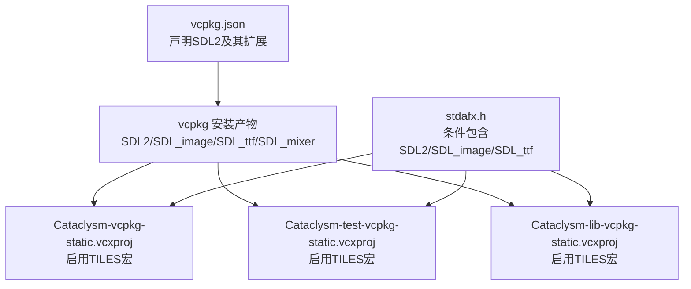
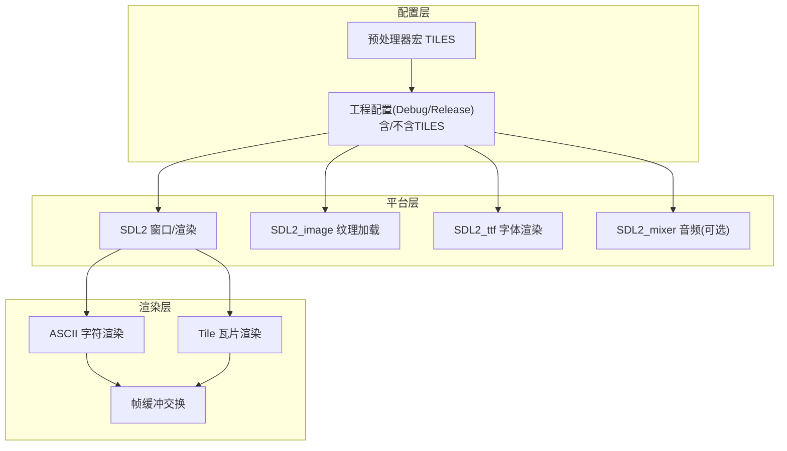
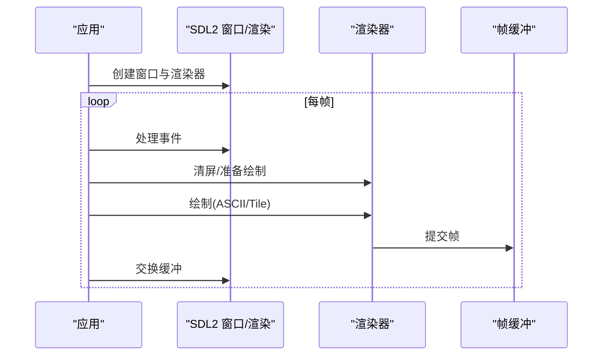
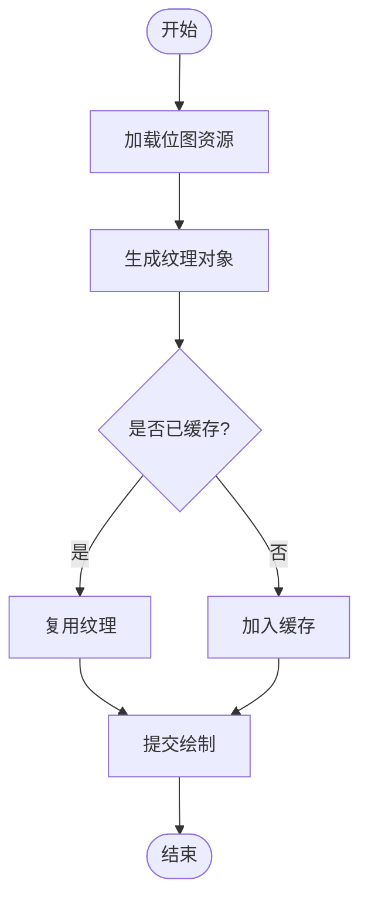
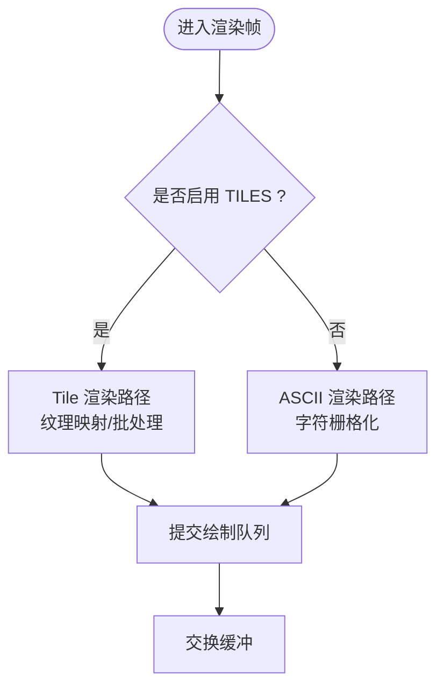
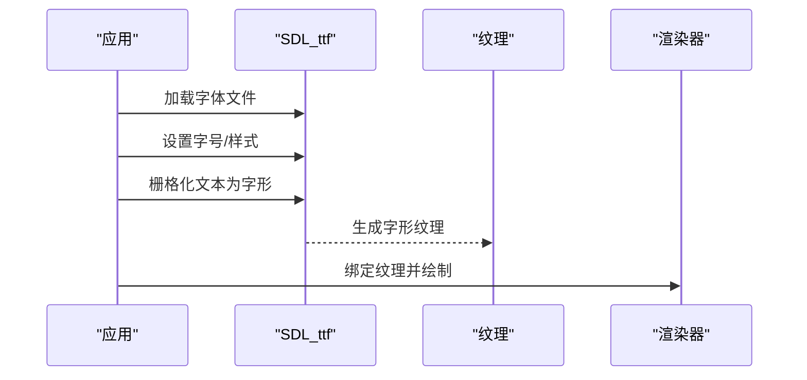
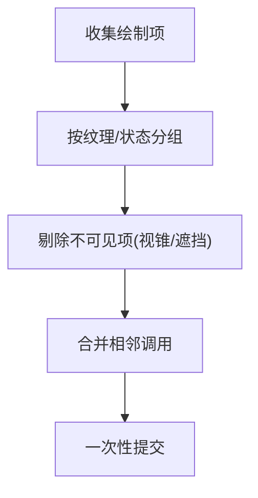
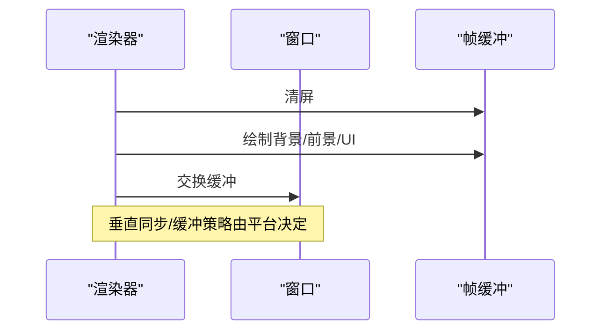
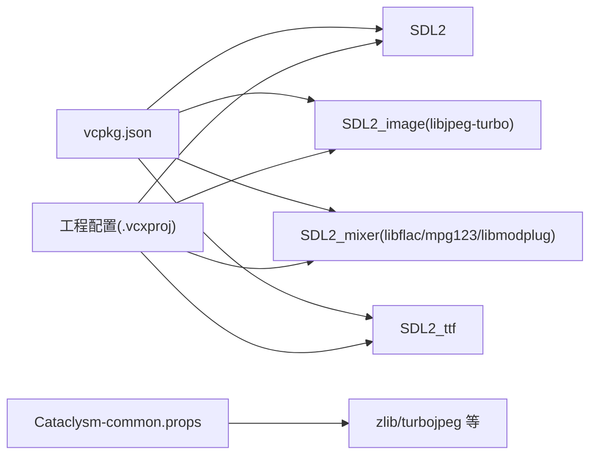

# 图形渲染系统

<cite>
**本文引用的文件**
- [vcpkg.json](file://vcpkg.json)
- [stdafx.h](file://stdafx.h)
- [stdafx.cpp](file://stdafx.cpp)
- [Cataclysm-vcpkg-static.vcxproj](file://Cataclysm-vcpkg-static.vcxproj)
- [Cataclysm-test-vcpkg-static.vcxproj](file://Cataclysm-test-vcpkg-static.vcxproj)
- [Cataclysm-lib-vcpkg-static.vcxproj](file://Cataclysm-lib-vcpkg-static.vcxproj)
- [Cataclysm-common.props](file://Cataclysm-common.props)
- [Cataclysm-vcpkg-static.sln](file://Cataclysm-vcpkg-static.sln)
</cite>

## 目录
1. [简介](#简介)
2. [项目结构](#项目结构)
3. [核心组件](#核心组件)
4. [架构总览](#架构总览)
5. [详细组件分析](#详细组件分析)
6. [依赖分析](#依赖分析)
7. [性能考虑](#性能考虑)
8. [故障排查指南](#故障排查指南)
9. [结论](#结论)
10. [附录](#附录)

## 简介
本文件面向图形渲染系统的综合文档，聚焦于SDL2图形子系统的集成与配置，涵盖窗口管理、渲染管线、纹理处理、ASCII字符渲染与Tile渲染两种模式的实现差异及切换方式，以及批量渲染、视锥剔除、帧缓冲管理等优化技术。同时说明字体渲染系统（SDL_ttf）的集成与自定义字体支持，并提供图形调试与性能监控方法，帮助开发者优化渲染性能。

## 项目结构
该仓库为构建工程与依赖配置文件集合，图形渲染能力通过SDL2系列库（SDL2、SDL2_image、SDL2_ttf、SDL2_mixer）在编译期启用。关键特征：
- 预处理器宏 TILES 控制是否启用基于瓦片的渲染路径；
- vcpkg.json 声明并安装 SDL2 及其扩展库；
- 多个 .vcxproj 工程文件定义了不同构建配置（Debug/Release、含/不含 TILES）；
- stdafx.h 条件包含 SDL2 相关头文件，确保在启用 TILES 时引入图形与字体库。

**图表来源**
- [vcpkg.json:1-22](file://vcpkg.json#L1-L22)
- [Cataclysm-vcpkg-static.vcxproj:189-225](file://Cataclysm-vcpkg-static.vcxproj#L189-L225)
- [Cataclysm-test-vcpkg-static.vcxproj:138-168](file://Cataclysm-test-vcpkg-static.vcxproj#L138-L168)
- [Cataclysm-lib-vcpkg-static.vcxproj](file://Cataclysm-lib-vcpkg-static.vcxproj)
- [stdafx.h:77-95](file://stdafx.h#L77-L95)

**章节来源**
- [vcpkg.json:1-22](file://vcpkg.json#L1-L22)
- [Cataclysm-vcpkg-static.vcxproj:189-225](file://Cataclysm-vcpkg-static.vcxproj#L189-L225)
- [Cataclysm-test-vcpkg-static.vcxproj:138-168](file://Cataclysm-test-vcpkg-static.vcxproj#L138-L168)
- [Cataclysm-lib-vcpkg-static.vcxproj](file://Cataclysm-lib-vcpkg-static.vcxproj)
- [stdafx.h:77-95](file://stdafx.h#L77-L95)

## 核心组件
- SDL2 图形与窗口子系统：负责窗口创建、事件循环、渲染上下文与帧缓冲交换。
- SDL2_image 纹理加载与格式支持：用于加载位图资源（如瓦片图集），生成纹理对象供渲染使用。
- SDL2_ttf 字体渲染：将文字栅格化为纹理以进行绘制。
- SDL2_mixer 音频（可选）：与图形系统协同，提供音效/背景音乐播放。
- 预处理器宏 TILES：控制是否启用瓦片渲染路径；在启用时，图形相关头文件被包含，构建系统会链接对应库。

上述组件在工程中通过 vcpkg 管理并在编译期按配置启用。

**章节来源**
- [vcpkg.json:1-22](file://vcpkg.json#L1-L22)
- [Cataclysm-vcpkg-static.vcxproj:189-225](file://Cataclysm-vcpkg-static.vcxproj#L189-L225)
- [Cataclysm-test-vcpkg-static.vcxproj:138-168](file://Cataclysm-test-vcpkg-static.vcxproj#L138-L168)
- [Cataclysm-lib-vcpkg-static.vcxproj](file://Cataclysm-lib-vcpkg-static.vcxproj)
- [stdafx.h:77-95](file://stdafx.h#L77-L95)

## 架构总览
图形渲染系统采用“配置驱动”的模块化设计：
- 配置层：通过预处理器宏 TILES 切换渲染模式；不同构建配置（Debug/Release、含/不含 TILES）由 .vcxproj 定义。
- 平台层：SDL2 提供跨平台的窗口与渲染抽象。
- 资源层：SDL2_image 加载位图资源，SDL2_ttf 将字体栅格化为纹理。
- 渲染层：根据当前模式（ASCII 或 Tile）选择不同的绘制策略，统一通过 SDL2 渲染器提交到帧缓冲。

**图表来源**
- [Cataclysm-vcpkg-static.vcxproj:189-225](file://Cataclysm-vcpkg-static.vcxproj#L189-L225)
- [Cataclysm-test-vcpkg-static.vcxproj:138-168](file://Cataclysm-test-vcpkg-static.vcxproj#L138-L168)
- [Cataclysm-lib-vcpkg-static.vcxproj](file://Cataclysm-lib-vcpkg-static.vcxproj)
- [vcpkg.json:1-22](file://vcpkg.json#L1-L22)
- [stdafx.h:77-95](file://stdafx.h#L77-L95)

## 详细组件分析

### 窗口管理与渲染上下文
- 窗口创建与事件循环：由 SDL2 管理，负责输入事件、重绘请求与帧缓冲交换。
- 渲染器初始化：在启用 TILES 的情况下，图形相关头文件被包含，渲染器可直接使用。
- 帧缓冲交换：每帧结束时调用交换函数以呈现画面。

**图表来源**
- [stdafx.h:77-95](file://stdafx.h#L77-L95)
- [Cataclysm-vcpkg-static.vcxproj:189-225](file://Cataclysm-vcpkg-static.vcxproj#L189-L225)

**章节来源**
- [stdafx.h:77-95](file://stdafx.h#L77-L95)
- [Cataclysm-vcpkg-static.vcxproj:189-225](file://Cataclysm-vcpkg-static.vcxproj#L189-L225)

### 纹理处理与资源加载
- 纹理加载：通过 SDL2_image 将位图资源加载为纹理，供渲染器绘制。
- 纹理缓存：建议对常用纹理进行缓存，避免重复加载。
- 纹理更新：动态内容（如UI、临时效果）可通过更新纹理区域减少开销。

**图表来源**
- [vcpkg.json:1-22](file://vcpkg.json#L1-L22)
- [Cataclysm-vcpkg-static.vcxproj:189-225](file://Cataclysm-vcpkg-static.vcxproj#L189-L225)

**章节来源**
- [vcpkg.json:1-22](file://vcpkg.json#L1-L22)
- [Cataclysm-vcpkg-static.vcxproj:189-225](file://Cataclysm-vcpkg-static.vcxproj#L189-L225)

### ASCII 字符渲染与 Tile 渲染模式对比
- ASCII 模式：通常以字符为单位进行绘制，适合终端风格或低分辨率场景。绘制流程相对简单，但像素密度较低。
- Tile 模式：以瓦片为单位进行绘制，适合位图资源与更精细的画面表现。需要纹理映射与批处理优化。
- 切换方式：通过预处理器宏 TILES 在编译期切换；不同工程配置分别启用或禁用该宏，从而影响包含的头文件与链接的库。

**图表来源**
- [Cataclysm-vcpkg-static.vcxproj:189-225](file://Cataclysm-vcpkg-static.vcxproj#L189-L225)
- [Cataclysm-test-vcpkg-static.vcxproj:138-168](file://Cataclysm-test-vcpkg-static.vcxproj#L138-L168)
- [Cataclysm-lib-vcpkg-static.vcxproj](file://Cataclysm-lib-vcpkg-static.vcxproj)
- [stdafx.h:77-95](file://stdafx.h#L77-L95)

**章节来源**
- [Cataclysm-vcpkg-static.vcxproj:189-225](file://Cataclysm-vcpkg-static.vcxproj#L189-L225)
- [Cataclysm-test-vcpkg-static.vcxproj:138-168](file://Cataclysm-test-vcpkg-static.vcxproj#L138-L168)
- [Cataclysm-lib-vcpkg-static.vcxproj](file://Cataclysm-lib-vcpkg-static.vcxproj)
- [stdafx.h:77-95](file://stdafx.h#L77-L95)

### 字体渲染系统（SDL_ttf）
- 集成方式：在启用 TILES 的条件下，SDL_ttf 头文件被包含，可在运行时加载字体文件并生成字形纹理。
- 自定义字体支持：通过指定字体路径与字号，生成相应尺寸的字形纹理，用于文本绘制。
- 性能建议：缓存常用字形与文本纹理，减少重复栅格化与纹理生成。

**图表来源**
- [vcpkg.json:1-22](file://vcpkg.json#L1-L22)
- [Cataclysm-vcpkg-static.vcxproj:189-225](file://Cataclysm-vcpkg-static.vcxproj#L189-L225)
- [stdafx.h:77-95](file://stdafx.h#L77-L95)

**章节来源**
- [vcpkg.json:1-22](file://vcpkg.json#L1-L22)
- [Cataclysm-vcpkg-static.vcxproj:189-225](file://Cataclysm-vcpkg-static.vcxproj#L189-L225)
- [stdafx.h:77-95](file://stdafx.h#L77-L95)

### 批量渲染与视锥剔除
- 批量渲染：合并相邻的绘制调用，减少状态切换与提交次数，提升吞吐量。
- 视锥剔除：仅绘制可见区域内的对象，降低无效绘制开销。
- 实施要点：按纹理/着色器/状态分组排序，减少切换；对静态场景建立可见性数据结构（如空间分割）。

**图表来源**
- [Cataclysm-vcpkg-static.vcxproj:189-225](file://Cataclysm-vcpkg-static.vcxproj#L189-L225)
- [Cataclysm-test-vcpkg-static.vcxproj:138-168](file://Cataclysm-test-vcpkg-static.vcxproj#L138-L168)

**章节来源**
- [Cataclysm-vcpkg-static.vcxproj:189-225](file://Cataclysm-vcpkg-static.vcxproj#L189-L225)
- [Cataclysm-test-vcpkg-static.vcxproj:138-168](file://Cataclysm-test-vcpkg-static.vcxproj#L138-L168)

### 帧缓冲管理
- 双缓冲/三缓冲：通过 SDL 窗口属性与渲染器设置，选择合适的缓冲策略以平衡延迟与撕裂。
- 垂直同步：可启用/禁用垂直同步，控制帧率与功耗。
- 清屏与合成：每帧清屏后按顺序合成背景、前景与UI层。

**图表来源**
- [Cataclysm-vcpkg-static.vcxproj:189-225](file://Cataclysm-vcpkg-static.vcxproj#L189-L225)
- [Cataclysm-test-vcpkg-static.vcxproj:138-168](file://Cataclysm-test-vcpkg-static.vcxproj#L138-L168)

**章节来源**
- [Cataclysm-vcpkg-static.vcxproj:189-225](file://Cataclysm-vcpkg-static.vcxproj#L189-L225)
- [Cataclysm-test-vcpkg-static.vcxproj:138-168](file://Cataclysm-test-vcpkg-static.vcxproj#L138-L168)

## 依赖分析
- vcpkg.json 声明依赖 SDL2、SDL2_image（启用 libjpeg-turbo 特性）、SDL2_mixer（启用多种音频后端）、SDL2_ttf。
- 工程文件通过预处理器宏 TILES 控制是否包含图形/字体相关头文件，并在链接阶段自动链接对应库。
- 公共属性文件定义了额外依赖库（如 zlib、turbojpeg 等），这些库可能间接影响图像解码与压缩性能。

**图表来源**
- [vcpkg.json:1-22](file://vcpkg.json#L1-L22)
- [Cataclysm-vcpkg-static.vcxproj:189-225](file://Cataclysm-vcpkg-static.vcxproj#L189-L225)
- [Cataclysm-test-vcpkg-static.vcxproj:138-168](file://Cataclysm-test-vcpkg-static.vcxproj#L138-L168)
- [Cataclysm-lib-vcpkg-static.vcxproj](file://Cataclysm-lib-vcpkg-static.vcxproj)
- [Cataclysm-common.props:116-153](file://Cataclysm-common.props#L116-L153)

**章节来源**
- [vcpkg.json:1-22](file://vcpkg.json#L1-L22)
- [Cataclysm-vcpkg-static.vcxproj:189-225](file://Cataclysm-vcpkg-static.vcxproj#L189-L225)
- [Cataclysm-test-vcpkg-static.vcxproj:138-168](file://Cataclysm-test-vcpkg-static.vcxproj#L138-L168)
- [Cataclysm-lib-vcpkg-static.vcxproj](file://Cataclysm-lib-vcpkg-static.vcxproj)
- [Cataclysm-common.props:116-153](file://Cataclysm-common.props#L116-L153)

## 性能考虑
- 编译优化：Release 配置启用最大速度优化与内联函数，有助于提升渲染循环性能。
- 链接优化：启用 COMDAT folding 与优化引用，减小二进制体积并提升缓存命中。
- 资源优化：优先使用压缩纹理格式（如 libjpeg-turbo 支持），缓存常用纹理与字形，减少重复加载。
- 渲染优化：批量渲染、状态合并、视锥剔除、按需刷新，避免全屏重绘。
- 字体优化：缓存文本纹理，避免频繁栅格化；合理设置字号与字体样式。

**章节来源**
- [Cataclysm-vcpkg-static.vcxproj:189-225](file://Cataclysm-vcpkg-static.vcxproj#L189-L225)
- [Cataclysm-test-vcpkg-static.vcxproj:138-168](file://Cataclysm-test-vcpkg-static.vcxproj#L138-L168)
- [vcpkg.json:1-22](file://vcpkg.json#L1-L22)

## 故障排查指南
- 无法找到图形库或头文件：确认工程已启用 TILES 宏且 vcpkg 已正确安装 SDL2 及其扩展。
- 字体渲染异常：检查字体文件路径与权限，确保 SDL_ttf 正常初始化。
- 性能抖动：检查是否存在频繁的状态切换与纹理切换，尝试批量渲染与纹理缓存。
- 帧率不稳定：检查垂直同步设置与缓冲策略，必要时禁用垂直同步进行基准测试。
- 资源加载失败：验证图像格式与编码器支持（libjpeg-turbo），确保纹理加载路径正确。

**章节来源**
- [vcpkg.json:1-22](file://vcpkg.json#L1-L22)
- [Cataclysm-vcpkg-static.vcxproj:189-225](file://Cataclysm-vcpkg-static.vcxproj#L189-L225)
- [Cataclysm-test-vcpkg-static.vcxproj:138-168](file://Cataclysm-test-vcpkg-static.vcxproj#L138-L168)
- [Cataclysm-lib-vcpkg-static.vcxproj](file://Cataclysm-lib-vcpkg-static.vcxproj)
- [Cataclysm-common.props:116-153](file://Cataclysm-common.props#L116-L153)

## 结论
本图形渲染系统通过 vcpkg 管理 SDL2 生态，在编译期以 TILES 宏控制渲染模式，结合 SDL2_image 与 SDL2_ttf 实现资源与字体渲染。通过批量渲染、视锥剔除与帧缓冲管理等优化手段，可在保证画面质量的同时提升性能。建议在实际开发中完善资源缓存、状态合并与性能监控机制，持续优化渲染路径。

## 附录
- 预处理器宏 TILES 的作用：控制是否启用瓦片渲染路径，影响头文件包含与库链接。
- 工程配置差异：Debug/Release、含/不含 TILES 的组合由多个 .vcxproj 文件定义，便于针对不同场景进行优化与调试。
- 依赖清单：SDL2、SDL2_image（libjpeg-turbo）、SDL2_mixer（多后端）、SDL2_ttf。

**章节来源**
- [Cataclysm-vcpkg-static.sln:94-126](file://Cataclysm-vcpkg-static.sln#L94-L126)
- [Cataclysm-vcpkg-static.vcxproj:189-225](file://Cataclysm-vcpkg-static.vcxproj#L189-L225)
- [Cataclysm-test-vcpkg-static.vcxproj:138-168](file://Cataclysm-test-vcpkg-static.vcxproj#L138-L168)
- [Cataclysm-lib-vcpkg-static.vcxproj](file://Cataclysm-lib-vcpkg-static.vcxproj)
- [vcpkg.json:1-22](file://vcpkg.json#L1-L22)
- [Cataclysm-common.props:116-153](file://Cataclysm-common.props#L116-L153)