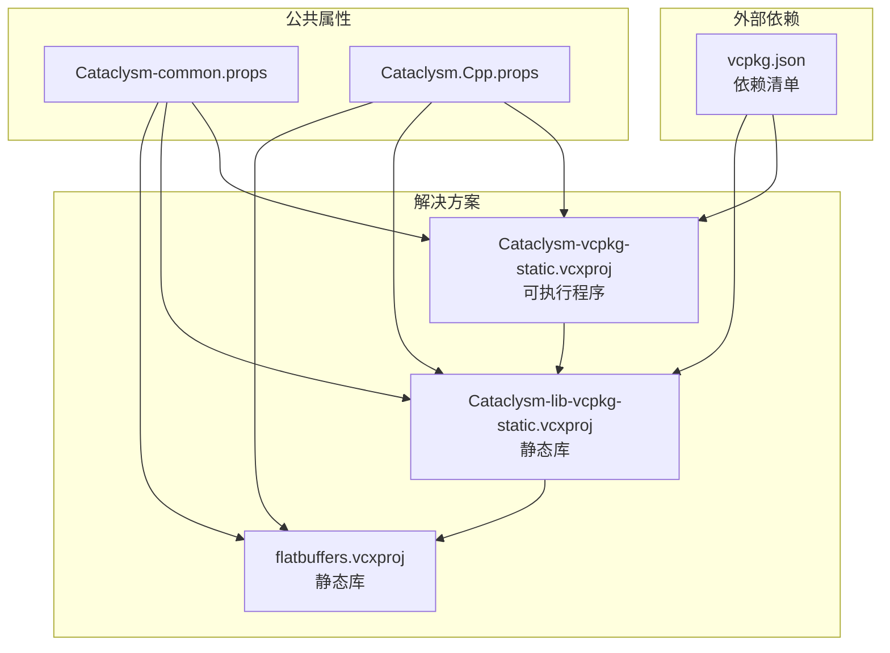
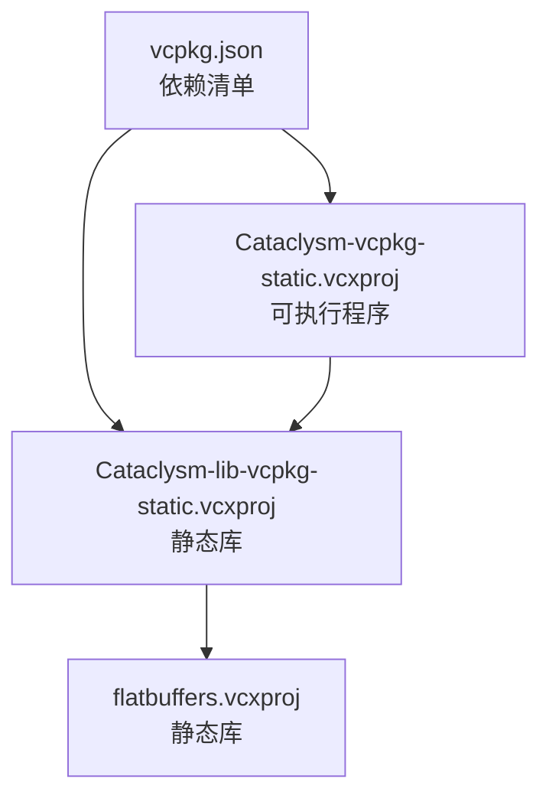
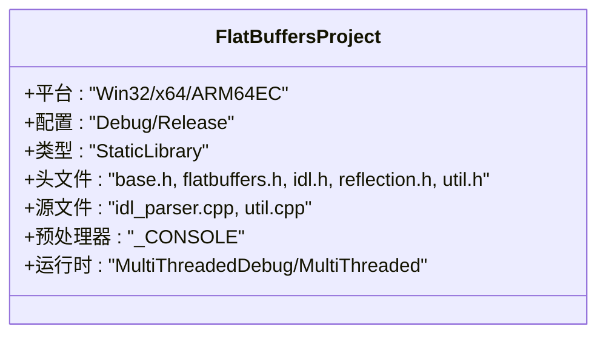
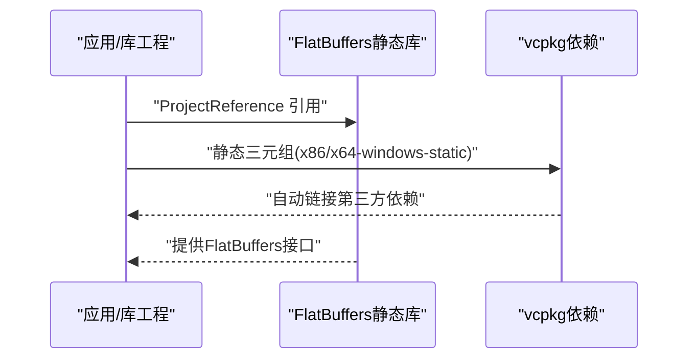
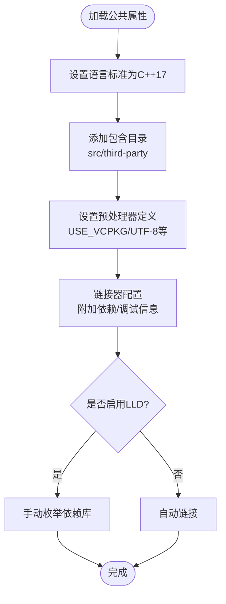

# FlatBuffers集成与配置

<cite>
**本文引用的文件**
- [vcpkg.json](file://vcpkg.json)
- [flatbuffers.vcxproj](file://msvc-full-features/flatbuffers.vcxproj)
- [Cataclysm-lib-vcpkg-static.vcxproj](file://msvc-full-features/Cataclysm-lib-vcpkg-static.vcxproj)
- [Cataclysm-vcpkg-static.vcxproj](file://msvc-full-features/Cataclysm-vcpkg-static.vcxproj)
- [Cataclysm-common.props](file://msvc-full-features/Cataclysm-common.props)
- [Cataclysm.Cpp.props](file://msvc-full-features/Cataclysm.Cpp.props)
- [prebuild.cmd](file://msvc-full-features/prebuild.cmd)
</cite>

## 目录
1. [简介](#简介)
2. [项目结构](#项目结构)
3. [核心组件](#核心组件)
4. [架构总览](#架构总览)
5. [详细组件分析](#详细组件分析)
6. [依赖关系分析](#依赖关系分析)
7. [性能考虑](#性能考虑)
8. [故障排除指南](#故障排除指南)
9. [结论](#结论)
10. [附录](#附录)

## 简介
本文件面向Cataclysm Medieval（CDDA）项目在Windows MSVC环境下的FlatBuffers集成与配置，重点覆盖以下方面：
- 静态库构建配置：如何将FlatBuffers作为静态库引入工程，并在不同平台（x86、x64、ARM64EC）下正确编译与链接。
- 多平台支持策略：通过MSBuild属性与vcpkg三元组实现跨平台静态链接。
- 编译选项与预处理器定义：统一的编译标准、语言标准、警告级别、调试信息格式等。
- 头文件与源文件组织：FlatBuffers核心头文件与解析器源文件的包含方式。
- IDL与代码生成：flatc编译器的使用场景与最佳实践（基于现有工程配置推导）。
- 应用场景：在游戏中的存档系统、网络通信、资源管理等方向的集成建议。

## 项目结构
本仓库采用MSBuild解决方案与vcpkg依赖管理相结合的方式组织FlatBuffers集成：
- 核心静态库工程：flatbuffers.vcxproj，负责编译FlatBuffers头文件与解析器源码，输出静态库供上层应用使用。
- 应用/库工程：Cataclysm-lib-vcpkg-static.vcxproj与Cataclysm-vcpkg-static.vcxproj，均通过vcpkg进行静态依赖管理，并显式引用flatbuffers静态库。
- 公共属性：Cataclysm-common.props集中定义编译、链接、vcpkg相关通用属性；Cataclysm.Cpp.props提供缓存与工具链相关开关。
- 版本生成脚本：prebuild.cmd用于生成版本头文件，确保工程版本信息一致。

图表来源
- [flatbuffers.vcxproj:1-128](file://msvc-full-features/flatbuffers.vcxproj#L1-L128)
- [Cataclysm-lib-vcpkg-static.vcxproj:1-191](file://msvc-full-features/Cataclysm-lib-vcpkg-static.vcxproj#L1-L191)
- [Cataclysm-vcpkg-static.vcxproj:1-236](file://msvc-full-features/Cataclysm-vcpkg-static.vcxproj#L1-L236)
- [Cataclysm-common.props:1-154](file://msvc-full-features/Cataclysm-common.props#L1-L154)
- [Cataclysm.Cpp.props:1-11](file://msvc-full-features/Cataclysm.Cpp.props#L1-L11)
- [vcpkg.json:1-22](file://vcpkg.json#L1-L22)

章节来源
- [flatbuffers.vcxproj:1-128](file://msvc-full-features/flatbuffers.vcxproj#L1-L128)
- [Cataclysm-lib-vcpkg-static.vcxproj:1-191](file://msvc-full-features/Cataclysm-lib-vcpkg-static.vcxproj#L1-L191)
- [Cataclysm-vcpkg-static.vcxproj:1-236](file://msvc-full-features/Cataclysm-vcpkg-static.vcxproj#L1-L236)
- [Cataclysm-common.props:1-154](file://msvc-full-features/Cataclysm-common.props#L1-L154)
- [Cataclysm.Cpp.props:1-11](file://msvc-full-features/Cataclysm.Cpp.props#L1-L11)
- [vcpkg.json:1-22](file://vcpkg.json#L1-L22)

## 核心组件
- FlatBuffers静态库工程（flatbuffers.vcxproj）
  - 目标：将FlatBuffers核心头文件与解析器源码编译为静态库，供上层模块使用。
  - 平台配置：支持Debug/Release与Win32、x64、ARM64EC三种平台。
  - 头文件集合：包含base.h、flatbuffers.h、idl.h、reflection.h、util.h等核心头文件。
  - 源文件集合：包含idl_parser.cpp、util.cpp等解析器实现。
  - 构建类型：StaticLibrary；字符集：Unicode；工具集继承全局默认值。
  - 调试/发布配置：分别设置运行时库、优化级别、调试信息格式等。
  - 预处理器定义：统一添加_CONSO标志，便于控制台/库行为一致性。
- 应用/库工程（Cataclysm-lib-vcpkg-static.vcxproj、Cataclysm-vcpkg-static.vcxproj）
  - vcpkg集成：启用vcpkg，使用静态三元组（x86/x64-windows-static），自动链接依赖。
  - 引用FlatBuffers静态库：通过ProjectReference显式引用flatbuffers.vcxproj，避免自动链接导致的二进制不一致。
  - 预处理器定义：包含USE_WINMAIN、SDL相关宏等，确保与游戏引擎兼容。
  - 平台映射：ARM64EC映射到x64-windows-static，保证ARM64EC平台也能以x64静态库形式构建。
- 公共属性（Cataclysm-common.props）
  - 统一编译选项：语言标准为C++17，启用多核编译、UTF-8、禁用特定警告。
  - 包含目录：自动添加src与third-party路径，便于引用FlatBuffers头文件。
  - 链接器配置：统一附加依赖库、调试信息格式、LLD链接器支持等。
  - vcpkg集成：支持自定义安装选项、静态库后缀、LLD链接器路径等。
- 版本生成（prebuild.cmd）
  - 通过git标签生成版本号，写入version.h，确保构建产物版本信息一致。

章节来源
- [flatbuffers.vcxproj:1-128](file://msvc-full-features/flatbuffers.vcxproj#L1-L128)
- [Cataclysm-lib-vcpkg-static.vcxproj:1-191](file://msvc-full-features/Cataclysm-lib-vcpkg-static.vcxproj#L1-L191)
- [Cataclysm-vcpkg-static.vcxproj:1-236](file://msvc-full-features/Cataclysm-vcpkg-static.vcxproj#L1-L236)
- [Cataclysm-common.props:1-154](file://msvc-full-features/Cataclysm-common.props#L1-L154)
- [prebuild.cmd:1-16](file://msvc-full-features/prebuild.cmd#L1-L16)

## 架构总览
FlatBuffers在本工程中的角色是“底层序列化/反序列化基础设施”，由flatbuffers.vcxproj提供静态库，被Cataclysm-lib-vcpkg-static.vcxproj与Cataclysm-vcpkg-static.vcxproj所引用。vcpkg负责管理第三方依赖，确保静态链接的一致性与可移植性。

图表来源
- [flatbuffers.vcxproj:182-185](file://msvc-full-features/flatbuffers.vcxproj#L182-L185)
- [Cataclysm-lib-vcpkg-static.vcxproj:182-185](file://msvc-full-features/Cataclysm-lib-vcpkg-static.vcxproj#L182-L185)
- [Cataclysm-vcpkg-static.vcxproj:226-228](file://msvc-full-features/Cataclysm-vcpkg-static.vcxproj#L226-L228)
- [vcpkg.json:1-22](file://vcpkg.json#L1-L22)

## 详细组件分析

### FlatBuffers静态库工程（flatbuffers.vcxproj）
- 平台与配置
  - 支持Debug/Release与Win32、x64、ARM64EC。
  - ARM64EC在vcpkg层面映射为x64-windows-static，确保静态库可用。
- 头文件与源文件
  - 头文件：base.h、flatbuffers.h、idl.h、reflection.h、util.h等。
  - 源文件：idl_parser.cpp、util.cpp。
- 编译与链接
  - 静态库类型；Unicode字符集；工具集继承全局默认值。
  - Debug使用多线程调试运行时，Release使用多线程运行时。
  - 预处理器定义包含_CONSOLE，便于控制台/库行为一致性。
- 多平台支持
  - 通过ItemDefinitionGroup针对Win32平台增加WIN32宏。
  - ARM64EC通过vcpkg三元组映射到x64-windows-static，避免平台差异带来的链接问题。

图表来源
- [flatbuffers.vcxproj:1-128](file://msvc-full-features/flatbuffers.vcxproj#L1-L128)

章节来源
- [flatbuffers.vcxproj:1-128](file://msvc-full-features/flatbuffers.vcxproj#L1-L128)

### 应用/库工程（Cataclysm-lib-vcpkg-static.vcxproj、Cataclysm-vcpkg-static.vcxproj）
- vcpkg集成
  - 启用vcpkg，使用静态三元组（x86/x64-windows-static）。
  - 自动链接第三方依赖，减少手动配置。
- 引用FlatBuffers静态库
  - 通过ProjectReference显式引用flatbuffers.vcxproj。
  - LinkLibraryDependencies设为false，避免重复或冲突的自动链接。
- 平台映射与目标名称
  - ARM64EC映射到x64-windows-static。
  - 目标名称统一为cataclysm-tiles，便于分发与测试。
- 预处理器定义
  - 包含USE_WINMAIN、SDL相关宏等，确保与游戏引擎兼容。

图表来源
- [Cataclysm-lib-vcpkg-static.vcxproj:182-185](file://msvc-full-features/Cataclysm-lib-vcpkg-static.vcxproj#L182-L185)
- [Cataclysm-vcpkg-static.vcxproj:226-228](file://msvc-full-features/Cataclysm-vcpkg-static.vcxproj#L226-L228)
- [vcpkg.json:1-22](file://vcpkg.json#L1-L22)

章节来源
- [Cataclysm-lib-vcpkg-static.vcxproj:1-191](file://msvc-full-features/Cataclysm-lib-vcpkg-static.vcxproj#L1-L191)
- [Cataclysm-vcpkg-static.vcxproj:1-236](file://msvc-full-features/Cataclysm-vcpkg-static.vcxproj#L1-L236)
- [vcpkg.json:1-22](file://vcpkg.json#L1-L22)

### 公共属性与编译选项（Cataclysm-common.props、Cataclysm.Cpp.props）
- 统一编译选项
  - 语言标准：C++17；多核编译；UTF-8；禁用特定警告。
  - 包含目录：自动添加src与third-party，便于引用FlatBuffers头文件。
  - 预处理器定义：统一添加USE_VCPKG、WIN32_LEAN_AND_MEAN等。
- 链接器配置
  - 统一附加依赖库；调试信息格式；支持LLD链接器。
  - 在启用LLD时，手动枚举依赖库，避免glob模式不兼容问题。
- 工具链与缓存
  - 支持ccache与LLD工具链路径配置，提升构建效率。

图表来源
- [Cataclysm-common.props:41-140](file://msvc-full-features/Cataclysm-common.props#L41-L140)
- [Cataclysm.Cpp.props:1-11](file://msvc-full-features/Cataclysm.Cpp.props#L1-L11)

章节来源
- [Cataclysm-common.props:1-154](file://msvc-full-features/Cataclysm-common.props#L1-L154)
- [Cataclysm.Cpp.props:1-11](file://msvc-full-features/Cataclysm.Cpp.props#L1-L11)

### 版本生成与构建流程（prebuild.cmd）
- 功能：从git标签生成版本字符串，写入version.h。
- 触发：在预生成阶段执行，确保版本信息在编译前就绪。
- 影响：为后续打包与分发提供稳定的版本标识。

章节来源
- [prebuild.cmd:1-16](file://msvc-full-features/prebuild.cmd#L1-L16)

## 依赖关系分析
- flatbuffers.vcxproj
  - 无外部依赖，仅依赖标准库与Windows SDK。
  - 输出静态库，供上层工程引用。
- Cataclysm-lib-vcpkg-static.vcxproj
  - 通过vcpkg管理第三方依赖（SDL2系列等）。
  - 显式引用flatbuffers.vcxproj，避免自动链接导致的二进制不一致。
- Cataclysm-vcpkg-static.vcxproj
  - 作为可执行程序，引用Cataclysm-lib-vcpkg-static.vcxproj。
  - 同样通过vcpkg管理依赖，保持与库工程一致的静态链接策略。

图表来源
- [vcpkg.json:1-22](file://vcpkg.json#L1-L22)
- [Cataclysm-lib-vcpkg-static.vcxproj:182-185](file://msvc-full-features/Cataclysm-lib-vcpkg-static.vcxproj#L182-L185)
- [Cataclysm-vcpkg-static.vcxproj:226-228](file://msvc-full-features/Cataclysm-vcpkg-static.vcxproj#L226-L228)
- [flatbuffers.vcxproj:182-185](file://msvc-full-features/flatbuffers.vcxproj#L182-L185)

章节来源
- [vcpkg.json:1-22](file://vcpkg.json#L1-L22)
- [Cataclysm-lib-vcpkg-static.vcxproj:1-191](file://msvc-full-features/Cataclysm-lib-vcpkg-static.vcxproj#L1-L191)
- [Cataclysm-vcpkg-static.vcxproj:1-236](file://msvc-full-features/Cataclysm-vcpkg-static.vcxproj#L1-L236)
- [flatbuffers.vcxproj:1-128](file://msvc-full-features/flatbuffers.vcxproj#L1-L128)

## 性能考虑
- 静态库与静态链接
  - 使用x86/x64-windows-static三元组，减少运行时依赖，提升分发与部署稳定性。
  - 在Release配置下启用最大优化与内联函数，降低运行时开销。
- 工具链优化
  - 支持LLD链接器与ccache，加速构建过程；在特定VS版本下规避已知问题。
- 编译选项
  - 启用多核编译、UTF-8、禁用冗余警告，提升编译效率与可维护性。

## 故障排除指南
- ARM64EC平台不可用
  - 现状：ARM64EC在vcpkg层面映射为x64-windows-static，确保静态库可用。
  - 建议：若出现链接错误，检查ARM64EC三元组是否正确传递至vcpkg。
- 链接冲突或重复依赖
  - 现状：通过显式ProjectReference并关闭LinkLibraryDependencies，避免自动链接导致的冲突。
  - 建议：确认所有工程均使用同一vcpkg三元组与静态链接策略。
- LLD链接器问题
  - 现状：在启用LLD时，手动枚举依赖库以规避glob模式不兼容问题。
  - 建议：升级到VS 2022 17.7及以上版本，修复DebugFastLink崩溃问题。
- 版本信息缺失
  - 现状：prebuild.cmd在找不到git时会生成提示文本。
  - 建议：确保git可用，以便生成正确的VERSION常量。

章节来源
- [Cataclysm-common.props:33-140](file://msvc-full-features/Cataclysm-common.props#L33-L140)
- [prebuild.cmd:1-16](file://msvc-full-features/prebuild.cmd#L1-L16)

## 结论
本工程通过flatbuffers.vcxproj提供FlatBuffers静态库，并在Cataclysm-lib-vcpkg-static.vcxproj与Cataclysm-vcpkg-static.vcxproj中统一集成。借助vcpkg的静态三元组与公共属性配置，实现了跨平台（x86、x64、ARM64EC）的一致构建与链接策略。该方案在保证构建效率的同时，确保了运行时的稳定性和可移植性。对于FlatBuffers的IDL与代码生成，建议结合现有工程的静态库策略，在CI中统一生成与校验，确保跨平台一致性。

## 附录
- 平台与三元组映射
  - Win32 → x86-windows-static
  - x64 → x64-windows-static
  - ARM64EC → x64-windows-static（vcpkg映射）
- 关键预处理器定义
  - _CONSOLE、_DEBUG/NDEBUG、WIN32、USE_VCPKG、SDL相关宏等
- 建议的IDL与代码生成实践
  - 在CI中统一调用flatc生成代码，固定命名空间与类型映射，避免跨平台差异。
  - 将生成的头文件纳入third-party目录，与flatbuffers头文件统一管理。
  - 对生成代码进行一致性检查（如风格与格式化），确保与主工程风格一致。