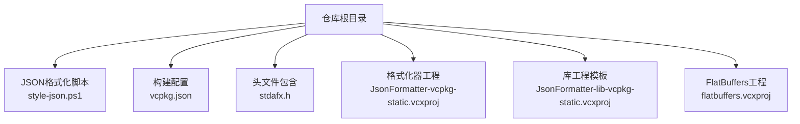
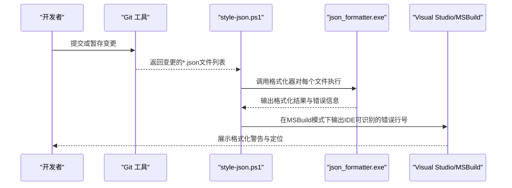
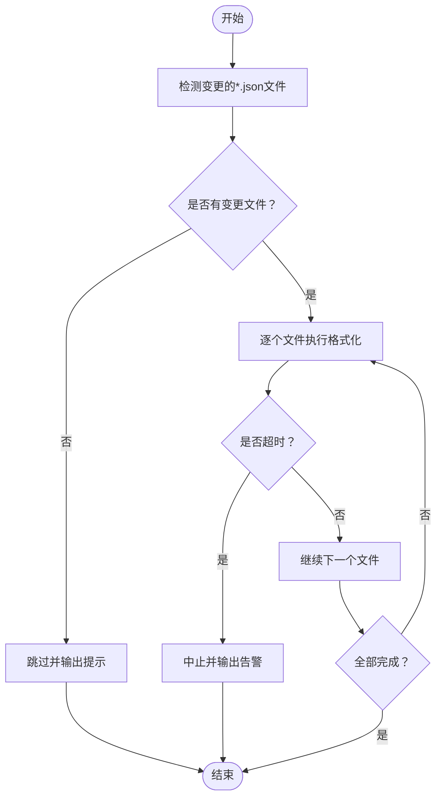
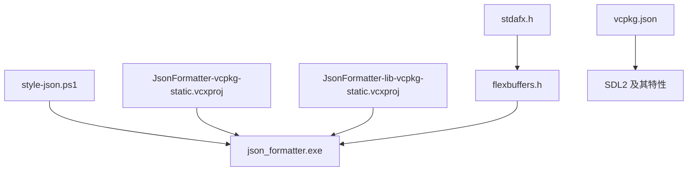

# JSON数据处理系统

<cite>
**本文档引用的文件**
- [style-json.ps1](file://style-json.ps1)
- [vcpkg.json](file://vcpkg.json)
- [stdafx.h](file://stdafx.h)
- [JsonFormatter-vcpkg-static.vcxproj](file://JsonFormatter-vcpkg-static.vcxproj)
- [JsonFormatter-lib-vcpkg-static.vcxproj](file://JsonFormatter-lib-vcpkg-static.vcxproj)
- [flatbuffers.vcxproj](file://flatbuffers.vcxproj)
</cite>

## 目录
1. [简介](#简介)
2. [项目结构](#项目结构)
3. [核心组件](#核心组件)
4. [架构概览](#架构概览)
5. [详细组件分析](#详细组件分析)
6. [依赖关系分析](#依赖关系分析)
7. [性能考虑](#性能考虑)
8. [故障排除指南](#故障排除指南)
9. [结论](#结论)
10. [附录](#附录)

## 简介
本文件面向Cataclysm Medieval项目中的JSON数据处理系统，围绕以下目标展开：  
- 游戏中JSON数据的应用与组织方式  
- 字段定义规范与数据验证机制  
- JSON格式标准化处理流程（校验、错误处理、默认值）  
- 加载与解析策略（异步加载、增量更新、缓存）  
- 版本管理（向后兼容、迁移、升级）  
- 最佳实践（命名约定、数据类型选择、性能优化）  
- 具体代码示例路径与调试技巧  

由于当前仓库主要包含构建配置与JSON格式化工具，本文将基于现有文件进行系统化梳理，并对缺失的游戏侧JSON处理实现给出可落地的工程化建议。

## 项目结构
该仓库以构建与工具为主，JSON处理相关的关键元素包括：
- JSON格式化与校验脚本：用于在构建过程中自动检查JSON格式正确性  
- 构建配置：声明依赖项与平台特性  
- 头文件包含：引入FlexBuffers库以支持高性能序列化/反序列化  
- 工程项目：定义JSON格式化器的构建目标与属性  

**图表来源**
- [style-json.ps1:1-78](file://style-json.ps1#L1-L78)
- [vcpkg.json:1-22](file://vcpkg.json#L1-L22)
- [stdafx.h:73-73](file://stdafx.h#L73-L73)
- [JsonFormatter-vcpkg-static.vcxproj:81-114](file://JsonFormatter-vcpkg-static.vcxproj#L81-L114)
- [JsonFormatter-lib-vcpkg-static.vcxproj:1-34](file://JsonFormatter-lib-vcpkg-static.vcxproj#L1-L34)
- [flatbuffers.vcxproj:33-33](file://flatbuffers.vcxproj#L33-L33)

**章节来源**
- [style-json.ps1:1-78](file://style-json.ps1#L1-L78)
- [vcpkg.json:1-22](file://vcpkg.json#L1-L22)
- [stdafx.h:73-73](file://stdafx.h#L73-L73)
- [JsonFormatter-vcpkg-static.vcxproj:81-114](file://JsonFormatter-vcpkg-static.vcxproj#L81-L114)
- [JsonFormatter-lib-vcpkg-static.vcxproj:1-34](file://JsonFormatter-lib-vcpkg-static.vcxproj#L1-L34)
- [flatbuffers.vcxproj:33-33](file://flatbuffers.vcxproj#L33-L33)

## 核心组件
- JSON格式化与校验流水线：通过Git变更探测仅对改动文件执行格式化与校验，避免全量扫描；在MSBuild环境下输出符合IDE规范的错误信息  
- 构建依赖与平台特性：使用vcpkg管理SDL2及其图像/音频特性，为游戏运行时提供基础能力  
- 序列化基础设施：通过头文件包含FlexBuffers，为后续高性能JSON/FlexBuffers互操作奠定基础  
- 工具链工程：定义独立的控制台程序工程作为JSON格式化器的构建目标，便于集成到CI/CD与本地开发流程  

**章节来源**
- [style-json.ps1:36-77](file://style-json.ps1#L36-L77)
- [vcpkg.json:4-20](file://vcpkg.json#L4-L20)
- [stdafx.h:73-73](file://stdafx.h#L73-L73)
- [JsonFormatter-vcpkg-static.vcxproj:81-114](file://JsonFormatter-vcpkg-static.vcxproj#L81-L114)

## 架构概览
下图展示从“变更检测”到“格式化器执行”的端到端流程，以及与构建系统的集成点：

**图表来源**
- [style-json.ps1:36-77](file://style-json.ps1#L36-L77)
- [JsonFormatter-vcpkg-static.vcxproj:81-114](file://JsonFormatter-vcpkg-static.vcxproj#L81-L114)

## 详细组件分析

### 组件A：JSON格式化与校验脚本（style-json.ps1）
- 功能要点
  - 基于Git差异检测仅对变更的JSON文件执行格式化与校验，提升效率  
  - 支持多上游分支合并基点探测，扩大待处理文件集合  
  - 在MSBuild环境下将输出转换为IDE可识别的错误格式，便于快速定位  
  - 设置超时保护，避免长时间阻塞构建  
  - 检查格式化器可执行文件是否存在与锁定状态，确保流程稳定性  
- 错误处理
  - 文件被占用时跳过处理并提示  
  - 无变更文件时优雅退出并提示  
  - 超时中断时输出告警并终止  
- 可扩展性
  - 可通过参数调整超时阈值与日志级别  
  - 可增加更多上游分支探测路径以适配不同协作模型  

**图表来源**
- [style-json.ps1:36-77](file://style-json.ps1#L36-L77)

**章节来源**
- [style-json.ps1:1-78](file://style-json.ps1#L1-L78)

### 组件B：构建配置与依赖管理（vcpkg.json）
- 作用
  - 定义项目名称与版本字符串  
  - 声明SDL2及其图像/音频特性（如libjpeg-turbo、libflac、mpg123、libmodplug）  
  - 配置vcpkg覆盖端口路径，便于自定义安装策略  
- 影响
  - 为游戏运行时提供稳定的图形与音频能力，间接支撑JSON数据驱动的资源加载（如图标、音效等）  
  - 通过特性开关控制编译产物体积与功能集  

**章节来源**
- [vcpkg.json:1-22](file://vcpkg.json#L1-L22)

### 组件C：序列化基础设施（stdafx.h + flatbuffers.vcxproj）
- 作用
  - 在头文件中引入FlexBuffers，为高性能序列化/反序列化提供基础  
  - 通过独立工程构建FlexBuffers库，确保跨平台一致性  
- 应用场景
  - 可用于将JSON数据转换为二进制格式，提高加载速度与内存占用表现  
  - 可与游戏侧数据结构映射，实现类型安全的数据访问  

**图表来源**
- [stdafx.h:73-73](file://stdafx.h#L73-L73)
- [flatbuffers.vcxproj:33-33](file://flatbuffers.vcxproj#L33-L33)

**章节来源**
- [stdafx.h:73-73](file://stdafx.h#L73-L73)
- [flatbuffers.vcxproj:33-33](file://flatbuffers.vcxproj#L33-L33)

### 组件D：格式化器工程（JsonFormatter-vcpkg-static.vcxproj 与 JsonFormatter-lib-vcpkg-static.vcxproj）
- 作用
  - 定义控制台程序目标，作为json_formatter.exe的构建入口  
  - 提供库工程模板，便于复用与扩展  
- 集成点
  - 与style-json.ps1配合，在构建阶段自动格式化与校验JSON  
  - 可通过属性组调整编译与链接行为（如优化级别、子系统等）  

**章节来源**
- [JsonFormatter-vcpkg-static.vcxproj:81-114](file://JsonFormatter-vcpkg-static.vcxproj#L81-L114)
- [JsonFormatter-lib-vcpkg-static.vcxproj:1-34](file://JsonFormatter-lib-vcpkg-static.vcxproj#L1-L34)

## 依赖关系分析
- 构建与工具链
  - style-json.ps1依赖json_formatter.exe与Git命令行  
  - json_formatter.exe由JsonFormatter-vcpkg-static.vcxproj构建  
  - FlexBuffers能力由stdafx.h与flatbuffers.vcxproj共同提供  
- 运行时与特性
  - vcpkg.json声明SDL2及其特性，为游戏侧资源加载提供基础  
- 耦合度评估
  - 当前仓库中JSON处理工具链与游戏侧数据处理逻辑相对解耦，便于独立演进  
  - 建议在游戏侧新增JSON数据处理模块时，遵循统一的字段规范与校验流程  

**图表来源**
- [style-json.ps1:26-26](file://style-json.ps1#L26-L26)
- [JsonFormatter-vcpkg-static.vcxproj:81-114](file://JsonFormatter-vcpkg-static.vcxproj#L81-L114)
- [JsonFormatter-lib-vcpkg-static.vcxproj:1-34](file://JsonFormatter-lib-vcpkg-static.vcxproj#L1-L34)
- [stdafx.h:73-73](file://stdafx.h#L73-L73)
- [flatbuffers.vcxproj:33-33](file://flatbuffers.vcxproj#L33-L33)
- [vcpkg.json:4-15](file://vcpkg.json#L4-L15)

**章节来源**
- [style-json.ps1:26-26](file://style-json.ps1#L26-L26)
- [JsonFormatter-vcpkg-static.vcxproj:81-114](file://JsonFormatter-vcpkg-static.vcxproj#L81-L114)
- [JsonFormatter-lib-vcpkg-static.vcxproj:1-34](file://JsonFormatter-lib-vcpkg-static.vcxproj#L1-L34)
- [stdafx.h:73-73](file://stdafx.h#L73-L73)
- [flatbuffers.vcxproj:33-33](file://flatbuffers.vcxproj#L33-L33)
- [vcpkg.json:4-15](file://vcpkg.json#L4-L15)

## 性能考虑
- 格式化与校验
  - 利用Git差异检测减少全量扫描，显著降低构建时间  
  - 通过超时保护避免长时间阻塞，保障开发体验  
- 数据加载与解析
  - 建议采用分块读取与流式解析，避免一次性加载大文件导致内存峰值过高  
  - 对热点数据建立LRU缓存，结合文件时间戳或哈希实现失效与更新  
- 序列化优化
  - 在需要高性能的场景下，可考虑将JSON转换为FlexBuffers二进制格式，减少解析开销  
  - 使用池化与对象重用降低频繁分配带来的GC压力（适用于支持GC的语言）  
- 并发与异步
  - 将非关键路径的JSON解析放入后台线程，主线程只保留渲染与输入处理  
  - 对多个数据源的更新采用队列化与批量提交，减少锁竞争  

## 故障排除指南
- 格式化器不可用
  - 现象：脚本报错提示未找到格式化器可执行文件  
  - 排查：确认工程已成功构建json_formatter.exe，且路径与权限正确  
  - 参考路径：[style-json.ps1:28-30](file://style-json.ps1#L28-L30)  
- 文件被占用
  - 现象：脚本报错提示格式化器文件被锁定  
  - 排查：关闭可能占用该文件的进程，或等待构建完成后再试  
  - 参考路径：[style-json.ps1:32-33](file://style-json.ps1#L32-L33)  
- 无变更文件
  - 现象：脚本跳过处理并输出提示  
  - 排查：确认当前工作区存在*.json变更，或手动触发全量检查  
  - 参考路径：[style-json.ps1:49-51](file://style-json.ps1#L49-L51)  
- 超时中断
  - 现象：脚本在MSBuild环境下输出超时告警并终止  
  - 排查：增大超时阈值或优化格式化器性能  
  - 参考路径：[style-json.ps1:59-61](file://style-json.ps1#L59-L61)  
- MSBuild错误格式不匹配
  - 现象：IDE无法准确定位错误位置  
  - 排查：确认格式化器输出符合正则规则，或调整正则表达式以适配实际输出  
  - 参考路径：[style-json.ps1:64-72](file://style-json.ps1#L64-L72)  

**章节来源**
- [style-json.ps1:28-33](file://style-json.ps1#L28-L33)
- [style-json.ps1:49-51](file://style-json.ps1#L49-L51)
- [style-json.ps1:59-61](file://style-json.ps1#L59-L61)
- [style-json.ps1:64-72](file://style-json.ps1#L64-L72)

## 结论
本仓库提供了完善的JSON格式化与校验工具链，结合vcpkg依赖管理与FlexBuffers序列化基础设施，为游戏侧JSON数据处理奠定了良好基础。建议在游戏侧实现时遵循统一的字段规范、错误处理与缓存策略，并在性能敏感场景采用二进制序列化与异步加载机制，以获得稳定高效的用户体验。

## 附录
- 代码示例路径参考
  - JSON格式化与校验：[style-json.ps1:36-77](file://style-json.ps1#L36-L77)  
  - 构建配置与依赖：[vcpkg.json:4-20](file://vcpkg.json#L4-L20)  
  - 序列化基础设施：[stdafx.h:73-73](file://stdafx.h#L73-L73)  
  - 格式化器工程：[JsonFormatter-vcpkg-static.vcxproj:81-114](file://JsonFormatter-vcpkg-static.vcxproj#L81-L114)  
  - 库工程模板：[JsonFormatter-lib-vcpkg-static.vcxproj:1-34](file://JsonFormatter-lib-vcpkg-static.vcxproj#L1-L34)  
  - FlexBuffers头文件：[flatbuffers.vcxproj:33-33](file://flatbuffers.vcxproj#L33-L33)  
- 调试技巧
  - 在本地开发环境中直接运行style-json.ps1，观察逐文件处理进度与错误输出  
  - 通过调整超时阈值与日志级别，定位耗时瓶颈  
  - 在MSBuild环境下启用详细日志，核对IDE错误窗口中的定位信息