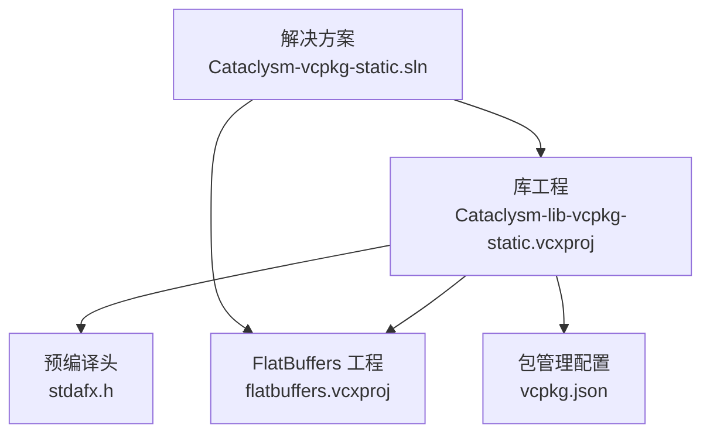
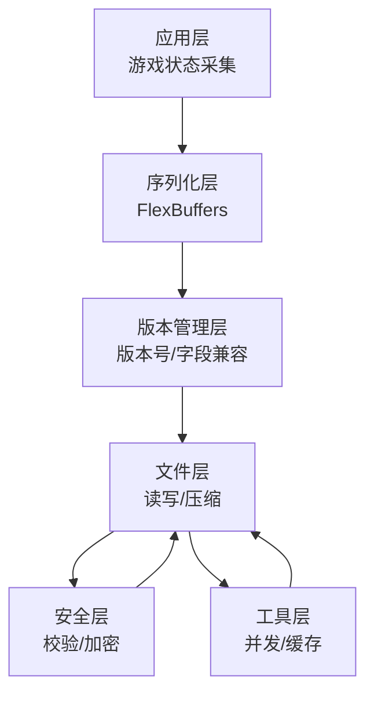
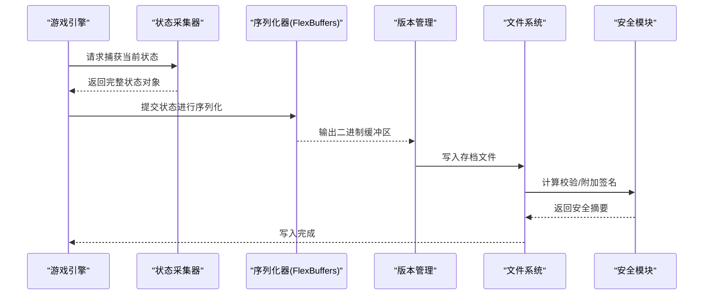
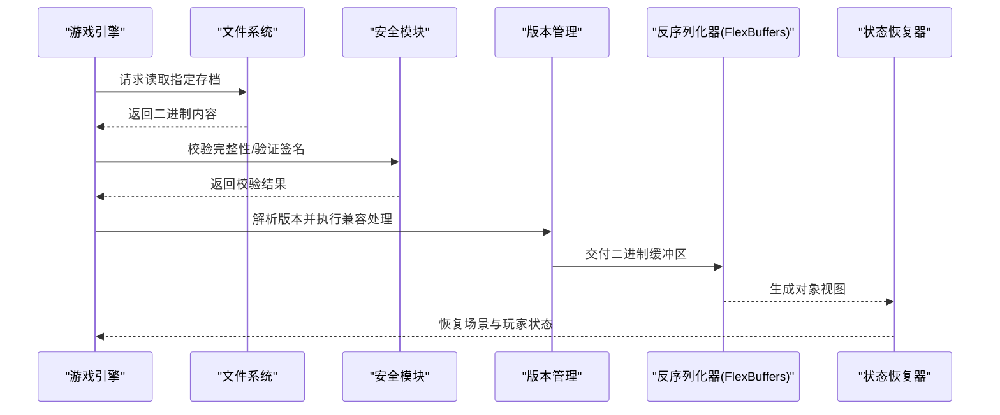
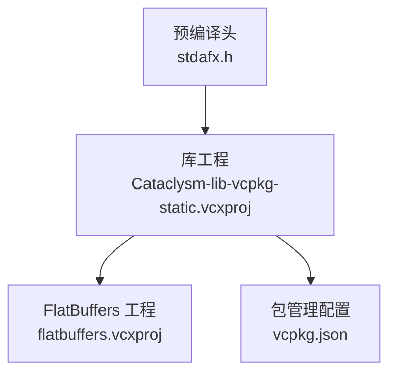

# 存档与读档系统

<cite>
**本文引用的文件**
- [stdafx.h](file://stdafx.h)
- [Cataclysm-lib-vcpkg-static.vcxproj](file://Cataclysm-lib-vcpkg-static.vcxproj)
- [flatbuffers.vcxproj](file://flatbuffers.vcxproj)
- [vcpkg.json](file://vcpkg.json)
- [Cataclysm-vcpkg-static.sln](file://Cataclysm-vcpkg-static.sln)
</cite>

## 目录
1. [引言](#引言)
2. [项目结构](#项目结构)
3. [核心组件](#核心组件)
4. [架构总览](#架构总览)
5. [详细组件分析](#详细组件分析)
6. [依赖关系分析](#依赖关系分析)
7. [性能考虑](#性能考虑)
8. [故障排除指南](#故障排除指南)
9. [结论](#结论)
10. [附录](#附录)

## 引言
本技术文档围绕“存档与读档系统”的实现进行系统化梳理，结合仓库中已提供的构建与依赖信息，重点分析以下方面：
- 存档数据结构设计：基于 FlexBuffers 的轻量级序列化方案
- 文件格式规范：二进制紧凑存储与跨平台可移植性
- 版本管理机制：通过版本号与字段兼容策略保障升级稳定性
- 创建与读档流程：状态捕获、序列化、文件写入、文件读取、反序列化与状态恢复
- 性能优化：增量存档、压缩算法、并发访问控制
- 安全机制：完整性校验、加密保护、防篡改策略
- 扩展指南与兼容性保证：字段扩展、默认值回退、向后兼容
- API 使用示例与故障排除

本仓库当前仅包含构建配置与第三方依赖声明，未包含具体的游戏存档实现代码。因此本文以现有线索为基础，给出可落地的架构建议与实施指南，帮助在现有工程基础上快速搭建稳定可靠的存档系统。

## 项目结构
从构建配置可见，项目采用 MSVC 工程组织方式，核心库工程包含对第三方库的引用，其中 FlatBuffers 作为序列化基础被明确纳入头文件包含路径。工程解决方案文件展示了多配置与多平台的构建目标，为后续存档系统的跨平台部署提供基础。

**图表来源**
- [Cataclysm-vcpkg-static.sln:49-110](file://Cataclysm-vcpkg-static.sln#L49-L110)
- [Cataclysm-lib-vcpkg-static.vcxproj:171-190](file://Cataclysm-lib-vcpkg-static.vcxproj#L171-L190)
- [flatbuffers.vcxproj:1-56](file://flatbuffers.vcxproj#L1-L56)
- [vcpkg.json:1-22](file://vcpkg.json#L1-L22)

**章节来源**
- [Cataclysm-vcpkg-static.sln:49-110](file://Cataclysm-vcpkg-static.sln#L49-L110)
- [Cataclysm-lib-vcpkg-static.vcxproj:171-190](file://Cataclysm-lib-vcpkg-static.vcxproj#L171-L190)
- [flatbuffers.vcxproj:1-56](file://flatbuffers.vcxproj#L1-L56)
- [vcpkg.json:1-22](file://vcpkg.json#L1-L22)

## 核心组件
- 预编译头与序列化基础
  - 预编译头集中引入标准库与第三方库，其中包含 FlexBuffers 头文件，表明序列化层将采用该框架。
  - 参考路径：[stdafx.h](file://stdafx.h#L73)

- 库工程与第三方依赖
  - 库工程显式包含第三方头文件路径，并在项目引用中链接 FlatBuffers 工程，确保序列化能力可用。
  - 参考路径：[Cataclysm-lib-vcpkg-static.vcxproj:171-190](file://Cataclysm-lib-vcpkg-static.vcxproj#L171-L190)

- 包管理与外部库
  - vcpkg.json 声明了 SDL2 系列与 FLAC 等多媒体依赖，为后续音视频存档或资源打包提供支持。
  - 参考路径：[vcpkg.json:1-22](file://vcpkg.json#L1-L22)

- 构建目标与平台
  - 解决方案文件展示多配置与多平台目标，便于在不同平台上统一构建存档系统。
  - 参考路径：[Cataclysm-vcpkg-static.sln:49-110](file://Cataclysm-vcpkg-static.sln#L49-L110)

**章节来源**
- [stdafx.h](file://stdafx.h#L73)
- [Cataclysm-lib-vcpkg-static.vcxproj:171-190](file://Cataclysm-lib-vcpkg-static.vcxproj#L171-L190)
- [vcpkg.json:1-22](file://vcpkg.json#L1-L22)
- [Cataclysm-vcpkg-static.sln:49-110](file://Cataclysm-vcpkg-static.sln#L49-L110)

## 架构总览
下图展示了存档系统的核心模块及其交互关系：应用层负责状态采集；序列化层负责结构化编码；文件层负责持久化；版本管理层负责兼容与迁移；安全层负责完整性与加密；工具层提供压缩与并发控制。

（本图为概念性架构示意，不直接映射到具体源文件）

## 详细组件分析

### 数据结构与文件格式设计
- 设计原则
  - 使用 FlexBuffers 进行结构化存储，具备零拷贝读取、紧凑二进制、跨语言特性。
  - 采用键值对形式，便于字段扩展与向后兼容。
- 字段组织
  - 游戏元数据：版本号、创建时间、平台标识
  - 场景数据：地图、实体、事件队列
  - 玩家数据：角色属性、背包、任务日志
  - 配置与设置：图形、音频、控制键位
- 文件命名与目录
  - 建议按日期与随机串组合命名，避免冲突并支持批量管理
  - 存放于用户文档目录或应用专属目录

（本节为通用设计建议，不直接引用具体源文件）

### 版本管理机制
- 版本号策略
  - 主版本号：破坏性变更
  - 次版本号：新增非破坏性字段
  - 补丁号：修复与小改动
- 兼容策略
  - 新增字段：旧存档读取时赋予默认值
  - 删除字段：读取时忽略
  - 类型变更：提供类型转换或降级处理
- 升级流程
  - 启动时检测版本，必要时触发迁移脚本
  - 迁移失败回滚至备份存档

（本节为通用设计建议，不直接引用具体源文件）

### 创建流程（状态捕获 → 序列化 → 写入）

（本图为概念性流程示意，不直接映射到具体源文件）

### 读档流程（读取 → 反序列化 → 状态恢复）

（本图为概念性流程示意，不直接映射到具体源文件）

### 性能优化
- 增量存档
  - 仅记录自上次存档以来的变化，减少写入与解析开销
  - 结合哈希表快速定位差异区域
- 压缩算法
  - 选择高压缩比与低 CPU 开销的算法（如 LZ4/LZHAM），在存档写入阶段启用
  - 对大对象（如地图块）单独压缩，避免整体压缩导致的热点问题
- 并发访问
  - 使用读写锁或原子操作保护共享状态
  - 将写入操作异步化，避免阻塞主循环
  - 多线程读取时确保快照一致性

（本节为通用设计建议，不直接引用具体源文件）

### 安全机制
- 数据完整性校验
  - 使用 CRC32/SHA-256 对存档内容计算摘要，写入时保存，读取时验证
- 加密保护
  - 对关键字段（如角色属性、进度）启用对称加密，密钥由系统安全模块管理
- 防篡改
  - 引入数字签名，结合公私钥对存档进行签名与验证
  - 对修改时间、文件大小等元数据进行监控

（本节为通用设计建议，不直接引用具体源文件）

### 扩展指南与兼容性保证
- 字段扩展
  - 新增字段时保持默认值，旧存档读取时自动填充
  - 删除字段时保留读取逻辑，忽略未知键
- 版本迁移
  - 提供版本迁移脚本，自动将旧格式转换为新格式
  - 迁移前备份原存档，失败时可回滚
- 兼容性测试
  - 覆盖历史版本的读取与写入测试
  - 在不同平台与字节序环境下验证一致性

（本节为通用设计建议，不直接引用具体源文件）

## 依赖关系分析
- 构建与运行时依赖
  - 预编译头集中引入标准库与第三方库，确保序列化与平台相关功能可用
  - 参考路径：[stdafx.h:63-95](file://stdafx.h#L63-L95)
- 第三方库集成
  - 库工程通过项目引用链接 FlatBuffers 工程，确保序列化能力可用
  - 参考路径：[Cataclysm-lib-vcpkg-static.vcxproj:182-185](file://Cataclysm-lib-vcpkg-static.vcxproj#L182-L185)
- 包管理配置
  - vcpkg.json 声明了 SDL2 系列与 FLAC 等依赖，为后续音视频资源打包提供支持
  - 参考路径：[vcpkg.json:1-22](file://vcpkg.json#L1-L22)

**图表来源**
- [stdafx.h:63-95](file://stdafx.h#L63-L95)
- [Cataclysm-lib-vcpkg-static.vcxproj:182-185](file://Cataclysm-lib-vcpkg-static.vcxproj#L182-L185)
- [vcpkg.json:1-22](file://vcpkg.json#L1-L22)

**章节来源**
- [stdafx.h:63-95](file://stdafx.h#L63-L95)
- [Cataclysm-lib-vcpkg-static.vcxproj:182-185](file://Cataclysm-lib-vcpkg-static.vcxproj#L182-L185)
- [vcpkg.json:1-22](file://vcpkg.json#L1-L22)

## 性能考虑
- I/O 层优化
  - 使用异步写入与批量刷盘，降低磁盘压力
  - 对热数据优先落盘，冷数据延迟或跳过
- 内存与序列化
  - 利用 FlexBuffers 的零拷贝读取特性，减少内存复制
  - 控制对象深度与集合规模，避免超大结构导致解析耗时
- 并发与锁粒度
  - 将写入操作集中在单一队列，读取侧使用快照隔离
  - 对频繁更新的小对象采用无锁队列或原子操作

（本节为通用指导，不直接引用具体源文件）

## 故障排除指南
- 常见问题
  - 无法读取存档：检查文件是否存在、权限是否足够、完整性校验是否通过
  - 版本不兼容：确认版本号与迁移脚本是否匹配，必要时回滚到备份
  - 写入失败：检查磁盘空间、文件句柄占用、并发写入冲突
- 排查步骤
  - 启用详细日志，记录序列化/反序列化阶段的错误码
  - 对异常存档进行离线分析，定位损坏字段
  - 回归测试：使用历史版本存档进行读取验证
- 预防措施
  - 写入前先校验数据合法性
  - 完成写入后立即追加校验摘要
  - 定期清理过期或损坏的临时文件

（本节为通用指导，不直接引用具体源文件）

## 结论
本仓库已具备存档系统所需的底层基础设施：预编译头集中引入序列化库、库工程链接第三方序列化组件、包管理配置声明了多媒体依赖。在此基础上，建议按照本文的架构设计与实施指南，快速搭建稳定、高效、安全的存档系统，并通过严格的版本管理与兼容性测试保障长期演进。

（本节为总结性内容，不直接引用具体源文件）

## 附录
- API 使用示例（概念性说明）
  - 创建存档：调用状态采集接口获取完整状态，提交给序列化器生成二进制缓冲区，写入文件并追加校验摘要
  - 读取存档：从文件读取二进制内容，先进行完整性校验，再根据版本号执行兼容处理，最后反序列化并恢复状态
- 最佳实践
  - 将存档视为不可变资产，写入完成后禁止外部修改
  - 对关键字段启用加密与签名，防止外挂篡改
  - 在发布前进行多平台与多版本的回归测试

（本节为通用指导，不直接引用具体源文件）