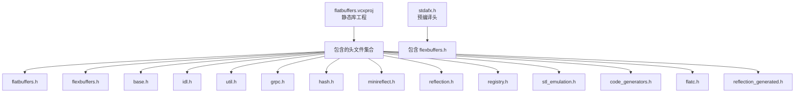
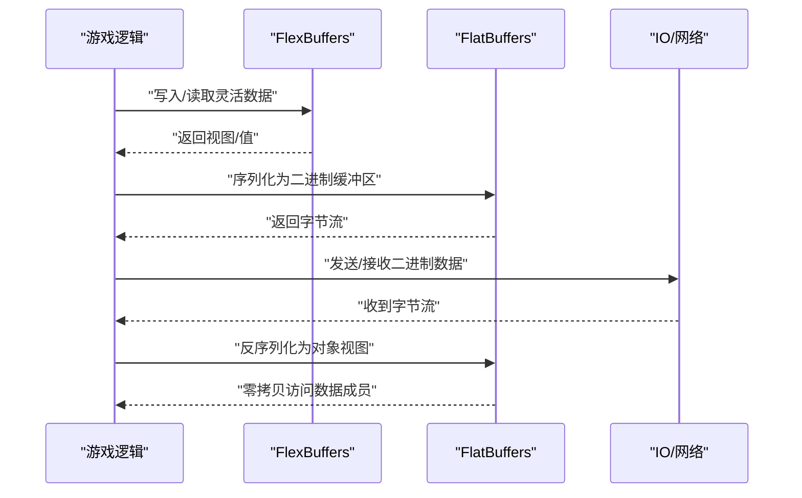
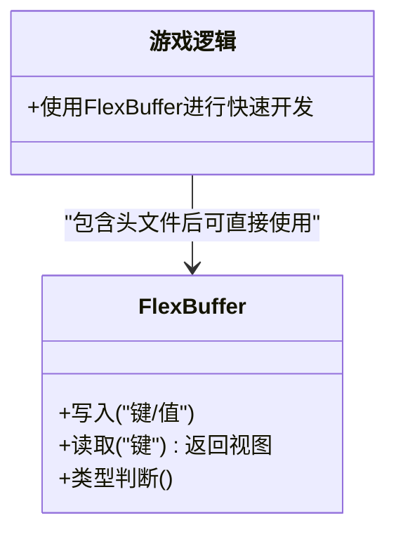
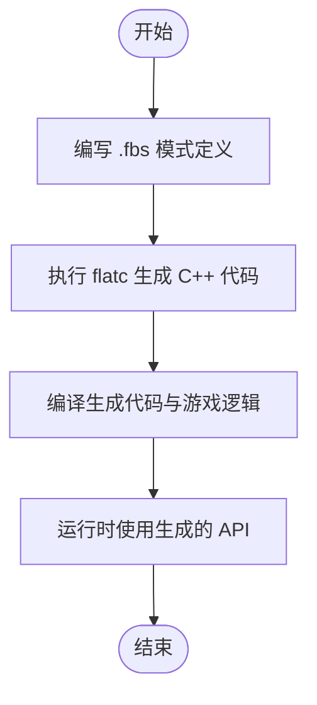
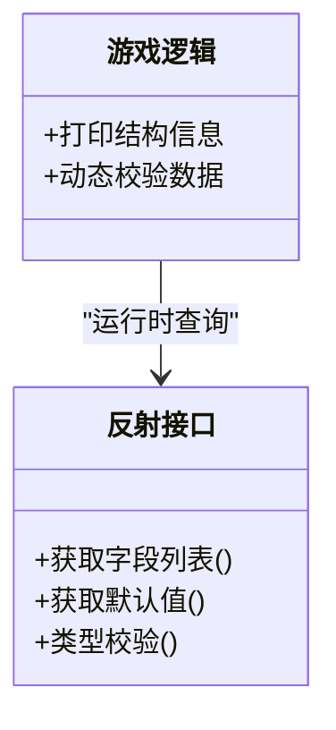
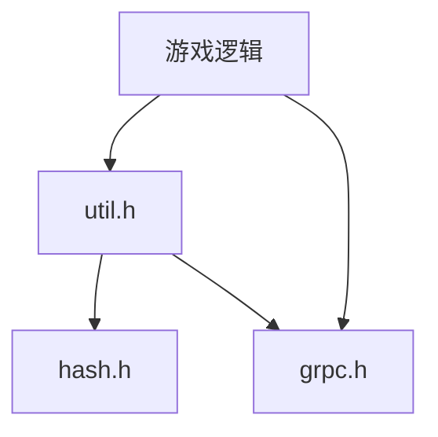
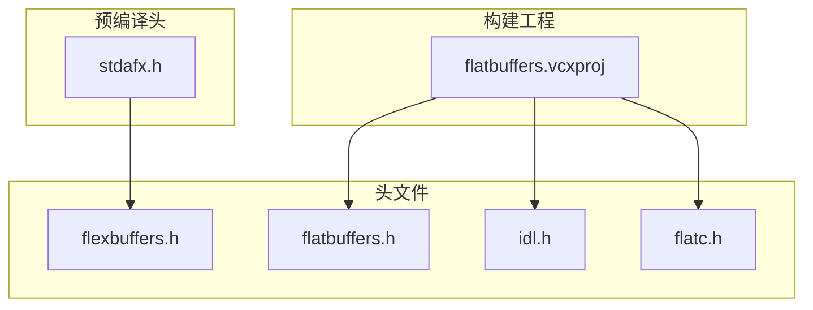

# 数据序列化与反序列化

<cite>
**本文引用的文件**
- [flatbuffers.vcxproj](file://flatbuffers.vcxproj)
- [stdafx.h](file://stdafx.h)
</cite>

## 目录
1. [引言](#引言)
2. [项目结构](#项目结构)
3. [核心组件](#核心组件)
4. [架构总览](#架构总览)
5. [详细组件分析](#详细组件分析)
6. [依赖关系分析](#依赖关系分析)
7. [性能考量](#性能考量)
8. [故障排查指南](#故障排查指南)
9. [结论](#结论)
10. [附录](#附录)

## 引言
本技术文档围绕数据序列化与反序列化展开，重点结合仓库中对 FlatBuffers 的集成方式，系统阐述其在游戏场景下的实现要点与工程实践。FlatBuffers 是一个跨平台的高效序列化库，支持零拷贝随机访问、紧凑二进制格式以及面向对象的数据模型生成。本文将从以下维度进行深入解析：
- 数据结构定义与内存布局优化
- 序列化与反序列化的性能特征（时间/空间复杂度、内存使用效率）
- 压缩与传输优化（二进制格式优势、网络传输优化、存储节省）
- 版本兼容性处理（向前/向后兼容、数据迁移策略）
- 性能调优指南（批量处理、内存池、缓存策略）
- API 使用示例与性能测试建议路径（基于仓库中已知的头文件集成）

## 项目结构
该仓库展示了对 FlatBuffers 的静态库集成方式，主要通过 MSVC 工程文件引入 FlatBuffers 头文件，并在预编译头中包含 flexbuffers 头文件，表明项目具备使用 FlexBuffers（无模式、可变类型）进行快速原型或动态场景的能力。



图表来源
- [flatbuffers.vcxproj:29-44](file://flatbuffers.vcxproj#L29-L44)
- [stdafx.h:73-73](file://stdafx.h#L73-L73)

章节来源
- [flatbuffers.vcxproj:1-128](file://flatbuffers.vcxproj#L1-L128)
- [stdafx.h:64-95](file://stdafx.h#L64-L95)

## 核心组件
- 静态库工程：flatbuffers.vcxproj 将 FlatBuffers 的核心头文件纳入工程，便于在上层游戏中直接使用。
- 预编译头：stdafx.h 中显式包含 flexbuffers.h，为后续在游戏逻辑中使用无模式灵活数据结构提供便利。
- 关键头文件概览：
  - flatbuffers.h：核心 API 与运行时支持
  - flexbuffers.h：无模式、可变类型容器
  - base.h：基础类型与工具
  - idl.h / flatc.h：IDL 定义与代码生成器接口
  - util.h：工具函数
  - grpc.h / hash.h / minireflect.h / reflection.h / registry.h / stl_emulation.h / code_generators.h / reflection_generated.h：扩展与反射能力

章节来源
- [flatbuffers.vcxproj:29-44](file://flatbuffers.vcxproj#L29-L44)
- [stdafx.h:73-73](file://stdafx.h#L73-L73)

## 架构总览
下图展示从“游戏逻辑”到“FlatBuffers 运行时”的典型调用链路，涵盖序列化与反序列化两条主线：



说明
- FlexBuffers 适合快速原型与动态数据；FlatBuffers 更适合强类型、高性能场景。
- 二进制格式直接对接网络/存储，避免文本解析开销。

## 详细组件分析

### 组件一：FlexBuffers（无模式灵活数据）
- 适用场景：快速原型、配置数据、动态结构、调试阶段。
- 优点：无需预先定义 Schema，写入/读取便捷；与 C++ STL 类型自然映射。
- 在本仓库中的体现：预编译头中包含 flexbuffers.h，表明可在游戏模块中直接使用。



章节来源
- [stdafx.h:73-73](file://stdafx.h#L73-L73)

### 组件二：FlatBuffers（强类型、零拷贝）
- 适用场景：高性能游戏状态、网络协议、持久化数据。
- 优点：零拷贝随机访问、紧凑二进制、Schema 驱动、跨语言一致性。
- 在本仓库中的体现：工程包含 flatbuffers.h、idl.h、flatc.h 等，表明具备完整的生成与运行时能力。

```mermaid
classDiagram
class FlatBufferBuilder {
+开始构建()
+写入标量/字符串/向量
+完成构建()
}
class 表/结构 {
+字段访问(零拷贝)
+嵌套表/向量访问
}
class 游戏逻辑 {
+序列化状态
+反序列化消息
}
游戏逻辑 --> FlatBufferBuilder : "生成二进制"
游戏逻辑 --> 表/结构 : "零拷贝读取"
```

章节来源
- [flatbuffers.vcxproj:29-44](file://flatbuffers.vcxproj#L29-L44)

### 组件三：IDL 与代码生成（flatc）
- 作用：根据 .fbs 文件生成 C++ 代码，提供类型安全的序列化/反序列化 API。
- 在本仓库中的体现：工程包含 flatc.h 与 idl.h，表明具备生成流程入口。



章节来源
- [flatbuffers.vcxproj:33-33](file://flatbuffers.vcxproj#L33-L33)
- [flatbuffers.vcxproj:37-37](file://flatbuffers.vcxproj#L37-L37)

### 组件四：反射与元信息（reflection/minireflect）
- 作用：在运行时查询类型、字段、默认值等元信息，辅助调试与通用处理。
- 在本仓库中的体现：工程包含 reflection.h 与 minireflect.h。



章节来源
- [flatbuffers.vcxproj:38-39](file://flatbuffers.vcxproj#L38-L39)

### 组件五：网络与工具（grpc/util/hash）
- grpc.h：支持 gRPC 场景下的序列化/反序列化。
- util.h/hash.h：提供工具函数与哈希支持，常用于键值索引与校验。
- 在本仓库中的体现：工程包含这些头文件。



章节来源
- [flatbuffers.vcxproj:35-43](file://flatbuffers.vcxproj#L35-L43)

## 依赖关系分析
- 工程依赖：flatbuffers.vcxproj 将 FlatBuffers 头文件作为静态库工程的一部分，供上层游戏模块链接使用。
- 头文件依赖：stdafx.h 显式包含 flexbuffers.h，表明 FlexBuffers 能力在预编译阶段即可用。
- 生成链路：idl.h/flatc.h 为 Schema 与生成器接口，配合实际的 .fbs 文件产出类型安全代码。



图表来源
- [flatbuffers.vcxproj:29-44](file://flatbuffers.vcxproj#L29-L44)
- [stdafx.h:73-73](file://stdafx.h#L73-L73)

章节来源
- [flatbuffers.vcxproj:1-128](file://flatbuffers.vcxproj#L1-L128)
- [stdafx.h:64-95](file://stdafx.h#L64-L95)

## 性能考量
- 时间复杂度
  - 序列化：线性于数据大小 O(N)，写入标量/字符串/向量均为摊销常数操作。
  - 反序列化：零拷贝访问，按需解引用，平均 O(1) 访问单个字段。
- 空间复杂度
  - 序列化输出为紧凑二进制，无额外结构体填充浪费。
  - FlexBuffers 在灵活性与内存占用之间提供平衡，适合动态场景。
- 内存使用效率
  - 零拷贝减少复制与临时缓冲。
  - 批量序列化可降低分配次数与碎片化。
- 压缩与传输优化
  - 二进制格式天然优于文本格式，减少带宽与 CPU 开销。
  - 结合网络分片/粘包处理，可进一步提升吞吐。
- 存储节省
  - 紧凑布局与定长字段组合可显著降低磁盘占用。

## 故障排查指南
- 常见问题
  - 字段缺失/顺序变化：确保 Schema 向后兼容，使用默认值与可选字段。
  - 大小端/平台差异：统一平台字节序或在传输层做转换。
  - 缓冲区越界：严格校验输入长度与偏移。
  - 反射误用：仅在调试/通用处理场景使用反射，避免在热路径频繁调用。
- 排查步骤
  - 使用 reflection/minireflect 输出结构信息进行核对。
  - 对比生成代码与 Schema 是否一致。
  - 在网络层记录原始二进制长度与首部校验和。

## 结论
本仓库通过静态库工程与预编译头的方式集成了 FlatBuffers 的核心能力，既支持强类型的高性能序列化，也保留了 FlexBuffers 的灵活性。结合 Schema 驱动与零拷贝特性，可在游戏场景中获得优秀的性能与可维护性。建议在生产环境中：
- 优先采用 FlatBuffers 强类型 API 进行核心数据序列化；
- 在调试与动态场景使用 FlexBuffers；
- 通过反射与工具函数完善版本兼容与诊断能力；
- 结合批量处理、内存池与缓存策略持续优化性能。

## 附录
- API 使用示例与性能测试建议路径（基于仓库中已知的头文件集成）
  - 强类型序列化/反序列化：参考工程中包含的头文件，结合实际 .fbs 定义生成的 API 进行调用。
  - 灵活数据：在预编译头中包含 flexbuffers.h 后，即可在游戏逻辑中使用 FlexBuffers 进行快速原型与动态数据处理。
  - 生成与运行：利用 flatc 与 idl.h/flatc.h 提供的接口，完成 Schema 生成与编译集成。

章节来源
- [flatbuffers.vcxproj:29-44](file://flatbuffers.vcxproj#L29-L44)
- [stdafx.h:73-73](file://stdafx.h#L73-L73)