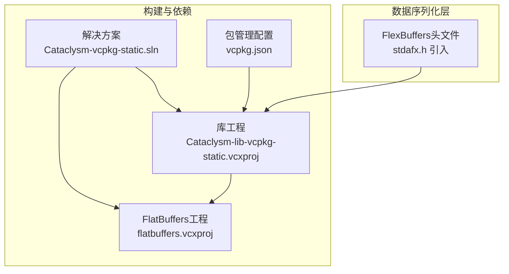
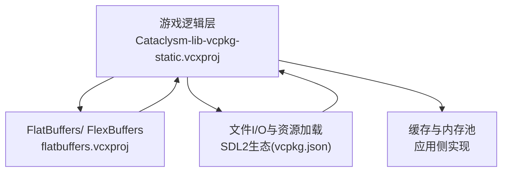
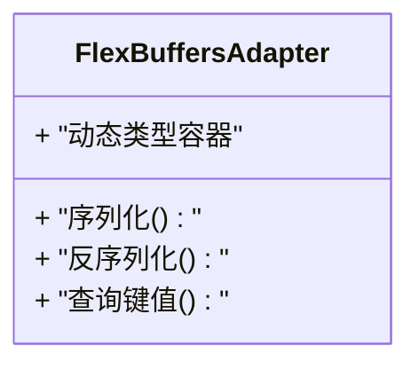
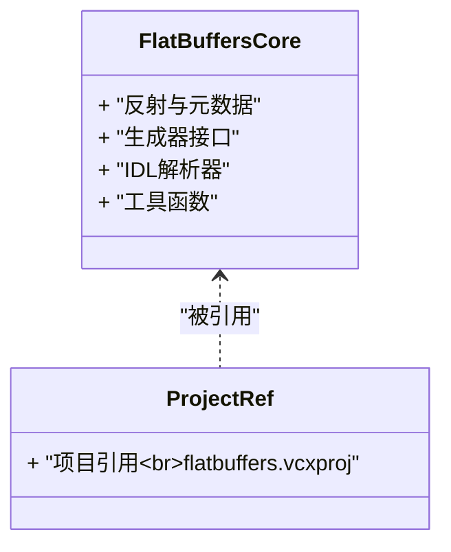
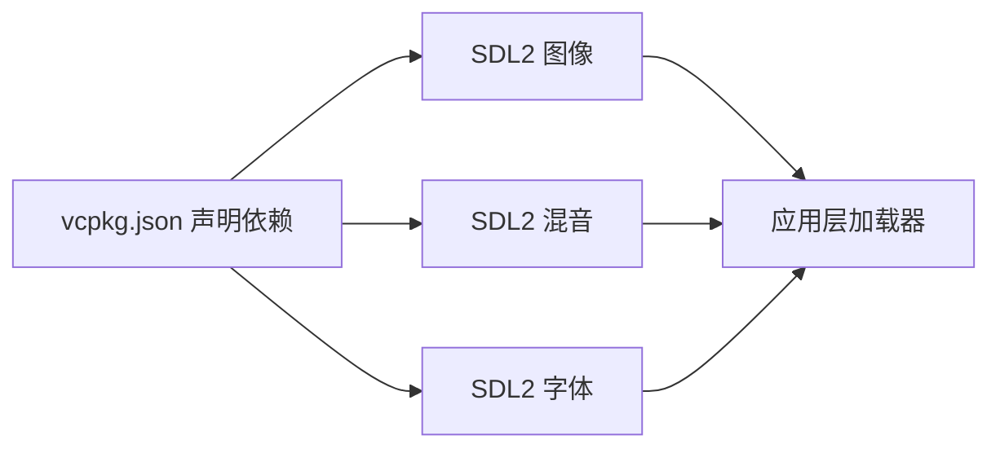
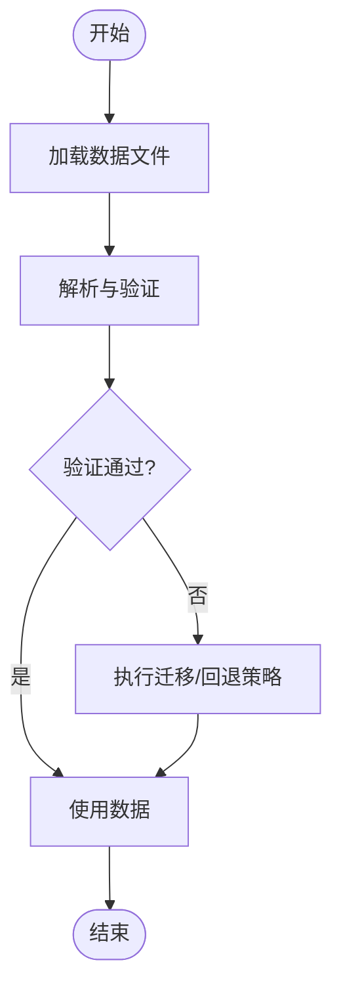
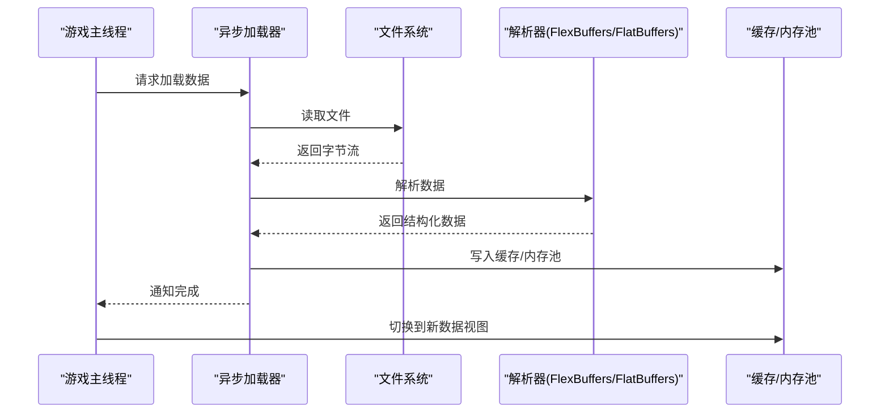
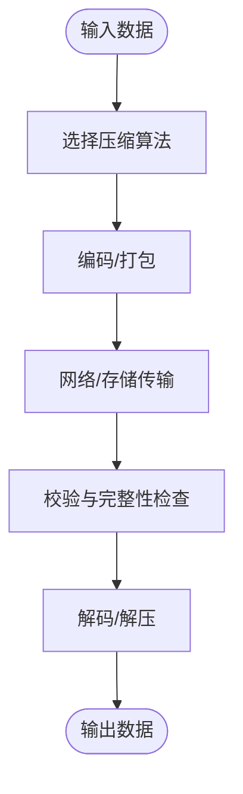
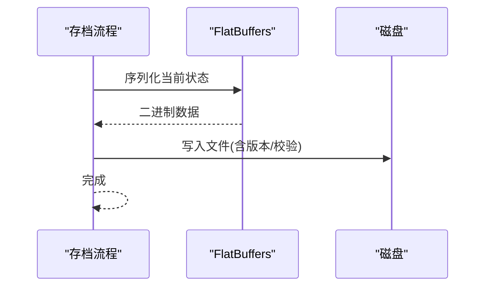
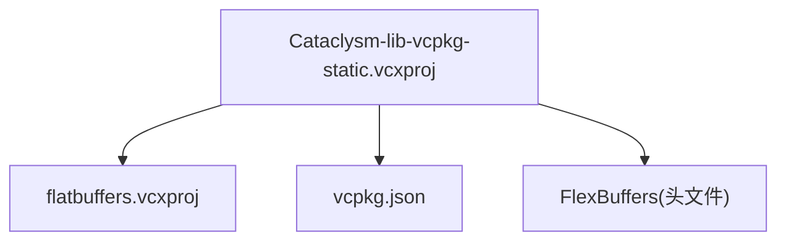

# 数据管理系统

<cite>
**本文引用的文件**
- [stdafx.h](file://stdafx.h)
- [flatbuffers.vcxproj](file://flatbuffers.vcxproj)
- [Cataclysm-lib-vcpkg-static.vcxproj](file://Cataclysm-lib-vcpkg-static.vcxproj)
- [vcpkg.json](file://vcpkg.json)
</cite>

## 目录
1. [简介](#简介)
2. [项目结构](#项目结构)
3. [核心组件](#核心组件)
4. [架构总览](#架构总览)
5. [详细组件分析](#详细组件分析)
6. [依赖关系分析](#依赖关系分析)
7. [性能考虑](#性能考虑)
8. [故障排除指南](#故障排除指南)
9. [结论](#结论)
10. [附录](#附录)

## 简介
本文件面向数据管理系统的综合文档，聚焦于在游戏场景中使用 FlatBuffers 进行数据序列化与反序列化的实践，涵盖内存布局优化、数据加载与缓存策略、压缩与传输优化、高效存档与读档流程，以及数据格式扩展与版本兼容性管理的最佳实践。由于当前仓库主要包含构建配置与第三方依赖声明，本文将基于现有信息进行系统化梳理，并提供可落地的工程化建议。

## 项目结构
该仓库为 C/C++ 游戏项目的 MSVC 工程集合，包含以下与数据管理相关的关键元素：
- 构建配置：通过 MSVC 工程文件声明了对 FlatBuffers 的静态库集成方式。
- 头文件前置声明：在编译入口处引入了 FlexBuffers 头文件，表明项目具备以 FlatBuffers 为核心的序列化能力。
- 包管理：通过 vcpkg 声明了 SDL2 及其音频相关依赖，间接支持资源与数据的加载与播放。

图表来源
- [Cataclysm-lib-vcpkg-static.vcxproj:182-185](file://Cataclysm-lib-vcpkg-static.vcxproj#L182-L185)
- [flatbuffers.vcxproj:29-44](file://flatbuffers.vcxproj#L29-L44)
- [vcpkg.json:1-22](file://vcpkg.json#L1-L22)
- [stdafx.h:73](file://stdafx.h#L73)

章节来源
- [Cataclysm-lib-vcpkg-static.vcxproj:175-186](file://Cataclysm-lib-vcpkg-static.vcxproj#L175-L186)
- [flatbuffers.vcxproj:1-56](file://flatbuffers.vcxproj#L1-L56)
- [vcpkg.json:1-22](file://vcpkg.json#L1-L22)
- [stdafx.h:73](file://stdafx.h#L73)

## 核心组件
- FlexBuffers 集成：在编译入口头文件中显式包含 FlexBuffers，用于支持动态类型的数据序列化与反序列化，便于运行时灵活解析 JSON 风格数据。
- FlatBuffers 静态库：通过独立工程模块提供 FlatBuffers 头文件与工具链，供主库工程链接使用。
- 包管理与外部依赖：vcpkg 声明了 SDL2 生态（图像、音频、字体）相关依赖，为资源加载与播放提供基础能力，间接支撑数据驱动的游戏内容。

章节来源
- [stdafx.h:73](file://stdafx.h#L73)
- [flatbuffers.vcxproj:29-44](file://flatbuffers.vcxproj#L29-L44)
- [vcpkg.json:1-22](file://vcpkg.json#L1-L22)

## 架构总览
下图展示了数据管理在工程中的位置与交互关系：

图表来源
- [Cataclysm-lib-vcpkg-static.vcxproj:182-185](file://Cataclysm-lib-vcpkg-static.vcxproj#L182-L185)
- [flatbuffers.vcxproj:29-44](file://flatbuffers.vcxproj#L29-L44)
- [vcpkg.json:1-22](file://vcpkg.json#L1-L22)

## 详细组件分析

### 组件一：FlexBuffers 动态序列化适配器
- 职责：提供运行时动态类型的数据结构表示与序列化/反序列化能力，适合 JSON 风格数据的快速解析与访问。
- 关键点：
  - 在编译入口引入 FlexBuffers 头文件，确保全局可用。
  - 适用于小规模或频繁变更的数据片段，降低编译期耦合。
- 性能与内存：
  - 读取为 O(1) 访问，写入需按需构建，适合读多写少场景。
  - 内存占用与数据形状相关，建议避免深层嵌套与超大数组。

章节来源
- [stdafx.h:73](file://stdafx.h#L73)

### 组件二：FlatBuffers 静态库集成
- 职责：提供强类型、零拷贝、跨平台的数据序列化方案，适合大规模持久化数据与网络传输。
- 关键点：
  - 通过独立工程模块提供头文件与工具链，主库工程以项目引用方式链接。
  - 适合定义稳定的数据模式（schema），生成跨语言/跨平台的二进制格式。
- 性能与内存：
  - 反序列化无需额外分配，直接读取内存布局，延迟加载字段时按需解析。
  - 适合高吞吐量场景，但 schema 固定后修改需谨慎处理版本兼容。

图表来源
- [flatbuffers.vcxproj:29-44](file://flatbuffers.vcxproj#L29-L44)
- [Cataclysm-lib-vcpkg-static.vcxproj:182-185](file://Cataclysm-lib-vcpkg-static.vcxproj#L182-L185)

章节来源
- [flatbuffers.vcxproj:1-56](file://flatbuffers.vcxproj#L1-L56)
- [Cataclysm-lib-vcpkg-static.vcxproj:182-185](file://Cataclysm-lib-vcpkg-static.vcxproj#L182-L185)

### 组件三：数据加载与资源生态
- 职责：结合 vcpkg 声明的 SDL2 生态（图像、音频、字体），为数据驱动的游戏内容提供加载与播放能力。
- 关键点：
  - 通过包管理统一依赖，减少手工配置成本。
  - 与数据序列化配合，实现从磁盘到内存的高效流转。

图表来源
- [vcpkg.json:1-22](file://vcpkg.json#L1-L22)

章节来源
- [vcpkg.json:1-22](file://vcpkg.json#L1-L22)

### 组件四：数据验证与版本兼容
- 验证机制（建议）：
  - 使用 FlatBuffers 反射与元数据校验字段存在性与类型一致性。
  - 对 FlexBuffers 结果进行白名单校验与边界检查。
- 版本兼容（建议）：
  - 为 FlatBuffers schema 定义版本号与默认值策略，保证旧数据可读。
  - 采用“向后兼容”原则：新增字段需可选且提供默认值；删除字段需保留别名或迁移映射。

（本图为概念性流程图，不对应具体源码文件）

### 组件五：异步加载、增量更新与内存池
- 异步加载（建议）：
  - 将 I/O 与解码分离至后台线程，完成后通过原子操作或锁交换指针切换到新数据视图。
- 增量更新（建议）：
  - 仅对变更部分重新解析或重建索引，避免全量重载。
- 内存池（建议）：
  - 为热路径对象分配器复用内存块，减少碎片与分配开销。

（本图为概念性时序图，不对应具体源码文件）

### 组件六：压缩与传输优化
- 压缩策略（建议）：
  - 对大体量 FlatBuffers 数据采用 LZ4/Brotli 等高压缩比算法，注意解压延迟与 CPU 占用平衡。
  - 对频繁访问的热点数据可采用无损压缩并缓存解压结果。
- 传输优化（建议）：
  - 使用分块传输与 CRC 校验，结合断点续传与差分更新。

（本图为概念性流程图，不对应具体源码文件）

### 组件七：高效存档与读档
- 存档（建议）：
  - 优先使用 FlatBuffers 的二进制格式，配合版本号与时间戳。
  - 对非关键字段采用延迟写入，减少冗余。
- 读档（建议）：
  - 先做版本与校验，再按需解析，避免一次性全量解码。

（本图为概念性时序图，不对应具体源码文件）

## 依赖关系分析
- 主库工程通过项目引用链接 FlatBuffers 静态库，确保头文件与工具可用。
- vcpkg 配置声明了 SDL2 生态依赖，为资源加载提供基础能力。
- FlexBuffers 在编译入口被统一引入，形成全局可用的动态序列化能力。

图表来源
- [Cataclysm-lib-vcpkg-static.vcxproj:182-185](file://Cataclysm-lib-vcpkg-static.vcxproj#L182-L185)
- [vcpkg.json:1-22](file://vcpkg.json#L1-L22)
- [stdafx.h:73](file://stdafx.h#L73)

章节来源
- [Cataclysm-lib-vcpkg-static.vcxproj:182-185](file://Cataclysm-lib-vcpkg-static.vcxproj#L182-L185)
- [vcpkg.json:1-22](file://vcpkg.json#L1-L22)
- [stdafx.h:73](file://stdafx.h#L73)

## 性能考虑
- 读取性能：优先使用 FlatBuffers 的零拷贝读取，避免额外分配；对热点数据建立索引与缓存。
- 写入性能：批量写入与合并更新，减少频繁序列化开销。
- 内存占用：控制嵌套层级与数组长度，必要时采用流式解析与懒加载。
- CPU/IO 平衡：异步加载与解压，避免阻塞主线程。

（本节为通用性能指导，不直接分析具体文件）

## 故障排除指南
- 编译错误（未找到 FlexBuffers 头文件）：
  - 确认已在编译入口包含相应头文件，并确保 FlatBuffers 工程已正确构建与引用。
- 链接错误（找不到 FlatBuffers 符号）：
  - 检查主库工程是否通过项目引用链接 FlatBuffers 工程，或已正确安装静态库。
- 运行时崩溃（解析异常）：
  - 对 FlexBuffers/FlatBuffers 输出进行严格校验，确保字段存在与类型匹配；对越界访问进行防护。

章节来源
- [Cataclysm-lib-vcpkg-static.vcxproj:182-185](file://Cataclysm-lib-vcpkg-static.vcxproj#L182-L185)
- [flatbuffers.vcxproj:29-44](file://flatbuffers.vcxproj#L29-L44)
- [stdafx.h:73](file://stdafx.h#L73)

## 结论
本仓库为数据管理系统提供了良好的基础设施：通过 FlexBuffers 实现动态类型数据的快速解析，通过 FlatBuffers 提供高性能、零拷贝的序列化能力，并借助 vcpkg 管理 SDL2 生态依赖。建议在此基础上完善数据验证、版本兼容、异步加载、增量更新与压缩传输等机制，以满足游戏场景下的高可靠性与高性能需求。

## 附录
- 数据格式扩展与版本兼容最佳实践（建议）
  - 为 FlatBuffers schema 定义清晰的版本号与默认值策略，确保向后兼容。
  - 对新增字段提供默认值，删除字段保留别名或迁移映射。
  - 对 FlexBuffers 数据建立白名单校验与边界检查，防止异常输入导致崩溃。
- 开发与维护建议
  - 将数据加载与解析抽象为独立模块，便于替换与测试。
  - 对热数据建立缓存与内存池，减少重复解析与分配。
  - 使用异步与增量策略提升加载体验，避免卡顿。

（本节为通用指导，不直接分析具体文件）