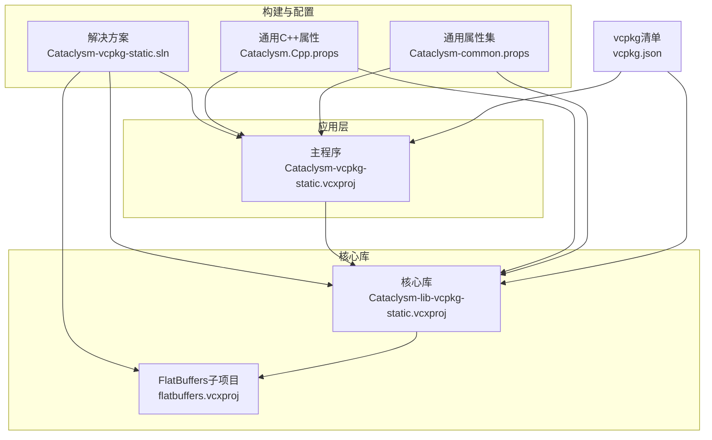
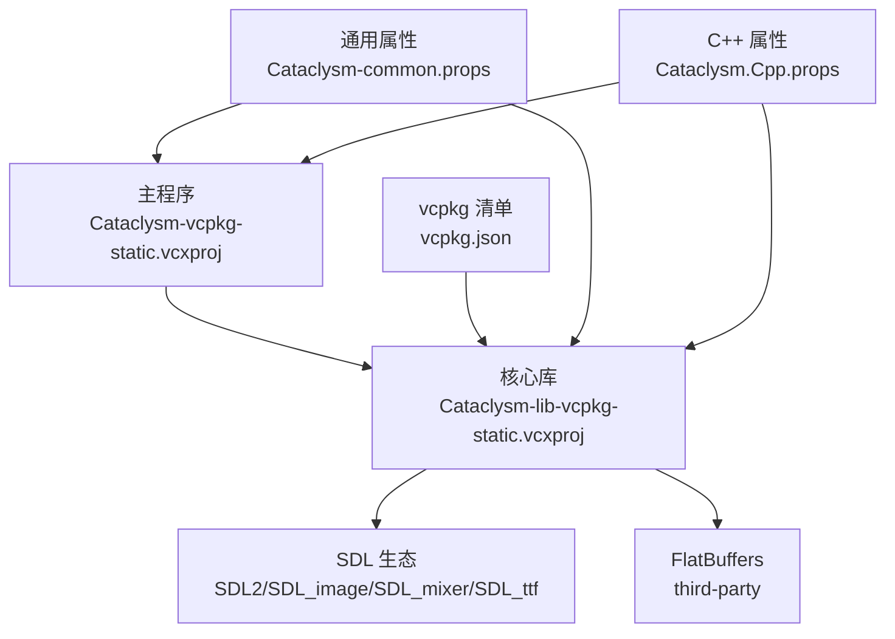
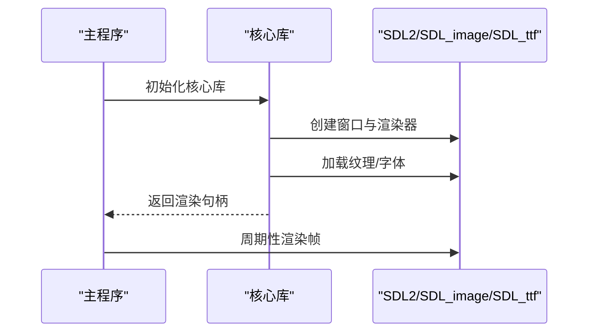
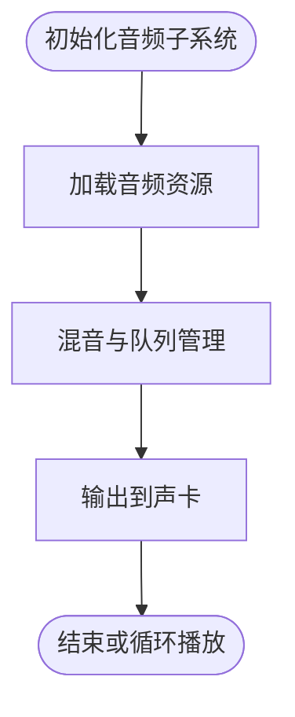
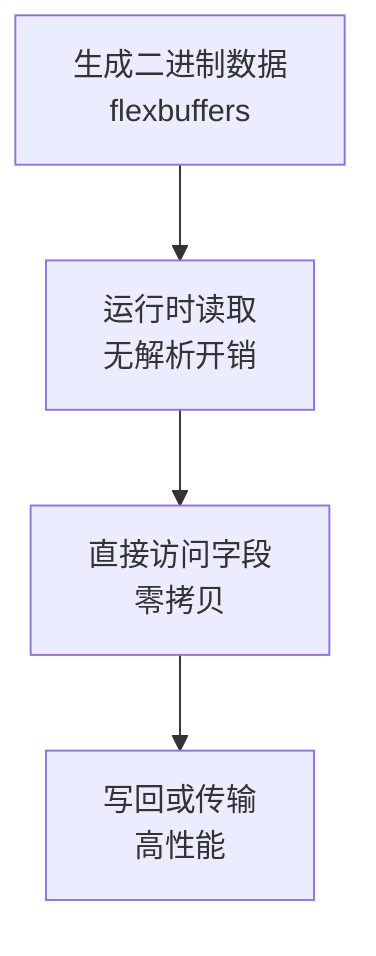
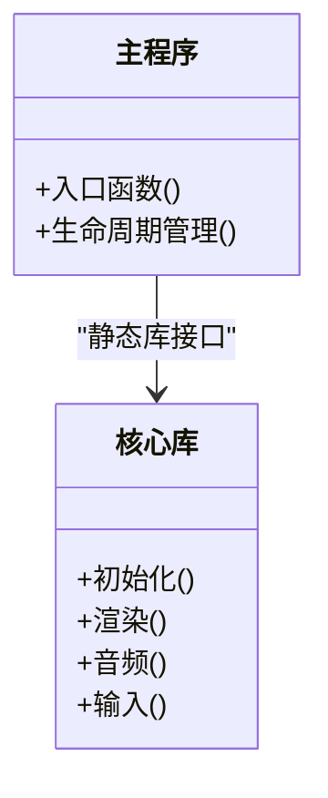
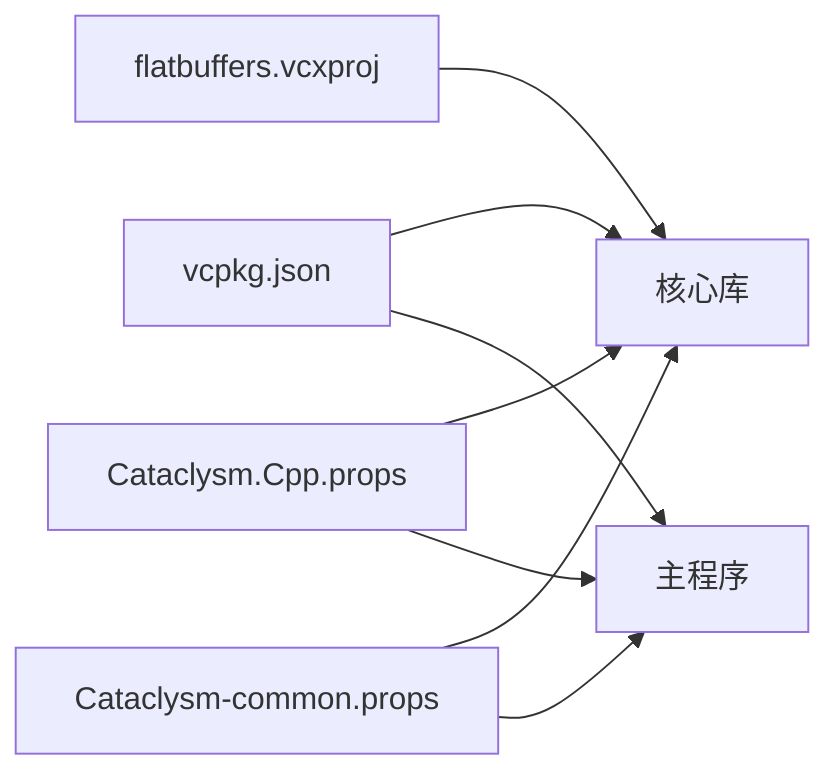

# 核心模块

<cite>
**本文引用的文件**
- [Cataclysm-vcpkg-static.vcxproj](file://Cataclysm-vcpkg-static.vcxproj)
- [Cataclysm-lib-vcpkg-static.vcxproj](file://Cataclysm-lib-vcpkg-static.vcxproj)
- [Cataclysm.Cpp.props](file://Cataclysm.Cpp.props)
- [Cataclysm-common.props](file://Cataclysm-common.props)
- [vcpkg.json](file://vcpkg.json)
- [stdafx.h](file://stdafx.h)
- [stdafx.cpp](file://stdafx.cpp)
- [flatbuffers.vcxproj](file://flatbuffers.vcxproj)
</cite>

## 目录
1. [引言](#引言)
2. [项目结构](#项目结构)
3. [核心组件](#核心组件)
4. [架构总览](#架构总览)
5. [详细组件分析](#详细组件分析)
6. [依赖关系分析](#依赖关系分析)
7. [性能考量](#性能考量)
8. [故障排查指南](#故障排查指南)
9. [结论](#结论)
10. [附录](#附录)

## 引言
本文件面向MSVC Full Features（Cataclysm Medieval）项目的“核心模块”进行系统性技术文档梳理，重点围绕以下目标展开：
- 深入解析模块化架构、组件系统与数据驱动开发的实现方式与设计思想
- 解释图形系统、音频系统、输入处理等关键子系统的集成路径与接口设计
- 分析FlatBuffers在游戏中的序列化应用及其性能优势
- 明确核心库与主应用程序之间的接口边界与松耦合通信机制
- 提供可操作的扩展指南与最佳实践建议

由于当前仓库中未包含实际源代码目录（src），本文基于构建配置与第三方依赖声明进行架构层面的解读与推演，帮助读者理解项目整体设计思路与落地方式。

## 项目结构
该工程采用MSBuild多项目组织，核心由三个构件构成：
- 主应用程序：Cataclysm-vcpkg-static（Win32控制台应用，使用vcpkg管理SDL生态）
- 核心静态库：Cataclysm-lib-vcpkg-static（封装游戏核心逻辑与平台适配）
- 序列化子系统：flatbuffers（内置于third-party，作为数据序列化基础）

构建属性通过公共props文件集中管理，统一编译选项、预编译头、链接器参数与vcpkg依赖枚举。

图表来源
- [Cataclysm-vcpkg-static.vcxproj:1-236](file://Cataclysm-vcpkg-static.vcxproj#L1-L236)
- [Cataclysm-lib-vcpkg-static.vcxproj:1-191](file://Cataclysm-lib-vcpkg-static.vcxproj#L1-L191)
- [Cataclysm.Cpp.props:1-11](file://Cataclysm.Cpp.props#L1-L11)
- [Cataclysm-common.props:1-154](file://Cataclysm-common.props#L1-L154)
- [vcpkg.json:1-22](file://vcpkg.json#L1-L22)

章节来源
- [Cataclysm-vcpkg-static.vcxproj:1-236](file://Cataclysm-vcpkg-static.vcxproj#L1-L236)
- [Cataclysm-lib-vcpkg-static.vcxproj:1-191](file://Cataclysm-lib-vcpkg-static.vcxproj#L1-L191)
- [Cataclysm.Cpp.props:1-11](file://Cataclysm.Cpp.props#L1-L11)
- [Cataclysm-common.props:1-154](file://Cataclysm-common.props#L1-L154)
- [vcpkg.json:1-22](file://vcpkg.json#L1-L22)

## 核心组件
- 预编译头与平台适配：stdafx.h统一引入STL、平台头与SDL生态，并在条件宏下选择性包含图形、音频、字体相关头文件，为后续模块提供一致的前置环境。
- 图形系统：通过SDL2/SDL_image/SDL_ttf实现渲染、图像加载与文字绘制；在TILES宏开启时启用瓦片地图渲染路径。
- 音频系统：通过SDL_mixer实现多格式音频解码与混音，支持FLAC、MP3、MOD等特性组合。
- 输入处理：SDL事件循环负责键盘、鼠标、手柄等输入采集与分发。
- 数据序列化：内置FlatBuffers子项目，提供flexbuffers运行时读取能力，用于资源定义与网络/存档数据的高效访问。

章节来源
- [stdafx.h:1-96](file://stdafx.h#L1-L96)
- [vcpkg.json:1-22](file://vcpkg.json#L1-L22)
- [Cataclysm-lib-vcpkg-static.vcxproj:175-191](file://Cataclysm-lib-vcpkg-static.vcxproj#L175-L191)

## 架构总览
从构建视角看，主程序与核心库之间通过静态库形式耦合，核心库再依赖vcpkg提供的SDL生态与本地FlatBuffers实现。通用属性文件集中管理编译/链接策略，确保跨配置一致性。

图表来源
- [Cataclysm-vcpkg-static.vcxproj:225-229](file://Cataclysm-vcpkg-static.vcxproj#L225-L229)
- [Cataclysm-lib-vcpkg-static.vcxproj:181-186](file://Cataclysm-lib-vcpkg-static.vcxproj#L181-L186)
- [vcpkg.json:1-22](file://vcpkg.json#L1-L22)
- [Cataclysm-common.props:1-154](file://Cataclysm-common.props#L1-L154)
- [Cataclysm.Cpp.props:1-11](file://Cataclysm.Cpp.props#L1-L11)

## 详细组件分析

### 模块化架构与组件系统
- 模块边界：核心库承担游戏逻辑与平台抽象，主程序仅负责入口与生命周期管理；两者通过静态库接口解耦。
- 组件系统：通过预编译头与条件编译宏（如TILES、SDL_SOUND）在编译期选择性启用功能模块，形成“按需装配”的组件化效果。
- 数据驱动：借助FlexBuffers运行时读取能力，资源定义与配置可通过二进制schema-less结构快速加载，降低运行时解析成本。

章节来源
- [Cataclysm-lib-vcpkg-static.vcxproj:120-122](file://Cataclysm-lib-vcpkg-static.vcxproj#L120-L122)
- [Cataclysm-lib-vcpkg-static.vcxproj:175-191](file://Cataclysm-lib-vcpkg-static.vcxproj#L175-L191)
- [stdafx.h:72-96](file://stdafx.h#L72-L96)

### 图形系统（SDL2）
- 能力范围：窗口、渲染、图像加载、字体渲染。
- 集成方式：在TILES宏开启时包含SDL2相关头文件，结合SDL_image与SDL_ttf完成资源加载与UI绘制。
- 性能要点：使用预编译头减少重复包含开销；在Release配置下启用优化与快速调试信息。

图表来源
- [Cataclysm-lib-vcpkg-static.vcxproj:120-122](file://Cataclysm-lib-vcpkg-static.vcxproj#L120-L122)
- [Cataclysm-common.props:52-58](file://Cataclysm-common.props#L52-L58)
- [vcpkg.json:5-14](file://vcpkg.json#L5-L14)

章节来源
- [Cataclysm-lib-vcpkg-static.vcxproj:120-122](file://Cataclysm-lib-vcpkg-static.vcxproj#L120-L122)
- [Cataclysm-common.props:52-58](file://Cataclysm-common.props#L52-L58)
- [vcpkg.json:5-14](file://vcpkg.json#L5-L14)

### 音频系统（SDL_mixer）
- 能力范围：多格式音频解码与混音，支持FLAC、MP3、MOD等特性组合。
- 集成方式：在SDL_SOUND宏存在时包含SDL_mixer头文件，按需启用音频功能。
- 性能要点：Release配置下启用函数级内联与优化，减少音频播放延迟。

图表来源
- [Cataclysm-lib-vcpkg-static.vcxproj:120-122](file://Cataclysm-lib-vcpkg-static.vcxproj#L120-L122)
- [vcpkg.json:10-13](file://vcpkg.json#L10-L13)

章节来源
- [Cataclysm-lib-vcpkg-static.vcxproj:120-122](file://Cataclysm-lib-vcpkg-static.vcxproj#L120-L122)
- [vcpkg.json:10-13](file://vcpkg.json#L10-L13)

### 输入处理（SDL事件）
- 能力范围：键盘、鼠标、手柄事件采集与分发。
- 集成方式：通过SDL事件循环在主程序或核心库中轮询处理，按帧更新游戏状态。
- 性能要点：事件处理应尽量轻量化，避免阻塞渲染线程。

章节来源
- [vcpkg.json:5-14](file://vcpkg.json#L5-L14)
- [Cataclysm-common.props:52-58](file://Cataclysm-common.props#L52-L58)

### FlatBuffers数据序列化
- 位置与作用：内置third-party实现，提供flexbuffers运行时读取能力，适合资源定义与网络/存档数据的高效访问。
- 使用场景：资源元数据、关卡布局、存档数据等。
- 性能优势：零拷贝读取、无额外解析开销、内存局部性好、Schema-less带来灵活扩展。

图表来源
- [stdafx.h:72-73](file://stdafx.h#L72-L73)
- [flatbuffers.vcxproj:29-44](file://flatbuffers.vcxproj#L29-L44)

章节来源
- [stdafx.h:72-73](file://stdafx.h#L72-L73)
- [flatbuffers.vcxproj:29-44](file://flatbuffers.vcxproj#L29-L44)

### 核心库与主程序接口设计
- 接口形态：通过静态库暴露符号，主程序在链接阶段绑定核心库导出的API。
- 松耦合策略：
  - 编译期通过宏控制功能开关，避免不必要的依赖进入最终二进制。
  - 预编译头集中管理包含项，减少头文件膨胀与编译时间。
  - 通用属性文件统一编译/链接参数，保证不同配置间行为一致。

图表来源
- [Cataclysm-vcpkg-static.vcxproj:225-229](file://Cataclysm-vcpkg-static.vcxproj#L225-L229)
- [Cataclysm-lib-vcpkg-static.vcxproj:120-122](file://Cataclysm-lib-vcpkg-static.vcxproj#L120-L122)

章节来源
- [Cataclysm-vcpkg-static.vcxproj:225-229](file://Cataclysm-vcpkg-static.vcxproj#L225-L229)
- [Cataclysm-lib-vcpkg-static.vcxproj:120-122](file://Cataclysm-lib-vcpkg-static.vcxproj#L120-L122)

## 依赖关系分析
- vcpkg清单声明了SDL2生态的关键依赖，核心库与主程序均通过vcpkg自动链接这些库。
- 核心库显式引用FlatBuffers子项目，确保序列化能力内建于核心库。
- 通用属性文件集中管理附加库与链接器参数，避免重复配置。

图表来源
- [vcpkg.json:1-22](file://vcpkg.json#L1-L22)
- [Cataclysm-lib-vcpkg-static.vcxproj:181-186](file://Cataclysm-lib-vcpkg-static.vcxproj#L181-L186)
- [Cataclysm.Cpp.props:1-11](file://Cataclysm.Cpp.props#L1-L11)
- [Cataclysm-common.props:1-154](file://Cataclysm-common.props#L1-L154)

章节来源
- [vcpkg.json:1-22](file://vcpkg.json#L1-L22)
- [Cataclysm-lib-vcpkg-static.vcxproj:181-186](file://Cataclysm-lib-vcpkg-static.vcxproj#L181-L186)
- [Cataclysm.Cpp.props:1-11](file://Cataclysm.Cpp.props#L1-L11)
- [Cataclysm-common.props:1-154](file://Cataclysm-common.props#L1-L154)

## 性能考量
- 编译优化：Release配置启用函数级内联与优化，缩短执行路径。
- 链接优化：启用COMDAT折叠与链接器优化，减小体积与提升缓存命中。
- 运行时优化：SDL2与SDL_mixer在Release下具备更佳的实时性能；FlexBuffers零解析开销带来快速访问。
- 预编译头：集中包含常用头文件，显著降低编译时间与内存占用。

章节来源
- [Cataclysm-lib-vcpkg-static.vcxproj:143-151](file://Cataclysm-lib-vcpkg-static.vcxproj#L143-L151)
- [Cataclysm-common.props:52-58](file://Cataclysm-common.props#L52-L58)
- [Cataclysm-common.props:74-90](file://Cataclysm-common.props#L74-L90)

## 故障排查指南
- 链接失败（缺少SDL库）：检查vcpkg是否正确安装并启用自动链接；确认通用属性文件中的附加库列表与当前配置匹配。
- 头文件包含问题：确保预编译头已启用且stdafx.h位于强制包含列表；检查宏定义（如TILES、SDL_SOUND）是否符合预期。
- 调试信息异常：VS特定版本的DebugFastLink存在已知问题，必要时切换为DebugFull。
- FlatBuffers相关错误：确认third-party头文件路径与包含顺序正确，flexbuffers头文件可用。

章节来源
- [Cataclysm-common.props:74-90](file://Cataclysm-common.props#L74-L90)
- [Cataclysm-common.props:82-85](file://Cataclysm-common.props#L82-L85)
- [Cataclysm-lib-vcpkg-static.vcxproj:175-191](file://Cataclysm-lib-vcpkg-static.vcxproj#L175-L191)
- [stdafx.h:72-73](file://stdafx.h#L72-L73)

## 结论
本项目通过清晰的模块划分与稳定的构建体系，实现了图形、音频、输入与数据序列化的解耦集成。核心库以静态库形式承载业务逻辑，主程序专注于生命周期与入口控制，配合vcpkg与通用属性文件，达到高可维护性与跨平台兼容性的平衡。FlatBuffers的引入进一步强化了数据驱动的灵活性与性能表现。建议在后续迭代中补充src目录与具体实现细节，以便对各模块职责与交互进行更深入的剖析。

## 附录
- 扩展指南
  - 新增子系统：在Cataclysm-lib-vcpkg-static中新增源文件与头文件，按需添加宏控制；在vcpkg.json中增加对应依赖后重新安装。
  - 功能开关：通过宏（如TILES、SDL_SOUND）在编译期启用/禁用功能，避免影响其他模块。
  - 数据驱动：优先使用FlexBuffers存储配置与资源元数据，保持Schema-less带来的灵活性。
- 最佳实践
  - 统一使用预编译头与通用属性文件，减少重复配置。
  - 将第三方库管理交由vcpkg，避免手动链接与路径污染。
  - 在Release配置下启用编译与链接优化，确保运行时性能。