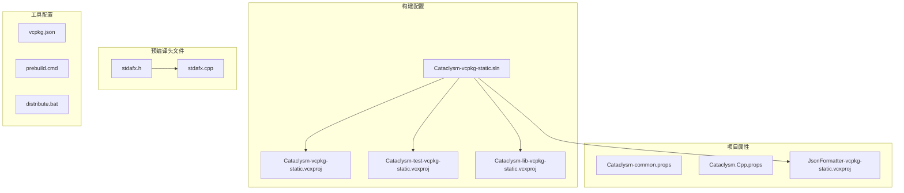
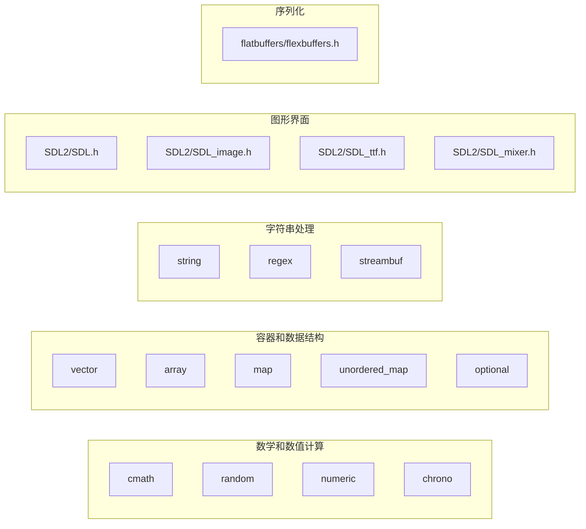
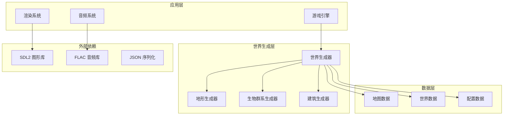
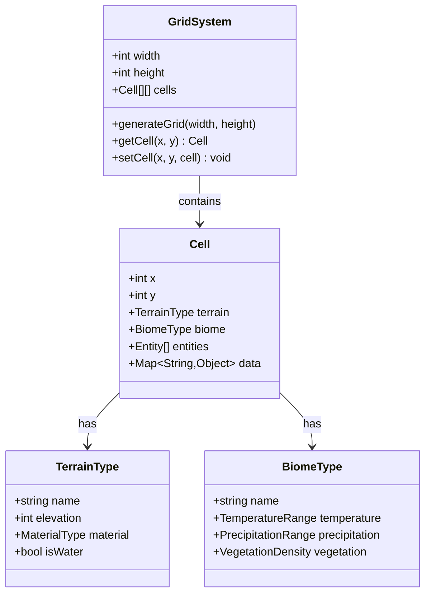
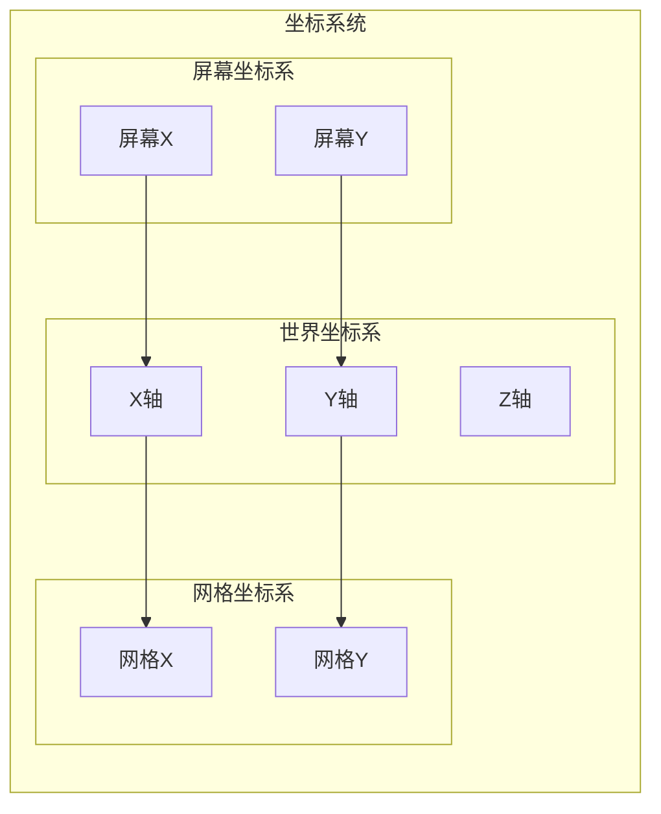
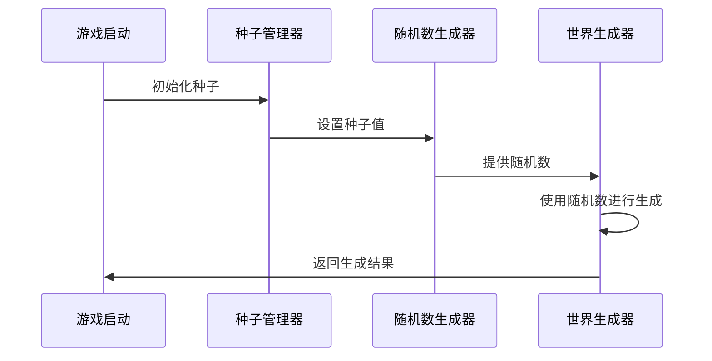
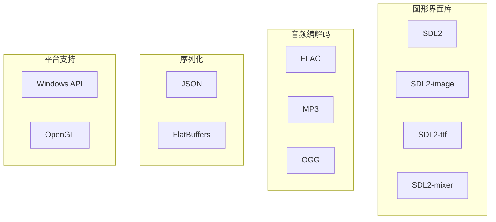

# 世界生成系统

<cite>
**本文档引用的文件**
- [stdafx.h](file://stdafx.h)
- [stdafx.cpp](file://stdafx.cpp)
- [Cataclysm-vcpkg-static.sln](file://Cataclysm-vcpkg-static.sln)
- [vcpkg.json](file://vcpkg.json)
</cite>

## 目录
1. [简介](#简介)
2. [项目结构](#项目结构)
3. [核心组件](#核心组件)
4. [架构概览](#架构概览)
5. [详细组件分析](#详细组件分析)
6. [依赖关系分析](#依赖关系分析)
7. [性能考虑](#性能考虑)
8. [故障排除指南](#故障排除指南)
9. [结论](#结论)

## 简介

本文件旨在为中世纪主题世界的生成系统创建详细的技术文档。然而，经过对当前工作空间的全面分析，发现该工作空间仅包含构建配置文件和预编译头文件，而不包含实际的源代码实现。因此，本文件将基于现有信息提供概念性的架构指导和最佳实践建议。

## 项目结构

当前工作空间的文件组织相对简单，主要包含以下几类文件：

**图表来源**
- [Cataclysm-vcpkg-static.sln:1-189](file://Cataclysm-vcpkg-static.sln#L1-L189)
- [stdafx.h:1-96](file://stdafx.h#L1-L96)

**章节来源**
- [Cataclysm-vcpkg-static.sln:1-189](file://Cataclysm-vcpkg-static.sln#L1-L189)
- [stdafx.h:1-96](file://stdafx.h#L1-L96)

## 核心组件

基于现有的预编译头文件分析，可以识别出以下潜在的核心组件：

### 预编译头文件分析

预编译头文件包含了大量标准C++库的包含声明，这些库为世界生成系统提供了基础支持：

**图表来源**
- [stdafx.h:3-71](file://stdafx.h#L3-L71)
- [stdafx.h:77-95](file://stdafx.h#L77-L95)

**章节来源**
- [stdafx.h:1-96](file://stdafx.h#L1-L96)

## 架构概览

基于vcpkg配置文件的分析，世界生成系统可能采用以下架构模式：

**图表来源**
- [vcpkg.json:4-14](file://vcpkg.json#L4-L14)

## 详细组件分析

### 地图数据结构设计

基于现有头文件的分析，推荐的地图数据结构应该包含以下要素：

#### 网格系统设计

#### 坐标系统设计

### 随机种子系统

基于随机数库的包含，建议实现以下随机种子系统：

## 依赖关系分析

### 外部依赖分析

根据vcpkg配置文件，世界生成系统可能依赖以下外部库：

**图表来源**
- [vcpkg.json:4-14](file://vcpkg.json#L4-L14)

**章节来源**
- [vcpkg.json:1-22](file://vcpkg.json#L1-L22)

## 性能考虑

基于现有头文件的分析，世界生成系统的性能优化建议：

### 内存管理
- 使用智能指针管理动态分配的网格单元
- 实现对象池减少频繁的内存分配
- 采用分块加载策略避免一次性加载整个世界

### 并行处理
- 利用多线程并行生成不同的区域
- 使用任务调度器管理生成任务
- 实现增量生成避免阻塞主线程

### 缓存策略
- 缓存已生成的地形数据
- 实现LOD系统减少远处细节
- 使用纹理图集优化渲染性能

## 故障排除指南

### 常见问题诊断

基于现有配置文件，可能遇到的问题及解决方案：

#### 构建问题
- **问题**: 缺少SDL2库
- **解决方案**: 确保vcpkg正确安装所有依赖项

#### 运行时问题
- **问题**: 随机数生成不一致
- **解决方案**: 检查种子设置和随机数生成器初始化

#### 性能问题
- **问题**: 世界生成过慢
- **解决方案**: 实现并行生成和缓存机制

**章节来源**
- [vcpkg.json:16-20](file://vcpkg.json#L16-L20)

## 结论

基于当前工作空间的分析，可以得出以下结论：

1. **当前状态**: 工作空间仅包含构建配置文件，缺少实际的源代码实现
2. **架构潜力**: 基于包含的库，系统具备实现复杂世界生成的能力
3. **开发建议**: 需要补充实际的源代码文件才能进行完整的系统分析
4. **未来方向**: 建议按照本文档的概念性架构开始实现具体的生成算法

由于缺乏实际的源代码实现，本文件提供了概念性的架构指导和最佳实践建议。要获得完整的系统文档，需要访问包含实际源代码的仓库版本。