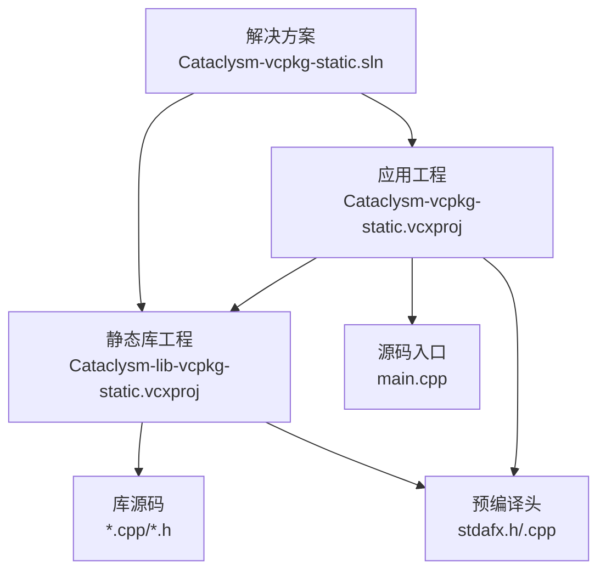
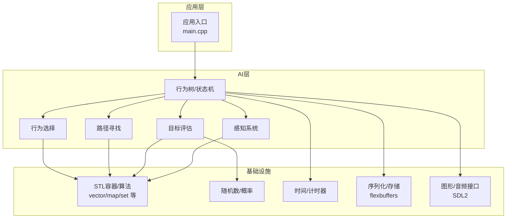
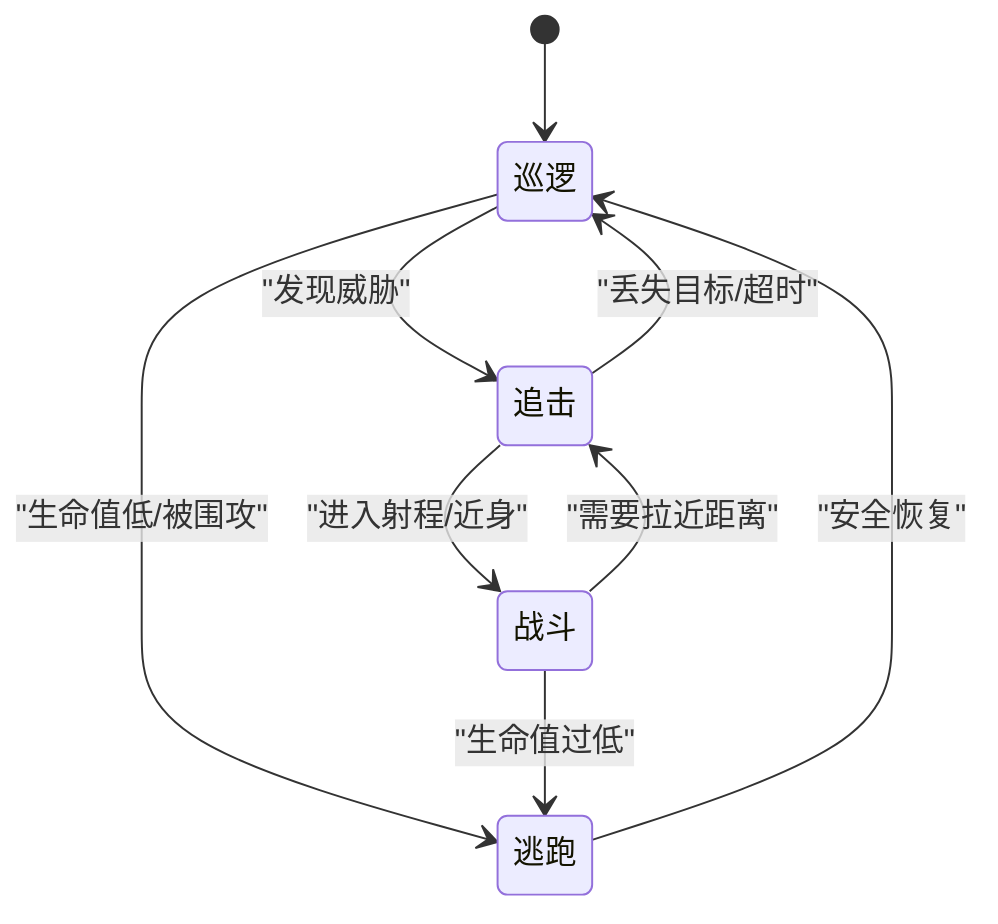
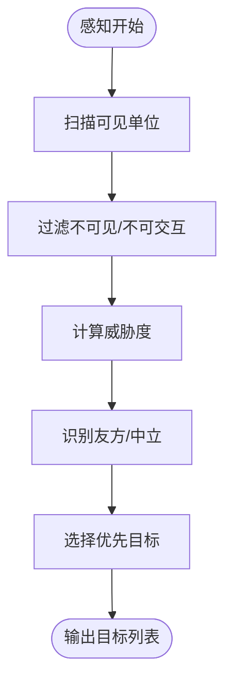
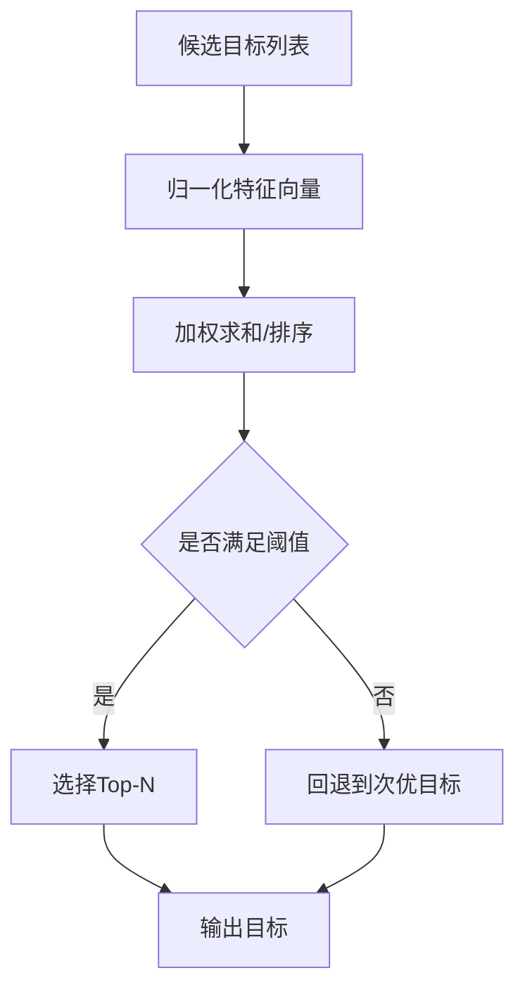
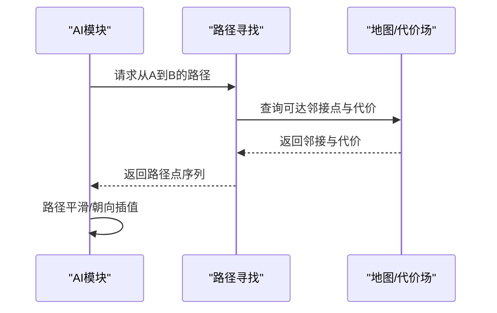
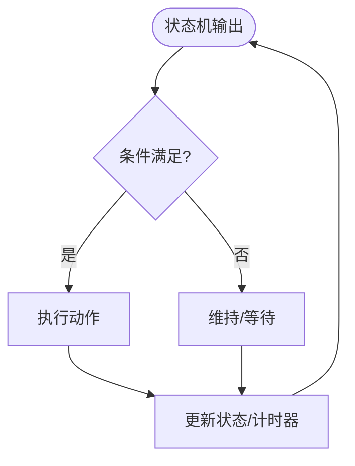
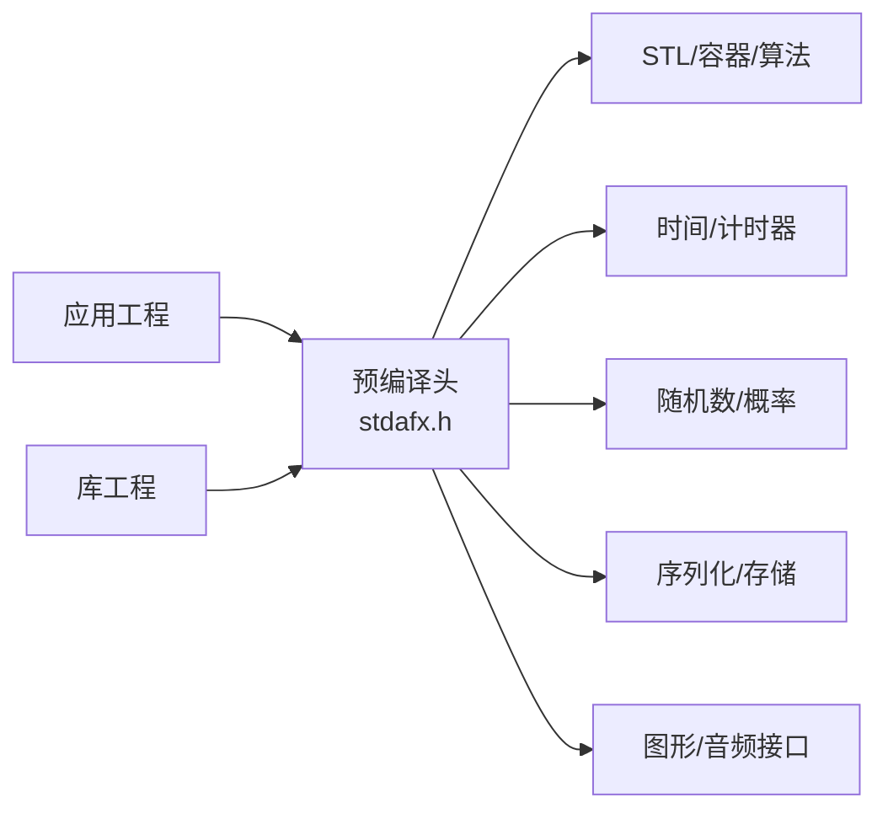

# 人工智能系统

<cite>
**本文引用的文件**
- [Cataclysm-vcpkg-static.vcxproj](file://Cataclysm-vcpkg-static.vcxproj)
- [Cataclysm-lib-vcpkg-static.vcxproj](file://Cataclysm-lib-vcpkg-static.vcxproj)
- [Cataclysm-vcpkg-static.sln](file://Cataclysm-vcpkg-static.sln)
- [stdafx.h](file://stdafx.h)
- [stdafx.cpp](file://stdafx.cpp)
</cite>

## 目录
1. [引言](#引言)
2. [项目结构](#项目结构)
3. [核心组件](#核心组件)
4. [架构总览](#架构总览)
5. [详细组件分析](#详细组件分析)
6. [依赖关系分析](#依赖关系分析)
7. [性能考虑](#性能考虑)
8. [故障排查指南](#故障排查指南)
9. [结论](#结论)
10. [附录](#附录)

## 引言
本文件面向“人工智能系统”的设计与实现，聚焦于游戏中各类生物的AI行为树与状态机，涵盖玩家AI、敌对生物AI、中立生物AI的策略差异；阐述感知系统、目标评估、路径寻找与行为选择机制；并给出AI状态机设计要点（巡逻、追击、逃跑、战斗等状态转换）、行为调优指南（难度平衡、行为合理性）以及性能优化与内存管理策略。  
鉴于当前仓库仅包含构建配置与预编译头文件，本文在缺乏具体源码的情况下，仍以项目结构为依据，结合常见游戏AI实践，提供可落地的设计与实施建议，并标注所有直接引用的文件来源。

## 项目结构
该仓库为Cataclysm Medieval项目的Visual Studio工程集合，包含应用工程与静态库工程，二者均指向同一套源代码目录（通过相对路径引用），并启用vcpkg进行依赖管理。构建配置展示了多平台、多配置的编译选项，同时启用了TILES宏与SDL相关组件支持。

**图表来源**
- [Cataclysm-vcpkg-static.vcxproj:221-224](file://Cataclysm-vcpkg-static.vcxproj#L221-L224)
- [Cataclysm-lib-vcpkg-static.vcxproj:175-180](file://Cataclysm-lib-vcpkg-static.vcxproj#L175-L180)
- [Cataclysm-vcpkg-static.sln:49-110](file://Cataclysm-vcpkg-static.sln#L49-L110)

**章节来源**
- [Cataclysm-vcpkg-static.vcxproj:218-235](file://Cataclysm-vcpkg-static.vcxproj#L218-L235)
- [Cataclysm-lib-vcpkg-static.vcxproj:175-191](file://Cataclysm-lib-vcpkg-static.vcxproj#L175-L191)
- [Cataclysm-vcpkg-static.sln:49-110](file://Cataclysm-vcpkg-static.sln#L49-L110)

## 核心组件
围绕AI系统，建议在现有工程基础上划分以下核心模块（概念性说明，便于后续落地实现）：
- AI行为树与状态机：定义巡逻、追击、逃跑、战斗等状态及状态间转换条件
- 感知系统：视野、听觉、威胁检测、友军识别
- 目标评估：威胁度、距离、价值、优先级排序
- 路径寻找：A*或Dijkstra，避障与动态路径重规划
- 行为选择：基于权重的目标选择与动作执行
- 性能与内存：对象池、帧级更新节流、缓存热点数据

上述模块与工程的预编译头文件存在天然耦合点：预编译头集中包含STL容器、时间工具、随机数、flatbuffers等，为AI模块的数据结构与通用算法提供基础支撑。

**章节来源**
- [stdafx.h:1-95](file://stdafx.h#L1-L95)
- [stdafx.cpp:1](file://stdafx.cpp#L1)

## 架构总览
下图展示AI系统在工程中的位置与交互关系（概念性示意）：

**图表来源**
- [Cataclysm-vcpkg-static.vcxproj:221-224](file://Cataclysm-vcpkg-static.vcxproj#L221-L224)
- [Cataclysm-lib-vcpkg-static.vcxproj:175-180](file://Cataclysm-lib-vcpkg-static.vcxproj#L175-L180)
- [stdafx.h:1-95](file://stdafx.h#L1-L95)

## 详细组件分析

### AI行为树与状态机
- 状态定义
  - 巡逻：沿预设路径或区域游走，周期性检查威胁
  - 追击：锁定目标后移动至射程内或最佳射击位
  - 逃跑：当生命值低于阈值或被围攻时向安全区移动
  - 战斗：近战/远程切换，根据弹药/耐力与距离选择攻击或撤退
- 状态转换
  - 威胁感知 → 追击/逃跑
  - 行动结果反馈 → 回到巡逻或继续追击
  - 时间/事件触发 → 切换状态
- 权重与优先级
  - 威胁度、距离、伤害期望、生存概率共同决定下一动作

[此图为概念性流程图，无需图表来源]

### 感知系统
- 视野与遮挡：基于FOV与射线检测，剔除不可见目标
- 听觉：枪声、碰撞声传播，影响敌对与逃跑倾向
- 威胁检测：基于武器伤害、弹药、技能冷却与历史交战记录
- 友军识别：阵营/派系判定，避免误伤

[此图为概念性流程图，无需图表来源]

### 目标评估
- 评估因子
  - 距离衰减、威胁系数、存活概率、资源价值
- 排序策略
  - 归一化加权求和，或基于优先队列的贪心选择
- 动态调整
  - 随难度变化调整权重，随环境变化更新阈值

[此图为概念性流程图，无需图表来源]

### 路径寻找
- 寻路算法：A*或Dijkstra，支持动态障碍与代价场
- 重规划：每帧或按需重算，避免静态路径导致拥堵
- 平滑：路径点平滑与朝向插值，提升移动自然度

[此图为概念性序列图，无需图表来源]

### 行为选择机制
- 条件分支：基于状态机与感知结果的条件判断
- 动作执行：移动、攻击、使用道具、呼叫支援
- 复合行为：组合多个动作形成连招或战术序列

[此图为概念性流程图，无需图表来源]

## 依赖关系分析
- 预编译头集中引入STL、时间、随机、flatbuffers与SDL等，为AI模块提供通用能力
- 应用工程与库工程共享同一套源码目录，AI实现可放置于库工程中以便复用
- vcpkg启用静态链接与自动链接，减少运行时依赖，有利于AI模块的独立部署

**图表来源**
- [stdafx.h:1-95](file://stdafx.h#L1-L95)
- [Cataclysm-vcpkg-static.vcxproj:218-235](file://Cataclysm-vcpkg-static.vcxproj#L218-L235)
- [Cataclysm-lib-vcpkg-static.vcxproj:175-191](file://Cataclysm-lib-vcpkg-static.vcxproj#L175-L191)

**章节来源**
- [stdafx.h:1-95](file://stdafx.h#L1-L95)
- [Cataclysm-vcpkg-static.vcxproj:218-235](file://Cataclysm-vcpkg-static.vcxproj#L218-L235)
- [Cataclysm-lib-vcpkg-static.vcxproj:175-191](file://Cataclysm-lib-vcpkg-static.vcxproj#L175-L191)

## 性能考虑
- 更新频率控制
  - 每帧仅处理部分AI实体，采用分批/时间片策略
  - 对远距离或低威胁目标降低更新频率
- 数据结构优化
  - 使用紧凑数组/对象池减少分配与碎片
  - 缓存热点数据（如最近目标、上一次路径）以避免重复计算
- 寻路与感知
  - 将寻路结果缓存到短生命周期内，避免每帧重算
  - 感知范围分级：大范围粗筛、小范围精筛
- 内存管理
  - 行为树节点池化，避免频繁构造/析构
  - 使用扁平缓冲（flexbuffers）进行快速序列化/反序列化

[本节为通用指导，无需章节来源]

## 故障排查指南
- 行为异常
  - 检查状态转换条件与权重参数，确认是否存在竞态或条件遗漏
  - 使用日志记录关键事件（发现目标、丢失目标、路径失败）
- 性能问题
  - 统计每帧AI更新耗时，定位热点函数与重复计算
  - 审核寻路与感知范围，避免过度扫描
- 配置问题
  - 确认构建宏（如TILES）与SDL相关依赖已正确启用
  - 核对vcpkg安装与静态链接设置

[本节为通用指导，无需章节来源]

## 结论
本AI系统设计以行为树与状态机为核心，结合感知、评估、寻路与选择机制，形成可扩展、可调优的智能体框架。依托工程的预编译头与vcpkg依赖体系，可在保证性能的同时实现灵活的行为调优与难度平衡。建议在库工程中实现AI模块，并通过应用工程统一调度，确保跨平台与可维护性。

[本节为总结性内容，无需章节来源]

## 附录
- AI行为调优清单
  - 难度等级：调整威胁系数、射程偏好、撤退阈值
  - 行为合理性：增加“犹豫/观察”冷却，避免无脑冲锋
  - 性能基线：设定每帧最大AI更新数量与超时阈值
- 参考实现路径
  - 行为树节点：[Cataclysm-lib-vcpkg-static.vcxproj:175-180](file://Cataclysm-lib-vcpkg-static.vcxproj#L175-L180)
  - 应用入口与资源：[Cataclysm-vcpkg-static.vcxproj:221-224](file://Cataclysm-vcpkg-static.vcxproj#L221-L224)
  - 预编译头与依赖：[stdafx.h:1-95](file://stdafx.h#L1-L95)

**章节来源**
- [Cataclysm-lib-vcpkg-static.vcxproj:175-180](file://Cataclysm-lib-vcpkg-static.vcxproj#L175-L180)
- [Cataclysm-vcpkg-static.vcxproj:221-224](file://Cataclysm-vcpkg-static.vcxproj#L221-L224)
- [stdafx.h:1-95](file://stdafx.h#L1-L95)