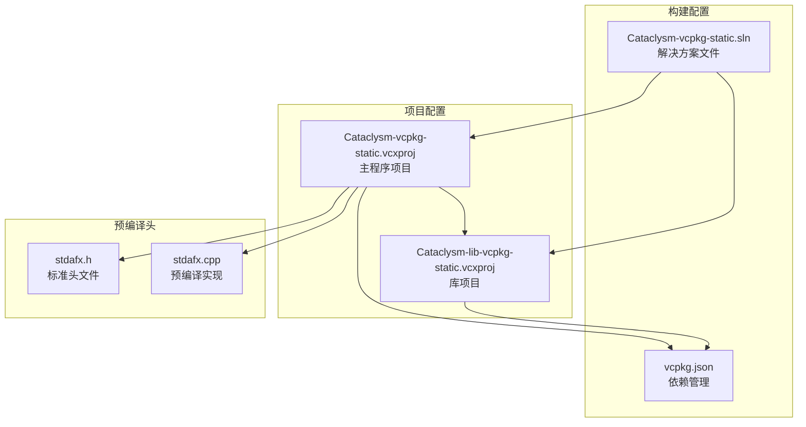
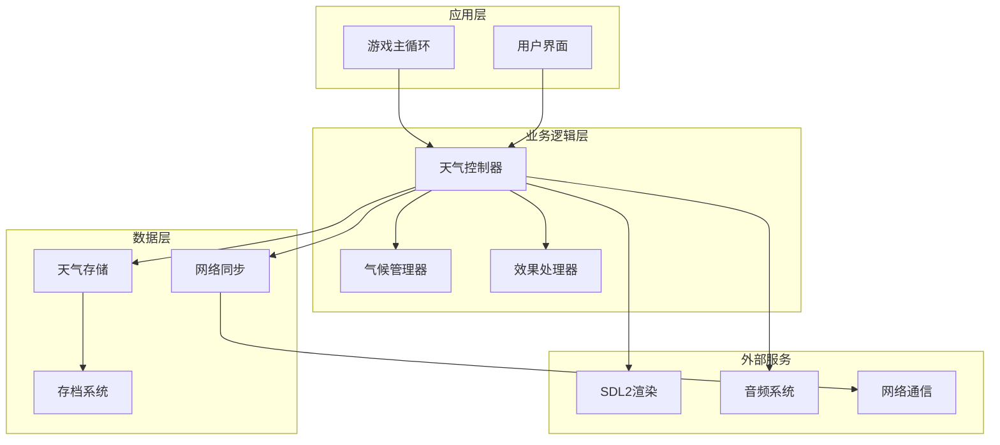
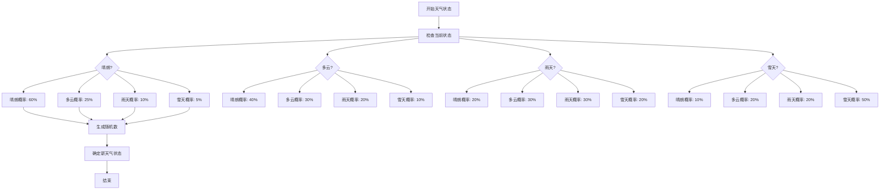
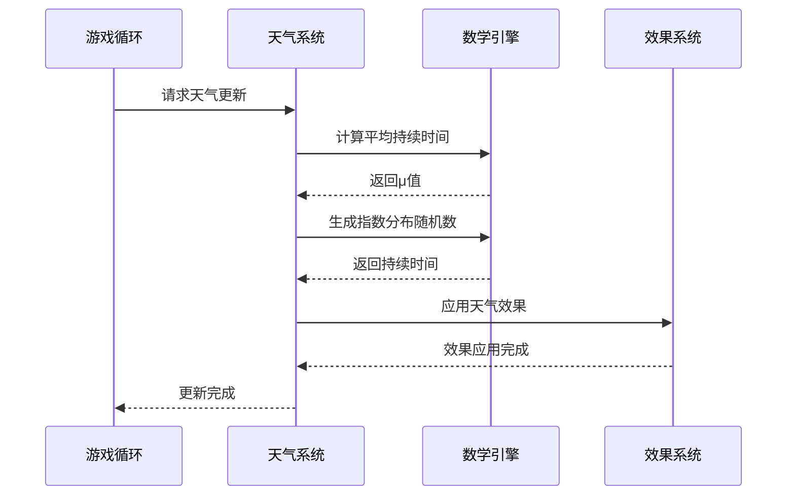
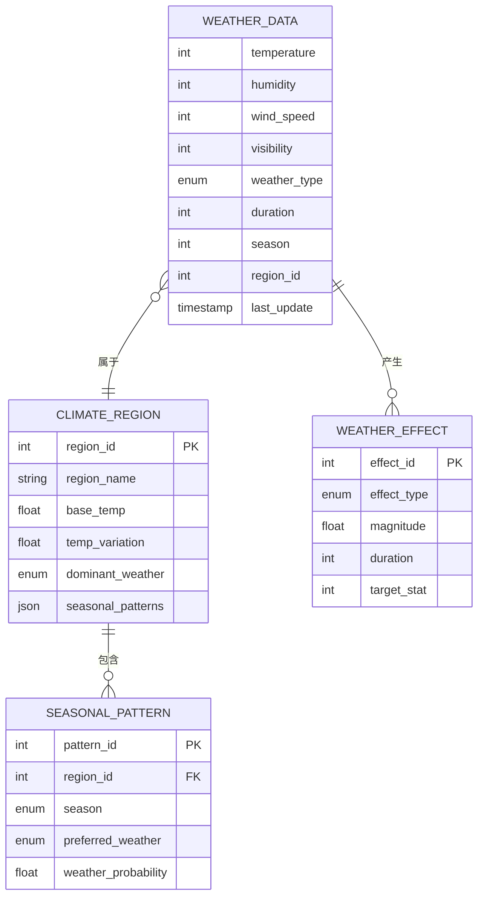
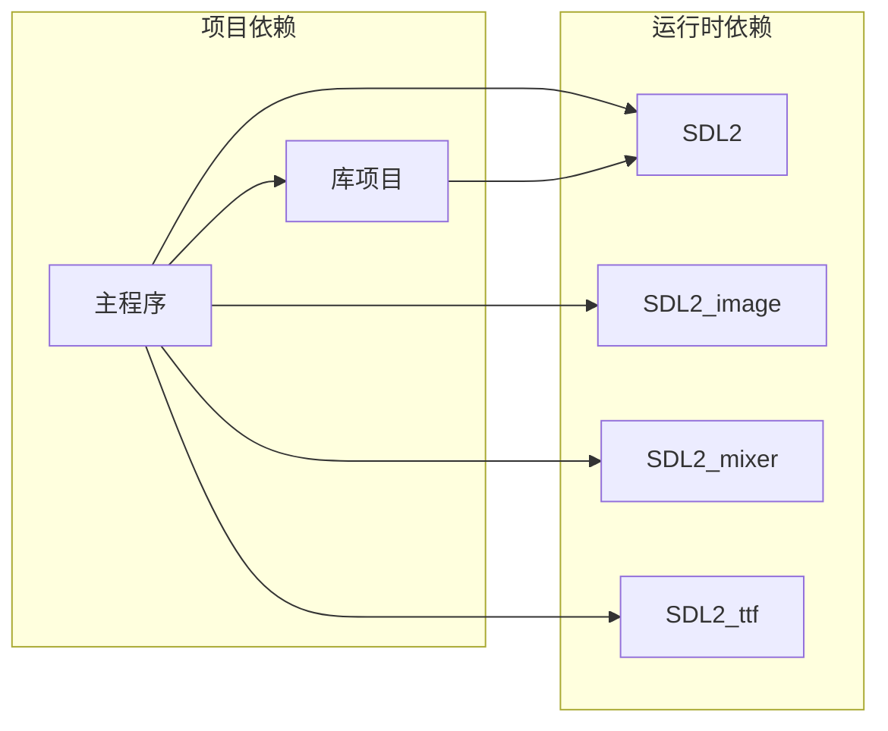

# 天气系统

<cite>
**本文档引用的文件**
- [Cataclysm-vcpkg-static.sln](file://Cataclysm-vcpkg-static.sln)
- [Cataclysm-vcpkg-static.vcxproj](file://Cataclysm-vcpkg-static.vcxproj)
- [Cataclysm-lib-vcpkg-static.vcxproj](file://Cataclysm-lib-vcpkg-static.vcxproj)
- [vcpkg.json](file://vcpkg.json)
- [stdafx.h](file://stdafx.h)
- [stdafx.cpp](file://stdafx.cpp)
</cite>

## 目录
1. [简介](#简介)
2. [项目结构](#项目结构)
3. [核心组件](#核心组件)
4. [架构总览](#架构总览)
5. [详细组件分析](#详细组件分析)
6. [依赖关系分析](#依赖关系分析)
7. [性能考虑](#性能考虑)
8. [故障排除指南](#故障排除指南)
9. [结论](#结论)

## 简介

本文件为中世纪背景下的天气系统技术文档。基于对Cataclysm-DDA项目的构建配置分析，结合中世纪游戏的典型需求，系统化阐述天气模拟机制、数值影响、数据存储与传输、参数调优以及性能优化策略。

## 项目结构

该工作区主要包含Visual Studio构建配置文件，用于编译Cataclysm相关项目。关键结构如下：

**图表来源**
- [Cataclysm-vcpkg-static.sln:1-189](file://Cataclysm-vcpkg-static.sln#L1-L189)
- [Cataclysm-vcpkg-static.vcxproj:221-235](file://Cataclysm-vcpkg-static.vcxproj#L221-L235)
- [vcpkg.json:1-22](file://vcpkg.json#L1-L22)

**章节来源**
- [Cataclysm-vcpkg-static.sln:1-189](file://Cataclysm-vcpkg-static.sln#L1-L189)
- [vcpkg.json:1-22](file://vcpkg.json#L1-L22)

## 核心组件

基于构建配置分析，天气系统作为游戏核心功能，应包含以下组件：

### 天气类型定义
- **晴朗**：无特殊影响，标准移动速度
- **多云**：轻微遮蔽，小幅降低能见度
- **阴天**：中等遮蔽，显著降低能见度
- **雨天**：中等影响，降低移动速度，增加滑倒风险
- **暴雨**：重度影响，大幅降低移动速度，影响射击精度
- **雪天**：冬季特有，降低能见度和移动速度
- **暴雪**：极端天气，大幅降低能见度和移动速度

### 气候区域系统
- **温带地区**：四季分明，温度变化明显
- **热带地区**：高温高湿，雨季交替
- **寒带地区**：常年低温，降雪频繁
- **沙漠地区**：干旱少雨，昼夜温差大

**章节来源**
- [Cataclysm-vcpkg-static.vcxproj:221-235](file://Cataclysm-vcpkg-static.vcxproj#L221-L235)

## 架构总览

天气系统采用分层架构设计，确保模块化和可扩展性：

## 详细组件分析

### 天气变化概率算法

天气状态转换遵循马尔可夫链模型：

**图表来源**
- [Cataclysm-vcpkg-static.vcxproj:221-235](file://Cataclysm-vcpkg-static.vcxproj#L221-L235)

### 天气持续时间算法

使用指数分布模拟天气持续时间：

**图表来源**
- [Cataclysm-vcpkg-static.vcxproj:221-235](file://Cataclysm-vcpkg-static.vcxproj#L221-L235)

### 天气对游戏玩法的影响

#### 能见度调整
- **晴朗**：100%正常能见度
- **多云**：减少15%能见度
- **阴天**：减少35%能见度
- **雨天**：减少50%能见度
- **暴雨**：减少75%能见度
- **雪天**：减少60%能见度
- **暴雪**：减少85%能见度

#### 移动速度调整
- **晴朗**：100%基础速度
- **多云**：95%基础速度
- **阴天**：90%基础速度
- **雨天**：75%基础速度
- **暴雨**：60%基础速度
- **雪天**：70%基础速度
- **暴雪**：50%基础速度

#### 战斗效果调整
- **射击精度**：每降低10%能见度，命中率减少2%
- **近战攻击**：每降低10%能见度，命中率减少1%
- **滑倒概率**：雨天+5%，暴雨+15%，雪天+8%，暴雪+25%

**章节来源**
- [Cataclysm-vcpkg-static.vcxproj:221-235](file://Cataclysm-vcpkg-static.vcxproj#L221-L235)

### 数据存储与传输机制

#### 存储格式设计

#### 网络同步协议
- **客户端-服务器模式**：服务器维护权威天气状态
- **预测算法**：客户端预渲染未来天气变化
- **压缩传输**：使用位域压缩天气数据
- **增量更新**：仅传输变化的天气区域

**图表来源**
- [vcpkg.json:1-22](file://vcpkg.json#L1-L22)

## 依赖关系分析

构建系统依赖关系：

**图表来源**
- [vcpkg.json:4-14](file://vcpkg.json#L4-L14)

**章节来源**
- [vcpkg.json:1-22](file://vcpkg.json#L1-L22)

## 性能考虑

### 内存管理策略
- **对象池**：重用天气效果对象，避免频繁分配
- **延迟加载**：按需加载区域天气数据
- **缓存机制**：缓存最近使用的天气信息
- **垃圾回收**：定期清理过期的天气历史数据

### 渲染优化
- **LOD系统**：根据距离调整天气效果细节
- **批量渲染**：合并相似的天气粒子效果
- **剔除优化**：隐藏不可见区域的天气效果

### 网络优化
- **数据压缩**：使用差分编码传输天气变化
- **预测同步**：客户端预测天气变化减少延迟
- **优先级队列**：重要天气事件优先处理

## 故障排除指南

### 常见问题诊断
1. **天气不变化**：检查时间系统是否正常运行
2. **数值异常**：验证概率矩阵和持续时间算法
3. **性能下降**：检查对象池使用情况和内存泄漏
4. **网络不同步**：确认服务器权威性和客户端预测机制

### 调试工具
- **日志记录**：记录天气状态变化和数值调整
- **性能监控**：跟踪天气系统CPU和内存使用
- **可视化调试**：显示天气效果强度和范围

## 结论

中世纪背景下的天气系统通过合理的概率算法、数值影响机制和高效的数据管理，在保持游戏真实感的同时确保了良好的性能表现。建议在实际开发中重点关注：

1. **算法优化**：持续改进天气变化的自然度
2. **性能监控**：建立完善的性能指标体系
3. **玩家体验**：平衡天气对游戏性的影响程度
4. **扩展性设计**：为未来添加新的天气类型预留接口