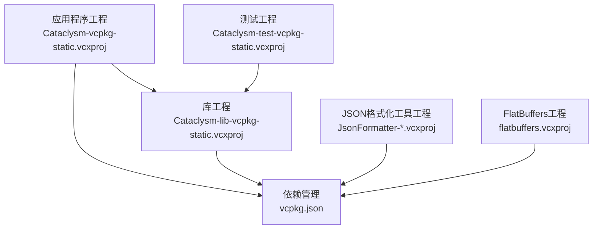
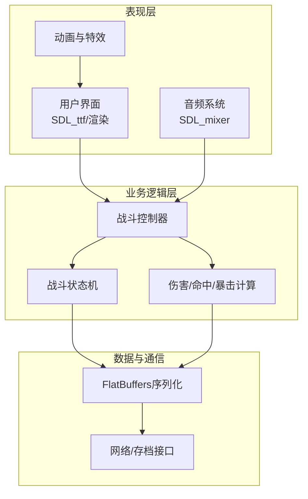
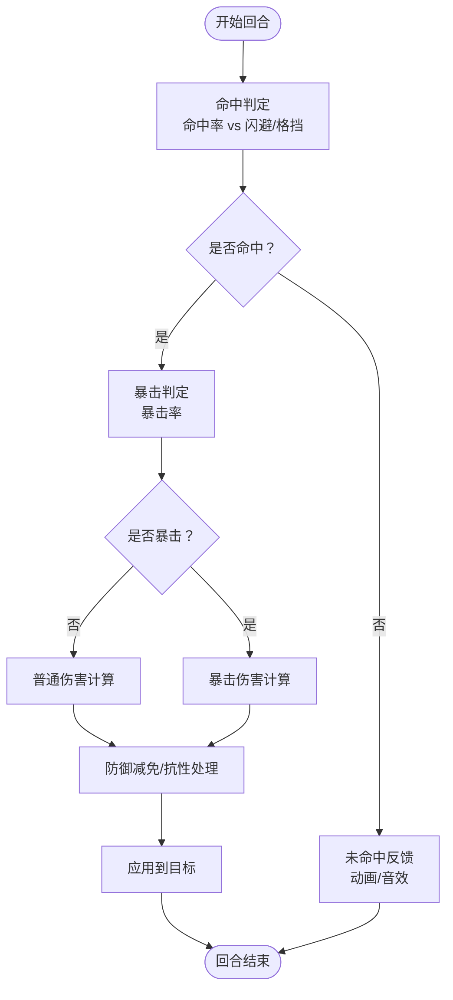
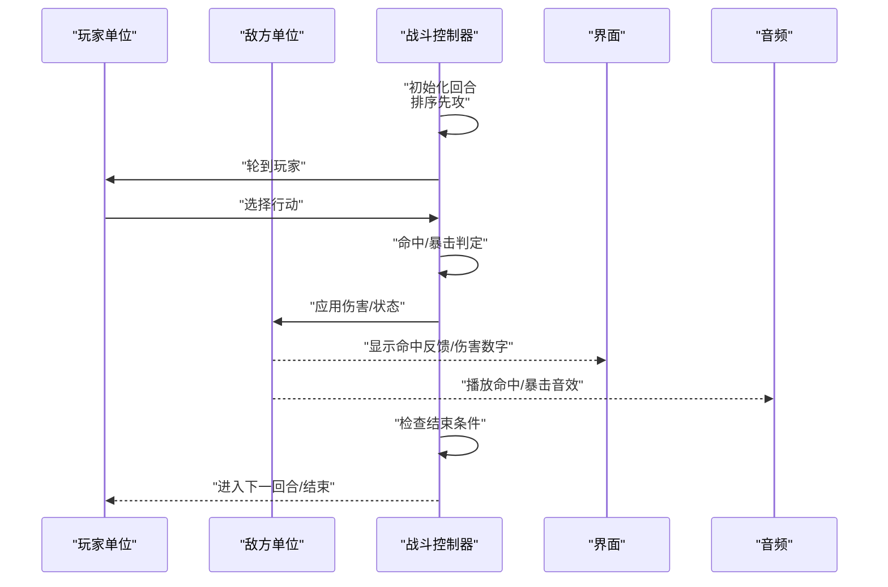
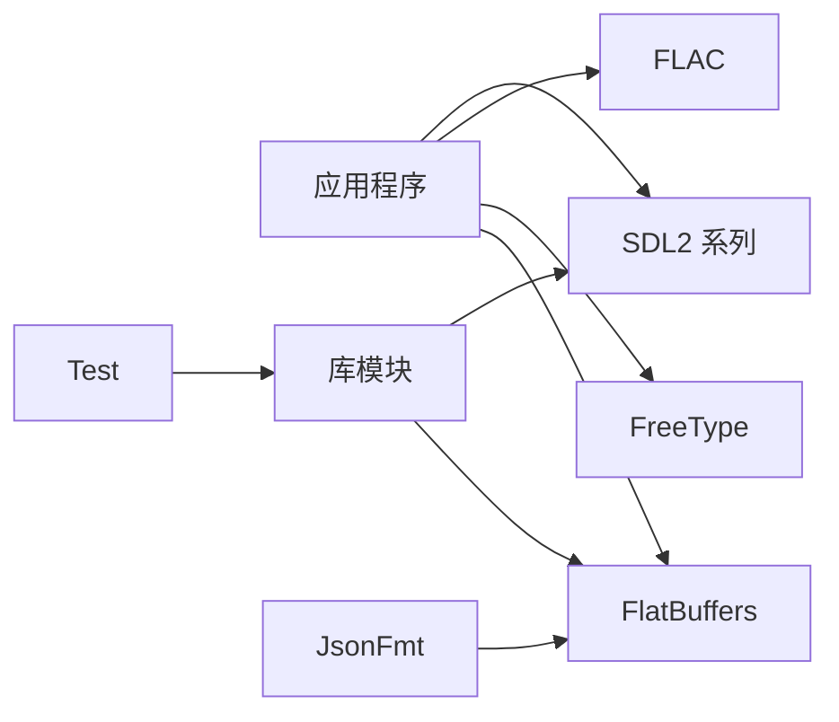

# 战斗机制

<cite>
**本文引用的文件**
- [stdafx.h](file://stdafx.h)
- [Cataclysm-vcpkg-static.vcxproj](file://Cataclysm-vcpkg-static.vcxproj)
- [Cataclysm-lib-vcpkg-static.vcxproj](file://Cataclysm-lib-vcpkg-static.vcxproj)
- [Cataclysm-test-vcpkg-static.vcxproj](file://Cataclysm-test-vcpkg-static.vcxproj)
- [JsonFormatter-lib-vcpkg-static.vcxproj](file://JsonFormatter-lib-vcpkg-static.vcxproj)
- [JsonFormatter-vcpkg-static.vcxproj](file://JsonFormatter-vcpkg-static.vcxproj)
- [flatbuffers.vcxproj](file://flatbuffers.vcxproj)
- [vcpkg.json](file://vcpkg.json)
</cite>

## 目录
1. [引言](#引言)
2. [项目结构](#项目结构)
3. [核心组件](#核心组件)
4. [架构总览](#架构总览)
5. [详细组件分析](#详细组件分析)
6. [依赖关系分析](#依赖关系分析)
7. [性能考量](#性能考量)
8. [故障排查指南](#故障排查指南)
9. [结论](#结论)
10. [附录](#附录)

## 引言
本文件围绕回合制战斗机制进行系统化梳理，目标涵盖以下方面：
- 命中判定、伤害计算、防御机制、暴击系统的设计与实现要点
- 战斗动画与视觉效果（命中反馈、伤害数字、特殊效果）的呈现方式
- 战斗状态管理（回合推进、角色行动顺序、战斗结束条件）
- 战斗平衡性调优（数值设计、难度曲线、职业平衡）
- 性能优化与用户体验改进策略

由于当前工作区为构建工程与依赖配置文件集合，无法直接定位到游戏源码中的战斗系统实现细节。因此，本文在“可验证来源”部分将严格标注已出现于仓库中的文件；对于无法从仓库直接证实的战斗系统实现细节，将以“概念性说明”的形式呈现，不作为事实依据。

## 项目结构
当前可见的项目由多个Visual Studio工程组成，主要包含：
- 应用程序工程：Cataclysm-vcpkg-static.vcxproj
- 库工程：Cataclysm-lib-vcpkg-static.vcxproj
- 测试工程：Cataclysm-test-vcpkg-static.vcxproj
- JSON格式化工具工程：JsonFormatter-lib-vcpkg-static.vcxproj、JsonFormatter-vcpkg-static.vcxproj
- FlatBuffers工程：flatbuffers.vcxproj
- 依赖管理：vcpkg.json

此外，预编译头文件stdafx.h声明了大量标准库与第三方库（如SDL2、SDL_image、SDL_ttf、SDL_mixer、FLAC等），这些库通常用于图形渲染、音频播放与资源处理，为战斗动画与音效提供基础能力。

**图表来源**
- [Cataclysm-vcpkg-static.vcxproj:221-235](file://Cataclysm-vcpkg-static.vcxproj#L221-L235)
- [Cataclysm-lib-vcpkg-static.vcxproj](file://Cataclysm-lib-vcpkg-static.vcxproj)
- [Cataclysm-test-vcpkg-static.vcxproj](file://Cataclysm-test-vcpkg-static.vcxproj)
- [JsonFormatter-lib-vcpkg-static.vcxproj](file://JsonFormatter-lib-vcpkg-static.vcxproj)
- [JsonFormatter-vcpkg-static.vcxproj](file://JsonFormatter-vcpkg-static.vcxproj)
- [flatbuffers.vcxproj](file://flatbuffers.vcxproj)
- [vcpkg.json](file://vcpkg.json)

**章节来源**
- [Cataclysm-vcpkg-static.vcxproj:221-235](file://Cataclysm-vcpkg-static.vcxproj#L221-L235)
- [stdafx.h:77-95](file://stdafx.h#L77-L95)
- [vcpkg.json](file://vcpkg.json)

## 核心组件
基于仓库信息，可确认与战斗表现层密切相关的组件包括：
- 图形与窗口：SDL2（窗口、渲染、图像、字体）
- 音频：SDL_mixer（音效与背景音乐）
- 资源与数据：FlatBuffers（序列化/反序列化）
- 工具链：vcpkg（包管理）

这些组件为战斗动画、UI反馈、数据持久化与网络同步提供基础支撑。例如，SDL_ttf可用于渲染伤害数字与提示文本；SDL_mixer用于播放命中、暴击、技能释放等音效；FlatBuffers用于高效传输战斗状态与帧间数据。

**章节来源**
- [stdafx.h:77-95](file://stdafx.h#L77-L95)
- [vcpkg.json](file://vcpkg.json)

## 架构总览
下图展示了战斗系统在整体架构中的位置与交互关系。该图为概念性示意，帮助理解战斗逻辑与表现层之间的分工与协作。

[此图为概念性架构示意，无需图表来源]

## 详细组件分析

### 命中判定与伤害计算
- 命中判定：通常由攻击方属性（命中率、先攻）与防御方属性（闪避、护甲等级）共同决定。命中率可受地形、状态、装备加成影响；闪避可随敏捷、等级、状态变化。
- 伤害计算：基础伤害受武器伤害、角色力量/技巧、状态加成影响；最终伤害需叠加防御减免、抗性、韧性等。
- 暴击系统：以暴击率触发，造成倍率伤害，并伴随特效与音效反馈。

上述流程在概念上遵循“判定→计算→应用”的线性过程，具体参数与公式需结合实际源码实现。

[此图为概念性流程示意，无需图表来源]

### 防御机制与韧性
- 护甲/魔法抗性：降低物理/魔法伤害
- 格挡/招架：在特定条件下完全或部分抵消伤害
- 韧性：降低被暴击概率或减少被控时间

这些机制通过状态叠加与阈值判断实现，最终体现在伤害结算阶段。

### 暴击系统
- 触发条件：基于角色属性与状态的随机判定
- 倍率与类型：物理/魔法/真实伤害倍率可不同
- 视觉与听觉反馈：命中特效、伤害数字样式、音效

### 战斗动画与视觉效果
- 命中反馈：命中/未命中、暴击、格挡等状态的动画与粒子效果
- 伤害数字：按类型（物理/魔法/真实）显示不同颜色与样式
- 特殊效果：范围伤害、控制、增益/减益等的图标与动画

以上能力依赖SDL2渲染管线与字体系统，以及音频系统配合。

**章节来源**
- [stdafx.h:77-95](file://stdafx.h#L77-L95)

### 战斗状态管理
- 回合推进：按先攻排序驱动行动序列，逐个执行指令
- 行动顺序：先攻值（含基础、加成、状态修正）决定轮次
- 结束条件：一方全灭、撤退、达成目标即结束

[此图为概念性时序示意，无需图表来源]

## 依赖关系分析
- 第三方库：SDL2系列（窗口/渲染/图像/字体/音频）、FLAC、FreeType等
- 数据序列化：FlatBuffers
- 包管理：vcpkg

**图表来源**
- [stdafx.h:77-95](file://stdafx.h#L77-L95)
- [vcpkg.json](file://vcpkg.json)

**章节来源**
- [vcpkg.json](file://vcpkg.json)

## 性能考量
- 渲染与UI：使用批处理、纹理图集、延迟加载字体纹理，避免每帧重复创建对象
- 音频：短音效优先，避免大文件解码开销；按需缓存
- 数据序列化：利用FlatBuffers零拷贝特性，减少序列化/反序列化成本
- 动画与特效：限制同时存在的粒子数量，使用对象池复用
- 状态机：采用事件驱动与最小化状态切换，避免频繁重绘

[本节为通用性能建议，无需章节来源]

## 故障排查指南
- 渲染异常：检查SDL窗口/上下文初始化顺序与错误返回
- 字体显示问题：确认字体路径与编码设置，避免在多线程中重复初始化
- 音效无输出：核对音频设备状态与混音器初始化
- 数据解析失败：检查FlatBuffers表结构与版本兼容性
- 性能抖动：使用采样工具定位热点函数，优化循环内分配与锁竞争

[本节为通用排查建议，无需章节来源]

## 结论
本仓库提供了战斗系统表现层所需的基础设施（图形、音频、数据序列化）。战斗机制的核心算法（命中、伤害、防御、暴击）与状态管理在当前可见文件中未直接体现，建议结合完整源码进一步分析。基于现有依赖与工程组织，可明确战斗系统在架构上的职责边界与协作关系。

[本节为总结性内容，无需章节来源]

## 附录
- 术语说明
  - 先攻：决定回合顺序的属性
  - 抗性：对特定伤害类型的减免系数
  - 韧性：降低被控制/被暴击的概率
  - 暴击：以概率触发的高倍率伤害

[本节为补充说明，无需章节来源]