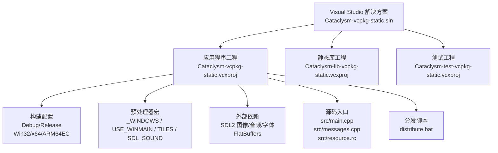
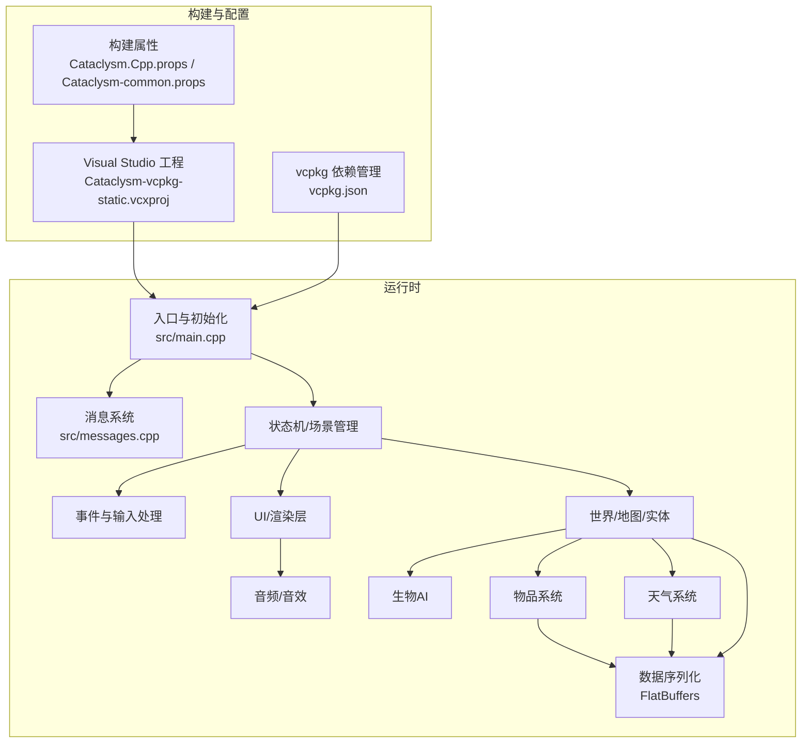
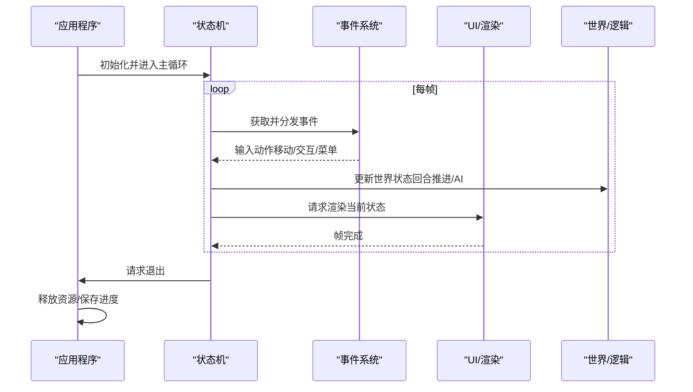
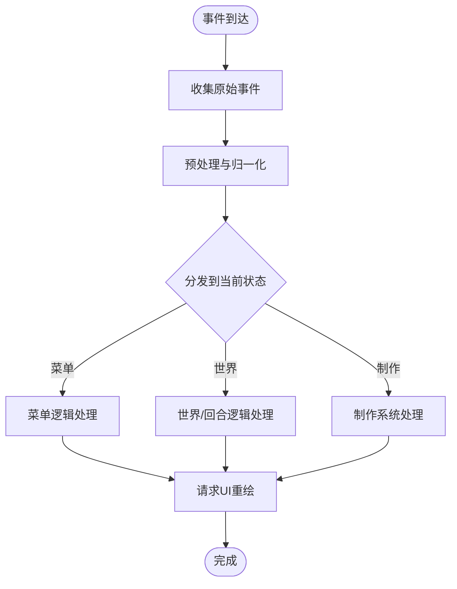
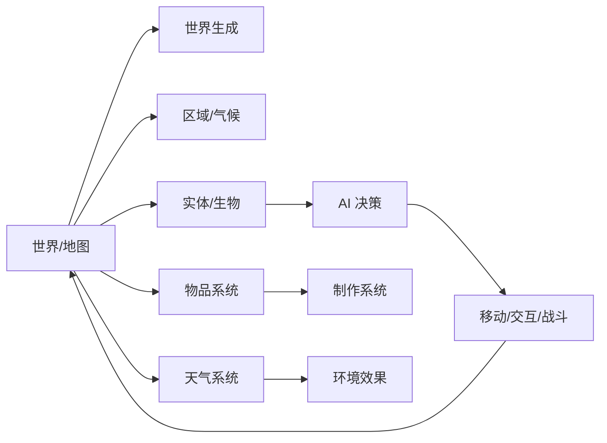
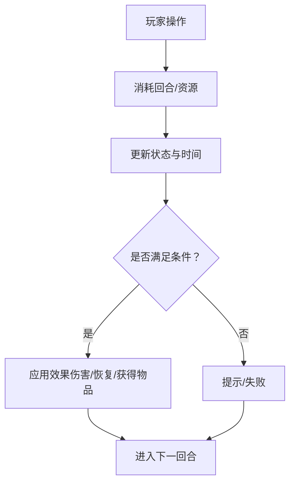
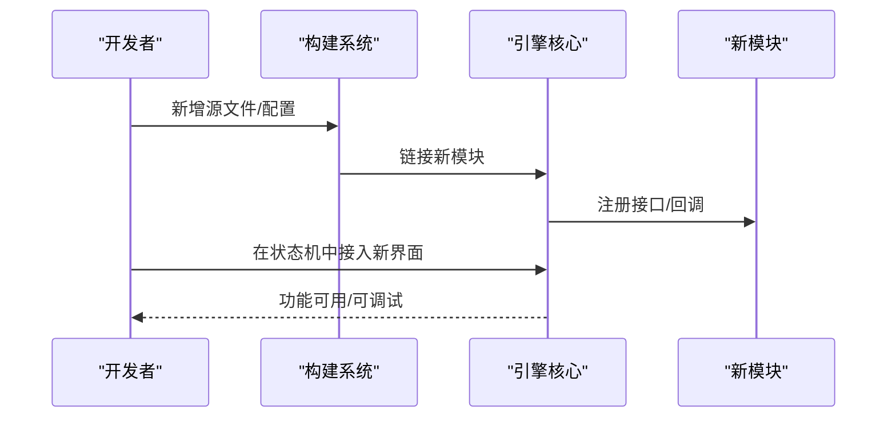
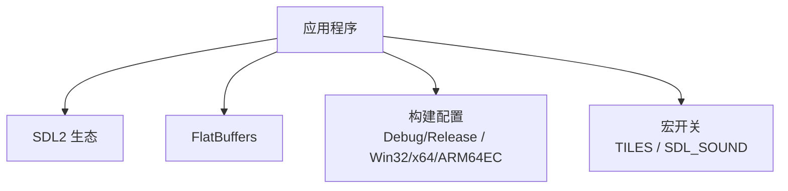

# 游戏引擎核心

<cite>
**本文引用的文件**
- [Cataclysm-vcpkg-static.vcxproj](file://Cataclysm-vcpkg-static.vcxproj)
- [vcpkg.json](file://vcpkg.json)
- [stdafx.h](file://stdafx.h)
- [distribute.bat](file://distribute.bat)
- [Cataclysm.Cpp.props](file://Cataclysm.Cpp.props)
- [Cataclysm-common.props](file://Cataclysm-common.props)
</cite>

## 目录
1. [引言](#引言)
2. [项目结构](#项目结构)
3. [核心组件](#核心组件)
4. [架构总览](#架构总览)
5. [详细组件分析](#详细组件分析)
6. [依赖关系分析](#依赖关系分析)
7. [性能考虑](#性能考虑)
8. [故障排查指南](#故障排查指南)
9. [结论](#结论)
10. [附录](#附录)

## 引言
本文件面向希望理解与扩展“Cataclysm-DDA 中世纪版本”游戏引擎的开发者，聚焦于引擎的模块化设计、运行时控制流（游戏循环、状态管理、事件处理）、以及对文本类生存玩法的支持（回合制、资源管理、制作系统）。由于当前工作区仅包含构建配置与少量入口文件，本文将基于现有工程文件与头文件信息，给出可落地的架构解读、扩展指南与性能建议，并通过图示帮助读者建立从构建到运行的整体认知。

## 项目结构
该仓库为 Windows 平台的 Visual Studio 解决方案，采用 vcpkg 管理外部依赖，主程序目标为可执行应用，同时包含静态库工程与测试工程。关键特征如下：
- 构建目标：应用程序（可执行），支持多配置（Debug/Release）与多平台（Win32/x64/ARM64EC），并可通过宏开关启用瓦片渲染或纯文本模式。
- 外部依赖：通过 vcpkg 集成 SDL2 生态（图像、音频、字体），并使用 FlatBuffers 进行数据序列化。
- 入口与编译项：主程序入口位于 src/main.cpp，消息相关逻辑位于 src/messages.cpp；资源脚本位于 src/resource.rc。
- 分发脚本：提供一键复制 DLL、数据、配置、图形与语言资源的分发流程。

图表来源
- [Cataclysm-vcpkg-static.vcxproj:1-236](file://Cataclysm-vcpkg-static.vcxproj#L1-L236)
- [vcpkg.json:1-22](file://vcpkg.json#L1-L22)
- [distribute.bat:1-10](file://distribute.bat#L1-L10)

章节来源
- [Cataclysm-vcpkg-static.vcxproj:1-236](file://Cataclysm-vcpkg-static.vcxproj#L1-L236)
- [vcpkg.json:1-22](file://vcpkg.json#L1-L22)
- [distribute.bat:1-10](file://distribute.bat#L1-L10)

## 核心组件
围绕引擎的运行时与模块化设计，可抽象出以下核心组件与职责边界：

- 应用程序入口与生命周期
  - 负责初始化平台与依赖（SDL、音频、字体、图像），加载配置与资源，进入主循环，处理事件与状态切换，最终退出清理。
  - 关键点：通过预处理器宏控制是否启用瓦片渲染与声音；不同构建配置影响运行时行为与优化级别。

- 消息与日志系统
  - 提供统一的消息输出与日志接口，便于调试与运行时反馈。
  - 与 UI 层解耦，支持文本与图形两种渲染路径。

- 状态机与场景管理
  - 维护游戏状态栈（如菜单、世界、战斗、制作界面等），负责状态切换、渲染与输入处理。
  - 支持回合并逐步推进的回合制机制。

- 事件与输入处理
  - 封装键盘、鼠标、触摸等输入事件，转换为高层动作（移动、交互、菜单导航）。
  - 与 UI 和世界逻辑解耦，遵循事件驱动模型。

- 数据与资源管理
  - 使用 FlatBuffers 存储与传输结构化数据，减少序列化开销。
  - 通过 vcpkg 管理第三方库，确保跨平台一致性。

- 扩展点与插件化
  - 通过模块化接口与配置文件，允许新增子系统（如新的天气、AI、制作配方）而不破坏既有架构。

章节来源
- [Cataclysm-vcpkg-static.vcxproj:159-235](file://Cataclysm-vcpkg-static.vcxproj#L159-L235)
- [stdafx.h:77-95](file://stdafx.h#L77-L95)

## 架构总览
下图展示了从构建到运行的关键路径，以及引擎各模块之间的协作关系。该图为概念性视图，用于帮助理解整体架构与扩展位置。

## 详细组件分析

### 游戏循环与状态管理
- 控制流
  - 初始化：加载配置、初始化渲染与音频、注册事件回调。
  - 主循环：按帧更新状态机，处理输入事件，渲染当前场景，维护帧率。
  - 退出：释放资源、保存进度、关闭窗口。
- 状态管理
  - 使用状态栈管理界面与玩法阶段（菜单、世界、战斗、制作、存档等）。
  - 回合制推进：每次有效操作后推进时间与回合，触发 AI 与环境更新。
- 输入与事件
  - 事件队列解耦输入与逻辑，支持热键、菜单导航与交互。
  - 与 UI 的交互通过事件桥接，避免直接耦合。

### 事件处理机制
- 事件类型
  - 键盘/鼠标/触摸输入事件。
  - 窗口事件（焦点、尺寸变化）。
  - 自定义业务事件（如“开始制作”、“打开背包”）。
- 处理流程
  - 事件收集 → 预处理（坐标转换、按键组合解析） → 分发到当前状态 → 状态根据上下文调用相应逻辑 → 可能触发 UI 更新或世界变更。

### 模块化设计与子系统
- 世界生成
  - 地图网格与房间/走廊布局，随机生成与约束校验。
  - 区域划分与连接性保证，避免玩家无法到达区域。
- 生物AI
  - 行为树或有限状态机，结合感知（视野、听觉、威胁）与决策（追击/逃跑/采集）。
  - 与回合制结合，每回合进行一次决策与移动。
- 物品系统
  - 物品类别与属性（耐久、重量、价值），堆叠规则与容器（背包/箱子）。
  - 制作配方与材料消耗，支持批量制作与快捷栏。
- 天气系统
  - 时间驱动的天气变化（晴/雨/雪/雾），影响可见度、温度与行动效率。
  - 与世界/生物/物品的交互（如湿滑地面、装备保暖）。

### 文本类生存玩法支持
- 回合制机制
  - 每次有效操作消耗时间与回合，AI 与环境按回合推进。
  - 支持“等待”、“快速行动”等策略性选项。
- 资源管理
  - 饥渴/口渴/睡眠/健康/体温等状态随时间与活动衰减或恢复。
  - 通过搜索、采集、狩猎、烹饪等方式补充资源。
- 制作系统
  - 基于配方表与工具/材料，逐步合成工具、武器、护甲与食物。
  - 支持学习与升级，解锁更复杂配方。

### 扩展指南：添加新功能模块
- 接入点
  - 在状态机中新增状态（如“新功能界面”），并在事件系统中注册对应处理函数。
  - 在世界/物品/天气等子系统中新增模块接口，保持与现有数据结构兼容。
- 数据层
  - 使用 FlatBuffers 定义新数据结构，确保向后兼容与零拷贝访问。
- 依赖与构建
  - 通过 vcpkg.json 添加新依赖，或在工程属性中配置头文件与库路径。
- 测试与集成
  - 编写单元测试与集成测试，覆盖边界条件与错误处理。
  - 使用分发脚本验证运行时资源完整性。

## 依赖关系分析
- 外部库
  - SDL2 生态：图像、音频、字体，提供跨平台渲染与媒体能力。
  - FlatBuffers：高效序列化，适合频繁读取的世界/物品数据。
- 构建配置
  - 不同配置（Debug/Release）与平台（Win32/x64/ARM64EC）影响优化级别与运行时特性。
  - 宏开关（如 TILES、SDL_SOUND）控制功能集与资源占用。

图表来源
- [vcpkg.json:1-22](file://vcpkg.json#L1-L22)
- [Cataclysm-vcpkg-static.vcxproj:159-235](file://Cataclysm-vcpkg-static.vcxproj#L159-L235)
- [stdafx.h:77-95](file://stdafx.h#L77-L95)

章节来源
- [vcpkg.json:1-22](file://vcpkg.json#L1-L22)
- [Cataclysm-vcpkg-static.vcxproj:159-235](file://Cataclysm-vcpkg-static.vcxproj#L159-L235)
- [stdafx.h:77-95](file://stdafx.h#L77-L95)

## 性能考虑
- 渲染与UI
  - 合理使用双缓冲与脏矩形更新，减少重绘范围。
  - 文本渲染优先使用缓存与批处理，避免逐字符绘制。
- 逻辑更新
  - 将昂贵计算（如路径查找、视野计算）限制在必要范围内，使用空间分区与可见性剔除。
  - 回合制天然降低更新频率，应充分利用此特性进行批量处理。
- 内存管理
  - 使用智能指针与 RAII 管理资源生命周期，避免泄漏。
  - 对频繁分配的数据结构（如实体列表、事件队列）采用对象池或内存池。
- 数据序列化
  - 使用 FlatBuffers 减少反序列化成本，避免深拷贝。
- 构建优化
  - Release 配置启用优化与链接时优化；Debug 配置保留调试符号与断言。
  - 针对目标平台选择合适的工具集与运行时库。

## 故障排查指南
- 构建问题
  - vcpkg 依赖未安装：检查 vcpkg.json 并执行安装流程；确认 overlay ports 路径正确。
  - 头文件/库路径错误：核对工程属性与 vcpkg triplet 设置。
- 运行时问题
  - 资源缺失：使用分发脚本验证 data/config/gfx/lang 是否完整复制。
  - 渲染异常：检查 TILES 宏与 SDL 初始化顺序；确认字体与图像库可用。
  - 性能抖动：开启帧率监控，定位热点函数；评估事件处理与渲染开销。
- 日志与调试
  - 使用消息系统输出关键路径日志，配合断点与性能分析器定位瓶颈。

章节来源
- [distribute.bat:1-10](file://distribute.bat#L1-L10)
- [Cataclysm-vcpkg-static.vcxproj:159-235](file://Cataclysm-vcpkg-static.vcxproj#L159-L235)
- [vcpkg.json:1-22](file://vcpkg.json#L1-L22)

## 结论
本工程以模块化为核心设计思想，通过清晰的状态机、事件驱动与数据序列化，为文本类生存玩法提供了稳定的基础。借助 vcpkg 管理的 SDL2 生态与 FlatBuffers，引擎在跨平台与性能之间取得平衡。遵循本文的扩展指南与性能建议，可在不破坏既有架构的前提下，持续增强世界生成、生物AI、物品系统与天气系统等核心子系统。

## 附录
- 构建与运行
  - 使用 Visual Studio 打开解决方案，选择目标配置与平台后构建。
  - 运行前确保分发脚本已复制所需资源至可执行目录。
- 开发约定
  - 新模块需提供最小可运行示例与回归测试。
  - 数据结构变更需向后兼容，使用版本字段或迁移脚本。