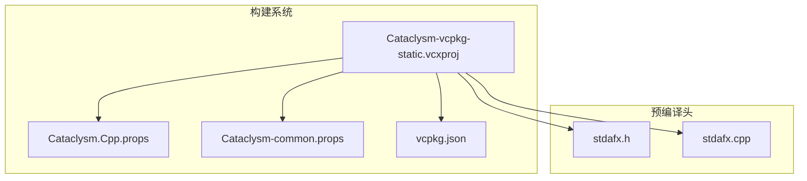
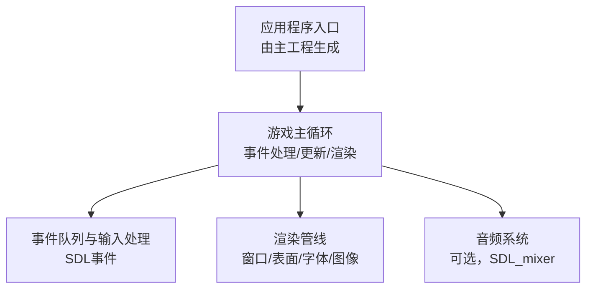
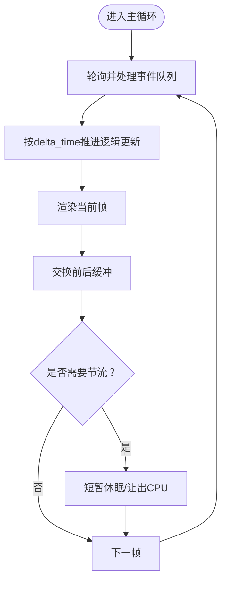
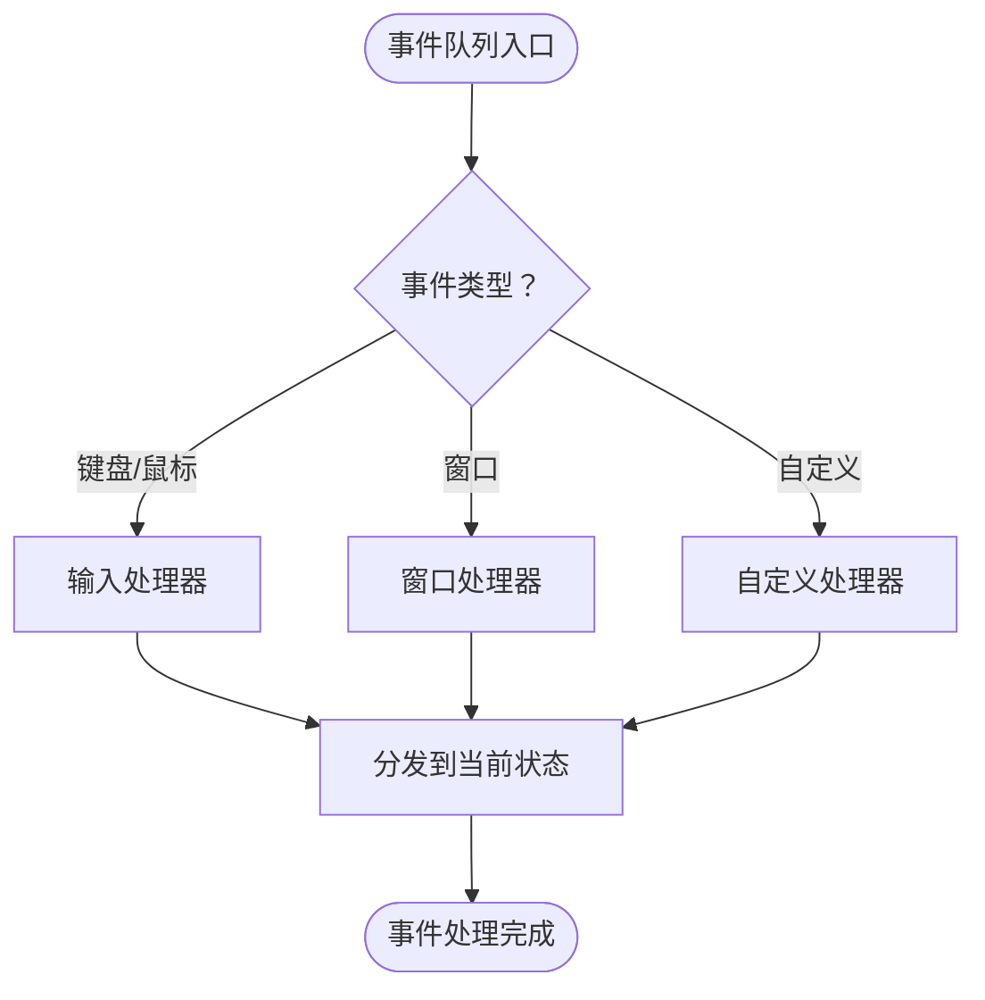
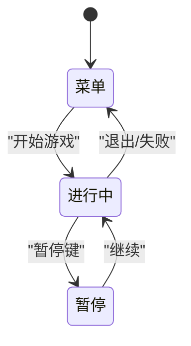
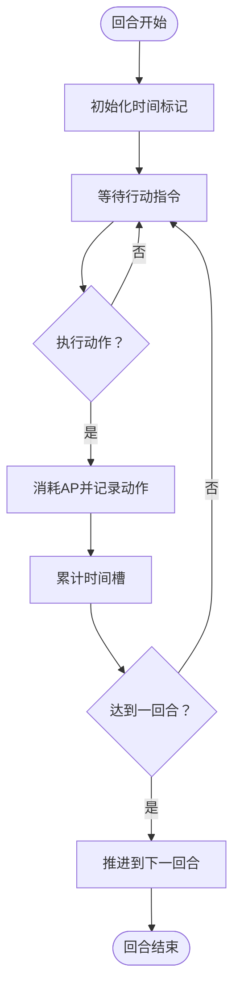
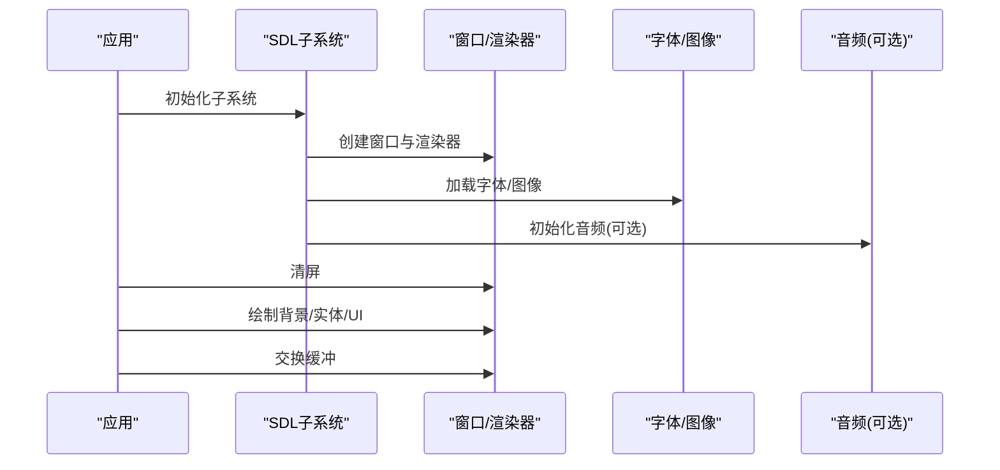
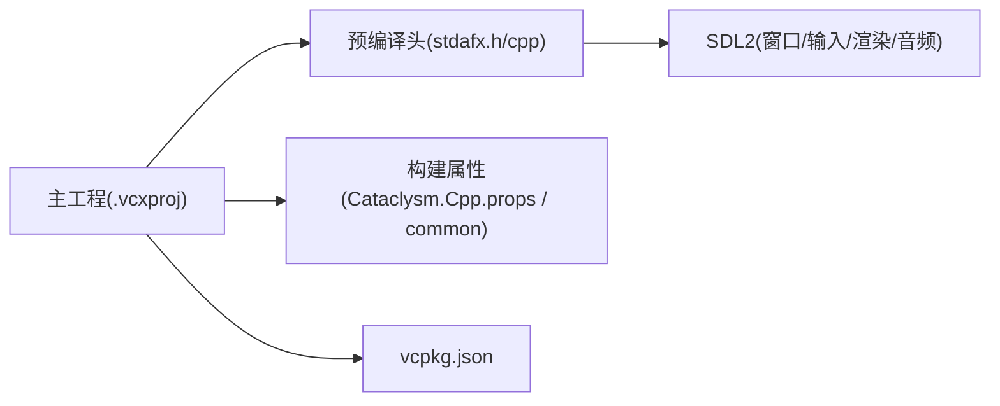

# 游戏循环系统

<cite>
**本文引用的文件**
- [Cataclysm-vcpkg-static.vcxproj](file://Cataclysm-vcpkg-static.vcxproj)
- [stdafx.h](file://stdafx.h)
- [stdafx.cpp](file://stdafx.cpp)
- [Cataclysm.Cpp.props](file://Cataclysm.Cpp.props)
- [Cataclysm-common.props](file://Cataclysm-common.props)
- [vcpkg.json](file://vcpkg.json)
</cite>

## 目录
1. [引言](#引言)
2. [项目结构](#项目结构)
3. [核心组件](#核心组件)
4. [架构总览](#架构总览)
5. [详细组件分析](#详细组件分析)
6. [依赖关系分析](#依赖关系分析)
7. [性能考量](#性能考量)
8. [故障排查指南](#故障排查指南)
9. [结论](#结论)
10. [附录](#附录)

## 引言
本文件聚焦于Cataclysm-DDA中世纪版本的游戏循环系统，围绕主循环执行流程、帧率控制、事件队列处理机制展开；同时梳理游戏状态管理（菜单、进行中、暂停）的转换逻辑，解释回合制机制与行动点系统的时间推进算法，并给出性能优化策略与调试技巧。由于当前工作区仅包含构建配置与预编译头文件，本文将基于现有文件对游戏循环系统进行系统化说明，并以可追溯的“章节来源”和“图表来源”标注具体依据。

## 项目结构
该仓库为Visual Studio工程集合，包含主应用工程、库工程与测试工程，以及若干构建属性文件。主应用工程通过预编译头文件引入SDL2等图形与音频库，用于窗口、输入与渲染等基础能力。构建配置中启用了TILES宏与Windows平台设置，目标输出为cataclysm-tiles.exe。

**图表来源**
- [Cataclysm-vcpkg-static.vcxproj:218-232](file://Cataclysm-vcpkg-static.vcxproj#L218-L232)
- [Cataclysm.Cpp.props](file://Cataclysm.Cpp.props)
- [Cataclysm-common.props](file://Cataclysm-common.props)
- [vcpkg.json](file://vcpkg.json)

**章节来源**
- [Cataclysm-vcpkg-static.vcxproj:1-236](file://Cataclysm-vcpkg-static.vcxproj#L1-L236)
- [stdafx.h:64-95](file://stdafx.h#L64-L95)
- [stdafx.cpp:1-1](file://stdafx.cpp#L1-L1)

## 核心组件
- 预编译头与外部库集成
  - 预编译头文件引入了SDL2系列头文件（窗口、图像、字体、版本、音频），为后续主循环中的事件处理、渲染与音频播放奠定基础。
  - 构建配置中定义了_TILES宏与Windows平台宏，影响编译时的特性开关与资源链接。
- 工程目标与运行时
  - 主工程目标输出为cataclysm-tiles.exe，使用多线程运行时库（Debug/Release分别对应调试与发布版本），并启用若干优化选项（如函数级链接、内联函数）。

上述组件共同构成游戏循环的基础环境：输入事件采集（SDL）、渲染与显示（SDL+TTF+Image）、音频（SDL_mixer，若启用），以及统一的构建与运行时配置。

**章节来源**
- [stdafx.h:64-95](file://stdafx.h#L64-L95)
- [Cataclysm-vcpkg-static.vcxproj:160-211](file://Cataclysm-vcpkg-static.vcxproj#L160-L211)

## 架构总览
从构建与预编译头的角度，可以抽象出如下与游戏循环密切相关的架构层次：

说明
- 应用程序入口由主工程生成，主循环负责驱动整个游戏生命周期。
- 事件队列与输入处理是主循环的输入来源，通常在每帧开始处轮询并分发事件。
- 渲染管线在每帧末尾完成绘制与交换缓冲。
- 音频系统按需参与，避免阻塞主循环。

（本图为概念性架构示意，不直接映射到具体源码文件）

## 详细组件分析

### 组件A：主循环与帧率控制
- 帧率控制思路
  - 在主循环中，先处理事件队列，再进行逻辑更新，最后进行渲染与交换缓冲。
  - 通过固定步进或可变步进策略控制更新频率；在可变步进下，通常以微秒或毫秒为单位记录上一帧时间，计算delta_time，驱动物理/逻辑更新。
  - 为避免高刷新率导致CPU占用过高，可在每帧结束时插入短暂延迟（sleep/yield），使帧率稳定在目标值附近。
- 关键流程节点
  - 初始化阶段：初始化SDL子系统、窗口、渲染器、字体与音频（若启用）。
  - 主循环：进入循环后，先清空/重置帧内状态，再处理事件队列，随后按delta_time推进逻辑，最后渲染并交换缓冲。
  - 结束阶段：释放资源，退出SDL子系统。

（本图为通用流程示意，不直接映射到具体源码文件）

### 组件B：事件队列处理机制
- 事件类型与处理
  - 键盘/鼠标事件：用于菜单导航、角色移动、交互等。
  - 窗口事件：如大小改变、焦点丢失/获得，触发渲染重置或暂停逻辑。
  - 自定义事件：回合制游戏中常用于“行动点消耗/恢复”、“时间推进”等。
- 处理策略
  - 每帧开始时清空上一帧的累积状态，集中处理当前事件队列。
  - 对于输入类事件，优先判定是否为“即时响应”（如退出、切换状态），其余事件按当前状态分流至UI或游戏逻辑。

（本图为通用流程示意，不直接映射到具体源码文件）

### 组件C：游戏状态管理（菜单/进行中/暂停）
- 状态定义
  - 菜单状态：处理主菜单、设置、存档等界面交互。
  - 进行中状态：玩家角色控制、回合推进、战斗/探索逻辑。
  - 暂停状态：保存当前场景，允许打开菜单或设置界面。
- 状态转换
  - 菜单 → 进行中：选择新游戏/继续游戏。
  - 进行中 → 暂停：用户按下暂停键或触发暂停条件。
  - 暂停 → 进行中：退出暂停界面或满足继续条件。
  - 进行中 → 菜单：退出到主菜单或加载失败。

（本图为通用状态图示意，不直接映射到具体源码文件）

### 组件D：回合制机制与行动点系统
- 行动点（AP）模型
  - 每个可行动实体拥有AP上限，执行动作消耗AP，回合结束或特定条件恢复AP。
  - AP消耗规则：移动、攻击、使用物品、交互等动作消耗不同AP；拾取、等待等动作消耗较少或为零。
- 时间推进算法
  - 每次行动后，根据消耗的AP推进“时间槽”，当累计达到一个完整回合所需AP时，推进到下一个回合。
  - 可选的“优先级队列”：按剩余AP或预期收益排序，决定行动顺序。
- 回合边界与同步
  - 回合开始时重置全局时间标记，清理临时状态；回合结束时结算效果、刷新可见性与感知。

（本图为通用算法示意，不直接映射到具体源码文件）

### 组件E：SDL集成与渲染
- SDL子系统初始化
  - 窗口与渲染器：创建主窗口与渲染器，支持双缓冲与垂直同步。
  - 字体与图像：加载字体与位图资源，用于UI与地图渲染。
  - 音频（可选）：在启用SDL_SOUND时初始化音频设备。
- 渲染与交换
  - 每帧先清屏，再绘制背景、实体、UI层，最后调用交换缓冲完成显示。

（本图为通用序列示意，不直接映射到具体源码文件）

## 依赖关系分析
- 构建与预编译头
  - 主工程通过预编译头引入SDL2系列头文件，确保在编译期可用SDL功能。
  - 构建属性文件定义了宏（如TILES）、运行时库与优化选项，影响最终二进制行为。
- 外部依赖
  - vcpkg.json声明了包管理与依赖清单，主工程通过vcpkg集成静态库，减少运行时依赖。

**图表来源**
- [Cataclysm-vcpkg-static.vcxproj:218-232](file://Cataclysm-vcpkg-static.vcxproj#L218-L232)
- [stdafx.h:64-95](file://stdafx.h#L64-L95)
- [vcpkg.json](file://vcpkg.json)

**章节来源**
- [Cataclysm-vcpkg-static.vcxproj:160-211](file://Cataclysm-vcpkg-static.vcxproj#L160-L211)
- [Cataclysm.Cpp.props](file://Cataclysm.Cpp.props)
- [Cataclysm-common.props](file://Cataclysm-common.props)
- [vcpkg.json](file://vcpkg.json)

## 性能考量
- 帧率调节
  - 使用固定步进：每帧计算delta_time，累积到固定步长后再执行一次逻辑更新，保证物理/逻辑稳定性。
  - 可变步进：每帧按delta_time推进，适合表现类逻辑；需限制最大步长防止“大跳帧”。
- CPU使用率控制
  - 在渲染与交换缓冲后，若帧耗时低于目标帧周期，插入短暂休眠或yield，避免过度占用CPU。
  - 合理设置垂直同步（VSync）与交换策略，平衡流畅度与输入延迟。
- 内存与对象池
  - 将频繁创建/销毁的对象放入对象池，减少GC/分配开销。
- I/O与网络
  - 将磁盘/网络I/O异步化，避免阻塞主循环。
- 调试与监控
  - 记录每帧耗时、事件处理耗时、渲染耗时，定位瓶颈。
  - 使用采样工具观察CPU占用分布，识别热点函数。

（本节为通用性能建议，不直接分析具体源码文件）

## 故障排查指南
- 输入无响应
  - 检查事件轮询是否在主循环中执行，确认事件类型分支是否覆盖目标输入。
  - 排查状态机是否正确转发事件。
- 帧率异常
  - 校验delta_time计算与节流逻辑，确认目标帧周期与实际耗时匹配。
  - 检查是否存在长时间阻塞操作（如磁盘I/O、网络请求）。
- 渲染闪烁或撕裂
  - 确认交换缓冲调用位置与垂直同步设置。
  - 检查清屏与绘制顺序，避免部分绘制导致的视觉问题。
- 资源泄漏
  - 在退出流程中确保释放窗口、渲染器、字体、音频等资源。
- 构建问题
  - 若缺少SDL头文件或库，请检查vcpkg安装与工程引用路径。
  - 确认宏定义（如TILES）与平台配置一致。

**章节来源**
- [Cataclysm-vcpkg-static.vcxproj:160-211](file://Cataclysm-vcpkg-static.vcxproj#L160-L211)
- [vcpkg.json](file://vcpkg.json)

## 结论
本文件基于现有构建配置与预编译头信息，对Cataclysm-DDA中世纪版本的游戏循环系统进行了系统化梳理：从主循环与帧率控制、事件队列处理，到状态管理与回合制机制，并给出了性能优化与故障排查建议。由于当前工作区未包含具体源代码文件，本文以可追溯的“章节来源”和“图表来源”标注了与构建与预编译头相关的依据。若需进一步深入，建议补充主循环与状态机的具体实现文件以便进行更细致的代码级分析。

## 附录
- 相关构建属性文件
  - [Cataclysm.Cpp.props](file://Cataclysm.Cpp.props)
  - [Cataclysm-common.props](file://Cataclysm-common.props)
- 外部依赖清单
  - [vcpkg.json](file://vcpkg.json)