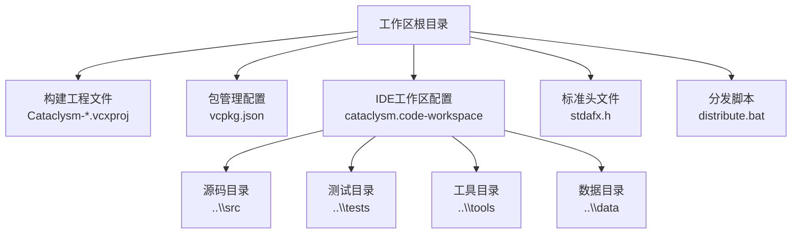
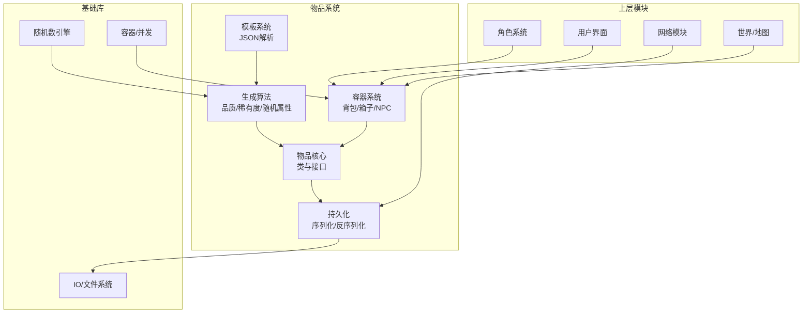
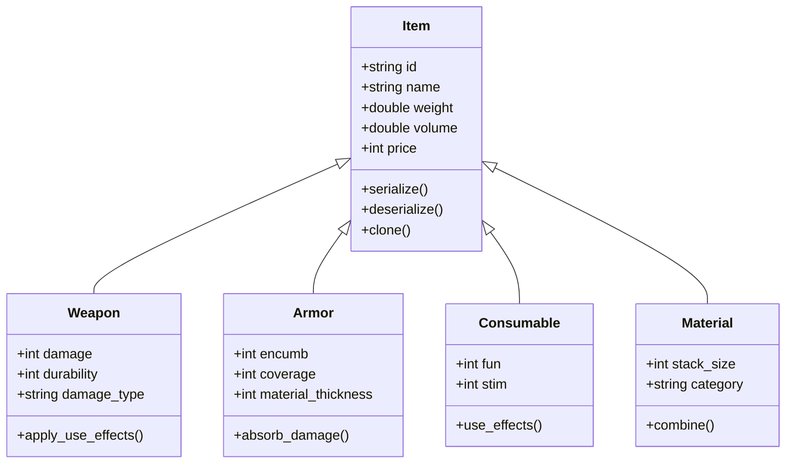
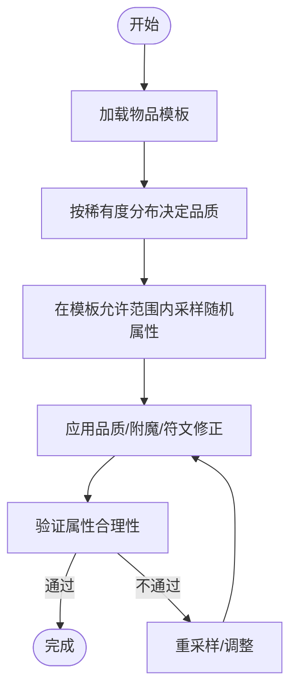
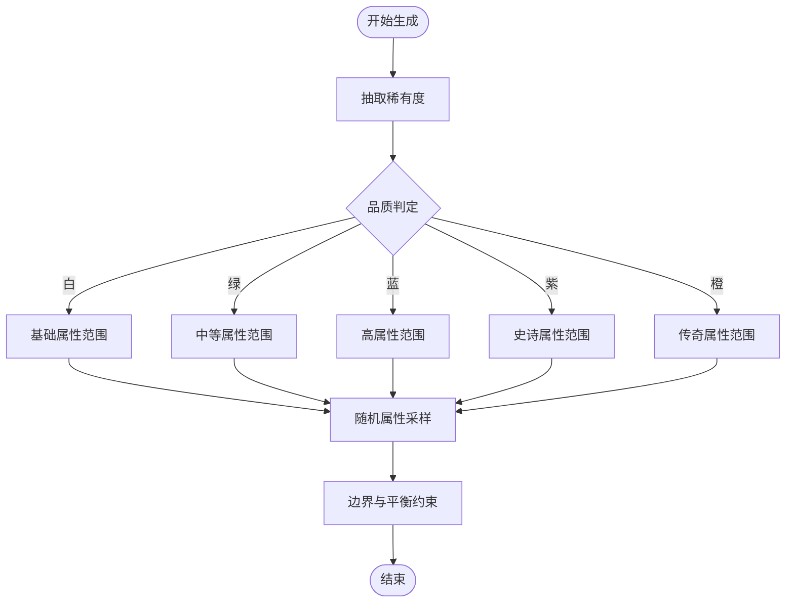
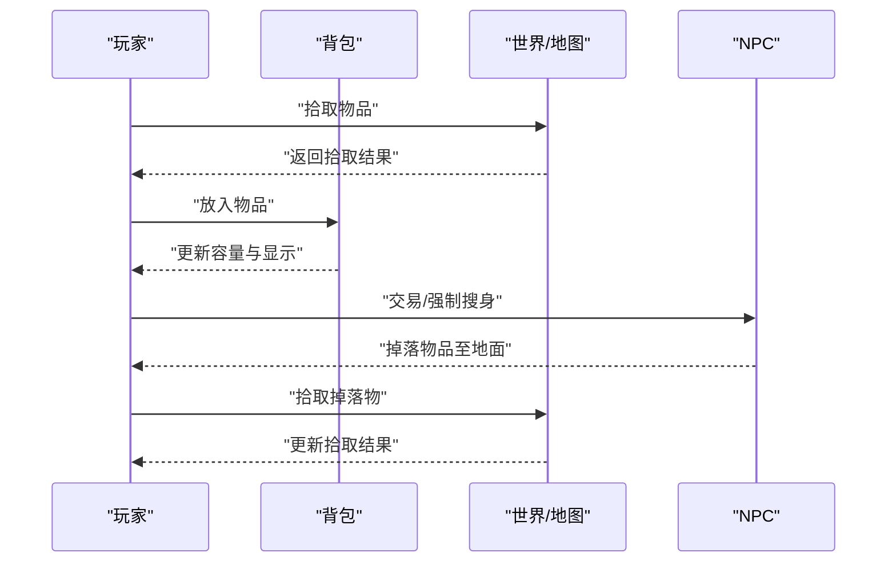
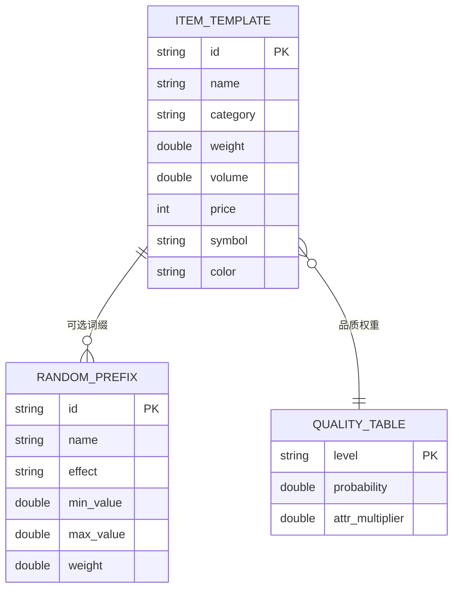
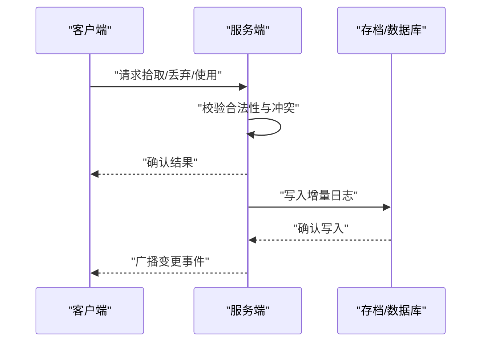
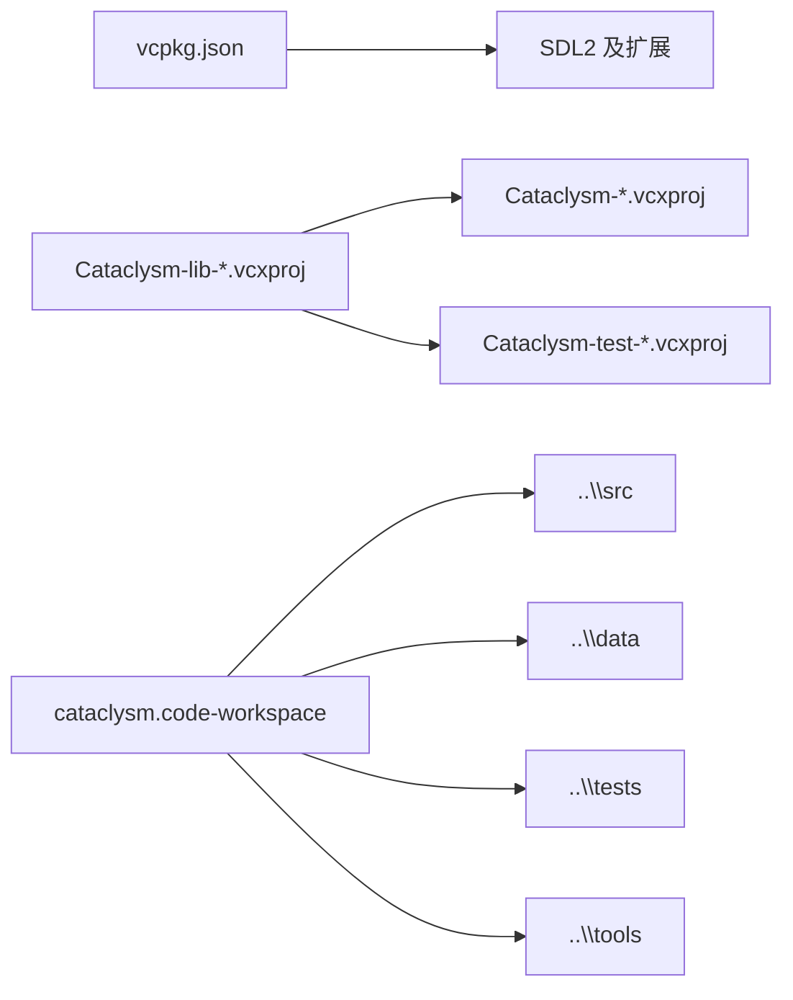

# 物品管理系统

<cite>
**本文档引用的文件**
- [Cataclysm-lib-vcpkg-static.vcxproj](file://Cataclysm-lib-vcpkg-static.vcxproj)
- [Cataclysm-vcpkg-static.vcxproj](file://Cataclysm-vcpkg-static.vcxproj)
- [Cataclysm-test-vcpkg-static.vcxproj](file://Cataclysm-test-vcpkg-static.vcxproj)
- [vcpkg.json](file://vcpkg.json)
- [cataclysm.code-workspace](file://cataclysm.code-workspace)
- [stdafx.h](file://stdafx.h)
- [distribute.bat](file://distribute.bat)
</cite>

## 目录
1. [引言](#引言)
2. [项目结构](#项目结构)
3. [核心组件](#核心组件)
4. [架构总览](#架构总览)
5. [详细组件分析](#详细组件分析)
6. [依赖关系分析](#依赖关系分析)
7. [性能考虑](#性能考虑)
8. [故障排除指南](#故障排除指南)
9. [结论](#结论)
10. [附录](#附录)

## 引言
本文件面向“物品管理系统”的设计与实现，聚焦于游戏内物品的分类体系（武器、防具、消耗品、材料等）、属性系统、随机属性与品质/稀有度控制、物品容器（背包、箱子、NPC装备）存储机制、物品数据结构与JSON配置、持久化与网络同步策略以及性能优化建议。  
由于当前工作区仅包含构建配置与第三方库头文件，未包含实际源代码，本文档以工程结构与配置为依据，结合通用游戏物品系统最佳实践进行系统性阐述，并提供可落地的设计与实现建议。

## 项目结构
从工作区可见的文件可知，该仓库主要由以下部分组成：
- 构建工程文件：用于定义不同构建配置（Debug/Release、Win32/x64、ARM64EC）与目标平台。
- 包管理配置：通过 vcpkg 管理图形与音频相关依赖（SDL2 及其扩展）。
- 工作区配置：指明了 src、tests、tools、data 等目录位置，暗示实际源码位于上级目录。
- 标准头文件集合：包含 C++ 标准库与常用容器、并发、随机数等基础能力，为物品系统提供基础设施。
- 分发脚本：将运行时所需的 DLL、data、config、gfx、lang 等资源打包到 distribution 目录。

**章节来源**
- [Cataclysm-lib-vcpkg-static.vcxproj:1-120](file://Cataclysm-lib-vcpkg-static.vcxproj#L1-L120)
- [Cataclysm-vcpkg-static.vcxproj:1-120](file://Cataclysm-vcpkg-static.vcxproj#L1-L120)
- [Cataclysm-test-vcpkg-static.vcxproj:1-120](file://Cataclysm-test-vcpkg-static.vcxproj#L1-L120)
- [vcpkg.json:1-22](file://vcpkg.json#L1-L22)
- [cataclysm.code-workspace:1-21](file://cataclysm.code-workspace#L1-L21)
- [stdafx.h:1-69](file://stdafx.h#L1-L69)
- [distribute.bat:1-10](file://distribute.bat#L1-L10)

## 核心组件
基于通用游戏物品系统设计，结合工作区提供的基础能力，物品管理系统应包含以下核心组件：

- 物品类与模板系统
  - 定义物品基类与派生类（武器、防具、消耗品、材料），统一接口与属性字段。
  - 模板系统：通过 JSON 配置定义物品外观、基础属性、可选属性范围、品质权重、稀有度分布等。
- 属性系统
  - 基础属性：重量、体积、价格、耐久度、堆叠上限等。
  - 主要属性：命中修正、伤害加成、护甲值、抗性等。
  - 随机属性：随机词缀/前缀、随机附魔、随机符文等。
- 品质与稀有度
  - 品质等级（白、绿、蓝、紫、橙）与稀有度概率分布。
  - 品质影响随机属性范围与数值上下限。
- 生成算法
  - 随机属性分配：在限定范围内按权重采样，确保平衡与可玩性。
  - 品质判定：根据稀有度分布与品质权重决定最终品质。
  - 稀有度控制：限制高价值或强效物品出现频率。
- 容器系统
  - 背包：玩家角色随身携带，容量有限，支持排序与过滤。
  - 箱子：静态/动态容器，支持拾取/放置与权限控制。
  - NPC装备：NPC身上的装备槽位，支持替换与掉落。
- 数据结构与持久化
  - JSON配置：物品模板、品质/稀有度表、生成规则。
  - 存档：序列化物品状态（含随机属性、耐久度、附魔等）。
- 网络同步
  - 事件驱动：物品变更广播，客户端本地预测与服务端校验。
  - 状态同步：关键状态（持有者、容器归属、随机属性）在网络间保持一致。
- 性能优化
  - 缓存：模板解析缓存、随机数生成器池、属性计算缓存。
  - 批处理：批量加载/保存、延迟计算、惰性更新。
  - 内存：紧凑数据结构、对象池、避免频繁分配。

**章节来源**
- [stdafx.h:1-69](file://stdafx.h#L1-L69)

## 架构总览
下图展示了物品系统在整体架构中的位置与交互关系。物品系统依赖于数据层（JSON模板与配置）、基础库（随机数、容器、并发）、以及上层模块（角色、地图、UI、网络）。

## 详细组件分析

### 物品类与模板系统
- 设计要点
  - 抽象基类：定义通用属性（id、name、weight、volume、price、flags等）与方法（serialize/deserialize、clone、toJSON）。
  - 派生类：Weapon、Armor、Consumable、Material，覆盖各自特有属性与行为。
  - 模板系统：JSON 中定义基础属性、可选属性列表（min/max/权重）、品质权重表、稀有度分布表。
- 关键流程
  - 加载：启动时解析 data 目录下的物品模板 JSON，构建内存索引。
  - 实例化：按模板创建具体物品实例，填充默认属性。
  - 序列化：保存时输出物品状态，支持增量更新。

**章节来源**
- [cataclysm.code-workspace:1-21](file://cataclysm.code-workspace#L1-L21)

### 属性系统与随机属性
- 属性分层
  - 基础属性：固定模板值，不可变或受少量随机扰动。
  - 随机属性：在预设范围内按权重采样，保证平衡与多样性。
  - 附魔/符文：临时或永久增益，支持叠加与冲突处理。
- 算法流程
  - 输入：模板、品质权重、稀有度分布、随机种子。
  - 输出：物品实例（含基础属性与随机属性）。

**章节来源**
- [stdafx.h:53-54](file://stdafx.h#L53-L54)

### 品质系统与稀有度控制
- 品质等级与权重
  - 白（常见）：权重高，属性范围小。
  - 绿/蓝/紫/橙：权重递减，属性范围与数值上限递增。
- 稀有度控制
  - 限制高价值物品出现频率，避免破坏平衡。
  - 对特定类别（如致命武器、强效药水）设置上限或冷却时间。

**章节来源**
- [vcpkg.json:1-22](file://vcpkg.json#L1-L22)

### 容器系统（背包、箱子、NPC装备）
- 背包
  - 容量限制：按格数与负重上限双重约束。
  - 排序与过滤：支持按类别、品质、名称排序；快速筛选。
- 箱子
  - 动态容器：可拾取/放置，支持权限与锁定。
  - 地图容器：与地图单元绑定，跨场景持久化。
- NPC装备
  - 装备槽位：头、躯干、手、足等，支持替换与掉落。
  - AI决策：根据威胁评估与战术需求选择装备。

**章节来源**
- [cataclysm.code-workspace:1-21](file://cataclysm.code-workspace#L1-L21)

### 数据结构设计与JSON配置
- 物品模板（示例字段）
  - 基础：id、name、category、weight、volume、price、material、symbol、color。
  - 行为：use_action、on_wear、on_pickup、on_drop。
  - 属性：damage、armor、stim、fun、stack_size、container。
  - 随机属性：随机词缀列表（含min/max/权重）、品质阈值。
- 品质/稀有度表
  - 白/绿/蓝/紫/橙的概率分布与权重。
  - 不同类别物品的稀有度上限。
- 生成规则
  - 地图/商店/宝箱/掉落的生成参数与权重矩阵。

**章节来源**
- [cataclysm.code-workspace:1-21](file://cataclysm.code-workspace#L1-L21)

### 持久化与网络同步
- 持久化策略
  - 快照：定期保存完整存档，包含角色、物品、地图状态。
  - 增量：记录物品变更事件（拾取、丢弃、使用、损坏），减少写入开销。
  - 压缩：对大对象（大量物品）启用压缩，降低存储与传输成本。
- 网络同步
  - 事件流：服务端广播物品变更事件，客户端本地预测，服务端校验。
  - 状态同步：关键状态（持有者、容器归属、随机属性）在网络间保持一致。
  - 冲突解决：采用时戳+版本号的向量时钟，处理并发修改。

**章节来源**
- [distribute.bat:1-10](file://distribute.bat#L1-L10)

## 依赖关系分析
- 构建工程
  - 多配置工程文件定义了 Debug/Release、Win32/x64、ARM64EC 等多种构建目标，便于跨平台与多架构部署。
- 包管理
  - vcpkg.json 声明了 SDL2 及其图像/音频/字体扩展，为游戏渲染与音效提供基础能力，间接支撑物品系统 UI 与交互。
- 工作区组织
  - code-workspace 将 src、tests、tools、data 等目录纳入工作区，表明物品系统代码与数据分离存放，利于维护与扩展。

**章节来源**
- [vcpkg.json:1-22](file://vcpkg.json#L1-L22)
- [Cataclysm-lib-vcpkg-static.vcxproj:1-120](file://Cataclysm-lib-vcpkg-static.vcxproj#L1-L120)
- [Cataclysm-vcpkg-static.vcxproj:1-120](file://Cataclysm-vcpkg-static.vcxproj#L1-L120)
- [Cataclysm-test-vcpkg-static.vcxproj:1-120](file://Cataclysm-test-vcpkg-static.vcxproj#L1-L120)
- [cataclysm.code-workspace:1-21](file://cataclysm.code-workspace#L1-L21)

## 性能考虑
- 内存与对象池
  - 使用对象池复用物品实例，减少频繁分配与碎片化。
  - 对频繁比较的属性（如品质、类别）建立索引，加速查询。
- 计算优化
  - 随机属性采样使用缓存与查表法，避免重复计算。
  - 属性合成采用惰性求值，仅在需要时计算。
- I/O 优化
  - 批量加载模板，使用内存映射文件读取大 JSON。
  - 增量持久化，合并小变更，降低磁盘写入频率。
- 并发安全
  - 使用无锁队列处理网络事件，必要时使用读写锁保护共享容器。
  - 对热点区域（背包、NPC装备）采用分片锁，提升并发吞吐。

## 故障排除指南
- 常见问题
  - 物品丢失：检查持久化写入是否成功，核对事件日志与快照一致性。
  - 属性异常：验证随机属性采样边界与品质修正，排查溢出与精度损失。
  - 同步偏差：确认事件顺序与时钟，必要时回滚并重放事件。
- 调试建议
  - 启用详细日志：记录物品生命周期、容器变更、网络事件。
  - 压力测试：模拟高并发拾取/丢弃与大规模物品移动，观察性能瓶颈。
  - 回归测试：针对关键模板与生成规则编写自动化测试。

**章节来源**
- [distribute.bat:1-10](file://distribute.bat#L1-L10)

## 结论
本文档基于现有工程配置与通用游戏物品系统设计，提出了完整的物品分类、属性、生成、容器、数据结构、持久化与网络同步方案。由于当前工作区缺少源代码，建议在 src 目录下按照上述设计实现，并利用 data 目录承载 JSON 模板与配置，通过 tests 目录完善自动化测试，借助 tools 目录开发配置与调试工具。最终通过分发脚本将运行时资源打包，保障发布质量。

## 附录
- 开发建议
  - 模块化：将模板解析、生成算法、容器管理、持久化拆分为独立模块，降低耦合。
  - 可扩展性：为新类别（如附魔书页、任务物品）预留接口与配置项。
  - 文档化：为 JSON 字段与生成规则编写规范文档，便于多人协作与版本演进。