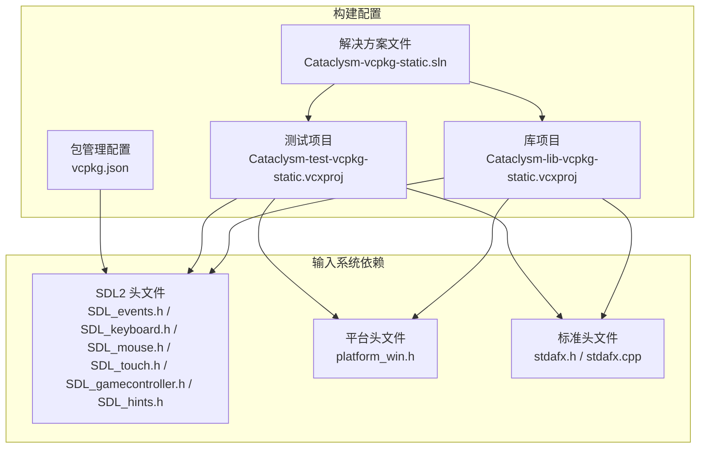
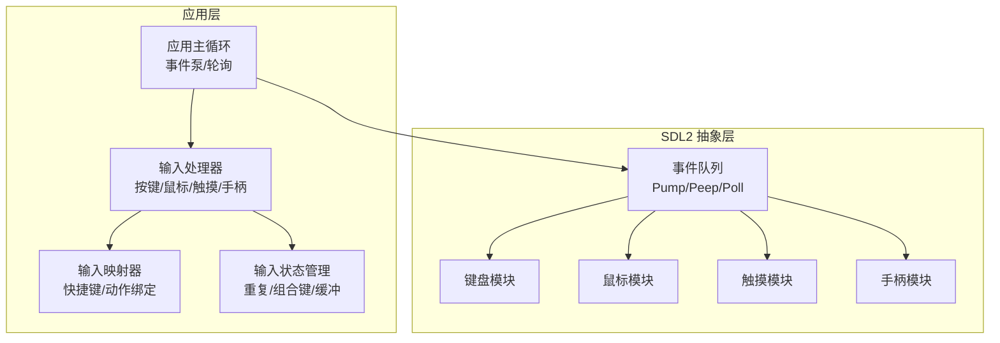
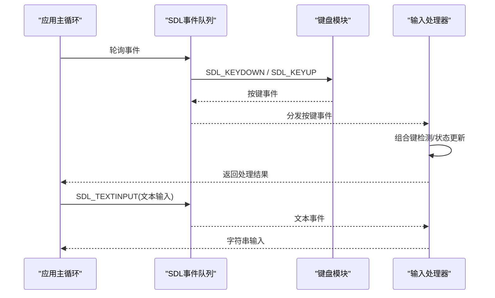
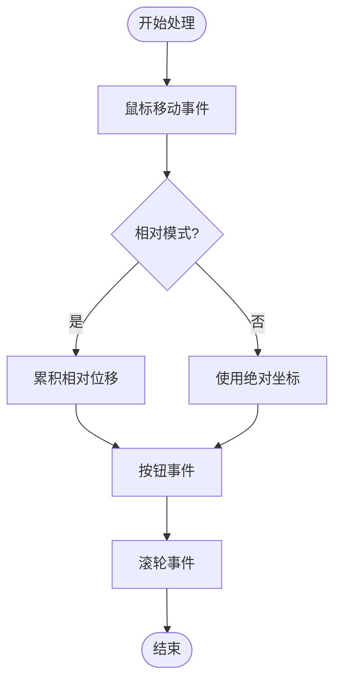
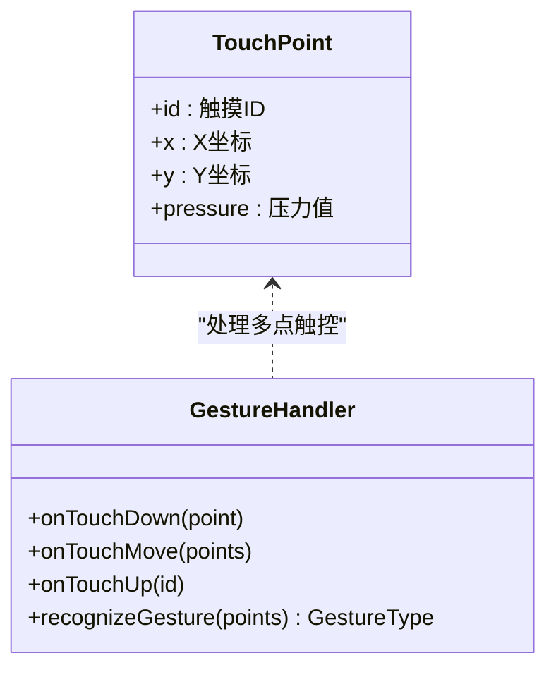
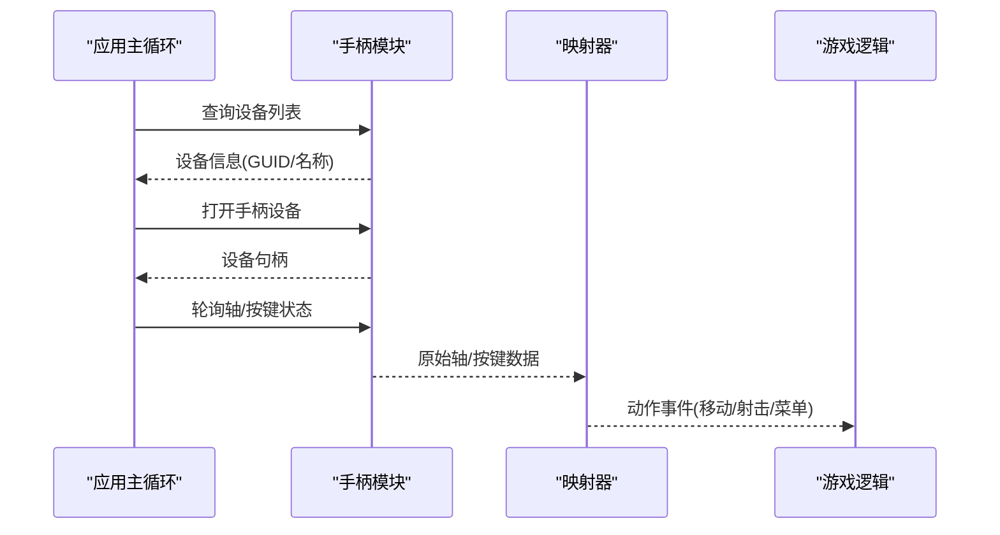
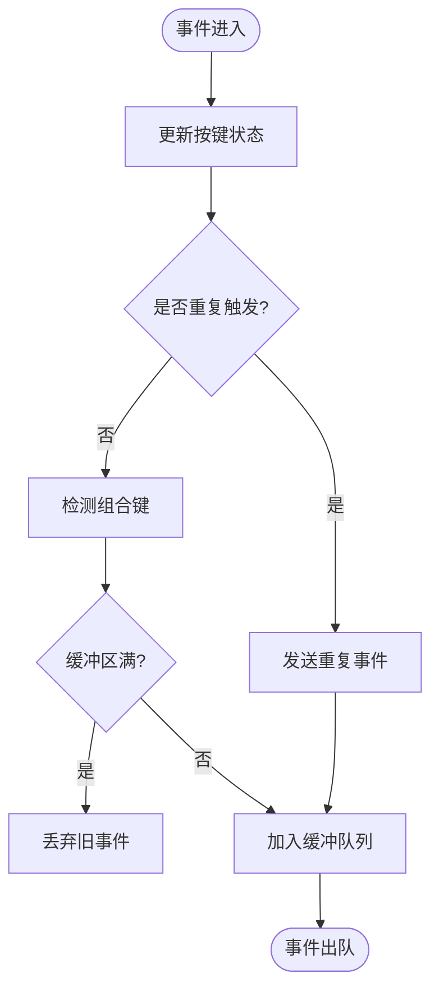
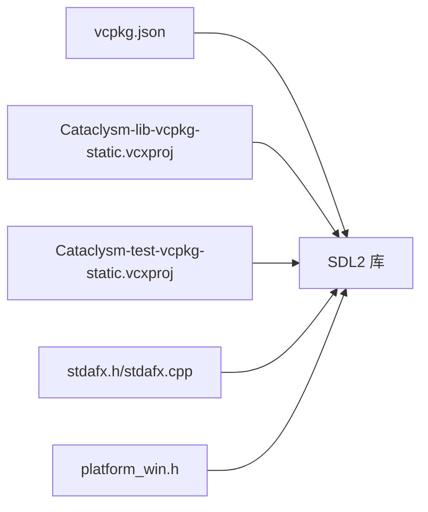

# 输入处理系统

<cite>
**本文档引用的文件**
- [stdafx.h](file://stdafx.h)
- [stdafx.cpp](file://stdafx.cpp)
- [Cataclysm-vcpkg-static.sln](file://Cataclysm-vcpkg-static.sln)
- [Cataclysm-lib-vcpkg-static.vcxproj](file://Cataclysm-lib-vcpkg-static.vcxproj)
- [Cataclysm-test-vcpkg-static.vcxproj](file://Cataclysm-test-vcpkg-static.vcxproj)
- [vcpkg.json](file://vcpkg.json)
- [SDL_events.h](file://vcpkg_installed/x64-windows-static/include/SDL2/SDL_events.h)
- [SDL_keyboard.h](file://vcpkg_installed/x64-windows-static/include/SDL2/SDL_keyboard.h)
- [SDL_mouse.h](file://vcpkg_installed/x64-windows-static/include/SDL2/SDL_mouse.h)
- [SDL_touch.h](file://vcpkg_installed/x64-windows-static/include/SDL2/SDL_touch.h)
- [SDL_gamecontroller.h](file://vcpkg_installed/x64-windows-static/include/SDL2/SDL_gamecontroller.h)
- [SDL_hints.h](file://vcpkg_installed/x64-windows-static/include/SDL2/SDL_hints.h)
- [platform_win.h](file://src/platform_win.h)
</cite>

## 目录
1. [简介](#简介)
2. [项目结构](#项目结构)
3. [核心组件](#核心组件)
4. [架构概览](#架构概览)
5. [详细组件分析](#详细组件分析)
6. [依赖关系分析](#依赖关系分析)
7. [性能考虑](#性能考虑)
8. [故障排除指南](#故障排除指南)
9. [结论](#结论)
10. [附录](#附录)

## 简介
本文件针对输入处理系统进行深入分析，涵盖键盘、鼠标、触摸屏及手柄输入的捕获与处理机制。基于仓库中的SDL2集成配置，系统通过SDL事件队列统一管理各类输入事件，支持文本输入、按键状态查询、鼠标移动与点击、触摸手势以及游戏手柄轴和按键映射。文档还讨论了输入状态管理（如按键重复、组合键检测）、输入缓冲策略、延迟优化与响应性改进，并提供跨平台输入兼容性的实现要点与扩展指南。

## 项目结构
该仓库为Cataclysm项目在Windows平台使用vcpkg静态链接SDL2的构建配置。输入处理系统的核心依赖于SDL2库头文件与预编译配置，通过预处理器宏控制不同平台与功能集的编译选项。

**图表来源**
- [Cataclysm-vcpkg-static.sln:94-110](file://Cataclysm-vcpkg-static.sln#L94-L110)
- [Cataclysm-lib-vcpkg-static.vcxproj:112-143](file://Cataclysm-lib-vcpkg-static.vcxproj#L112-L143)
- [Cataclysm-test-vcpkg-static.vcxproj:110-141](file://Cataclysm-test-vcpkg-static.vcxproj#L110-L141)
- [vcpkg.json](file://vcpkg.json)

**章节来源**
- [Cataclysm-vcpkg-static.sln:94-110](file://Cataclysm-vcpkg-static.sln#L94-L110)
- [Cataclysm-lib-vcpkg-static.vcxproj:112-143](file://Cataclysm-lib-vcpkg-static.vcxproj#L112-L143)
- [Cataclysm-test-vcpkg-static.vcxproj:110-141](file://Cataclysm-test-vcpkg-static.vcxproj#L110-L141)
- [vcpkg.json](file://vcpkg.json)

## 核心组件
- SDL事件系统：统一接收并分发键盘、鼠标、触摸和手柄事件，提供事件泵与轮询机制。
- 键盘输入：按键状态查询、文本输入事件、修饰键组合检测。
- 鼠标输入：位置坐标、相对移动、按钮点击、滚轮事件。
- 触摸输入：多点触控、手势识别、模拟鼠标触摸事件。
- 手柄输入：轴映射、按键映射、设备识别与校准。
- 平台适配：Windows平台特定的输入提示与窗口焦点管理。

**章节来源**
- [SDL_events.h:100-1076](file://vcpkg_installed/x64-windows-static/include/SDL2/SDL_events.h#L100-L1076)
- [SDL_keyboard.h:44-265](file://vcpkg_installed/x64-windows-static/include/SDL2/SDL_keyboard.h#L44-L265)
- [SDL_mouse.h:223-223](file://vcpkg_installed/x64-windows-static/include/SDL2/SDL_mouse.h#L223-L223)
- [SDL_touch.h:62-62](file://vcpkg_installed/x64-windows-static/include/SDL2/SDL_touch.h#L62-L62)
- [SDL_gamecontroller.h:627-743](file://vcpkg_installed/x64-windows-static/include/SDL2/SDL_gamecontroller.h#L627-L743)
- [SDL_hints.h:294-306](file://vcpkg_installed/x64-windows-static/include/SDL2/SDL_hints.h#L294-L306)
- [SDL_hints.h:1009-1009](file://vcpkg_installed/x64-windows-static/include/SDL2/SDL_hints.h#L1009-L1009)
- [SDL_hints.h:1149-1149](file://vcpkg_installed/x64-windows-static/include/SDL2/SDL_hints.h#L1149-L1149)

## 架构概览
输入系统采用SDL2作为跨平台输入抽象层，应用层通过事件循环从SDL事件队列获取输入事件，再根据事件类型分派到相应的处理逻辑。SDL提供统一的事件结构体与API，确保键盘、鼠标、触摸、手柄输入的一致性处理流程。

**图表来源**
- [SDL_events.h:689-689](file://vcpkg_installed/x64-windows-static/include/SDL2/SDL_events.h#L689-L689)
- [SDL_events.h:1076-1076](file://vcpkg_installed/x64-windows-static/include/SDL2/SDL_events.h#L1076-L1076)
- [SDL_keyboard.h:44-44](file://vcpkg_installed/x64-windows-static/include/SDL2/SDL_keyboard.h#L44-L44)
- [SDL_mouse.h:223-223](file://vcpkg_installed/x64-windows-static/include/SDL2/SDL_mouse.h#L223-L223)
- [SDL_touch.h:62-62](file://vcpkg_installed/x64-windows-static/include/SDL2/SDL_touch.h#L62-L62)
- [SDL_gamecontroller.h:627-627](file://vcpkg_installed/x64-windows-static/include/SDL2/SDL_gamecontroller.h#L627-L627)

## 详细组件分析

### 键盘输入处理
- 事件类型：按键按下/释放、文本输入事件。
- 状态查询：通过按键状态函数获取当前按键是否被按下，支持组合键检测。
- 文本输入：SDL_TEXTINPUT事件用于接收字符输入，避免将物理按键与字符映射混淆。
- 修饰键：支持Ctrl/Cmd/Alt/Shift等修饰键组合，常用于快捷键绑定。

**图表来源**
- [SDL_events.h:100-107](file://vcpkg_installed/x64-windows-static/include/SDL2/SDL_events.h#L100-L107)
- [SDL_events.h:633-633](file://vcpkg_installed/x64-windows-static/include/SDL2/SDL_events.h#L633-L633)
- [SDL_keyboard.h:44-44](file://vcpkg_installed/x64-windows-static/include/SDL2/SDL_keyboard.h#L44-L44)

**章节来源**
- [SDL_events.h:100-107](file://vcpkg_installed/x64-windows-static/include/SDL2/SDL_events.h#L100-L107)
- [SDL_events.h:633-633](file://vcpkg_installed/x64-windows-static/include/SDL2/SDL_events.h#L633-L633)
- [SDL_keyboard.h:44-44](file://vcpkg_installed/x64-windows-static/include/SDL2/SDL_keyboard.h#L44-L44)

### 鼠标输入处理
- 事件类型：鼠标移动、按钮按下/释放、滚轮滚动。
- 坐标系统：支持绝对坐标与相对移动；相对模式下可隐藏光标并持续追踪移动。
- 窗口焦点：窗口输入抓取与焦点状态影响鼠标事件的接收。

**图表来源**
- [SDL_mouse.h:223-223](file://vcpkg_installed/x64-windows-static/include/SDL2/SDL_mouse.h#L223-L223)
- [SDL_video.h:111-112](file://vcpkg_installed/x64-windows-static/include/SDL2/SDL_video.h#L111-L112)
- [SDL_video.h:1355-1417](file://vcpkg_installed/x64-windows-static/include/SDL2/SDL_video.h#L1355-L1417)

**章节来源**
- [SDL_mouse.h:223-223](file://vcpkg_installed/x64-windows-static/include/SDL2/SDL_mouse.h#L223-L223)
- [SDL_video.h:111-112](file://vcpkg_installed/x64-windows-static/include/SDL2/SDL_video.h#L111-L112)
- [SDL_video.h:1355-1417](file://vcpkg_installed/x64-windows-static/include/SDL2/SDL_video.h#L1355-L1417)

### 触摸屏输入处理
- 多点触控：支持同时跟踪多个触摸点，用于缩放、旋转等手势。
- 模拟鼠标：可通过配置将触摸事件映射为鼠标事件，便于传统UI兼容。
- 触摸ID：每个触摸点有唯一标识，便于区分不同手指操作。

**图表来源**
- [SDL_touch.h:62-62](file://vcpkg_installed/x64-windows-static/include/SDL2/SDL_touch.h#L62-L62)

**章节来源**
- [SDL_touch.h:62-62](file://vcpkg_installed/x64-windows-static/include/SDL2/SDL_touch.h#L62-L62)

### 手柄输入处理
- 设备枚举：通过GUID识别设备，支持热插拔与多设备管理。
- 轴映射：左/右摇杆、触发器轴的标准化映射。
- 按键映射：A/B/X/Y、LB/RB、LT/RT、方向键等按键映射。
- 校准与提示：通过SDL提示控制手柄状态更新与传感器状态。

**图表来源**
- [SDL_gamecontroller.h:627-627](file://vcpkg_installed/x64-windows-static/include/SDL2/SDL_gamecontroller.h#L627-L627)
- [SDL_gamecontroller.h:743-743](file://vcpkg_installed/x64-windows-static/include/SDL2/SDL_gamecontroller.h#L743-L743)
- [SDL_hints.h:294-306](file://vcpkg_installed/x64-windows-static/include/SDL2/SDL_hints.h#L294-L306)
- [SDL_hints.h:306-306](file://vcpkg_installed/x64-windows-static/include/SDL2/SDL_hints.h#L306-L306)

**章节来源**
- [SDL_gamecontroller.h:627-627](file://vcpkg_installed/x64-windows-static/include/SDL2/SDL_gamecontroller.h#L627-L627)
- [SDL_gamecontroller.h:743-743](file://vcpkg_installed/x64-windows-static/include/SDL2/SDL_gamecontroller.h#L743-L743)
- [SDL_hints.h:294-306](file://vcpkg_installed/x64-windows-static/include/SDL2/SDL_hints.h#L294-L306)
- [SDL_hints.h:306-306](file://vcpkg_installed/x64-windows-static/include/SDL2/SDL_hints.h#L306-L306)

### 输入状态管理
- 按键重复：通过定时器或事件间隔检测按键持续按下的行为，生成重复事件。
- 组合键检测：维护修饰键状态，检测特定组合键序列。
- 输入缓冲：对高频事件进行去抖与节流，减少处理压力并提升响应性。

**图表来源**
- [SDL_keyboard.h:44-44](file://vcpkg_installed/x64-windows-static/include/SDL2/SDL_keyboard.h#L44-L44)
- [SDL_events.h:689-689](file://vcpkg_installed/x64-windows-static/include/SDL2/SDL_events.h#L689-L689)

**章节来源**
- [SDL_keyboard.h:44-44](file://vcpkg_installed/x64-windows-static/include/SDL2/SDL_keyboard.h#L44-L44)
- [SDL_events.h:689-689](file://vcpkg_installed/x64-windows-static/include/SDL2/SDL_events.h#L689-L689)

### 跨平台输入兼容性
- 平台头文件：通过平台特定头文件适配不同平台的输入差异。
- SDL抽象：统一键盘、鼠标、触摸、手柄接口，屏蔽底层差异。
- 提示与配置：使用SDL提示调整输入行为（如原始输入、传感器更新）。

**章节来源**
- [platform_win.h](file://src/platform_win.h)
- [SDL_hints.h:1009-1009](file://vcpkg_installed/x64-windows-static/include/SDL2/SDL_hints.h#L1009-L1009)
- [SDL_hints.h:1149-1149](file://vcpkg_installed/x64-windows-static/include/SDL2/SDL_hints.h#L1149-L1149)

## 依赖关系分析
输入系统依赖于SDL2库提供的事件与设备管理能力，构建配置通过vcpkg管理SDL2依赖，并在项目属性中启用SDL相关宏定义以启用声音与主循环处理。

**图表来源**
- [vcpkg.json](file://vcpkg.json)
- [Cataclysm-lib-vcpkg-static.vcxproj:112-143](file://Cataclysm-lib-vcpkg-static.vcxproj#L112-L143)
- [Cataclysm-test-vcpkg-static.vcxproj:110-141](file://Cataclysm-test-vcpkg-static.vcxproj#L110-L141)
- [stdafx.h:77-95](file://stdafx.h#L77-L95)

**章节来源**
- [vcpkg.json](file://vcpkg.json)
- [Cataclysm-lib-vcpkg-static.vcxproj:112-143](file://Cataclysm-lib-vcpkg-static.vcxproj#L112-L143)
- [Cataclysm-test-vcpkg-static.vcxproj:110-141](file://Cataclysm-test-vcpkg-static.vcxproj#L110-L141)
- [stdafx.h:77-95](file://stdafx.h#L77-L95)

## 性能考虑
- 事件泵与轮询：合理安排事件泵调用频率，避免过度轮询导致CPU占用过高。
- 去抖与节流：对高频输入（如鼠标移动、触摸）进行去抖与节流，减少无效事件处理。
- 缓冲策略：设置合理的事件缓冲大小与超时阈值，平衡延迟与吞吐量。
- 批量处理：将同类事件批量处理，降低上下文切换成本。
- 平台提示：利用SDL提示优化输入设备状态更新与传感器采样频率。

## 故障排除指南
- 事件未到达：检查事件泵调用与事件过滤器设置，确认事件队列未被阻塞。
- 键盘无响应：验证SDL_TEXTINPUT事件启用状态与键盘焦点，检查修饰键状态查询逻辑。
- 鼠标异常：确认窗口输入抓取状态与相对模式配置，检查坐标转换与边界处理。
- 触摸误判：调整触摸事件映射策略与多点触控识别算法，避免与鼠标事件冲突。
- 手柄无响应：检查设备枚举与打开流程，核对轴与按键映射表，启用必要的SDL提示。

**章节来源**
- [SDL_events.h:689-689](file://vcpkg_installed/x64-windows-static/include/SDL2/SDL_events.h#L689-L689)
- [SDL_keyboard.h:265-265](file://vcpkg_installed/x64-windows-static/include/SDL2/SDL_keyboard.h#L265-L265)
- [SDL_video.h:111-112](file://vcpkg_installed/x64-windows-static/include/SDL2/SDL_video.h#L111-L112)
- [SDL_hints.h:294-306](file://vcpkg_installed/x64-windows-static/include/SDL2/SDL_hints.h#L294-L306)

## 结论
输入处理系统以SDL2为核心，提供了统一且高效的跨平台输入抽象。通过事件队列管理、输入映射与状态管理，系统能够稳定地处理键盘、鼠标、触摸与手柄输入。结合平台提示与缓冲策略，可在保证响应性的同时优化性能。扩展新输入设备时，建议遵循SDL的设备枚举与事件分发规范，并提供清晰的映射与校准流程。

## 附录
- 快捷键绑定建议：将常用操作映射到键盘组合键与手柄按键，提供可配置的用户界面。
- 自定义输入映射：允许用户在配置文件中重新绑定动作，系统动态加载映射表并实时生效。
- 扩展新设备：新增设备需提供设备枚举、轴/按键映射与校准流程，确保与现有状态管理兼容。