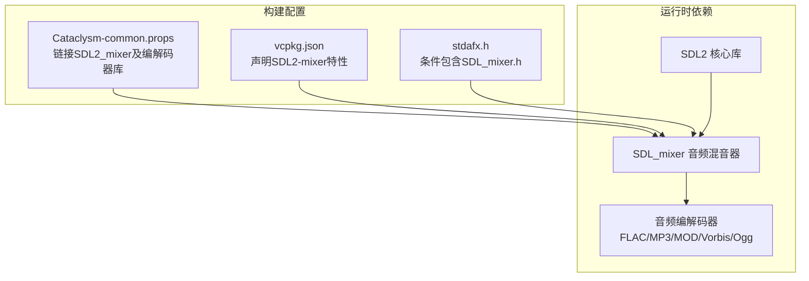
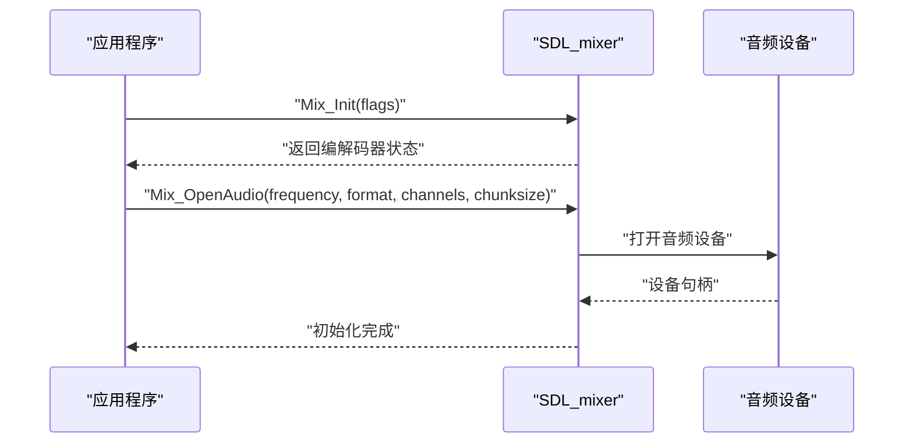
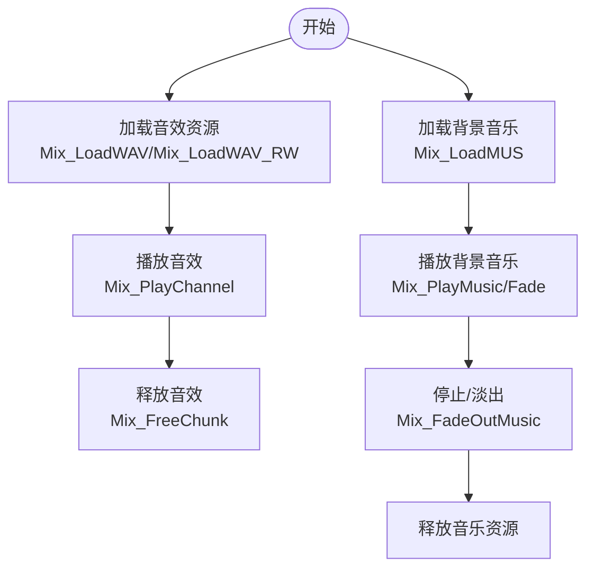
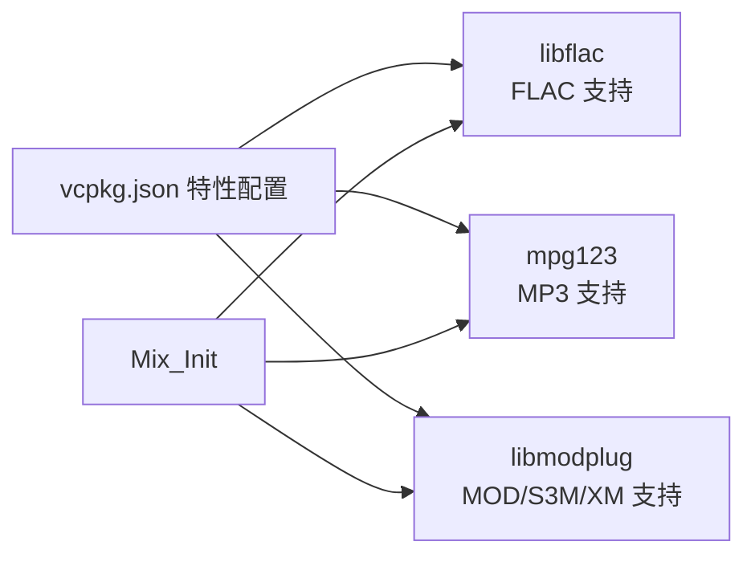
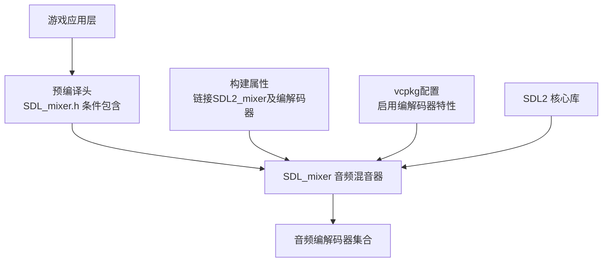
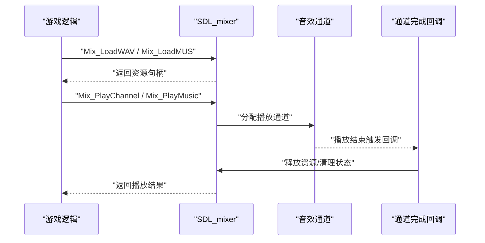
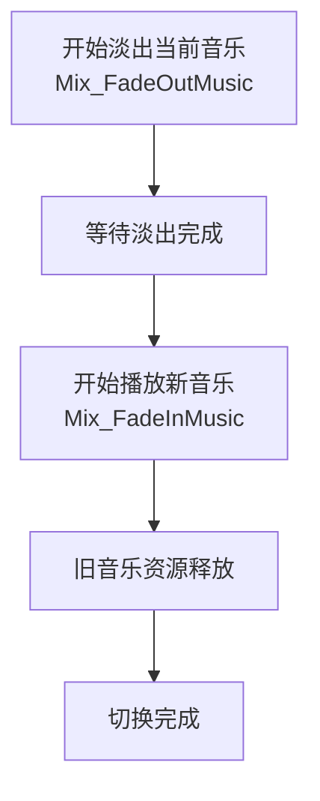
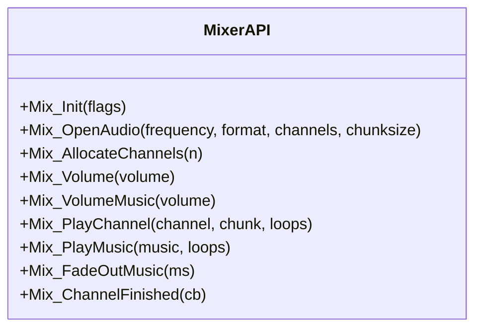
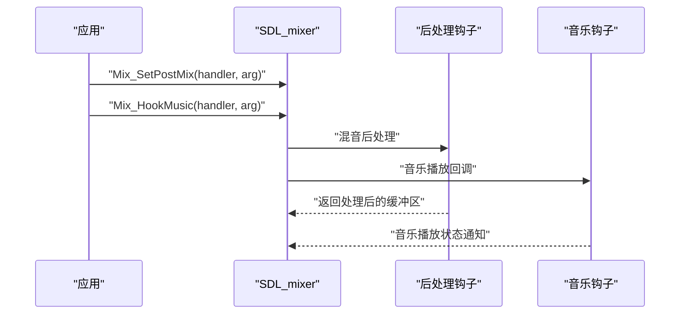
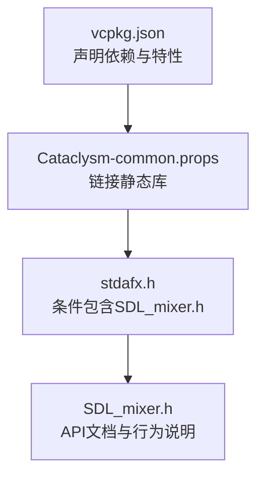

# 音频处理系统

<cite>
**本文档引用的文件**
- [Cataclysm-common.props](file://Cataclysm-common.props)
- [Cataclysm-lib-vcpkg-static.vcxproj](file://Cataclysm-lib-vcpkg-static.vcxproj)
- [vcpkg.json](file://vcpkg.json)
- [stdafx.h](file://stdafx.h)
- [SDL_mixer.h](file://vcpkg_installed/x64-windows-static/x64-windows-static/include/SDL2/SDL_mixer.h)
- [SDL_audio.h](file://vcpkg_installed/x64-windows-static/x64-windows-static/include/SDL2/SDL_audio.h)
</cite>

## 目录
1. [简介](#简介)
2. [项目结构](#项目结构)
3. [核心组件](#核心组件)
4. [架构概览](#架构概览)
5. [详细组件分析](#详细组件分析)
6. [依赖关系分析](#依赖关系分析)
7. [性能考虑](#性能考虑)
8. [故障排除指南](#故障排除指南)
9. [结论](#结论)

## 简介

本文件针对Cataclysm-DDA项目中的音频处理系统进行深入分析，重点围绕SDL_mixer音频子系统的集成与配置展开。根据仓库中的构建配置信息，项目已通过vcpkg安装并链接了SDL2及其音频扩展SDL_mixer，并启用了多种音频编解码器支持（FLAC、MP3、MOD等）。本文将从系统架构、组件关系、数据流、处理逻辑、集成点、错误处理和性能特征等方面进行全面阐述，并提供调试工具和故障排除指南。

## 项目结构

该项目采用基于vcpkg的静态库构建方式，音频处理能力通过SDL_mixer提供。关键配置包括：

- 构建属性中明确链接SDL2_mixer静态库及相关的音频编解码器库
- vcpkg配置声明了对SDL2-mixer的特性启用（libflac、mpg123、libmodplug）
- 预编译头文件中条件性包含SDL_mixer.h，确保在启用SDL_SOUND宏时可用

**图表来源**
- [Cataclysm-common.props:98-135](file://Cataclysm-common.props#L98-L135)
- [vcpkg.json:10-13](file://vcpkg.json#L10-L13)
- [stdafx.h:83-93](file://stdafx.h#L83-L93)

**章节来源**
- [Cataclysm-common.props:98-135](file://Cataclysm-common.props#L98-L135)
- [vcpkg.json:10-13](file://vcpkg.json#L10-L13)
- [stdafx.h:83-93](file://stdafx.h#L83-L93)

## 核心组件

### SDL_mixer集成与初始化

- 初始化流程：SDL_mixer通过Mix_Init加载所需编解码器，随后调用Mix_OpenAudio或Mix_OpenAudioDevice打开音频设备，准备播放音效与背景音乐。
- 设备参数：频率、采样格式、声道数、缓冲区大小等参数影响延迟与质量平衡。
- 关闭流程：Mix_CloseAudio关闭设备，Mix_Quit卸载编解码器，释放资源。

**图表来源**
- [SDL_mixer.h:168-209](file://vcpkg_installed/x64-windows-static/x64-windows-static/include/SDL2/SDL_mixer.h#L168-L209)
- [SDL_mixer.h:283-357](file://vcpkg_installed/x64-windows-static/x64-windows-static/include/SDL2/SDL_mixer.h#L283-L357)

**章节来源**
- [SDL_mixer.h:168-209](file://vcpkg_installed/x64-windows-static/x64-windows-static/include/SDL2/SDL_mixer.h#L168-L209)
- [SDL_mixer.h:283-357](file://vcpkg_installed/x64-windows-static/x64-windows-static/include/SDL2/SDL_mixer.h#L283-L357)

### 音效播放与背景音乐管理

- 音效（Chunk）：使用WAV等格式的短音效，通过Mix_LoadWAV/Mix_LoadWAV_RW加载到内存，播放后由Mix_FreeChunk释放。
- 背景音乐（Music）：支持多种格式，通过Mix_LoadMUS系列函数加载，播放时可设置循环、淡入淡出等效果。
- 播放控制：Mix_PlayChannel系列函数用于音效播放，Mix_FadeInMusic/Mix_FadeOutMusic用于背景音乐的渐变控制。

**图表来源**
- [SDL_mixer.h:558-616](file://vcpkg_installed/x64-windows-static/x64-windows-static/include/SDL2/SDL_mixer.h#L558-L616)
- [SDL_mixer.h:753-820](file://vcpkg_installed/x64-windows-static/x64-windows-static/include/SDL2/SDL_mixer.h#L753-L820)
- [SDL_mixer.h:1610-1680](file://vcpkg_installed/x64-windows-static/x64-windows-static/include/SDL2/SDL_mixer.h#L1610-L1680)

**章节来源**
- [SDL_mixer.h:558-616](file://vcpkg_installed/x64-windows-static/x64-windows-static/include/SDL2/SDL_mixer.h#L558-L616)
- [SDL_mixer.h:753-820](file://vcpkg_installed/x64-windows-static/x64-windows-static/include/SDL2/SDL_mixer.h#L753-L820)
- [SDL_mixer.h:1610-1680](file://vcpkg_installed/x64-windows-static/x64-windows-static/include/SDL2/SDL_mixer.h#L1610-L1680)

### 音频格式支持

- 编解码器特性：vcpkg配置启用了libflac、mpg123、libmodplug等特性，分别对应FLAC、MP3、MOD等格式的支持。
- 动态加载：Mix_Init按需加载编解码器，避免不必要的开销；Mix_Quit用于卸载。

**图表来源**
- [vcpkg.json:10-13](file://vcpkg.json#L10-L13)
- [Cataclysm-common.props:103-120](file://Cataclysm-common.props#L103-L120)

**章节来源**
- [vcpkg.json:10-13](file://vcpkg.json#L10-L13)
- [Cataclysm-common.props:103-120](file://Cataclysm-common.props#L103-L120)

## 架构概览

音频系统整体架构基于SDL2核心与SDL_mixer混音器，通过vcpkg提供的静态库进行集成。预编译头文件在启用SDL_SOUND宏时引入SDL_mixer.h，确保编译期可用性。构建属性中明确链接SDL2_mixer静态库及相关编解码器库，形成完整的音频播放链路。

**图表来源**
- [stdafx.h:83-93](file://stdafx.h#L83-L93)
- [Cataclysm-common.props:113-113](file://Cataclysm-common.props#L113-L113)
- [vcpkg.json:10-13](file://vcpkg.json#L10-L13)

**章节来源**
- [stdafx.h:83-93](file://stdafx.h#L83-L93)
- [Cataclysm-common.props:113-113](file://Cataclysm-common.props#L113-L113)
- [vcpkg.json:10-13](file://vcpkg.json#L10-L13)

## 详细组件分析

### 音频资源加载与缓存机制

- 音效资源：使用Mix_LoadWAV/Mix_LoadWAV_RW加载至内存，适合短促音效；播放完成后调用Mix_FreeChunk释放，避免内存泄漏。
- 背景音乐：通过Mix_LoadMUS系列函数加载，支持多种格式；播放时可设置循环与淡入淡出，提升听感平滑度。
- 缓存策略：SDL_mixer内部维护播放队列与回调机制，结合Mix_ChannelFinished回调可在通道释放时执行清理逻辑，实现资源回收与无缝切换的基础。

**图表来源**
- [SDL_mixer.h:558-616](file://vcpkg_installed/x64-windows-static/x64-windows-static/include/SDL2/SDL_mixer.h#L558-L616)
- [SDL_mixer.h:1243-1265](file://vcpkg_installed/x64-windows-static/x64-windows-static/include/SDL2/SDL_mixer.h#L1243-L1265)

**章节来源**
- [SDL_mixer.h:558-616](file://vcpkg_installed/x64-windows-static/x64-windows-static/include/SDL2/SDL_mixer.h#L558-L616)
- [SDL_mixer.h:1243-1265](file://vcpkg_installed/x64-windows-static/x64-windows-static/include/SDL2/SDL_mixer.h#L1243-L1265)

### 无缝音频切换实现

- 渐变控制：使用Mix_FadeOutMusic与Mix_FadeInMusic实现背景音乐的淡出与淡入，避免切换时的突兀。
- 通道优先级：Mix_PlayChannel系列函数支持指定通道，合理安排音效通道可减少冲突；当通道不足时，自动选择空闲通道。
- 回调清理：通过Mix_ChannelFinished注册回调，在音效播放结束后及时释放资源，为新音效腾挪空间。

**图表来源**
- [SDL_mixer.h:1610-1680](file://vcpkg_installed/x64-windows-static/x64-windows-static/include/SDL2/SDL_mixer.h#L1610-L1680)
- [SDL_mixer.h:1243-1265](file://vcpkg_installed/x64-windows-static/x64-windows-static/include/SDL2/SDL_mixer.h#L1243-L1265)

**章节来源**
- [SDL_mixer.h:1610-1680](file://vcpkg_installed/x64-windows-static/x64-windows-static/include/SDL2/SDL_mixer.h#L1610-L1680)
- [SDL_mixer.h:1243-1265](file://vcpkg_installed/x64-windows-static/x64-windows-static/include/SDL2/SDL_mixer.h#L1243-L1265)

### 音量控制与声道管理

- 音量控制：SDL_mixer提供全局音量与通道音量两级控制，可通过Mix_Volume/Mix_VolumeChunk/Mix_VolumeMusic调整不同对象的音量。
- 声道管理：Mix_AllocateChannels设置总通道数，Mix_ReserveChannels预留保留通道；Mix_GroupChannel/Mix_GroupAvailable用于分组管理，便于批量控制。
- 设备参数：Mix_OpenAudio/Mix_OpenAudioDevice的参数直接影响延迟与质量，需根据平台与性能目标进行权衡。

**图表来源**
- [SDL_mixer.h:168-209](file://vcpkg_installed/x64-windows-static/x64-windows-static/include/SDL2/SDL_mixer.h#L168-L209)
- [SDL_mixer.h:283-357](file://vcpkg_installed/x64-windows-static/x64-windows-static/include/SDL2/SDL_mixer.h#L283-L357)
- [SDL_mixer.h:1243-1265](file://vcpkg_installed/x64-windows-static/x64-windows-static/include/SDL2/SDL_mixer.h#L1243-L1265)

**章节来源**
- [SDL_mixer.h:168-209](file://vcpkg_installed/x64-windows-static/x64-windows-static/include/SDL2/SDL_mixer.h#L168-L209)
- [SDL_mixer.h:283-357](file://vcpkg_installed/x64-windows-static/x64-windows-static/include/SDL2/SDL_mixer.h#L283-L357)
- [SDL_mixer.h:1243-1265](file://vcpkg_installed/x64-windows-static/x64-windows-static/include/SDL2/SDL_mixer.h#L1243-L1265)

### 3D音频效果与高级特性

- 音乐钩子：Mix_HookMusic/Mix_SetPostMix允许在混音阶段插入自定义处理逻辑，可用于实现简单的3D音频效果或音效增强。
- 后处理：Mix_SetPostMix在最终输出前对混合缓冲区进行处理，适合实现空间化、回声等效果。
- 音乐完成回调：Mix_HookMusicFinished在音乐播放结束时触发，便于执行清理或切换逻辑。

**图表来源**
- [SDL_mixer.h:1154-1202](file://vcpkg_installed/x64-windows-static/x64-windows-static/include/SDL2/SDL_mixer.h#L1154-L1202)
- [SDL_mixer.h:1229-1243](file://vcpkg_installed/x64-windows-static/x64-windows-static/include/SDL2/SDL_mixer.h#L1229-L1243)

**章节来源**
- [SDL_mixer.h:1154-1202](file://vcpkg_installed/x64-windows-static/x64-windows-static/include/SDL2/SDL_mixer.h#L1154-L1202)
- [SDL_mixer.h:1229-1243](file://vcpkg_installed/x64-windows-static/x64-windows-static/include/SDL2/SDL_mixer.h#L1229-L1243)

## 依赖关系分析

音频系统的关键依赖关系如下：

- vcpkg.json声明SDL2-mixer及其特性，确保编译期可用
- Cataclysm-common.props链接SDL2_mixer-static与各编解码器静态库
- stdafx.h在启用SDL_SOUND宏时包含SDL_mixer.h，保证编译期接口可用
- SDL_mixer.h提供完整的API文档与行为说明，指导开发实践

**图表来源**
- [vcpkg.json:10-13](file://vcpkg.json#L10-L13)
- [Cataclysm-common.props:113-113](file://Cataclysm-common.props#L113-L113)
- [stdafx.h:83-93](file://stdafx.h#L83-L93)
- [SDL_mixer.h:1-120](file://vcpkg_installed/x64-windows-static/x64-windows-static/include/SDL2/SDL_mixer.h#L1-L120)

**章节来源**
- [vcpkg.json:10-13](file://vcpkg.json#L10-L13)
- [Cataclysm-common.props:113-113](file://Cataclysm-common.props#L113-L113)
- [stdafx.h:83-93](file://stdafx.h#L83-L93)
- [SDL_mixer.h:1-120](file://vcpkg_installed/x64-windows-static/x64-windows-static/include/SDL2/SDL_mixer.h#L1-L120)

## 性能考虑

- 延迟控制：通过Mix_OpenAudio/Mix_OpenAudioDevice的chunksize参数调节缓冲区大小，较小的chunksize可降低延迟但增加CPU占用；较大的chunksize提高稳定性但会增加延迟。
- 内存使用：音效资源应按需加载并在播放完毕后及时释放；背景音乐建议采用流式播放以减少内存峰值。
- 通道管理：合理设置Mix_AllocateChannels与Mix_ReserveChannels，避免频繁的通道分配/回收导致的抖动。
- 编解码器选择：根据目标平台与资源大小选择合适的编解码器特性，避免加载过多不必要模块。

## 故障排除指南

- 初始化失败：检查Mix_Init返回值与Mix_OpenAudio/Mix_OpenAudioDevice的参数是否正确；确认编解码器库已正确链接。
- 播放无声：验证音频设备是否成功打开，检查Mix_Volume与Mix_VolumeMusic设置；确认SDL音频子系统已正确初始化。
- 资源泄漏：确保每次Mix_LoadWAV/Mix_LoadMUS后都有对应的Mix_FreeChunk/Mix_FreeMusic调用；利用Mix_ChannelFinished回调进行资源回收。
- 切换卡顿：优化chunksize与缓冲策略，避免在主线程执行耗时操作；使用淡入淡出减少突兀切换。
- 调试建议：结合SDL音频提示与日志输出定位问题；逐步缩小范围，先验证基础播放再添加复杂效果。

**章节来源**
- [SDL_mixer.h:168-209](file://vcpkg_installed/x64-windows-static/x64-windows-static/include/SDL2/SDL_mixer.h#L168-L209)
- [SDL_mixer.h:283-357](file://vcpkg_installed/x64-windows-static/x64-windows-static/include/SDL2/SDL_mixer.h#L283-L357)
- [SDL_audio.h:327-345](file://vcpkg_installed/x64-windows-static/x64-windows-static/include/SDL2/SDL_audio.h#L327-L345)

## 结论

本项目通过vcpkg集成SDL2与SDL_mixer，并启用多种音频编解码器特性，为游戏提供了完善的音频播放能力。基于SDL_mixer的初始化、资源管理、播放控制与回调机制，可以实现音效与背景音乐的高效播放与无缝切换。通过合理的延迟与内存策略、通道管理以及编解码器选择，能够在不同平台上获得稳定且低延迟的音频体验。配合本文提供的故障排除指南，开发者可快速定位并解决常见音频问题。