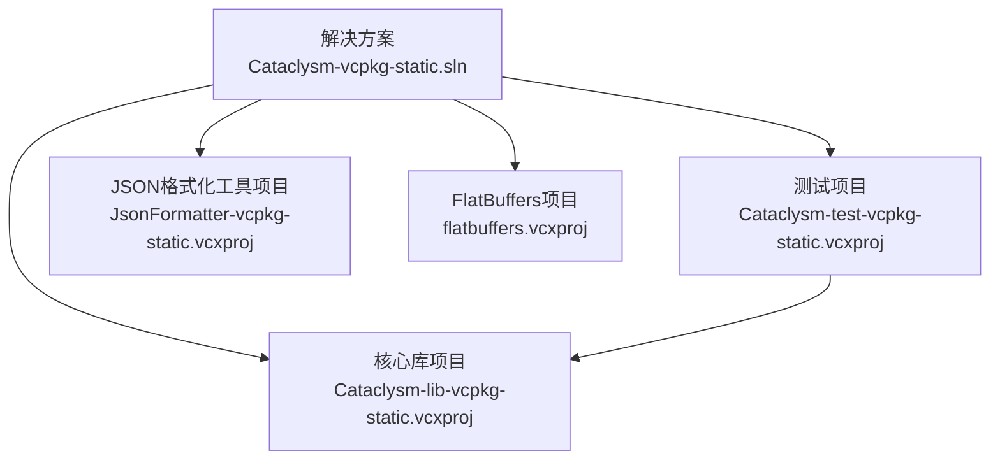
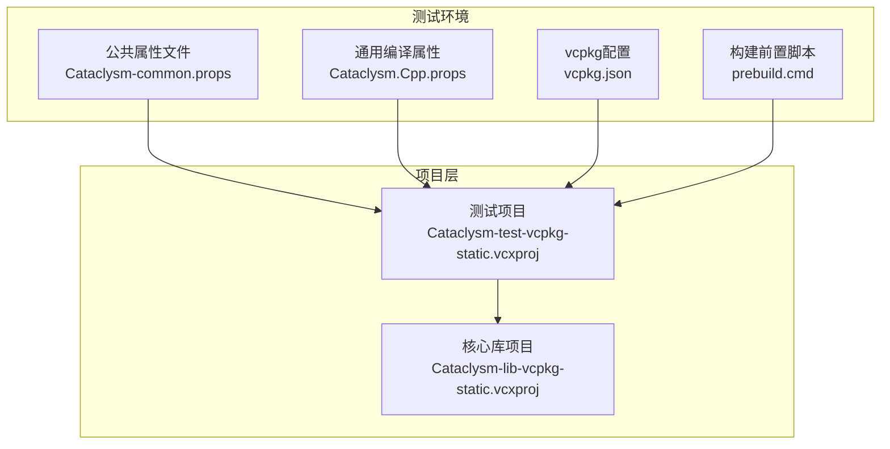
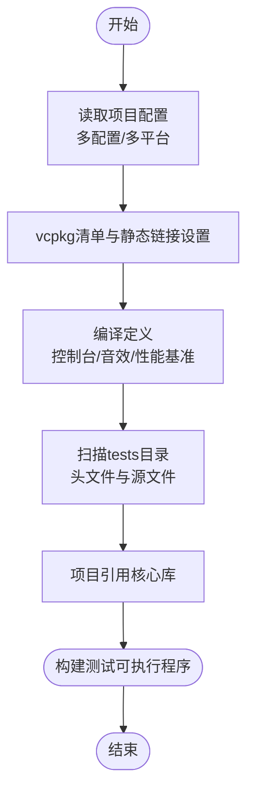
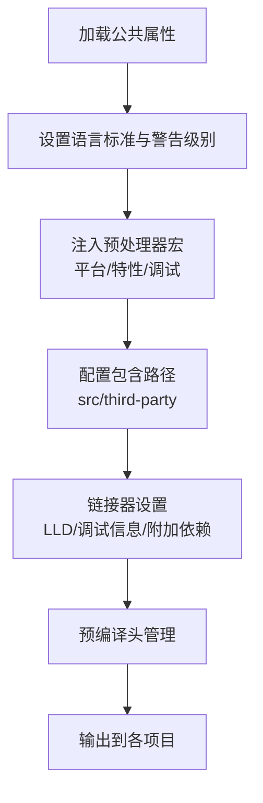
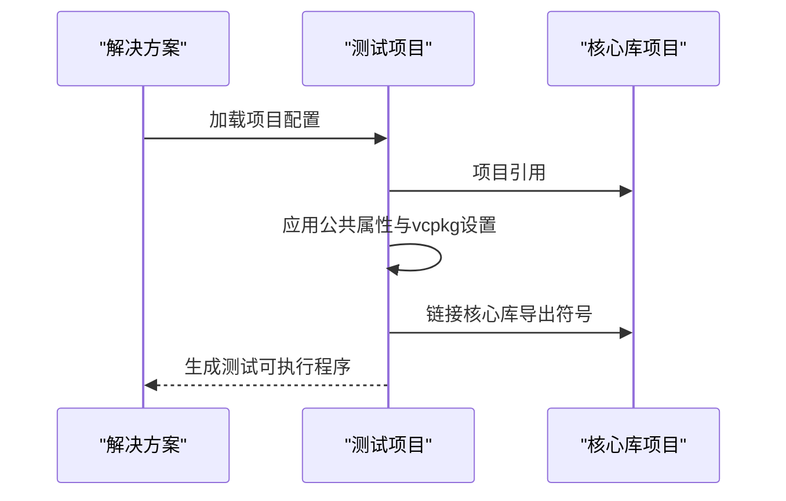
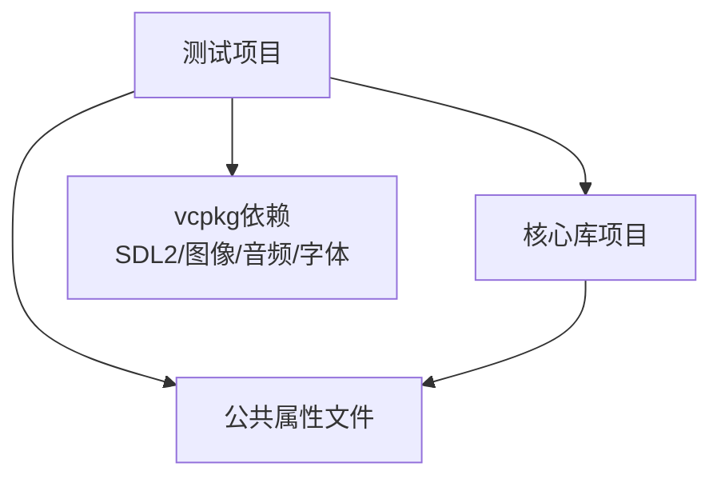

# 测试框架

<cite>
**本文引用的文件**
- [Cataclysm-test-vcpkg-static.vcxproj](file://Cataclysm-test-vcpkg-static.vcxproj)
- [Cataclysm-vcpkg-static.sln](file://Cataclysm-vcpkg-static.sln)
- [Cataclysm.Cpp.props](file://Cataclysm.Cpp.props)
- [Cataclysm-common.props](file://Cataclysm-common.props)
- [vcpkg.json](file://vcpkg.json)
- [prebuild.cmd](file://prebuild.cmd)
- [distribute.bat](file://distribute.bat)
- [JsonFormatter-vcpkg-static.vcxproj](file://JsonFormatter-vcpkg-static.vcxproj)
- [flatbuffers.vcxproj](file://flatbuffers.vcxproj)
</cite>

## 目录
1. [引言](#引言)
2. [项目结构](#项目结构)
3. [核心组件](#核心组件)
4. [架构总览](#架构总览)
5. [详细组件分析](#详细组件分析)
6. [依赖分析](#依赖分析)
7. [性能考虑](#性能考虑)
8. [故障排查指南](#故障排查指南)
9. [结论](#结论)
10. [附录](#附录)

## 引言
本文件系统性阐述 MSVC Full Features 项目的测试框架架构与实践，覆盖单元测试、性能测试与集成测试的组织方式与执行流程；解释测试项目的配置与编译设置、与核心库的依赖关系；分析测试覆盖率与质量保证流程；给出测试用例编写指南（最佳实践与常见模式）；说明在持续集成环境下的测试执行策略及测试失败与调试要点。文档面向不同技术背景读者，力求以循序渐进的方式呈现。

## 项目结构
该仓库采用多项目解决方案组织，测试框架位于独立的测试可执行项目中，并通过 vcpkg 管理第三方依赖，统一使用公共属性文件进行编译与链接配置。测试项目直接引用核心库项目作为其依赖，形成“测试可执行程序 → 核心库”的依赖链路。

图表来源
- [Cataclysm-vcpkg-static.sln:17-28](file://Cataclysm-vcpkg-static.sln#L17-L28)
- [Cataclysm-test-vcpkg-static.vcxproj:188-191](file://Cataclysm-test-vcpkg-static.vcxproj#L188-L191)

章节来源
- [Cataclysm-vcpkg-static.sln:1-189](file://Cataclysm-vcpkg-static.sln#L1-L189)
- [Cataclysm-test-vcpkg-static.vcxproj:1-195](file://Cataclysm-test-vcpkg-static.vcxproj#L1-L195)

## 核心组件
- 测试可执行项目：负责收集与运行测试用例，包含单元测试与性能测试入口，支持多种配置与平台组合。
- 核心库项目：被测试项目直接引用，提供被测功能模块。
- 公共属性文件：集中定义编译选项、预处理器宏、包含路径、链接器参数等，确保跨项目一致性。
- vcpkg 配置：声明第三方依赖（如 SDL2 及其扩展），并指定 overlay ports 路径。
- 构建前置脚本：生成版本头文件，供构建期使用。
- 分发脚本：用于打包分发所需资源与可执行文件。

章节来源
- [Cataclysm-test-vcpkg-static.vcxproj:123-186](file://Cataclysm-test-vcpkg-static.vcxproj#L123-L186)
- [Cataclysm-common.props:41-143](file://Cataclysm-common.props#L41-L143)
- [vcpkg.json:1-22](file://vcpkg.json#L1-L22)
- [prebuild.cmd:1-16](file://prebuild.cmd#L1-L16)
- [distribute.bat:1-11](file://distribute.bat#L1-L11)

## 架构总览
测试框架围绕“测试可执行程序 + 核心库 + vcpkg 依赖 + 公共属性”展开，测试项目通过项目引用与 vcpkg 自动链接机制与核心库建立依赖关系。公共属性文件统一控制编译语言标准、警告级别、预处理器宏、包含路径、链接器行为等，确保测试与核心库在一致的编译环境下协同工作。

图表来源
- [Cataclysm-common.props:41-143](file://Cataclysm-common.props#L41-L143)
- [Cataclysm.Cpp.props:1-11](file://Cataclysm.Cpp.props#L1-L11)
- [vcpkg.json:1-22](file://vcpkg.json#L1-L22)
- [prebuild.cmd:1-16](file://prebuild.cmd#L1-L16)
- [Cataclysm-test-vcpkg-static.vcxproj:123-191](file://Cataclysm-test-vcpkg-static.vcxproj#L123-L191)

## 详细组件分析

### 测试项目（Cataclysm-test-vcpkg-static）
- 多配置与多平台：支持 Debug/Release 与 NoTiles 变体，覆盖 Win32/x64/ARM64EC 平台，便于在不同硬件与优化级别下验证行为。
- vcpkg 集成：启用 vcpkg 清单安装、静态链接、自动链接与用户三元组，确保第三方库按需安装并正确链接。
- 编译定义：启用控制台应用、音效相关宏、性能基准宏，满足测试与性能评估需求。
- 源码组织：自动包含 tests 目录下的头文件与源文件，形成“测试用例即源码”的组织方式。
- 依赖关系：通过项目引用直接依赖核心库项目，确保测试可访问核心库导出的符号与接口。

图表来源
- [Cataclysm-test-vcpkg-static.vcxproj:3-51](file://Cataclysm-test-vcpkg-static.vcxproj#L3-L51)
- [Cataclysm-test-vcpkg-static.vcxproj:63-73](file://Cataclysm-test-vcpkg-static.vcxproj#L63-L73)
- [Cataclysm-test-vcpkg-static.vcxproj:123-131](file://Cataclysm-test-vcpkg-static.vcxproj#L123-L131)
- [Cataclysm-test-vcpkg-static.vcxproj:180-191](file://Cataclysm-test-vcpkg-static.vcxproj#L180-L191)

章节来源
- [Cataclysm-test-vcpkg-static.vcxproj:1-195](file://Cataclysm-test-vcpkg-static.vcxproj#L1-L195)

### 公共属性文件（Cataclysm-common.props）
- 统一编译选项：语言标准为 C++17，禁用部分安全检查与特定警告，提升编译速度与兼容性。
- 预处理器宏：统一定义平台与特性宏，支持回溯、发布构建、vcpkg 使用等条件开关。
- 包含路径：自动包含 src 与 third-party 目录，便于测试与核心库共享头文件。
- 链接器设置：在使用 LLD 链接器时，手动枚举依赖库并调整调试信息格式，避免某些工具链版本的已知问题。
- 预编译头：统一管理预编译头文件，减少编译时间。

图表来源
- [Cataclysm-common.props:41-143](file://Cataclysm-common.props#L41-L143)

章节来源
- [Cataclysm-common.props:1-154](file://Cataclysm-common.props#L1-L154)

### vcpkg 配置（vcpkg.json）
- 依赖声明：SDL2 及其图像、音频、字体扩展，满足图形与音效测试场景。
- Overlay Ports：指向 GitHub overlay，用于定制端口或补丁。
- 与测试项目配合：测试项目启用 vcpkg 清单安装与自动链接，确保第三方库在构建期可用。

章节来源
- [vcpkg.json:1-22](file://vcpkg.json#L1-L22)
- [Cataclysm-test-vcpkg-static.vcxproj:63-73](file://Cataclysm-test-vcpkg-static.vcxproj#L63-L73)

### 构建前置脚本（prebuild.cmd）
- 版本生成：通过 Git 描述生成版本号，写入版本头文件，供构建期使用。
- 条件触发：仅在版本头文件不存在或内容不匹配时重新生成，避免不必要的重编译。

章节来源
- [prebuild.cmd:1-16](file://prebuild.cmd#L1-L16)

### 分发脚本（distribute.bat）
- 资源复制：将 DLL、数据、配置、图形、语言资源与可执行文件复制到分发目录，便于测试与演示。

章节来源
- [distribute.bat:1-11](file://distribute.bat#L1-L11)

### 项目引用与依赖链
测试项目通过项目引用依赖核心库，形成稳定的依赖链。公共属性文件确保两者在编译与链接阶段保持一致的配置。

图表来源
- [Cataclysm-vcpkg-static.sln:17-28](file://Cataclysm-vcpkg-static.sln#L17-L28)
- [Cataclysm-test-vcpkg-static.vcxproj:188-191](file://Cataclysm-test-vcpkg-static.vcxproj#L188-L191)

章节来源
- [Cataclysm-vcpkg-static.sln:1-189](file://Cataclysm-vcpkg-static.sln#L1-L189)
- [Cataclysm-test-vcpkg-static.vcxproj:188-191](file://Cataclysm-test-vcpkg-static.vcxproj#L188-L191)

## 依赖分析
- 项目耦合：测试项目对核心库存在直接引用，耦合度高但职责清晰（测试验证核心库行为）。
- 外部依赖：通过 vcpkg 管理 SDL2 生态（图像、音频、字体），测试项目启用自动链接，降低手工维护成本。
- 配置一致性：公共属性文件集中控制编译与链接行为，避免重复配置带来的不一致风险。
- 平台与变体：多配置与多平台支持，有助于在不同硬件与优化级别下验证稳定性与性能。

图表来源
- [Cataclysm-test-vcpkg-static.vcxproj:188-191](file://Cataclysm-test-vcpkg-static.vcxproj#L188-L191)
- [vcpkg.json:4-15](file://vcpkg.json#L4-L15)
- [Cataclysm-common.props:41-143](file://Cataclysm-common.props#L41-L143)

章节来源
- [Cataclysm-test-vcpkg-static.vcxproj:1-195](file://Cataclysm-test-vcpkg-static.vcxproj#L1-L195)
- [vcpkg.json:1-22](file://vcpkg.json#L1-L22)
- [Cataclysm-common.props:1-154](file://Cataclysm-common.props#L1-L154)

## 性能考虑
- 编译优化：在 Release 配置下启用最大速度优化与函数级链接，缩短测试可执行程序体积与启动时间。
- 链接器选择：在使用 LLD 链接器时，手动枚举依赖库并调整调试信息格式，规避工具链版本问题。
- 预编译头：统一管理预编译头，减少编译时间，提高迭代效率。
- 多平台覆盖：通过多平台构建，可在不同 CPU/架构上评估性能差异。

章节来源
- [Cataclysm-common.props:59-90](file://Cataclysm-common.props#L59-L90)
- [Cataclysm-common.props:91-140](file://Cataclysm-common.props#L91-L140)
- [Cataclysm-test-vcpkg-static.vcxproj:148-174](file://Cataclysm-test-vcpkg-static.vcxproj#L148-L174)

## 故障排查指南
- 构建失败（缺少版本头）：确认 prebuild.cmd 已执行且 Git 可用；检查版本头是否生成。
- vcpkg 依赖缺失：确认 vcpkg 清单安装已启用，且 overlay ports 路径有效；清理缓存后重试安装。
- 链接错误（LLD 链接器）：检查公共属性文件中的附加库列表是否完整；必要时关闭自动链接由项目自行枚举。
- 调试信息异常：若使用 VS 2022 某版本的 DebugFastLink 出现崩溃，公共属性文件已针对该问题调整为 DebugFull。
- 多平台/多配置问题：核对解决方案配置平台映射，确保测试项目与核心库的配置一致。

章节来源
- [prebuild.cmd:1-16](file://prebuild.cmd#L1-L16)
- [Cataclysm-test-vcpkg-static.vcxproj:63-73](file://Cataclysm-test-vcpkg-static.vcxproj#L63-L73)
- [Cataclysm-common.props:81-85](file://Cataclysm-common.props#L81-L85)
- [Cataclysm-common.props:91-140](file://Cataclysm-common.props#L91-L140)

## 结论
该测试框架通过“测试可执行项目 + 核心库 + vcpkg + 公共属性”的组合，实现了跨平台、多配置的测试组织与执行。公共属性文件统一了编译与链接策略，vcpkg 管理第三方依赖，项目引用确保测试与核心库的紧密耦合。结合多配置与多平台支持，能够在不同硬件与优化级别下验证功能与性能。建议在持续集成中按平台与配置矩阵运行测试，并结合日志与产物进行回归分析与质量度量。

## 附录

### 测试类型与组织
- 单元测试：聚焦小范围功能与边界条件，快速反馈。
- 性能测试：利用性能基准宏与计时手段，评估关键路径性能。
- 集成测试：验证模块间交互与第三方依赖（如 SDL2 生态）的协同工作。

### 测试用例编写指南（最佳实践与常见模式）
- 分离关注点：每个测试用例聚焦单一行为，输入/断言清晰。
- 前置与清理：使用合适的 setUp/tearDown 或 RAII 模式，确保测试隔离。
- 参数化与数据驱动：对边界值与典型输入进行参数化，提升覆盖面。
- 平台与配置感知：在多配置/多平台下，注意条件编译与平台差异。
- 性能基线：记录关键路径的性能基线，纳入回归检查。

### 持续集成执行策略
- 矩阵构建：按平台（Win32/x64/ARM64EC）与配置（Debug/Release、带/不带 Tiles）执行测试。
- 依赖准备：确保 vcpkg 依赖安装完成，必要时开启缓存与增量安装。
- 日志与产物：收集测试日志、覆盖率报告与可执行程序，便于回溯与分析。
- 失败处理：失败时保留构建产物与日志，触发告警并通知相关开发者。

### 质量保证流程与覆盖率
- 覆盖率采集：在测试项目中启用相应覆盖率工具（如 Visual Studio 内置或外部工具），在 CI 中汇总统计。
- 回归分析：将覆盖率与关键路径性能纳入门禁指标，阻止降级提交进入主干。
- 报告输出：生成 HTML/XML 报告并与 CI 平台集成，便于团队查看与追踪。