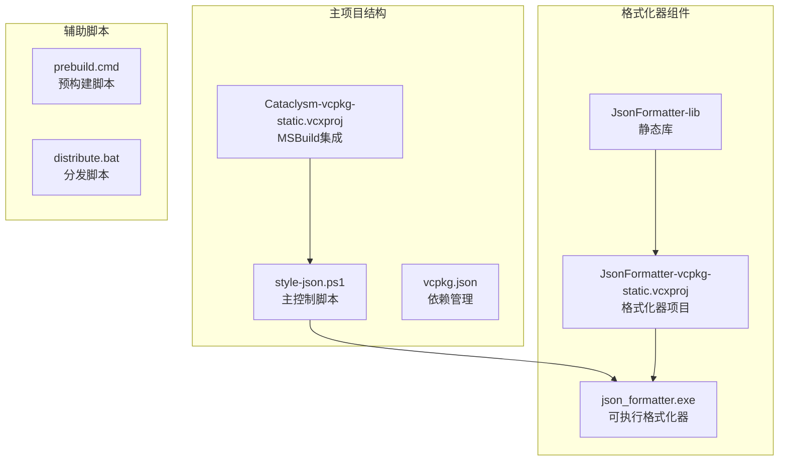
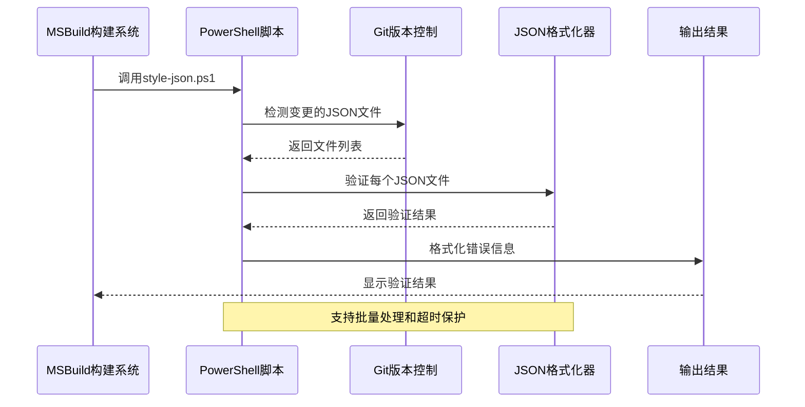
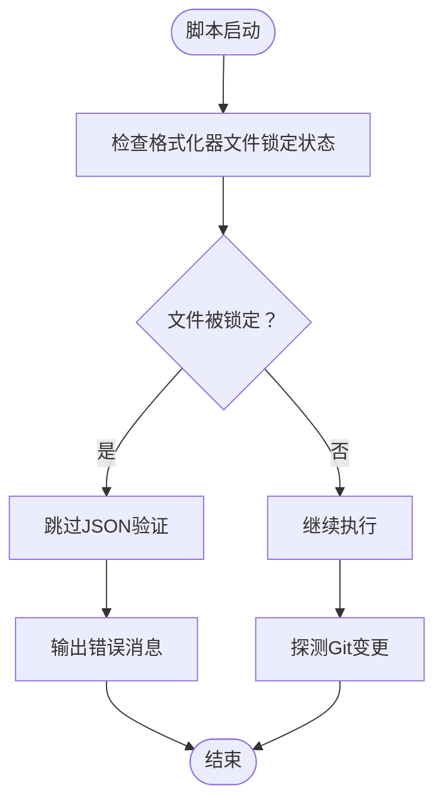
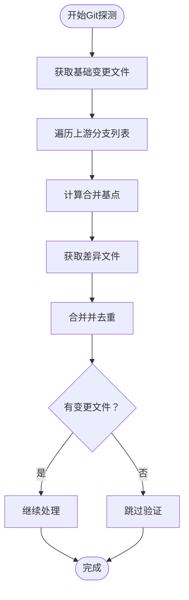
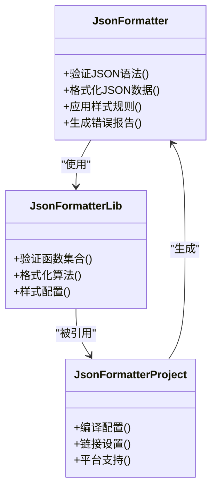
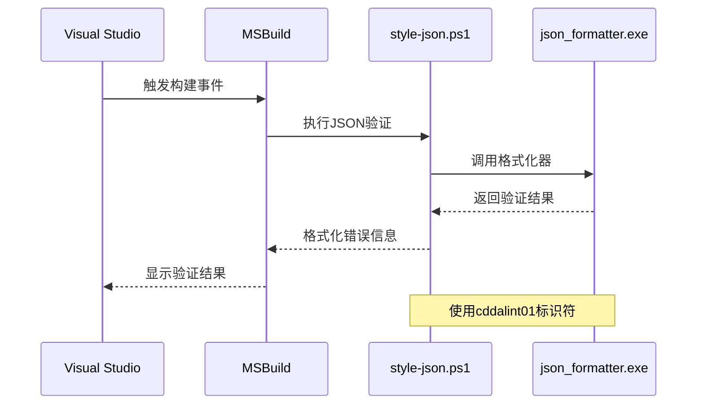
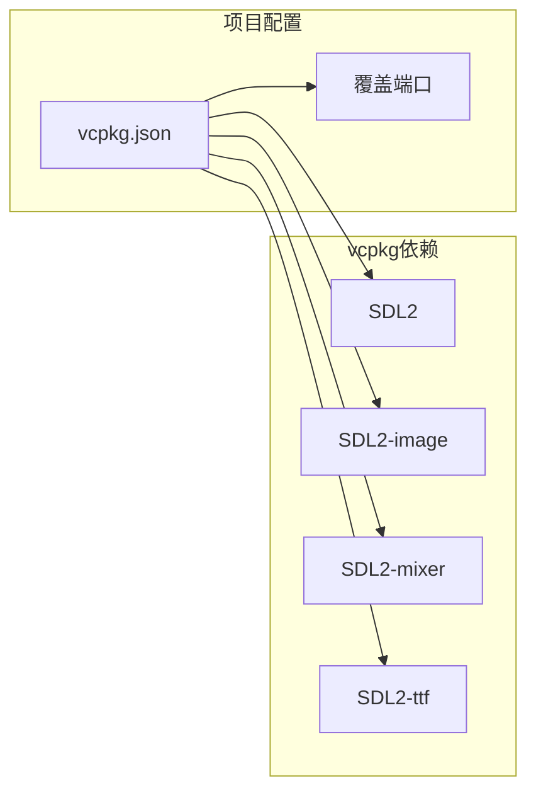
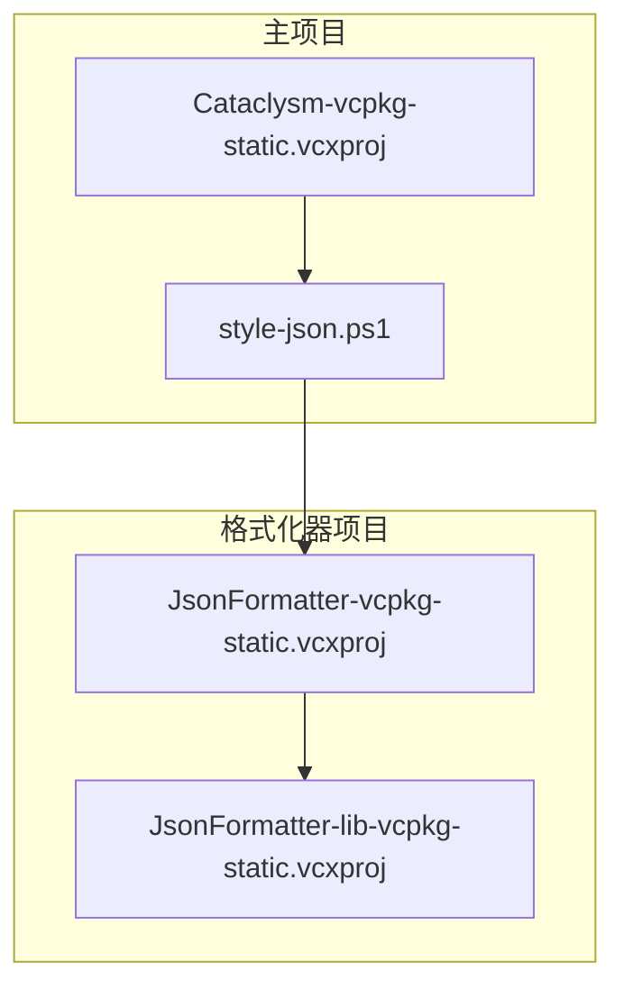
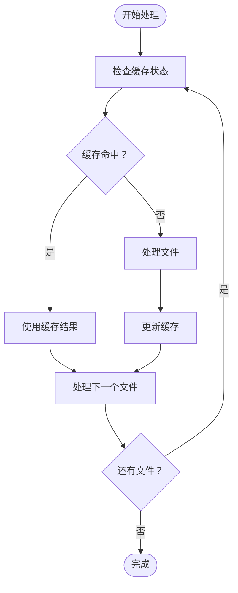
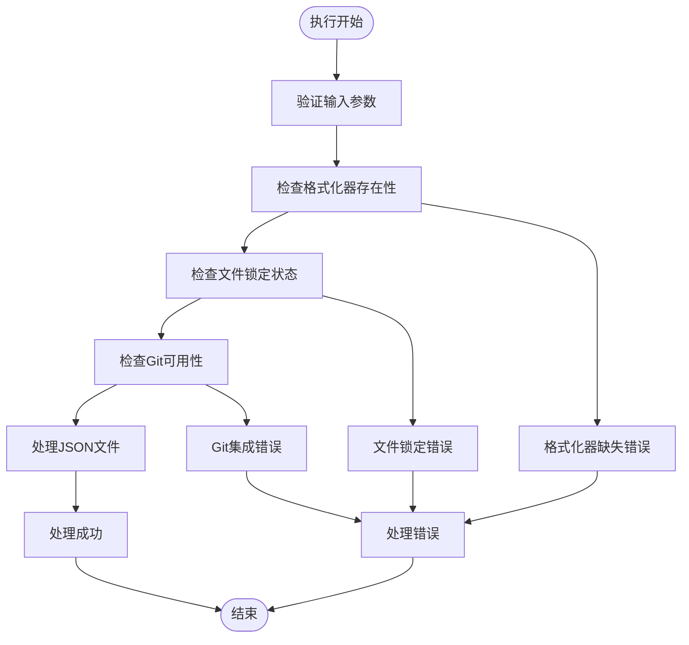

# JSON格式化工具

<cite>
**本文档引用的文件**
- [style-json.ps1](file://style-json.ps1)
- [vcpkg.json](file://vcpkg.json)
- [Cataclysm-vcpkg-static.vcxproj](file://Cataclysm-vcpkg-static.vcxproj)
- [JsonFormatter-vcpkg-static.vcxproj](file://JsonFormatter-vcpkg-static.vcxproj)
- [JsonFormatter-lib-vcpkg-static.vcxproj](file://JsonFormatter-lib-vcpkg-static.vcxproj)
- [prebuild.cmd](file://prebuild.cmd)
- [distribute.bat](file://distribute.bat)
</cite>

## 目录
1. [简介](#简介)
2. [项目结构](#项目结构)
3. [核心组件](#核心组件)
4. [架构概览](#架构概览)
5. [详细组件分析](#详细组件分析)
6. [依赖关系分析](#依赖关系分析)
7. [性能考虑](#性能考虑)
8. [故障排除指南](#故障排除指南)
9. [结论](#结论)

## 简介

JSON格式化工具是一个集成在Cataclysm Medieval开发环境中的自动化工具集，专门用于验证和格式化JSON文件。该工具通过PowerShell脚本与自定义的C++格式化器结合，实现了高效的JSON数据验证和格式化功能。

该项目的核心目标是确保游戏项目中所有JSON配置文件的语法正确性和格式一致性，特别是在大型团队协作环境中维护代码质量。

## 项目结构

项目采用模块化设计，主要包含以下关键组件：



**图表来源**
- [style-json.ps1:1-78](file://style-json.ps1#L1-L78)
- [Cataclysm-vcpkg-static.vcxproj:163-170](file://Cataclysm-vcpkg-static.vcxproj#L163-L170)

**章节来源**
- [style-json.ps1:1-78](file://style-json.ps1#L1-L78)
- [vcpkg.json:1-22](file://vcpkg.json#L1-L22)

## 核心组件

### 主要功能模块

1. **PowerShell控制脚本** (`style-json.ps1`)
   - Git变更检测和文件筛选
   - 执行时间监控和超时保护
   - 格式化器调用和结果处理

2. **JSON格式化器** (`json_formatter.exe`)
   - 基于C++实现的高性能格式化器
   - 支持多种JSON验证规则
   - 可扩展的验证框架

3. **MSBuild集成** (`Cataclysm-vcpkg-static.vcxproj`)
   - 自动化构建流程集成
   - 错误报告格式化
   - 构建过程中的JSON验证

**章节来源**
- [style-json.ps1:24-34](file://style-json.ps1#L24-L34)
- [Cataclysm-vcpkg-static.vcxproj:166-170](file://Cataclysm-vcpkg-static.vcxproj#L166-L170)

## 架构概览

系统采用分层架构设计，实现了从构建到验证的完整流程：



**图表来源**
- [style-json.ps1:36-51](file://style-json.ps1#L36-L51)
- [style-json.ps1:58-76](file://style-json.ps1#L58-L76)

## 详细组件分析

### PowerShell控制脚本分析

#### 文件锁定检测机制

脚本实现了智能的文件锁定检测，确保格式化器可执行文件可用：



**图表来源**
- [style-json.ps1:6-9](file://style-json.ps1#L6-L9)
- [style-json.ps1:32-34](file://style-json.ps1#L32-L34)

#### Git变更检测算法

脚本使用多分支探测策略来识别需要验证的JSON文件：



**图表来源**
- [style-json.ps1:37-47](file://style-json.ps1#L37-L47)

#### 执行时间监控

脚本内置了30秒的执行时间限制，防止长时间运行影响构建效率：

```mermaid
stateDiagram-v2
[*] --> 初始化计时器
初始化计时器 --> 运行格式化器
运行格式化器 --> 检查时间限制
检查时间限制 --> 时间充足{"时间是否超过限制？"}
时间充足 --> |否| 继续处理下一个文件
时间充足 --> |是| 中止执行
继续处理下一个文件 --> 运行格式化器
中止执行 --> 输出警告
输出警告 --> [*]
```

**图表来源**
- [style-json.ps1:20-22](file://style-json.ps1#L20-L22)
- [style-json.ps1:58-61](file://style-json.ps1#L58-L61)

**章节来源**
- [style-json.ps1:1-78](file://style-json.ps1#L1-L78)

### JSON格式化器组件

#### 项目结构

格式化器采用静态库架构，提供了清晰的接口分离：



**图表来源**
- [JsonFormatter-vcpkg-static.vcxproj:85-102](file://JsonFormatter-vcpkg-static.vcxproj#L85-L102)
- [JsonFormatter-lib-vcpkg-static.vcxproj:33-57](file://JsonFormatter-lib-vcpkg-static.vcxproj#L33-L57)

#### MSBuild集成

格式化器与Visual Studio构建系统的深度集成：



**图表来源**
- [Cataclysm-vcpkg-static.vcxproj:166-170](file://Cataclysm-vcpkg-static.vcxproj#L166-L170)
- [style-json.ps1:12-17](file://style-json.ps1#L12-L17)

**章节来源**
- [JsonFormatter-vcpkg-static.vcxproj:1-154](file://JsonFormatter-vcpkg-static.vcxproj#L1-L154)
- [JsonFormatter-lib-vcpkg-static.vcxproj:1-57](file://JsonFormatter-lib-vcpkg-static.vcxproj#L1-L57)

## 依赖关系分析

### 外部依赖管理

项目使用vcpkg进行依赖管理，确保构建环境的一致性：



**图表来源**
- [vcpkg.json:4-15](file://vcpkg.json#L4-L15)

### 内部组件依赖

格式化器项目之间的依赖关系：



**图表来源**
- [JsonFormatter-vcpkg-static.vcxproj:145-149](file://JsonFormatter-vcpkg-static.vcxproj#L145-L149)

**章节来源**
- [vcpkg.json:1-22](file://vcpkg.json#L1-L22)
- [JsonFormatter-vcpkg-static.vcxproj:145-149](file://JsonFormatter-vcpkg-static.vcxproj#L145-L149)

## 性能考虑

### 批量处理优化

脚本实现了智能的批量处理策略：

1. **进度报告优化**
   - 每处理1个、100个或最后一个文件时输出进度
   - 减少频繁I/O操作对性能的影响

2. **内存管理**
   - 使用管道流处理大量文件
   - 避免一次性加载所有文件到内存

3. **并发控制**
   - 单线程顺序处理避免资源竞争
   - 执行时间限制防止长时间阻塞

### 缓存和重用策略



**章节来源**
- [style-json.ps1:53-56](file://style-json.ps1#L53-L56)
- [style-json.ps1:20-22](file://style-json.ps1#L20-L22)

## 故障排除指南

### 常见问题诊断

#### 格式化器不可用

**症状**: 脚本输出"格式化器可执行文件未找到"消息

**解决方案**:
1. 确认格式化器项目已成功构建
2. 检查`tools/format/`目录是否存在
3. 验证文件权限设置

#### 文件锁定问题

**症状**: 脚本输出"格式化器文件被锁定"消息

**解决方案**:
1. 关闭正在使用的IDE或编辑器
2. 等待构建进程完成
3. 重新运行脚本

#### Git集成问题

**症状**: 无法检测到变更的JSON文件

**解决方案**:
1. 确保Git命令可用
2. 检查工作目录状态
3. 验证分支名称正确性

### 错误处理机制

脚本实现了多层次的错误处理：



**图表来源**
- [style-json.ps1:28-34](file://style-json.ps1#L28-L34)
- [style-json.ps1:49-51](file://style-json.ps1#L49-L51)

**章节来源**
- [style-json.ps1:11-18](file://style-json.ps1#L11-L18)
- [style-json.ps1:28-34](file://style-json.ps1#L28-L34)

## 结论

JSON格式化工具为Cataclysm Medieval项目提供了一个高效、可靠的JSON数据验证和格式化解决方案。通过PowerShell脚本与C++格式化器的有机结合，实现了以下优势：

1. **自动化集成**: 无缝集成到MSBuild构建流程中
2. **智能检测**: 基于Git的变更检测机制
3. **性能优化**: 执行时间限制和批量处理优化
4. **错误处理**: 完善的错误检测和报告机制
5. **可扩展性**: 支持自定义验证规则和样式标准

该工具不仅提高了代码质量，还简化了开发流程，特别适合大型团队协作环境中的JSON数据管理需求。