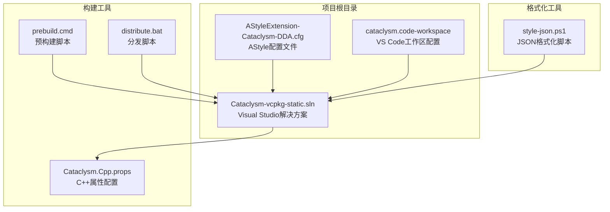
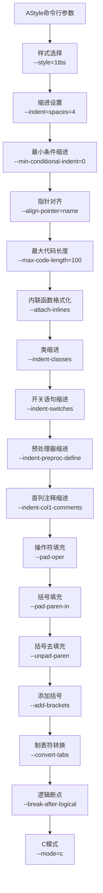
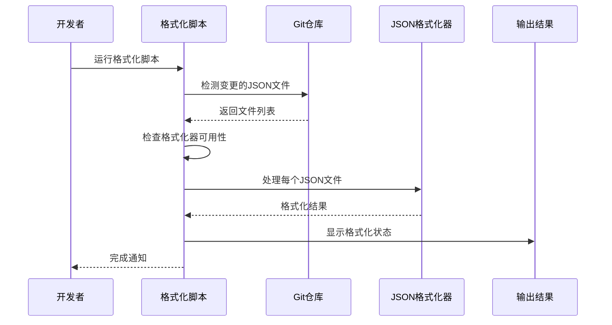
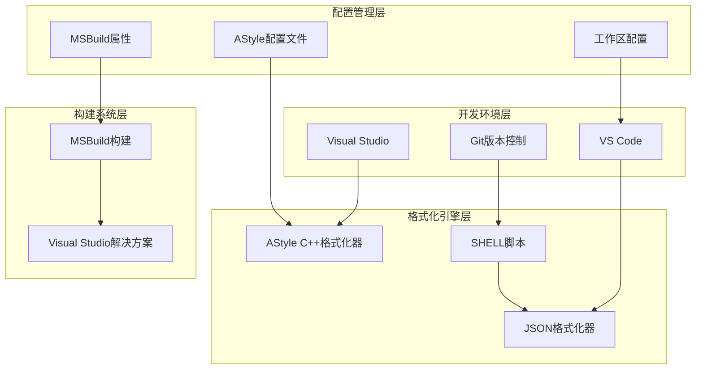
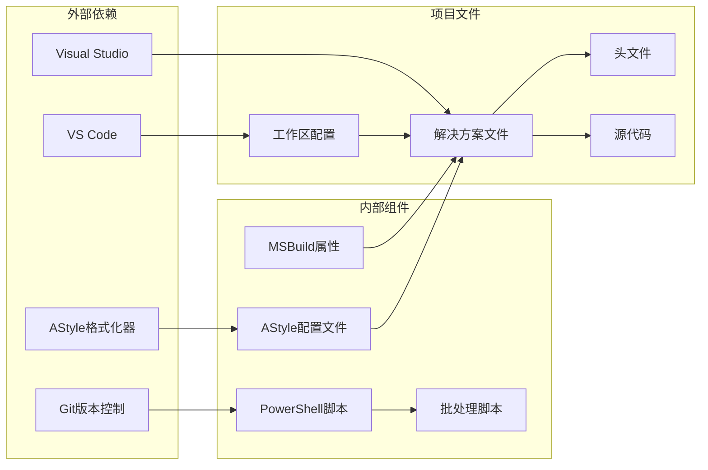

# 代码格式化配置

<cite>
**本文档引用的文件**
- [AStyleExtension-Cataclysm-DDA.cfg](file://AStyleExtension-Cataclysm-DDA.cfg)
- [Cataclysm.Cpp.props](file://Cataclysm.Cpp.props)
- [Cataclysm-vcpkg-static.sln](file://Cataclysm-vcpkg-static.sln)
- [cataclysm.code-workspace](file://cataclysm.code-workspace)
- [style-json.ps1](file://style-json.ps1)
- [prebuild.cmd](file://prebuild.cmd)
- [distribute.bat](file://distribute.bat)
</cite>

## 目录
1. [简介](#简介)
2. [项目结构](#项目结构)
3. [核心组件](#核心组件)
4. [架构概览](#架构概览)
5. [详细组件分析](#详细组件分析)
6. [依赖关系分析](#依赖关系分析)
7. [性能考虑](#性能考虑)
8. [故障排除指南](#故障排除指南)
9. [结论](#结论)
10. [附录](#附录)

## 简介

本文件详细解析了Cataclysm-DDA项目中的代码格式化配置系统。该项目采用多种工具和技术来确保代码风格的一致性和可维护性，包括AStyle C++格式化器、JSON格式化脚本以及Visual Studio集成配置。

Cataclysm-DDA是一个基于C++的开源游戏项目，需要严格的代码格式化标准来维护大型项目的代码质量。本文档将深入分析配置文件的各项设置，解释不同编程语言的格式化策略，并提供IDE集成指南和最佳实践建议。

## 项目结构

该项目采用混合开发环境，结合了Visual Studio解决方案、MSBuild属性文件和PowerShell脚本等多种工具：

**图表来源**
- [AStyleExtension-Cataclysm-DDA.cfg:1-8](file://AStyleExtension-Cataclysm-DDA.cfg#L1-L8)
- [Cataclysm-vcpkg-static.sln:1-189](file://Cataclysm-vcpkg-static.sln#L1-L189)
- [cataclysm.code-workspace:1-22](file://cataclysm.code-workspace#L1-L22)

**章节来源**
- [AStyleExtension-Cataclysm-DDA.cfg:1-8](file://AStyleExtension-Cataclysm-DDA.cfg#L1-L8)
- [Cataclysm-vcpkg-static.sln:1-189](file://Cataclysm-vcpkg-static.sln#L1-L189)
- [cataclysm.code-workspace:1-22](file://cataclysm.code-workspace#L1-L22)

## 核心组件

### AStyle C++格式化配置

AStyle是该项目的核心代码格式化工具，专门用于C/C++代码的自动格式化。配置文件包含了完整的格式化规则集：

#### 基本设置
- **格式化触发**: 关闭保存时自动格式化（CppFormatOnSave=false）
- **版本控制**: 使用AStyle 3.0.0.0版本配置

#### C++格式化参数详解

**图表来源**
- [AStyleExtension-Cataclysm-DDA.cfg:5](file://AStyleExtension-Cataclysm-DDA.cfg#L5)

**章节来源**
- [AStyleExtension-Cataclysm-DDA.cfg:1-8](file://AStyleExtension-Cataclysm-DDA.cfg#L1-L8)

### VS Code工作区配置

VS Code工作区配置提供了统一的开发环境设置：

#### IDE设置
- **格式化禁用**: C/C++格式化功能禁用（C_Cpp.formatting: disabled）
- **CMake配置**: 关闭自动配置（cmake.configureOnOpen: false）
- **远程开发**: 推荐使用Remote Containers扩展
- **Docker支持**: 集成Docker开发容器

#### 扩展推荐
- **Remote Containers**: 远程容器开发
- **Docker**: 容器化开发支持
- **CDDA JSON Formatter**: JSON数据格式化工具

**章节来源**
- [cataclysm.code-workspace:1-22](file://cataclysm.code-workspace#L1-L22)

### JSON格式化系统

项目包含专门的JSON格式化和验证系统：

#### PowerShell脚本功能
- **文件锁定检测**: 防止格式化器被占用
- **Git集成**: 只格式化变更的JSON文件
- **性能监控**: 超时保护机制（30秒限制）
- **错误处理**: 友好的错误消息输出

#### 格式化流程

**图表来源**
- [style-json.ps1:1-78](file://style-json.ps1#L1-L78)

**章节来源**
- [style-json.ps1:1-78](file://style-json.ps1#L1-L78)

## 架构概览

整个格式化系统采用分层架构设计，各组件协同工作以确保代码质量：

**图表来源**
- [AStyleExtension-Cataclysm-DDA.cfg:1-8](file://AStyleExtension-Cataclysm-DDA.cfg#L1-L8)
- [Cataclysm-vcpkg-static.sln:1-189](file://Cataclysm-vcpkg-static.sln#L1-L189)
- [cataclysm.code-workspace:1-22](file://cataclysm.code-workspace#L1-L22)

## 详细组件分析

### AStyle配置深度解析

#### 缩进系统
- **缩进类型**: 空格缩进（spaces=4）
- **最小条件缩进**: 0级缩进，保持简洁
- **类缩进**: 启用类成员的额外缩进
- **开关语句缩进**: 支持switch/case语句的正确缩进
- **预处理器缩进**: 处理宏定义的缩进问题
- **首列注释缩进**: 保持注释与代码的对齐

#### 代码布局策略
- **样式选择**: 1TBS（One True Brace Style）
- **最大代码长度**: 100字符限制
- **内联函数格式化**: 自动处理内联函数
- **指针对齐**: 将指针符号与名称对齐

#### 操作符和括号处理
- **操作符填充**: 在操作符周围添加空格
- **括号填充**: 输入括号的空格处理
- **括号去填充**: 移除不必要的括号空格
- **添加括号**: 确保所有控制结构都有大括号

#### 文本处理
- **制表符转换**: 将制表符转换为空格
- **逻辑断点**: 在逻辑运算符后换行
- **C模式**: 针对C/C++语言的特定处理

**章节来源**
- [AStyleExtension-Cataclysm-DDA.cfg:5](file://AStyleExtension-Cataclysm-DDA.cfg#L5)

### MSBuild属性配置

项目使用MSBuild属性文件来管理编译器设置：

#### 缓存优化
- **CCache支持**: 条件启用缓存（非Debug配置）
- **多工具任务**: 启用UseMultiToolTask以提高编译效率

**章节来源**
- [Cataclysm.Cpp.props:1-11](file://Cataclysm.Cpp.props#L1-L11)

### 解决方案集成

Visual Studio解决方案文件展示了格式化配置的集成方式：

#### 文件包含
- **配置文件**: AStyleExtension-Cataclysm-DDA.cfg
- **构建脚本**: prebuild.cmd和distribute.bat
- **格式化工具**: style-json.ps1

#### 平台支持
- **多平台配置**: ARM64EC、x64、x86支持
- **调试配置**: Debug和Release变体
- **特性变体**: 标准版和无地图瓦片版

**章节来源**
- [Cataclysm-vcpkg-static.sln:1-189](file://Cataclysm-vcpkg-static.sln#L1-L189)

## 依赖关系分析

**图表来源**
- [AStyleExtension-Cataclysm-DDA.cfg:1-8](file://AStyleExtension-Cataclysm-DDA.cfg#L1-L8)
- [Cataclysm-vcpkg-static.sln:1-189](file://Cataclysm-vcpkg-static.sln#L1-L189)
- [cataclysm.code-workspace:1-22](file://cataclysm.code-workspace#L1-L22)

**章节来源**
- [AStyleExtension-Cataclysm-DDA.cfg:1-8](file://AStyleExtension-Cataclysm-DDA.cfg#L1-L8)
- [Cataclysm-vcpkg-static.sln:1-189](file://Cataclysm-vcpkg-static.sln#L1-L189)
- [cataclysm.code-workspace:1-22](file://cataclysm.code-workspace#L1-L22)

## 性能考虑

### 格式化性能优化

#### AStyle配置优化
- **内存使用**: 合理的代码长度限制（100字符）平衡可读性和性能
- **处理速度**: 禁用保存时自动格式化，避免频繁I/O操作
- **缓存策略**: 利用MSBuild的多工具任务提升编译效率

#### JSON格式化性能
- **超时保护**: 30秒超时限制防止长时间运行
- **增量处理**: 只处理变更的文件，减少不必要的工作
- **文件锁定检测**: 避免格式化器被占用时的冲突

#### 大型项目处理策略
- **分阶段处理**: 先处理C++代码，再处理JSON数据
- **并行执行**: 利用多核处理器同时处理多个文件
- **资源监控**: 实时监控内存和CPU使用情况

**章节来源**
- [style-json.ps1:20-30](file://style-json.ps1#L20-L30)
- [Cataclysm.Cpp.props:7-9](file://Cataclysm.Cpp.props#L7-L9)

## 故障排除指南

### 常见问题及解决方案

#### AStyle配置问题
- **格式化不生效**: 检查CppFormatOnSave设置为false是否符合预期
- **样式不一致**: 验证AStyle版本兼容性和配置参数正确性
- **性能问题**: 调整max-code-length参数或禁用不必要的格式化选项

#### VS Code集成问题
- **格式化功能不可用**: 确认C_Cpp.formatting设置为disabled
- **扩展推荐**: 安装Remote Containers和Docker扩展
- **工作区配置**: 验证工作区文件路径和设置

#### PowerShell脚本问题
- **格式化器未找到**: 检查tools/format/json_formatter.exe路径
- **文件锁定**: 等待编译完成释放文件锁
- **Git集成失败**: 确保Git安装和配置正确

#### 批处理脚本问题
- **版本生成失败**: 检查Git安装和权限
- **路径问题**: 确认相对路径在不同环境中的一致性

**章节来源**
- [style-json.ps1:11-18](file://style-json.ps1#L11-L18)
- [prebuild.cmd:1-16](file://prebuild.cmd#L1-L16)

## 结论

Cataclysm-DDA项目的代码格式化配置展现了现代C++项目的最佳实践。通过AStyle、PowerShell脚本和VS Code配置的有机结合，项目实现了：

1. **一致性**: 统一的代码格式化标准
2. **可维护性**: 清晰的配置管理和文档
3. **性能**: 高效的格式化处理和超时保护
4. **团队协作**: 标准化的开发环境和工作流程

这套配置系统为大型C++项目提供了可靠的代码质量保障，值得其他项目参考和借鉴。

## 附录

### 配置参数速查表

| 参数类别 | 参数名称 | 默认值 | 说明 |
|---------|----------|--------|------|
| 缩进 | indent | spaces=4 | 空格缩进，4个空格 |
| 样式 | style | 1tbs | One True Brace Style |
| 最大长度 | max-code-length | 100 | 单行最大字符数 |
| 操作符 | pad-oper | 启用 | 操作符周围空格 |
| 括号 | pad-paren-in | 启用 | 输入括号空格 |
| 模式 | mode | c | C语言模式 |

### 团队协作最佳实践

1. **统一配置**: 确保所有开发者使用相同的配置文件
2. **CI集成**: 在持续集成中包含格式化检查
3. **定期更新**: 定期审查和更新格式化规则
4. **培训教育**: 为新成员提供格式化工具使用培训
5. **反馈机制**: 建立格式化问题的反馈和改进机制