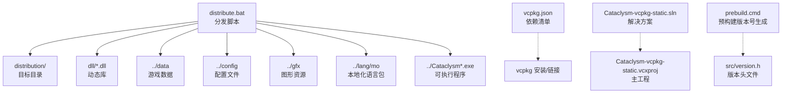
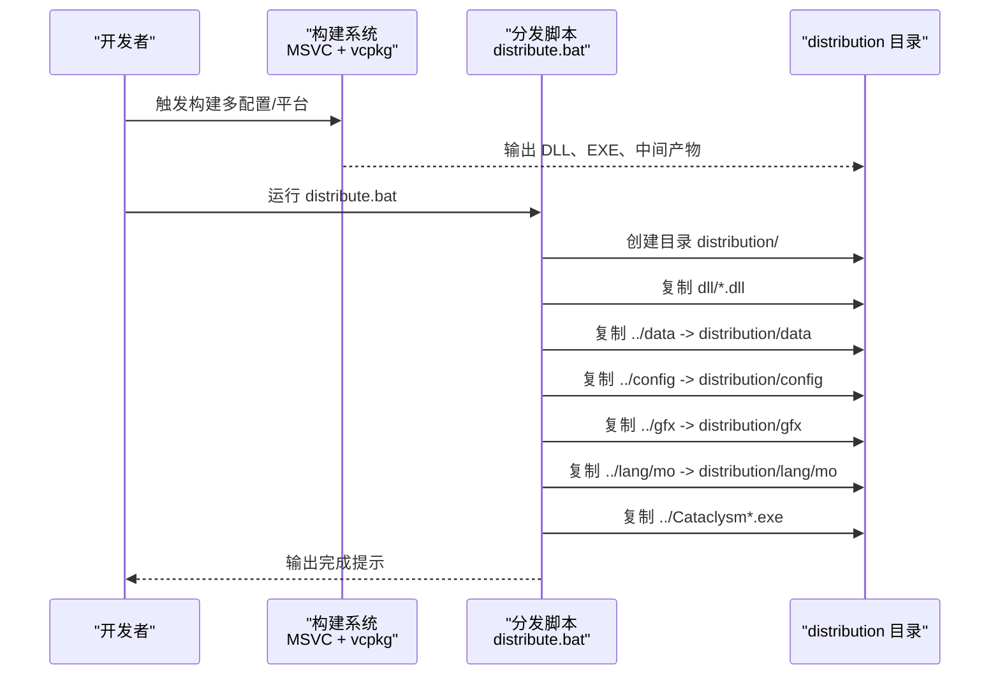
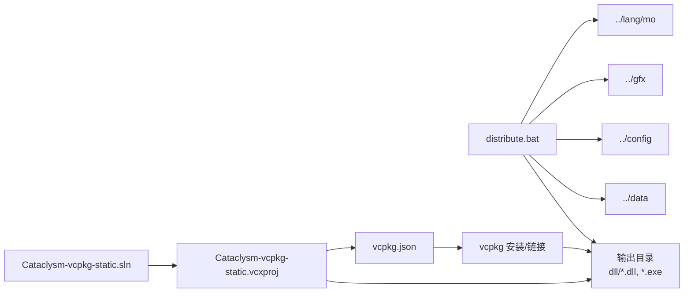

# 分发脚本

<cite>
**本文引用的文件**
- [distribute.bat](file://distribute.bat)
- [vcpkg.json](file://vcpkg.json)
- [Cataclysm-vcpkg-static.sln](file://Cataclysm-vcpkg-static.sln)
- [Cataclysm-common.props](file://Cataclysm-common.props)
- [prebuild.cmd](file://prebuild.cmd)
- [Cataclysm-vcpkg-static.vcxproj](file://Cataclysm-vcpkg-static.vcxproj)
- [Cataclysm.Cpp.props](file://Cataclysm.Cpp.props)
</cite>

## 目录
1. [简介](#简介)
2. [项目结构](#项目结构)
3. [核心组件](#核心组件)
4. [架构总览](#架构总览)
5. [详细组件分析](#详细组件分析)
6. [依赖关系分析](#依赖关系分析)
7. [性能考虑](#性能考虑)
8. [故障排查指南](#故障排查指南)
9. [结论](#结论)
10. [附录](#附录)

## 简介
本文件面向分发脚本的使用者与维护者，系统性解析 distribute.bat 的构建产物打包流程，涵盖构建结果收集、文件组织结构、打包过程以及分发包目录设计。同时提供配置分发脚本以适配不同发布需求的方法、分发包验证与完整性检查手段，并给出扩展自定义分发流程的最佳实践。

## 项目结构
该仓库为一个基于 MSVC 的静态链接分发工程，使用 vcpkg 管理依赖，通过 Visual Studio 解决方案统一编译与打包。分发脚本位于仓库根目录，负责将构建产物与资源文件复制到统一的 distribution 目录中，形成可分发的安装包结构。

图表来源
- [distribute.bat:1-11](file://distribute.bat#L1-L11)
- [vcpkg.json:1-22](file://vcpkg.json#L1-L22)
- [Cataclysm-vcpkg-static.sln:1-189](file://Cataclysm-vcpkg-static.sln#L1-L189)
- [Cataclysm-vcpkg-static.vcxproj:1-236](file://Cataclysm-vcpkg-static.vcxproj#L1-L236)
- [prebuild.cmd:1-16](file://prebuild.cmd#L1-L16)

章节来源
- [distribute.bat:1-11](file://distribute.bat#L1-L11)
- [vcpkg.json:1-22](file://vcpkg.json#L1-L22)
- [Cataclysm-vcpkg-static.sln:1-189](file://Cataclysm-vcpkg-static.sln#L1-L189)
- [Cataclysm-vcpkg-static.vcxproj:1-236](file://Cataclysm-vcpkg-static.vcxproj#L1-L236)
- [prebuild.cmd:1-16](file://prebuild.cmd#L1-L16)

## 核心组件
- 分发脚本 distribute.bat：负责创建 distribution 目标目录，并将 DLL、数据、配置、图形、语言包以及可执行文件复制到对应子目录。
- vcpkg.json：声明 SDL2 及其特性（图像、音频、字体）等依赖，用于静态链接与安装。
- Cataclysm-vcpkg-static.sln：包含多个工程的解决方案，主工程为 Cataclysm-vcpkg-static。
- Cataclysm-common.props：MSBuild 属性文件，定义输出路径、编译选项、链接器设置及 vcpkg 配置。
- prebuild.cmd：在构建前生成版本号到 src/version.h，确保分发包包含正确的版本信息。

章节来源
- [distribute.bat:1-11](file://distribute.bat#L1-L11)
- [vcpkg.json:1-22](file://vcpkg.json#L1-L22)
- [Cataclysm-vcpkg-static.sln:1-189](file://Cataclysm-vcpkg-static.sln#L1-L189)
- [Cataclysm-common.props:1-154](file://Cataclysm-common.props#L1-L154)
- [prebuild.cmd:1-16](file://prebuild.cmd#L1-L16)

## 架构总览
分发脚本在 Windows 批处理层面协调各资源与产物，形成标准的分发包布局。下图展示了从构建产物到分发包目录的映射关系与复制流程。

图表来源
- [distribute.bat:1-11](file://distribute.bat#L1-L11)

## 详细组件分析

### 分发脚本 distribute.bat
- 功能概述
  - 创建 distribution 目标目录
  - 将运行时依赖 DLL 复制到 distribution 根目录
  - 将游戏数据、配置、图形资源、语言包复制到对应子目录
  - 将可执行文件复制到 distribution 根目录
  - 提示用户分发包已生成并暂停等待

- 关键步骤与行为
  - 创建目录：确保分发包根目录存在
  - 复制 DLL：将当前目录下的所有 DLL 文件复制到 distribution
  - 复制数据与资源：
    - data：游戏数据文件
    - config：默认或用户配置模板
    - gfx：图形资源
    - lang/mo：翻译语言包
  - 复制可执行文件：将根目录下匹配模式的 EXE 文件复制到 distribution

- 目录结构设计
  - distribution/
    - data/
    - config/
    - gfx/
    - lang/mo/
    - *.dll
    - *.exe

- 压缩打包过程
  - 当前脚本未包含压缩逻辑；如需打包为压缩包，可在脚本末尾添加压缩命令，或将 distribution 目录交给外部工具进行打包。

- 可配置点
  - DLL 源目录：当前为 dll 目录，可根据实际输出位置调整
  - 资源路径：data、config、gfx、lang/mo 的相对路径需与实际构建产物一致
  - 可执行文件命名：当前使用通配符匹配，若命名规则变化需同步调整

- 错误处理与健壮性
  - 若某些资源目录不存在，xcopy 会报错；建议在脚本中加入错误检查与容错处理
  - 若 DLL 或 EXE 未生成，需先完成构建再运行脚本

章节来源
- [distribute.bat:1-11](file://distribute.bat#L1-L11)

### vcpkg 依赖管理
- 作用
  - 统一管理 SDL2 及其特性（图像、音频、字体），确保静态链接与跨平台一致性
  - 通过 overlay-ports 自定义端口，满足特定需求

- 关键点
  - 依赖项与特性组合影响最终 DLL 与链接库的选择
  - vcpkg 安装后，MSBuild 会自动链接所需库

章节来源
- [vcpkg.json:1-22](file://vcpkg.json#L1-L22)

### MSBuild 工程与属性
- 主工程 Cataclysm-vcpkg-static.vcxproj
  - 定义多配置与多平台（Debug/Release、Win32/x64/ARM64EC）
  - 使用 vcpkg 静态链接，指定 triplet 与 AutoLink 行为
  - 导入 Cataclysm.Cpp.props 与 Cataclysm-common.props，统一编译与链接参数

- 公共属性文件 Cataclysm-common.props
  - 定义输出目录、中间目录、vcpkg 安装选项
  - 控制是否使用 LLD 链接器、Thin Archives 等高级特性
  - 设置编译器警告级别、调试信息格式、预处理器宏等

- C++ 属性文件 Cataclysm.Cpp.props
  - 控制是否启用 ccache（仅在非 Debug 配置下生效）

章节来源
- [Cataclysm-vcpkg-static.vcxproj:1-236](file://Cataclysm-vcpkg-static.vcxproj#L1-L236)
- [Cataclysm-common.props:1-154](file://Cataclysm-common.props#L1-L154)
- [Cataclysm.Cpp.props:1-10](file://Cataclysm.Cpp.props#L1-L10)

### 预构建版本号生成
- prebuild.cmd 在构建前根据 Git 描述生成版本号，并写入 src/version.h
- 保证分发包包含准确的版本信息，便于用户识别与问题定位

章节来源
- [prebuild.cmd:1-16](file://prebuild.cmd#L1-L16)

### 分发包目录结构设计
- 推荐布局
  - distribution/
    - data/：游戏数据文件（地图、物品、NPC 等）
    - config/：默认配置文件与用户配置模板
    - gfx/：图形资源（图标、界面素材等）
    - lang/mo/：翻译语言包（按语言代码组织）
    - *.dll：运行时依赖 DLL
    - *.exe：可执行文件

- 设计原则
  - 保持与运行时查找路径一致，避免运行时找不到资源
  - 将可执行文件与 DLL 放在同一级，减少路径复杂度
  - 语言包按 mo 子目录组织，便于扩展与替换

章节来源
- [distribute.bat:1-11](file://distribute.bat#L1-L11)

### 压缩打包过程
- 当前脚本未包含压缩逻辑
- 建议在 distribution 目录生成后，使用外部工具（如 zip、7z）进行压缩
- 可在脚本末尾追加压缩命令，或在 CI 中统一处理

章节来源
- [distribute.bat:1-11](file://distribute.bat#L1-L11)

## 依赖关系分析
分发脚本与构建系统的耦合关系如下：

图表来源
- [distribute.bat:1-11](file://distribute.bat#L1-L11)
- [vcpkg.json:1-22](file://vcpkg.json#L1-L22)
- [Cataclysm-vcpkg-static.sln:1-189](file://Cataclysm-vcpkg-static.sln#L1-L189)
- [Cataclysm-vcpkg-static.vcxproj:1-236](file://Cataclysm-vcpkg-static.vcxproj#L1-L236)

章节来源
- [distribute.bat:1-11](file://distribute.bat#L1-L11)
- [vcpkg.json:1-22](file://vcpkg.json#L1-L22)
- [Cataclysm-vcpkg-static.sln:1-189](file://Cataclysm-vcpkg-static.sln#L1-L189)
- [Cataclysm-vcpkg-static.vcxproj:1-236](file://Cataclysm-vcpkg-static.vcxproj#L1-L236)

## 性能考虑
- 复制效率
  - xcopy 的 /s /e /i 参数可批量复制目录树，减少多次调用
  - 对于大型资源目录，建议分批复制或在 CI 中使用更高效的工具
- 并行化
  - 在脚本中引入并行复制（如 PowerShell 的 Parallel）可提升速度
- 增量复制
  - 仅复制变更文件可显著缩短分发时间（需配合哈希校验）

## 故障排查指南
- DLL 缺失
  - 症状：运行时提示缺少 DLL
  - 排查：确认 DLL 源目录与输出目录一致；检查 vcpkg 安装是否成功
- 资源缺失
  - 症状：游戏无法加载数据/图形/语言
  - 排查：确认 ../data、../config、../gfx、../lang/mo 是否存在且未被过滤
- 可执行文件未找到
  - 症状：复制阶段失败
  - 排查：确认构建已生成 EXE；检查命名是否符合通配符规则
- 权限问题
  - 症状：无法创建/写入 distribution 目录
  - 排查：以管理员权限运行脚本；检查目录权限
- 版本信息不正确
  - 症状：分发包版本显示异常
  - 排查：确认 prebuild.cmd 已生成 src/version.h；检查 Git 状态与描述

章节来源
- [distribute.bat:1-11](file://distribute.bat#L1-L11)
- [prebuild.cmd:1-16](file://prebuild.cmd#L1-L16)

## 结论
distribute.bat 提供了简洁而清晰的分发流程，将构建产物与资源文件组织到统一的 distribution 目录中。结合 vcpkg 的依赖管理与 MSBuild 的工程配置，能够稳定地生成可运行的分发包。建议在现有基础上增加压缩、校验与增量复制能力，并在 CI 中自动化执行，以进一步提升效率与可靠性。

## 附录

### 配置分发脚本以适配不同发布需求
- 调整 DLL 源目录：根据实际输出路径修改脚本中的 dll 目录
- 调整资源路径：确保 ../data、../config、../gfx、../lang/mo 与构建产物一致
- 扩展复制内容：如需包含额外文件（日志、手册、许可证），在脚本中追加相应复制命令
- 条件复制：根据配置（Debug/Release）或平台（Win32/x64/ARM64EC）选择性复制
- 压缩打包：在脚本末尾追加压缩命令，或将 distribution 目录交由外部工具处理

章节来源
- [distribute.bat:1-11](file://distribute.bat#L1-L11)

### 分发包验证与完整性检查
- 校验文件数量与大小：统计 distribution 下各目录文件数量与总大小，与预期对比
- 校验 DLL 依赖：使用工具检查 EXE/DLL 依赖是否齐全
- 校验版本信息：读取 src/version.h 或 EXE 内嵌版本，确认与构建一致
- 运行测试：启动游戏，验证数据、图形、语言资源加载正常

章节来源
- [prebuild.cmd:1-16](file://prebuild.cmd#L1-L16)

### 自定义分发流程的扩展指南与最佳实践
- 扩展点
  - 增加压缩：在脚本末尾添加压缩命令或调用外部工具
  - 增加校验：生成校验文件（如 SHA256）并与分发包一同发布
  - 增量分发：仅复制变更文件，结合哈希校验实现增量更新
  - 多平台支持：根据平台差异调整复制策略
- 最佳实践
  - 明确目录结构与命名规范，保持与运行时查找路径一致
  - 在 CI 中自动化执行分发脚本，确保每次构建都生成分发包
  - 记录分发包版本与构建信息，便于追溯与回滚
  - 对外发布前进行功能回归测试，确保分发包可用