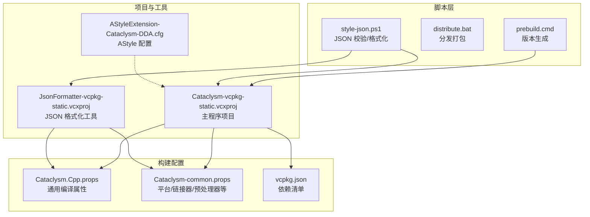
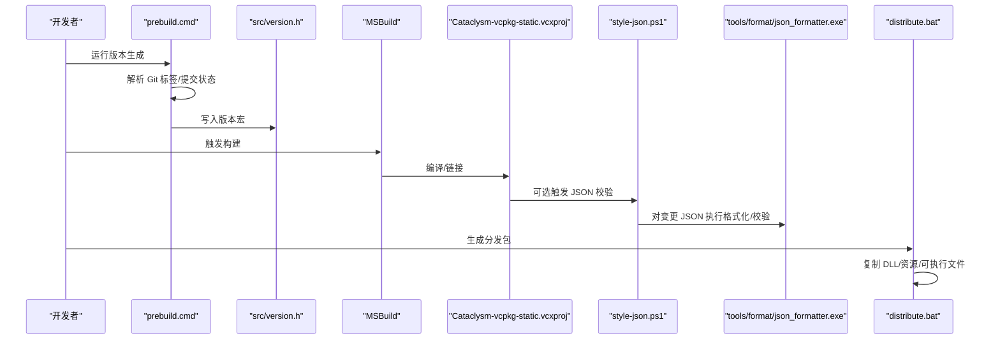
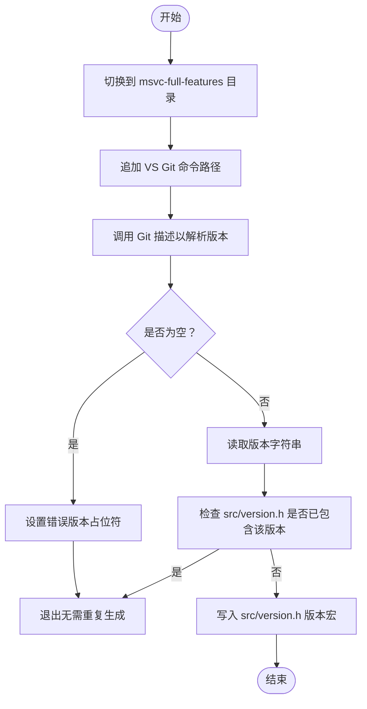
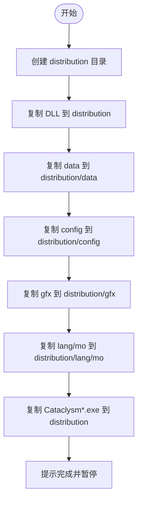
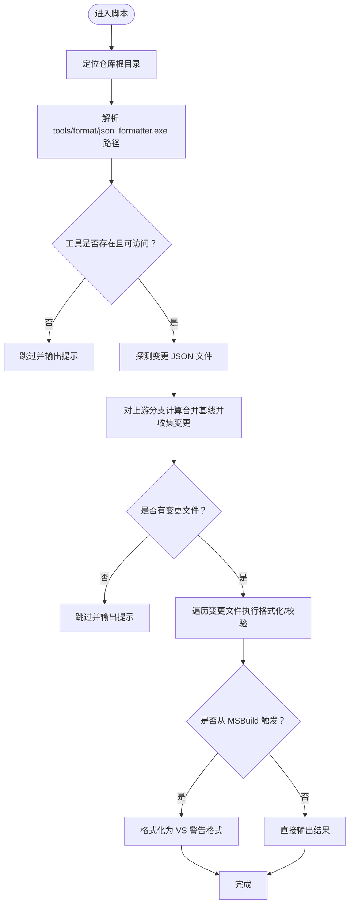
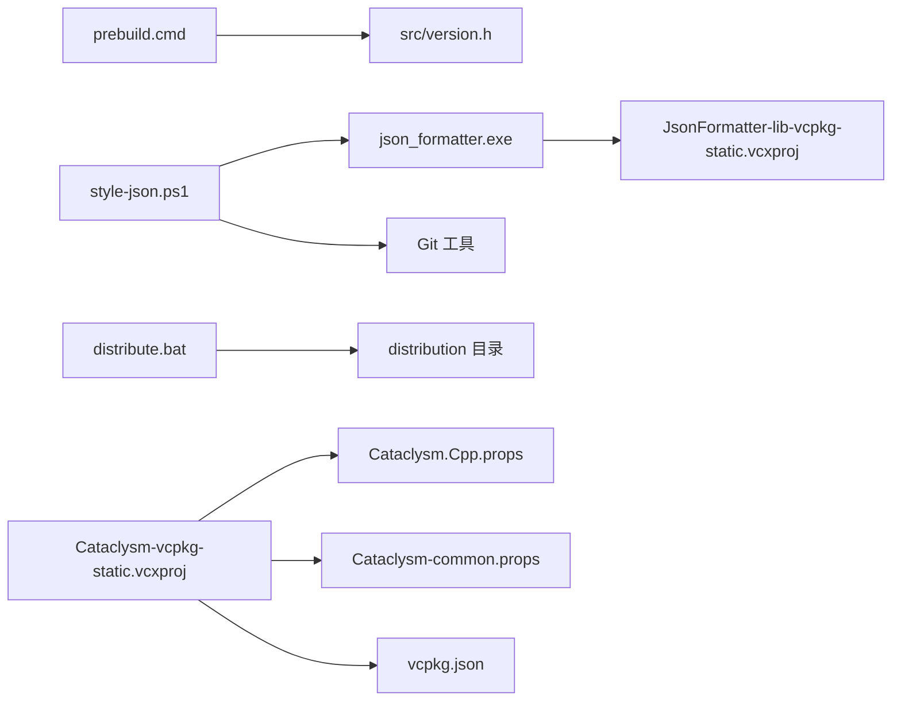

# 自动化工具链

<cite>
**本文引用的文件**
- [prebuild.cmd](file://prebuild.cmd)
- [distribute.bat](file://distribute.bat)
- [style-json.ps1](file://style-json.ps1)
- [AStyleExtension-Cataclysm-DDA.cfg](file://AStyleExtension-Cataclysm-DDA.cfg)
- [Cataclysm.Cpp.props](file://Cataclysm.Cpp.props)
- [Cataclysm-common.props](file://Cataclysm-common.props)
- [Cataclysm-vcpkg-static.vcxproj](file://Cataclysm-vcpkg-static.vcxproj)
- [JsonFormatter-vcpkg-static.vcxproj](file://JsonFormatter-vcpkg-static.vcxproj)
- [vcpkg.json](file://vcpkg.json)
</cite>

## 目录
1. [简介](#简介)
2. [项目结构](#项目结构)
3. [核心组件](#核心组件)
4. [架构总览](#架构总览)
5. [详细组件分析](#详细组件分析)
6. [依赖关系分析](#依赖关系分析)
7. [性能考量](#性能考量)
8. [故障排查指南](#故障排查指南)
9. [结论](#结论)
10. [附录](#附录)

## 简介
本文件系统性介绍 MSVC Full Features 项目的自动化工具链，重点覆盖以下方面：
- 版本生成：prebuild.cmd 如何基于 Git 标签与提交状态生成版本号并注入到头文件。
- 构建产物打包：distribute.bat 的分发包生成流程与结构优化建议。
- JSON 数据校验与格式化：style-json.ps1 的变更探测、执行策略与输出格式。
- 代码风格一致性：AStyle 配置与在项目中的集成方式。
- 扩展与定制：如何在现有工具链基础上进行扩展与定制。

## 项目结构
该仓库包含一组批处理与 PowerShell 脚本、MSBuild 属性与项目文件，以及 vcpkg 清单，共同构成自动化工具链的核心。

图表来源
- [prebuild.cmd:1-16](file://prebuild.cmd#L1-L16)
- [distribute.bat:1-11](file://distribute.bat#L1-L11)
- [style-json.ps1:1-78](file://style-json.ps1#L1-L78)
- [Cataclysm.Cpp.props:1-11](file://Cataclysm.Cpp.props#L1-L11)
- [Cataclysm-common.props:1-154](file://Cataclysm-common.props#L1-L154)
- [Cataclysm-vcpkg-static.vcxproj:1-200](file://Cataclysm-vcpkg-static.vcxproj#L1-L200)
- [JsonFormatter-vcpkg-static.vcxproj:1-154](file://JsonFormatter-vcpkg-static.vcxproj#L1-L154)
- [vcpkg.json:1-22](file://vcpkg.json#L1-L22)

章节来源
- [prebuild.cmd:1-16](file://prebuild.cmd#L1-L16)
- [distribute.bat:1-11](file://distribute.bat#L1-L11)
- [style-json.ps1:1-78](file://style-json.ps1#L1-L78)
- [Cataclysm.Cpp.props:1-11](file://Cataclysm.Cpp.props#L1-L11)
- [Cataclysm-common.props:1-154](file://Cataclysm-common.props#L1-L154)
- [Cataclysm-vcpkg-static.vcxproj:1-200](file://Cataclysm-vcpkg-static.vcxproj#L1-L200)
- [JsonFormatter-vcpkg-static.vcxproj:1-154](file://JsonFormatter-vcpkg-static.vcxproj#L1-L154)
- [vcpkg.json:1-22](file://vcpkg.json#L1-L22)

## 核心组件
- 版本生成脚本：prebuild.cmd 基于 Git 描述信息生成版本字符串，并写入 src/version.h，避免重复生成。
- 分发打包脚本：distribute.bat 将运行时 DLL、游戏资源与可执行文件复制到 distribution 目录，形成标准分发包。
- JSON 校验与格式化：style-json.ps1 在变更的 JSON 文件上运行 tools/format/json_formatter.exe，支持从 MSBuild 触发并在 VS 中输出规范化的警告。
- 代码风格工具：AStyleExtension-Cataclysm-DDA.cfg 定义了 C++ 格式化参数，便于统一代码风格。
- 构建属性与项目：Cataclysm.Cpp.props 与 Cataclysm-common.props 提供编译、链接、预处理器定义、工具链路径等通用设置；vcpkg.json 管理依赖安装与 overlay ports。

章节来源
- [prebuild.cmd:1-16](file://prebuild.cmd#L1-L16)
- [distribute.bat:1-11](file://distribute.bat#L1-L11)
- [style-json.ps1:1-78](file://style-json.ps1#L1-L78)
- [AStyleExtension-Cataclysm-DDA.cfg:1-8](file://AStyleExtension-Cataclysm-DDA.cfg#L1-L8)
- [Cataclysm.Cpp.props:1-11](file://Cataclysm.Cpp.props#L1-L11)
- [Cataclysm-common.props:1-154](file://Cataclysm-common.props#L1-L154)
- [vcpkg.json:1-22](file://vcpkg.json#L1-L22)

## 架构总览
下图展示工具链在构建与发布阶段的关键交互：

图表来源
- [prebuild.cmd:1-16](file://prebuild.cmd#L1-L16)
- [Cataclysm-vcpkg-static.vcxproj:166-170](file://Cataclysm-vcpkg-static.vcxproj#L166-L170)
- [style-json.ps1:1-78](file://style-json.ps1#L1-L78)
- [JsonFormatter-vcpkg-static.vcxproj:77-77](file://JsonFormatter-vcpkg-static.vcxproj#L77-L77)
- [distribute.bat:1-11](file://distribute.bat#L1-L11)

## 详细组件分析

### 版本生成机制（prebuild.cmd）
- Git 标签解析：通过 Git 描述命令提取最近匹配规则的标签，同时包含提交状态与分支信息，确保版本号能反映当前状态。
- 版本号注入：若 src/version.h 中未包含当前版本字符串，则写入新的版本宏，避免不必要的重复生成。
- 环境准备：显式追加 VS Team Explorer Git 的命令路径，保证在不同环境中可用。

图表来源
- [prebuild.cmd:1-16](file://prebuild.cmd#L1-L16)

章节来源
- [prebuild.cmd:1-16](file://prebuild.cmd#L1-L16)

### 构建产物打包（distribute.bat）
- 目标：生成标准化的 distribution 目录，包含运行时 DLL、游戏数据、配置、图形资源、语言资源与可执行文件。
- 流程：创建目标目录，逐项复制资源，最后提示用户并暂停以便查看结果。
- 优化建议：
  - 按需裁剪：仅复制当前平台/配置所需的 DLL 与资源，减少体积。
  - 结构规范化：将可执行文件置于 bin 子目录，资源按 data/config/gfx/lang/mo 组织，便于解压后直接运行。
  - 平台标识：在目录名中加入平台与配置信息，避免多配置混杂。

图表来源
- [distribute.bat:1-11](file://distribute.bat#L1-L11)

章节来源
- [distribute.bat:1-11](file://distribute.bat#L1-L11)

### JSON 数据验证与格式化（style-json.ps1）
- 执行入口：从项目中通过自定义构建步骤触发，或手动运行。
- 文件探测：先列出工作区内变更的 JSON 文件，再对常见上游分支进行合并基线探测，汇总变更集。
- 执行策略：
  - 若找不到格式化工具或工具被锁定，则跳过并输出提示。
  - 若无变更文件，输出“无变更”提示。
  - 支持在 VS 中以特定格式输出警告，便于定位问题。
- 性能控制：内置计时器，超过阈值时提前终止，避免阻塞构建。

图表来源
- [style-json.ps1:1-78](file://style-json.ps1#L1-L78)

章节来源
- [style-json.ps1:1-78](file://style-json.ps1#L1-L78)
- [Cataclysm-vcpkg-static.vcxproj:166-170](file://Cataclysm-vcpkg-static.vcxproj#L166-L170)
- [JsonFormatter-vcpkg-static.vcxproj:77-77](file://JsonFormatter-vcpkg-static.vcxproj#L77-L77)

### 代码格式化工具（AStyle）配置与使用
- 配置文件：AStyleExtension-Cataclysm-DDA.cfg 定义了 C++ 格式化参数，如缩进、大括号风格、操作符间距、最大代码长度等。
- 使用场景：可在编辑器中启用保存时格式化，或在 CI 中作为检查步骤，确保风格一致。
- 与项目集成：可通过外部工具链或编辑器插件应用配置，保持团队风格统一。

章节来源
- [AStyleExtension-Cataclysm-DDA.cfg:1-8](file://AStyleExtension-Cataclysm-DDA.cfg#L1-L8)

### 构建属性与项目集成
- 通用属性：Cataclysm.Cpp.props 控制缓存编译开关与多工具任务；Cataclysm-common.props 定义输出目录、预处理器、编译选项、链接器行为与 vcpkg 集成细节。
- 主程序项目：Cataclysm-vcpkg-static.vcxproj 设置平台三元组、静态链接、自定义构建步骤（触发 JSON 校验），并映射 LLD 链接器与薄库支持。
- JSON 格式化工具：JsonFormatter-vcpkg-static.vcxproj 将格式化器输出到 tools/format，供 style-json.ps1 调用。
- 依赖管理：vcpkg.json 声明 SDL2 生态依赖与 overlay ports，确保构建环境一致性。

章节来源
- [Cataclysm.Cpp.props:1-11](file://Cataclysm.Cpp.props#L1-L11)
- [Cataclysm-common.props:1-154](file://Cataclysm-common.props#L1-L154)
- [Cataclysm-vcpkg-static.vcxproj:1-200](file://Cataclysm-vcpkg-static.vcxproj#L1-L200)
- [JsonFormatter-vcpkg-static.vcxproj:1-154](file://JsonFormatter-vcpkg-static.vcxproj#L1-L154)
- [vcpkg.json:1-22](file://vcpkg.json#L1-L22)

## 依赖关系分析
- 版本生成依赖 Git 工具链与 src/version.h 输出。
- JSON 校验依赖 json_formatter.exe 与 Git 变更探测。
- 分发打包依赖构建产物与资源目录结构。
- 构建系统依赖 vcpkg 清单与项目属性文件。

图表来源
- [prebuild.cmd:1-16](file://prebuild.cmd#L1-L16)
- [style-json.ps1:1-78](file://style-json.ps1#L1-L78)
- [distribute.bat:1-11](file://distribute.bat#L1-L11)
- [Cataclysm-vcpkg-static.vcxproj:1-200](file://Cataclysm-vcpkg-static.vcxproj#L1-L200)
- [JsonFormatter-vcpkg-static.vcxproj:1-154](file://JsonFormatter-vcpkg-static.vcxproj#L1-L154)
- [vcpkg.json:1-22](file://vcpkg.json#L1-L22)

章节来源
- [prebuild.cmd:1-16](file://prebuild.cmd#L1-L16)
- [style-json.ps1:1-78](file://style-json.ps1#L1-L78)
- [distribute.bat:1-11](file://distribute.bat#L1-L11)
- [Cataclysm-vcpkg-static.vcxproj:1-200](file://Cataclysm-vcpkg-static.vcxproj#L1-L200)
- [JsonFormatter-vcpkg-static.vcxproj:1-154](file://JsonFormatter-vcpkg-static.vcxproj#L1-L154)
- [vcpkg.json:1-22](file://vcpkg.json#L1-L22)

## 性能考量
- JSON 校验超时保护：脚本内置计时器，超过阈值自动中止，避免长时间阻塞构建。
- 条件触发：仅在存在变更文件时执行格式化，减少无效开销。
- 工具可用性检查：若格式化器不可用或被占用则跳过，保证构建连续性。
- 分发包体积：建议仅复制必要资源，按平台/配置拆分目录，降低分发包大小。

## 故障排查指南
- 版本生成失败
  - 症状：src/version.h 未更新或显示占位版本。
  - 排查：确认 Git 工具可用、网络可达；检查 Git 描述命令返回值；确认 prebuild.cmd 路径与权限。
  - 参考
    - [prebuild.cmd:5-9](file://prebuild.cmd#L5-L9)
- JSON 校验跳过
  - 症状：输出“跳过：未找到格式化器/格式化器被锁定/无变更文件”。
  - 排查：确认 tools/format/json_formatter.exe 存在且可执行；关闭占用进程；确保有变更文件或上游分支存在。
  - 参考
    - [style-json.ps1:28-34](file://style-json.ps1#L28-L34)
    - [style-json.ps1:49-51](file://style-json.ps1#L49-L51)
- 分发包缺失
  - 症状：distribution 目录不完整。
  - 排查：确认构建成功、资源路径正确；检查 distribute.bat 的复制逻辑与目标目录权限。
  - 参考
    - [distribute.bat:3-8](file://distribute.bat#L3-L8)
- 构建失败（链接器/库）
  - 症状：链接阶段报错或缺少依赖。
  - 排查：核对 vcpkg 三元组与静态链接设置；确认 LLD 链接器与薄库配置；检查 AdditionalDependencies。
  - 参考
    - [Cataclysm-common.props:91-140](file://Cataclysm-common.props#L91-L140)
    - [vcpkg.json:1-22](file://vcpkg.json#L1-L22)

章节来源
- [prebuild.cmd:5-9](file://prebuild.cmd#L5-L9)
- [style-json.ps1:28-34](file://style-json.ps1#L28-L34)
- [style-json.ps1:49-51](file://style-json.ps1#L49-L51)
- [distribute.bat:3-8](file://distribute.bat#L3-L8)
- [Cataclysm-common.props:91-140](file://Cataclysm-common.props#L91-L140)
- [vcpkg.json:1-22](file://vcpkg.json#L1-L22)

## 结论
该工具链通过 prebuild.cmd、style-json.ps1、distribute.bat 与一系列 MSBuild 属性/项目文件，实现了版本号自动生成、JSON 校验与格式化、分发包打包与依赖管理的闭环。通过合理配置与优化，可以在保证质量的同时提升构建效率与分发体验。

## 附录
- 扩展与定制建议
  - 版本号策略：在 prebuild.cmd 中增加对分支/CI 的识别，生成带构建号的版本字符串。
  - JSON 校验范围：根据项目规模调整上游分支探测列表，或允许通过环境变量控制探测范围。
  - 分发包结构：引入版本子目录与平台标识，便于多版本共存与自动化部署。
  - 代码风格：在 CI 中增加 AStyle 校验步骤，失败即阻止合并，确保风格一致性。
  - 构建加速：结合缓存编译与并行编译设置，缩短构建时间。