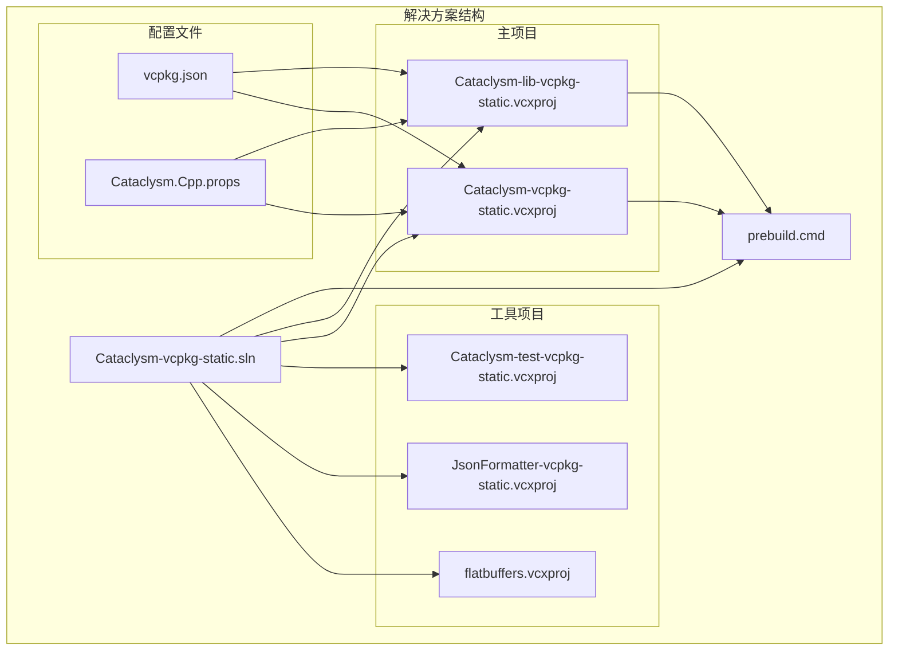
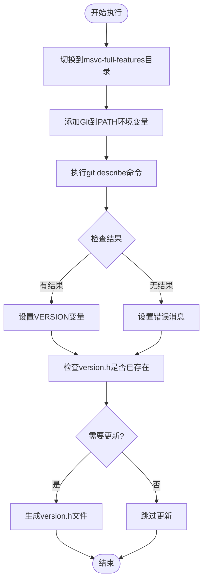
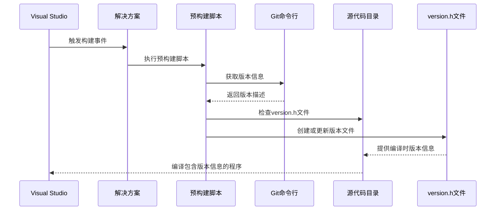
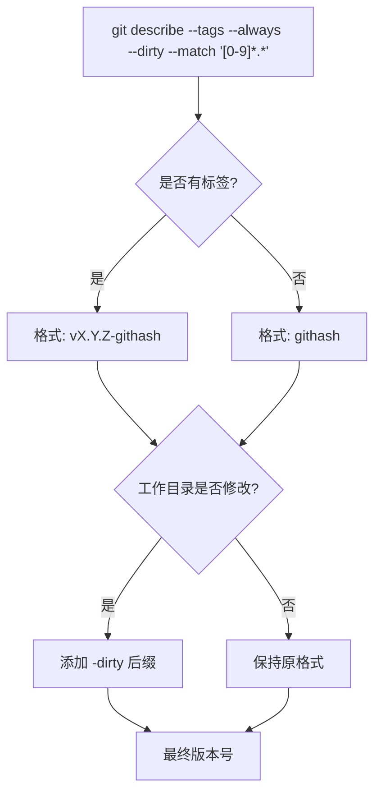
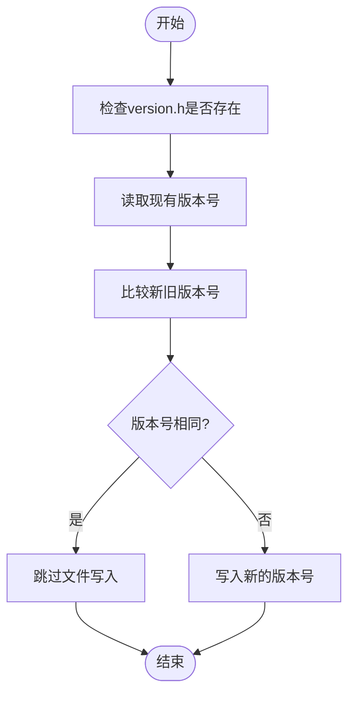
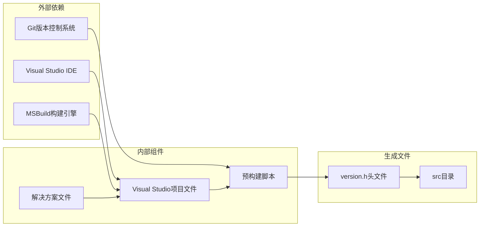

# 预构建脚本

<cite>
**本文档引用的文件**
- [prebuild.cmd](file://prebuild.cmd)
- [Cataclysm-lib-vcpkg-static.vcxproj](file://Cataclysm-lib-vcpkg-static.vcxproj)
- [Cataclysm-vcpkg-static.sln](file://Cataclysm-vcpkg-static.sln)
- [vcpkg.json](file://vcpkg.json)
- [Cataclysm.Cpp.props](file://Cataclysm.Cpp.props)
</cite>

## 目录
1. [简介](#简介)
2. [项目结构](#项目结构)
3. [核心组件](#核心组件)
4. [架构概览](#架构概览)
5. [详细组件分析](#详细组件分析)
6. [依赖关系分析](#依赖关系分析)
7. [性能考虑](#性能考虑)
8. [故障排除指南](#故障排除指南)
9. [结论](#结论)

## 简介

预构建脚本是Cataclysm Medieval项目构建系统的重要组成部分，负责在编译前生成版本信息文件。该脚本通过Git命令获取当前代码库的状态信息，并将其写入到version.h头文件中，供C++代码在编译时使用。

本脚本采用批处理语言编写，集成在Visual Studio的预构建事件中，在每次构建前自动执行。它实现了智能的版本号生成机制，能够处理各种Git仓库状态，包括有标签和无标签的提交、工作目录修改状态等。

## 项目结构

该项目是一个基于Visual Studio的C++项目，使用vcpkg进行依赖管理。预构建脚本位于解决方案根目录下，与主要的构建项目文件同级。

**图表来源**
- [Cataclysm-vcpkg-static.sln:1-189](file://Cataclysm-vcpkg-static.sln#L1-L189)
- [Cataclysm-lib-vcpkg-static.vcxproj:120-191](file://Cataclysm-lib-vcpkg-static.vcxproj#L120-L191)

**章节来源**
- [Cataclysm-vcpkg-static.sln:1-189](file://Cataclysm-vcpkg-static.sln#L1-L189)
- [prebuild.cmd:1-16](file://prebuild.cmd#L1-L16)

## 核心组件

### 预构建脚本核心功能

预构建脚本包含以下关键组件：

1. **环境初始化**：设置批处理环境变量和路径
2. **Git版本获取**：使用git describe命令获取版本信息
3. **版本号生成**：处理不同Git状态下的版本号格式
4. **文件生成**：创建version.h头文件
5. **智能更新**：避免不必要的文件重写

### 版本号生成算法

脚本采用智能的版本号生成策略，通过Git命令组合实现：

**图表来源**
- [prebuild.cmd:1-16](file://prebuild.cmd#L1-L16)

**章节来源**
- [prebuild.cmd:1-16](file://prebuild.cmd#L1-L16)

## 架构概览

预构建脚本在整个构建系统中的位置和作用如下：

**图表来源**
- [Cataclysm-lib-vcpkg-static.vcxproj:123-125](file://Cataclysm-lib-vcpkg-static.vcxproj#L123-L125)
- [prebuild.cmd:1-16](file://prebuild.cmd#L1-L16)

### 构建事件配置

预构建脚本通过Visual Studio的预构建事件机制集成：

| 组件 | 配置位置 | 执行时机 |
|------|----------|----------|
| 预构建事件 | `Cataclysm-lib-vcpkg-static.vcxproj` | 每次构建前 |
| 脚本路径 | `..\msvc-full-features\prebuild.cmd` | 相对路径引用 |
| 触发条件 | 项目配置变更时 | 自动触发 |

**章节来源**
- [Cataclysm-lib-vcpkg-static.vcxproj:123-125](file://Cataclysm-lib-vcpkg-static.vcxproj#L123-L125)

## 详细组件分析

### Git命令解析

脚本使用的关键Git命令是`git describe`，其参数组合具有特定含义：

#### 命令参数详解

| 参数 | 含义 | 影响 |
|------|------|------|
| `--tags` | 仅考虑标记（tag） | 优先使用Git标签作为版本标识 |
| `--always` | 即使没有标签也返回描述 | 确保始终有输出，避免空值 |
| `--dirty` | 标记工作目录为脏（有未提交更改） | 包含工作目录状态信息 |
| `--match "[0-9]*.*"` | 只匹配以数字开头的标签 | 过滤非语义化版本标签 |

#### 版本号格式规则

根据Git命令的组合效果，生成的版本号遵循以下规则：

1. **有标签状态**：`vX.Y.Z-githash`
2. **无标签状态**：`githash-dirty标志`
3. **工作目录修改**：在版本号末尾添加`-dirty`后缀
4. **特殊字符处理**：使用方括号过滤非数字开头的标签

### 版本号生成流程

**图表来源**
- [prebuild.cmd:6](file://prebuild.cmd#L6)

### 文件生成机制

脚本通过智能检测避免不必要的文件操作：

**图表来源**
- [prebuild.cmd:10-15](file://prebuild.cmd#L10-L15)

**章节来源**
- [prebuild.cmd:1-16](file://prebuild.cmd#L1-L16)

## 依赖关系分析

### 外部依赖

预构建脚本依赖于以下外部组件：

**图表来源**
- [prebuild.cmd:1-16](file://prebuild.cmd#L1-L16)
- [Cataclysm-lib-vcpkg-static.vcxproj:123-125](file://Cataclysm-lib-vcpkg-static.vcxproj#L123-L125)

### 内部耦合关系

预构建脚本与项目配置文件之间存在紧密的耦合关系：

| 组件 | 依赖关系 | 作用 |
|------|----------|------|
| prebuild.cmd | 相对路径引用 | 在解决方案中定位脚本 |
| Cataclysm-lib-vcpkg-static.vcxproj | 预构建事件配置 | 触发脚本执行 |
| Cataclysm-vcpkg-static.sln | 解决方案文件 | 管理项目和脚本关系 |
| vcpkg.json | 依赖配置 | 影响构建环境 |

**章节来源**
- [Cataclysm-vcpkg-static.sln:11-12](file://Cataclysm-vcpkg-static.sln#L11-L12)
- [Cataclysm-lib-vcpkg-static.vcxproj:123-125](file://Cataclysm-lib-vcpkg-static.vcxproj#L123-L125)

## 性能考虑

### 执行效率

预构建脚本设计简洁高效，主要性能考量包括：

1. **最小化I/O操作**：只在版本号变化时才写入文件
2. **快速Git查询**：使用高效的git describe命令
3. **内存使用**：批处理脚本占用资源极少
4. **缓存机制**：避免重复生成相同的版本文件

### 并发安全性

脚本通过以下机制确保并发安全：
- 使用`findstr`检查现有内容
- 条件性文件写入
- 错误级别检查

## 故障排除指南

### 常见问题及解决方案

#### Git未安装或不可访问

**症状**：版本号为空字符串，显示安装提示信息

**原因**：PATH环境变量中缺少Git可执行文件路径

**解决方案**：
1. 确认Git已正确安装
2. 检查`%VSAPPIDDIR%\CommonExtensions\Microsoft\TeamFoundation\Team Explorer\Git\cmd`路径
3. 重启Visual Studio以刷新环境变量

#### 版本号获取失败

**症状**：生成的版本号包含错误消息

**原因**：Git仓库无任何标签或处于不完整状态

**解决方案**：
1. 在Git仓库中创建语义化版本标签
2. 确保Git索引完整
3. 检查工作目录状态

#### 文件权限问题

**症状**：无法创建或修改version.h文件

**原因**：目标目录权限不足或文件被其他进程锁定

**解决方案**：
1. 检查src目录写入权限
2. 关闭可能锁定文件的进程
3. 以管理员身份运行Visual Studio

#### 路径解析错误

**症状**：脚本无法找到目标文件

**原因**：相对路径在不同工作目录下解析不一致

**解决方案**：
1. 使用绝对路径引用
2. 检查工作目录设置
3. 验证项目文件路径配置

### 调试技巧

1. **启用详细日志**：在脚本中添加调试输出
2. **手动测试Git命令**：直接在命令行执行git describe命令
3. **检查环境变量**：验证PATH中Git路径的正确性
4. **验证文件权限**：确保目标目录可写

**章节来源**
- [prebuild.cmd:7-9](file://prebuild.cmd#L7-L9)

## 结论

预构建脚本是Cataclysm Medieval项目构建系统中一个精心设计且高效的组件。它通过简洁的批处理脚本实现了复杂的版本号生成逻辑，充分利用了Git的强大功能。

### 主要优势

1. **自动化程度高**：完全自动化的版本号生成过程
2. **智能检测**：避免不必要的文件操作
3. **兼容性强**：支持多种Git仓库状态
4. **集成度好**：无缝集成到Visual Studio构建流程

### 设计亮点

- 使用`git describe`命令获取语义化版本信息
- 通过`--match "[0-9]*.*"`参数确保版本号格式规范
- 实现了智能的文件更新检测机制
- 提供了完善的错误处理和降级策略

该脚本为项目的持续集成和发布提供了可靠的基础，确保每次构建都能获得准确的版本信息。