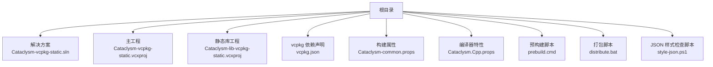
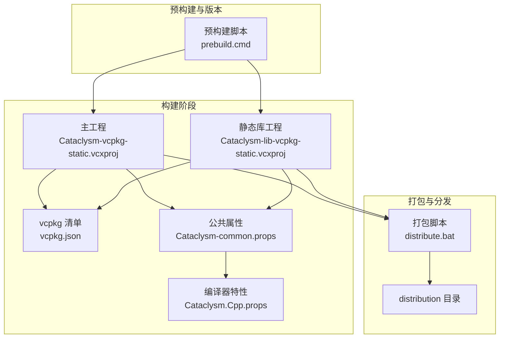
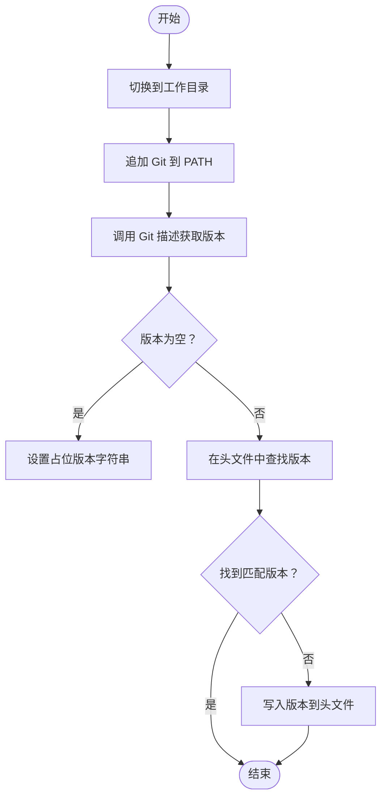
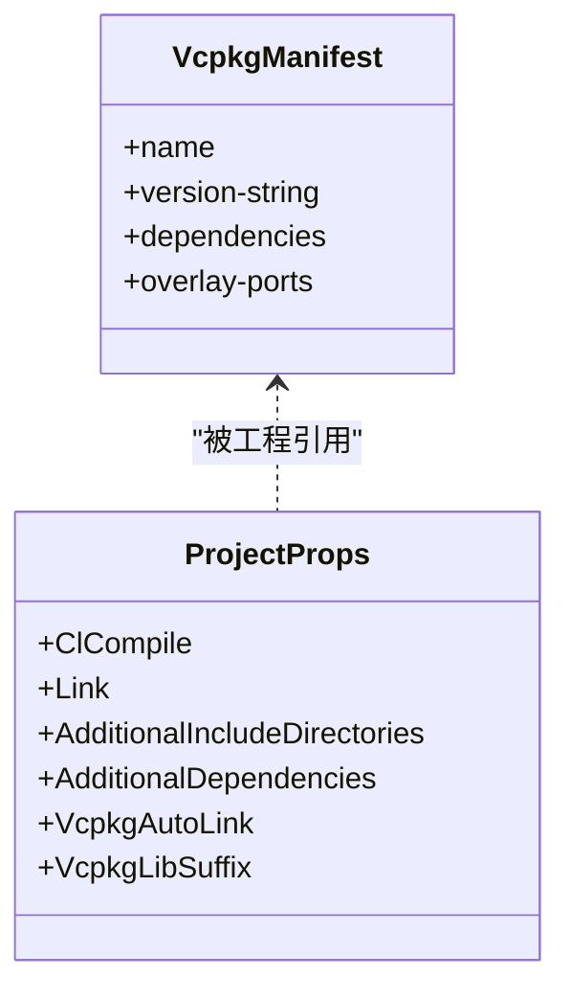
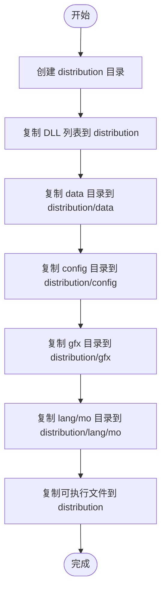
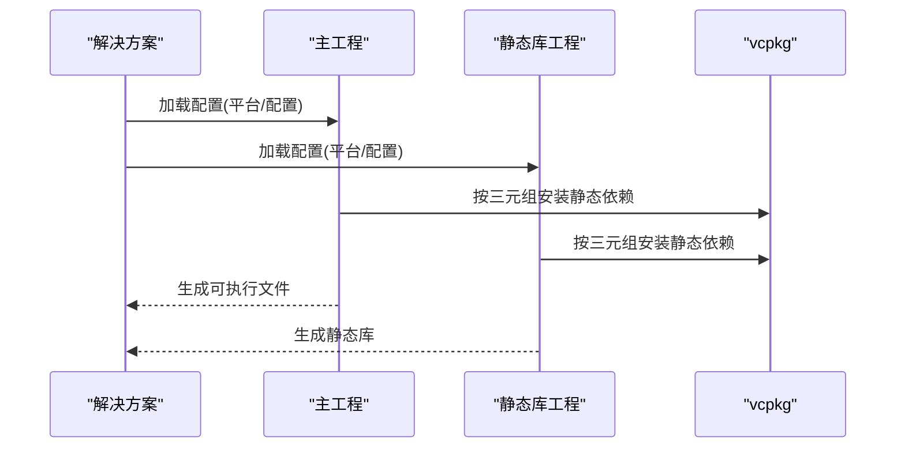
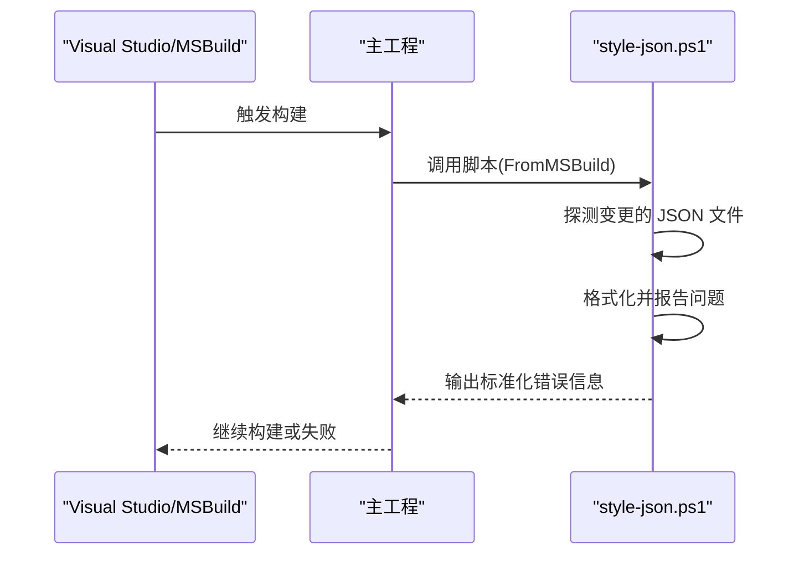
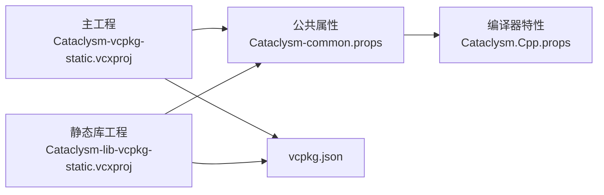

# 部署与分发

<cite>
**本文引用的文件**
- [distribute.bat](file://distribute.bat)
- [prebuild.cmd](file://prebuild.cmd)
- [vcpkg.json](file://vcpkg.json)
- [Cataclysm-vcpkg-static.sln](file://Cataclysm-vcpkg-static.sln)
- [Cataclysm.Cpp.props](file://Cataclysm.Cpp.props)
- [Cataclysm-common.props](file://Cataclysm-common.props)
- [Cataclysm-vcpkg-static.vcxproj](file://Cataclysm-vcpkg-static.vcxproj)
- [Cataclysm-lib-vcpkg-static.vcxproj](file://Cataclysm-lib-vcpkg-static.vcxproj)
- [style-json.ps1](file://style-json.ps1)
- [cataclysm.code-workspace](file://cataclysm.code-workspace)
</cite>

## 目录
1. [简介](#简介)
2. [项目结构](#项目结构)
3. [核心组件](#核心组件)
4. [架构总览](#架构总览)
5. [详细组件分析](#详细组件分析)
6. [依赖关系分析](#依赖关系分析)
7. [性能考量](#性能考量)
8. [故障排查指南](#故障排查指南)
9. [结论](#结论)
10. [附录](#附录)

## 简介
本文件系统性阐述 MSVC Full Features 项目的部署与分发策略，覆盖以下方面：
- 构建产物的打包流程：依赖库收集、资源文件整理、最终包压缩
- 不同平台架构（x86/x64/ARM64EC）的部署差异与优化策略
- 分发包的版本管理：版本号标记与变更日志生成
- 自动化分发流程配置与 CI/CD 集成建议
- 部署后验证与回滚策略，确保分发质量

## 项目结构
该仓库采用 MSBuild 解决方案组织，核心由一个主可执行工程、静态库工程、vcpkg 依赖声明与若干构建辅助脚本组成。关键目录与文件如下：
- 根目录包含解决方案、属性文件、构建脚本与 vcpkg 声明
- 通过 distribute.bat 将运行时所需的 DLL、数据、配置、图形与语言资源复制到 distribution 目录
- 通过 prebuild.cmd 在构建前生成版本头文件，供程序运行时识别版本信息

图表来源
- [Cataclysm-vcpkg-static.sln](file://Cataclysm-vcpkg-static.sln)
- [Cataclysm-vcpkg-static.vcxproj](file://Cataclysm-vcpkg-static.vcxproj)
- [Cataclysm-lib-vcpkg-static.vcxproj](file://Cataclysm-lib-vcpkg-static.vcxproj)
- [vcpkg.json](file://vcpkg.json)
- [Cataclysm-common.props](file://Cataclysm-common.props)
- [Cataclysm.Cpp.props](file://Cataclysm.Cpp.props)
- [prebuild.cmd](file://prebuild.cmd)
- [distribute.bat](file://distribute.bat)
- [style-json.ps1](file://style-json.ps1)

章节来源
- [Cataclysm-vcpkg-static.sln](file://Cataclysm-vcpkg-static.sln)
- [Cataclysm-vcpkg-static.vcxproj](file://Cataclysm-vcpkg-static.vcxproj)
- [Cataclysm-lib-vcpkg-static.vcxproj](file://Cataclysm-lib-vcpkg-static.vcxproj)
- [vcpkg.json](file://vcpkg.json)
- [Cataclysm-common.props](file://Cataclysm-common.props)
- [Cataclysm.Cpp.props](file://Cataclysm.Cpp.props)
- [prebuild.cmd](file://prebuild.cmd)
- [distribute.bat](file://distribute.bat)
- [style-json.ps1](file://style-json.ps1)

## 核心组件
- 版本生成与注入
  - 预构建阶段使用 Git 标签/提交信息生成版本字符串，并写入源码头文件，供运行时读取显示
- 依赖管理
  - 使用 vcpkg 清单安装静态依赖，按平台三元组选择对应二进制
- 打包分发
  - 使用批处理脚本将运行时 DLL、数据、配置、图形与语言资源复制到统一目录，便于后续压缩与发布
- 构建属性与工具链
  - 通过公共属性文件集中定义编译器、链接器、LLD/Thin Archive 等选项，保证跨平台一致性

章节来源
- [prebuild.cmd](file://prebuild.cmd)
- [vcpkg.json](file://vcpkg.json)
- [distribute.bat](file://distribute.bat)
- [Cataclysm-common.props](file://Cataclysm-common.props)
- [Cataclysm.Cpp.props](file://Cataclysm.Cpp.props)

## 架构总览
下图展示从构建到分发的关键路径：工程配置 → 依赖安装 → 产物生成 → 资源打包 → 发布。

图表来源
- [Cataclysm-vcpkg-static.vcxproj](file://Cataclysm-vcpkg-static.vcxproj)
- [Cataclysm-lib-vcpkg-static.vcxproj](file://Cataclysm-lib-vcpkg-static.vcxproj)
- [vcpkg.json](file://vcpkg.json)
- [Cataclysm-common.props](file://Cataclysm-common.props)
- [Cataclysm.Cpp.props](file://Cataclysm.Cpp.props)
- [prebuild.cmd](file://prebuild.cmd)
- [distribute.bat](file://distribute.bat)

## 详细组件分析

### 组件一：版本号生成与注入（prebuild.cmd）
- 功能要点
  - 通过 Git 描述生成版本字符串（含标签、提交哈希、dirty 标记）
  - 若源码头文件未包含当前版本，则写入新版本宏，确保运行时可见
- 关键行为
  - 仅在版本变化时更新头文件，避免不必要的重新编译
  - 当无法获取 Git 信息时，设置占位版本字符串，便于本地开发调试

图表来源
- [prebuild.cmd](file://prebuild.cmd)

章节来源
- [prebuild.cmd](file://prebuild.cmd)

### 组件二：依赖库收集与链接（vcpkg 与工程属性）
- vcpkg 清单
  - 声明 SDL2 及其子模块（图像、音频、字体），并启用自定义 overlay ports
  - 按平台三元组安装静态库，确保可执行文件自包含
- 工程属性
  - 公共属性集中定义编译器警告级别、预处理器定义、包含目录、链接器附加依赖等
  - 支持 LLD 链接器与 Thin Archive，提升链接速度与库体积优化
  - 针对不同配置（Debug/Release、Tiles/NoTiles）设置不同的编译与链接参数

图表来源
- [vcpkg.json](file://vcpkg.json)
- [Cataclysm-common.props](file://Cataclysm-common.props)

章节来源
- [vcpkg.json](file://vcpkg.json)
- [Cataclysm-common.props](file://Cataclysm-common.props)

### 组件三：资源文件整理与打包（distribute.bat）
- 功能要点
  - 创建 distribution 目录
  - 复制运行时 DLL 至 distribution
  - 递归复制 data、config、gfx、lang/mo 等资源目录
  - 复制可执行文件至 distribution
- 注意事项
  - 该脚本为“复制”而非“压缩”，实际压缩可在后续流程中完成
  - 适用于 x86/x64/ARM64EC 的通用打包，不区分平台变体

图表来源
- [distribute.bat](file://distribute.bat)

章节来源
- [distribute.bat](file://distribute.bat)

### 组件四：构建配置与平台差异（多配置/多平台）
- 平台支持
  - 解决方案包含 Debug/Release 与 x86/x64/ARM64EC 的组合
  - 主工程在不同平台下设置相同的可执行目标名，便于统一分发
- 配置差异
  - Debug/Release 配置分别启用/禁用优化、调试信息格式不同
  - Tiles/NoTiles 配置影响预处理器定义与运行特性
- 工具链选择
  - 可选 LLD 链接器与 LLVM Lib 工具以生成薄归档或进行快速链接

图表来源
- [Cataclysm-vcpkg-static.sln](file://Cataclysm-vcpkg-static.sln)
- [Cataclysm-vcpkg-static.vcxproj](file://Cataclysm-vcpkg-static.vcxproj)
- [Cataclysm-lib-vcpkg-static.vcxproj](file://Cataclysm-lib-vcpkg-static.vcxproj)

章节来源
- [Cataclysm-vcpkg-static.sln](file://Cataclysm-vcpkg-static.sln)
- [Cataclysm-vcpkg-static.vcxproj](file://Cataclysm-vcpkg-static.vcxproj)
- [Cataclysm-lib-vcpkg-static.vcxproj](file://Cataclysm-lib-vcpkg-static.vcxproj)

### 组件五：JSON 样式检查与质量门禁（style-json.ps1）
- 功能要点
  - 在 MSBuild 中作为自定义步骤运行，对变更的 JSON 文件进行样式检查
  - 限制执行时间，避免阻塞构建
  - 若检测到格式问题，以标准错误格式输出，便于 IDE/CI 识别
- 集成方式
  - 主工程在构建项定义中添加自定义步骤调用该脚本

图表来源
- [Cataclysm-vcpkg-static.vcxproj](file://Cataclysm-vcpkg-static.vcxproj)
- [style-json.ps1](file://style-json.ps1)

章节来源
- [Cataclysm-vcpkg-static.vcxproj](file://Cataclysm-vcpkg-static.vcxproj)
- [style-json.ps1](file://style-json.ps1)

## 依赖关系分析
- 工程与属性
  - 主工程与静态库工程均导入公共属性文件，统一编译/链接参数
  - 编译器特性属性文件控制缓存与多工具任务等高级编译行为
- 依赖与工具链
  - vcpkg 清单决定依赖集合与安装策略；工程属性控制自动链接与库后缀
  - LLD/Thin Archive 选项在公共属性中集中配置，避免重复设置

图表来源
- [Cataclysm-vcpkg-static.vcxproj](file://Cataclysm-vcpkg-static.vcxproj)
- [Cataclysm-lib-vcpkg-static.vcxproj](file://Cataclysm-lib-vcpkg-static.vcxproj)
- [Cataclysm-common.props](file://Cataclysm-common.props)
- [Cataclysm.Cpp.props](file://Cataclysm.Cpp.props)
- [vcpkg.json](file://vcpkg.json)

章节来源
- [Cataclysm-vcpkg-static.vcxproj](file://Cataclysm-vcpkg-static.vcxproj)
- [Cataclysm-lib-vcpkg-static.vcxproj](file://Cataclysm-lib-vcpkg-static.vcxproj)
- [Cataclysm-common.props](file://Cataclysm-common.props)
- [Cataclysm.Cpp.props](file://Cataclysm.Cpp.props)
- [vcpkg.json](file://vcpkg.json)

## 性能考量
- 链接与归档优化
  - 启用 LLD 链接器与 Thin Archive 可显著缩短链接时间并减小静态库体积
- 编译缓存
  - 可选启用编译缓存，配合多工具任务提升并行编译效率
- 调试信息与发布优化
  - 发布配置下关闭增量链接、生成完整调试信息并可剥离私有符号，平衡调试与发布体积

章节来源
- [Cataclysm-common.props](file://Cataclysm-common.props)
- [Cataclysm.Cpp.props](file://Cataclysm.Cpp.props)

## 故障排查指南
- 版本号未更新
  - 确认 Git 可用且存在可匹配的标签；检查预构建脚本是否成功写入头文件
- 依赖缺失导致链接失败
  - 检查 vcpkg 三元组与平台匹配；确认已安装对应静态依赖
- 打包遗漏资源
  - 确认打包脚本运行位置与相对路径正确；核对 distribution 目录内容
- JSON 样式检查阻塞构建
  - 查看脚本输出的错误定位；必要时调整执行时间阈值或跳过该步骤

章节来源
- [prebuild.cmd](file://prebuild.cmd)
- [vcpkg.json](file://vcpkg.json)
- [distribute.bat](file://distribute.bat)
- [style-json.ps1](file://style-json.ps1)

## 结论
本项目通过清晰的工程属性与 vcpkg 清单实现了跨平台静态依赖管理，结合预构建版本注入与统一打包脚本，形成可复现的部署与分发流程。建议在现有基础上补充自动化压缩与发布步骤，并将打包流程纳入 CI/CD，以实现持续交付与质量保障。

## 附录

### A. 平台架构差异与优化策略
- x86/x64/ARM64EC
  - 三元组统一映射为 Windows 静态库，确保可执行文件自包含
  - ARM64EC 通过 x64 三元组安装，减少维护复杂度
- 优化建议
  - 在 Release 配置下启用 LLD 与 Thin Archive
  - 使用编译缓存与多工具任务加速构建

章节来源
- [Cataclysm-vcpkg-static.sln](file://Cataclysm-vcpkg-static.sln)
- [Cataclysm-common.props](file://Cataclysm-common.props)

### B. 版本管理与变更日志
- 版本号标记
  - 使用 Git 描述生成版本字符串，写入源码头文件，便于运行时读取
- 变更日志生成
  - 可基于 Git 提交历史与标签生成变更记录，建议在 CI 中自动产出

章节来源
- [prebuild.cmd](file://prebuild.cmd)

### C. 自动化分发流程与 CI/CD 集成
- 建议步骤
  - 构建 → 生成版本头 → 运行测试 → 打包 distribution → 压缩发布 → 上传制品
- CI/CD 集成点
  - 在 CI 中调用构建命令与打包脚本，使用环境变量传递版本信息
  - 与代码工作区配置联动，确保上游分支与远程名称一致

章节来源
- [Cataclysm-vcpkg-static.sln](file://Cataclysm-vcpkg-static.sln)
- [cataclysm.code-workspace](file://cataclysm.code-workspace)