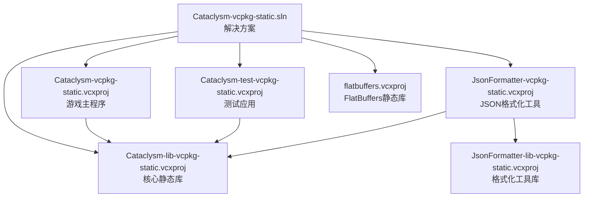
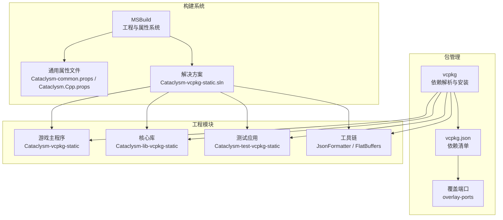
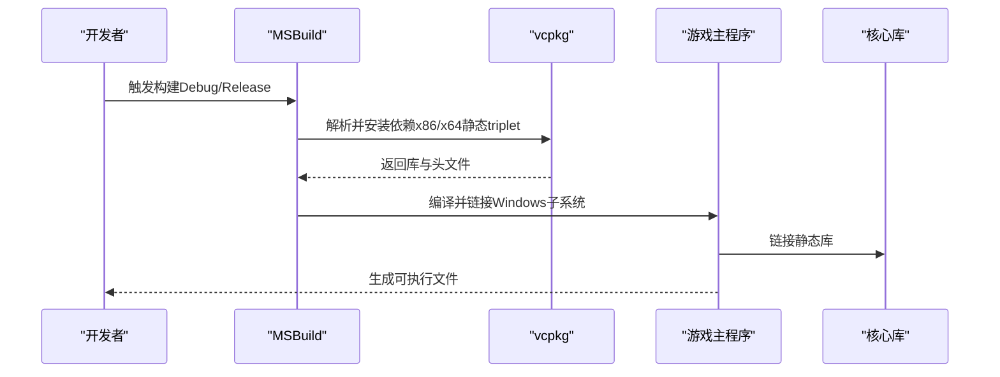
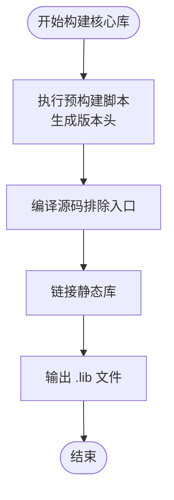
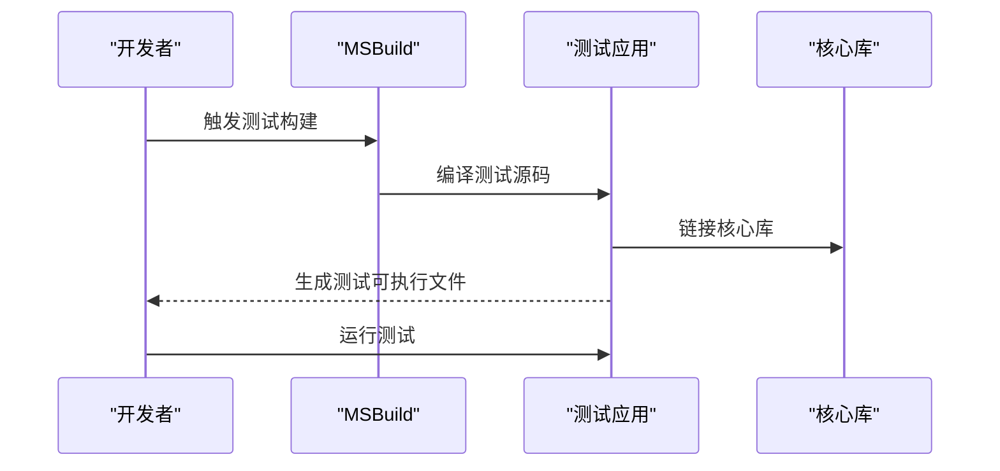
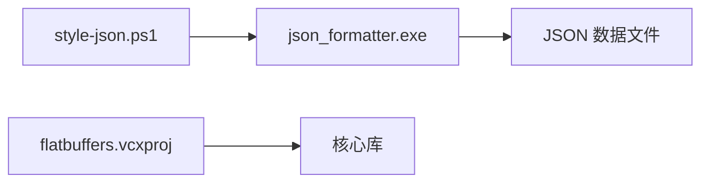
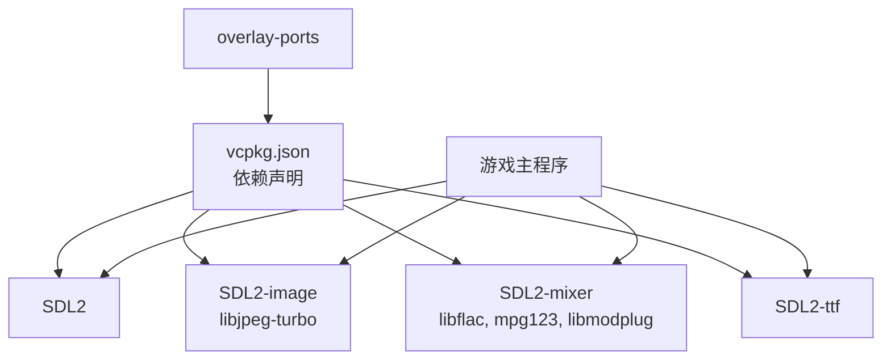

# 项目概述

<cite>
**本文引用的文件**
- [vcpkg.json](file://vcpkg.json)
- [Cataclysm-vcpkg-static.sln](file://Cataclysm-vcpkg-static.sln)
- [Cataclysm.Cpp.props](file://Cataclysm.Cpp.props)
- [Cataclysm-common.props](file://Cataclysm-common.props)
- [prebuild.cmd](file://prebuild.cmd)
- [distribute.bat](file://distribute.bat)
- [style-json.ps1](file://style-json.ps1)
- [AStyleExtension-Cataclysm-DDA.cfg](file://AStyleExtension-Cataclysm-DDA.cfg)
- [cataclysm.code-workspace](file://cataclysm.code-workspace)
- [Cataclysm-vcpkg-static.vcxproj](file://Cataclysm-vcpkg-static.vcxproj)
- [Cataclysm-lib-vcpkg-static.vcxproj](file://Cataclysm-lib-vcpkg-static.vcxproj)
- [Cataclysm-test-vcpkg-static.vcxproj](file://Cataclysm-test-vcpkg-static.vcxproj)
- [JsonFormatter-vcpkg-static.vcxproj](file://JsonFormatter-vcpkg-static.vcxproj)
- [flatbuffers.vcxproj](file://flatbuffers.vcxproj)
</cite>

## 目录
1. [引言](#引言)
2. [项目结构](#项目结构)
3. [核心组件](#核心组件)
4. [架构总览](#架构总览)
5. [详细组件分析](#详细组件分析)
6. [依赖关系分析](#依赖关系分析)
7. [性能考量](#性能考量)
8. [故障排查指南](#故障排查指南)
9. [结论](#结论)
10. [附录](#附录)

## 引言
本项目是 Cataclysm: Dark Days Ahead（中世纪风格版本）在 Windows 平台上的 MSVC 全功能构建方案。其目标与愿景是：
- 提供稳定、可移植且高性能的 Windows 游戏体验，支持多平台（x86/x64/ARM64EC）与多种构建变体（含/不含贴图资源、调试/发布等）。
- 通过 vcpkg 包管理器统一依赖，采用静态链接减少运行时分发复杂度，并结合 MSBuild 的工程化能力提升可维护性与一致性。
- 以模块化设计组织：游戏主程序、核心库、测试框架与工具链清晰分离，便于独立编译、测试与分发。

本概述面向初学者与资深开发者，既提供背景知识，也给出技术深度分析与实践建议。

## 项目结构
该工作区围绕一个解决方案组织多个工程，形成“主程序 + 核心库 + 测试 + 工具”的模块化布局：
- 解决方案文件集中声明所有工程及其配置矩阵（Debug/Release、x86/x64/ARM64EC、含/不含贴图资源等）。
- 工程按职责划分：应用工程负责最终可执行文件；静态库工程封装核心逻辑；测试工程承载单元/基准测试；工具工程提供数据格式化与校验。
- 通用属性文件统一编译/链接选项、预处理宏、包含路径与第三方库枚举，确保跨工程一致性。

图表来源
- [Cataclysm-vcpkg-static.sln:17-28](file://Cataclysm-vcpkg-static.sln#L17-L28)
- [Cataclysm-vcpkg-static.vcxproj:226-229](file://Cataclysm-vcpkg-static.vcxproj#L226-L229)
- [Cataclysm-test-vcpkg-static.vcxproj:188-190](file://Cataclysm-test-vcpkg-static.vcxproj#L188-L190)
- [JsonFormatter-vcpkg-static.vcxproj:144-149](file://JsonFormatter-vcpkg-static.vcxproj#L144-L149)
- [flatbuffers.vcxproj:182-185](file://flatbuffers.vcxproj#L182-L185)

章节来源
- [Cataclysm-vcpkg-static.sln:1-189](file://Cataclysm-vcpkg-static.sln#L1-L189)
- [Cataclysm.Cpp.props:1-11](file://Cataclysm.Cpp.props#L1-L11)
- [Cataclysm-common.props:1-154](file://Cataclysm-common.props#L1-L154)

## 核心组件
- vcpkg 依赖清单与覆盖端口
  - 通过 vcpkg.json 声明 SDL2 生态（图像、音频、字体）及特性选择，同时指定覆盖端口目录以引入定制化端口。
- 通用构建属性
  - 通过 Cataclysm-common.props 统一编译标准（C++17）、警告级别、预编译头、包含路径、预处理器定义与链接器设置（含 Windows 系统库）。
  - 通过 Cataclysm.Cpp.props 控制缓存编译、多工具任务等高级特性。
- 预构建与版本生成
  - prebuild.cmd 在构建前生成版本头文件，确保二进制版本号与 Git 描述一致。
- 分发脚本
  - distribute.bat 将 DLL、数据、配置、资源与可执行文件打包到 distribution 目录，便于快速分发。
- JSON 样式检查与格式化
  - style-json.ps1 作为 MSBuild 自定义步骤调用 json_formatter.exe 对变更的 JSON 文件进行样式检查与格式化，避免 CI/IDE 中断。
- 开发环境工作区
  - cataclysm.code-workspace 定义多文件夹工作区与扩展推荐，提升协作效率。

章节来源
- [vcpkg.json:1-22](file://vcpkg.json#L1-L22)
- [Cataclysm-common.props:42-143](file://Cataclysm-common.props#L42-L143)
- [Cataclysm.Cpp.props:1-11](file://Cataclysm.Cpp.props#L1-L11)
- [prebuild.cmd:1-16](file://prebuild.cmd#L1-L16)
- [distribute.bat:1-11](file://distribute.bat#L1-L11)
- [style-json.ps1:1-78](file://style-json.ps1#L1-L78)
- [cataclysm.code-workspace:1-22](file://cataclysm.code-workspace#L1-L22)

## 架构总览
整体架构强调“静态链接 + vcpkg + MSBuild 属性系统”的组合，以实现：
- 可重复的构建：统一的属性与条件逻辑保证不同配置/平台的一致行为。
- 易于维护：通用属性文件集中管理编译/链接细节，减少重复配置。
- 可观测性：针对 VS 调试器已知问题（如 DebugFastLink 段错误）提供条件修复。
- 可扩展性：通过覆盖端口与自定义 triplet 支持非标准依赖或本地修改。

图表来源
- [Cataclysm-vcpkg-static.sln:17-28](file://Cataclysm-vcpkg-static.sln#L17-L28)
- [vcpkg.json:16-20](file://vcpkg.json#L16-L20)
- [Cataclysm-common.props:23-40](file://Cataclysm-common.props#L23-L40)
- [Cataclysm-vcpkg-static.vcxproj:63-73](file://Cataclysm-vcpkg-static.vcxproj#L63-L73)
- [Cataclysm-lib-vcpkg-static.vcxproj:60-71](file://Cataclysm-lib-vcpkg-static.vcxproj#L60-L71)
- [Cataclysm-test-vcpkg-static.vcxproj:63-73](file://Cataclysm-test-vcpkg-static.vcxproj#L63-L73)
- [JsonFormatter-vcpkg-static.vcxproj:39-49](file://JsonFormatter-vcpkg-static.vcxproj#L39-L49)

## 详细组件分析

### 游戏主程序（Cataclysm-vcpkg-static）
- 角色定位：最终可执行文件，面向用户运行。
- 关键特性：
  - 使用 Windows 子系统（窗口模式），定义 USE_WINMAIN。
  - 默认目标名统一为 cataclysm-tiles，便于分发与识别。
  - 条件宏控制是否启用贴图资源（TILES）与调试变体（Debug/Release-NoTiles）。
  - 集成 vcpkg 静态依赖与 LLD 链接器（当启用 Thin Archives 或 LLD 时）。
- 依赖关系：引用核心库工程，间接获得 SDL2 生态与 FlatBuffers。

图表来源
- [Cataclysm-vcpkg-static.vcxproj:159-171](file://Cataclysm-vcpkg-static.vcxproj#L159-L171)
- [Cataclysm-vcpkg-static.vcxproj:226-229](file://Cataclysm-vcpkg-static.vcxproj#L226-L229)
- [Cataclysm-common.props:91-140](file://Cataclysm-common.props#L91-L140)

章节来源
- [Cataclysm-vcpkg-static.vcxproj:1-236](file://Cataclysm-vcpkg-static.vcxproj#L1-L236)

### 核心库（Cataclysm-lib-vcpkg-static）
- 角色定位：封装游戏核心逻辑，供主程序与测试共享。
- 关键特性：
  - 静态库类型，统一编译/链接选项与预处理器宏。
  - 预构建事件调用 prebuild.cmd 生成版本头文件。
  - 依赖 FlatBuffers 静态库，用于数据序列化。
- 产出：.lib 库文件，供其他工程引用。

图表来源
- [Cataclysm-lib-vcpkg-static.vcxproj:123-126](file://Cataclysm-lib-vcpkg-static.vcxproj#L123-L126)
- [Cataclysm-lib-vcpkg-static.vcxproj:175-180](file://Cataclysm-lib-vcpkg-static.vcxproj#L175-L180)
- [flatbuffers.vcxproj:182-185](file://flatbuffers.vcxproj#L182-L185)

章节来源
- [Cataclysm-lib-vcpkg-static.vcxproj:1-191](file://Cataclysm-lib-vcpkg-static.vcxproj#L1-L191)

### 测试框架（Cataclysm-test-vcpkg-static）
- 角色定位：承载单元测试与基准测试，使用 Catch2。
- 关键特性：
  - 控制台子系统，启用 CATCH_CONFIG_ENABLE_BENCHMARKING。
  - 链接 legacy_stdio_float_rounding.obj 以兼容某些浮点行为。
  - 引用核心库，确保测试覆盖完整逻辑层。
- 产出：测试可执行文件，可在 CI 或本地运行。

图表来源
- [Cataclysm-test-vcpkg-static.vcxproj:124-131](file://Cataclysm-test-vcpkg-static.vcxproj#L124-L131)
- [Cataclysm-test-vcpkg-static.vcxproj:188-191](file://Cataclysm-test-vcpkg-static.vcxproj#L188-L191)

章节来源
- [Cataclysm-test-vcpkg-static.vcxproj:1-195](file://Cataclysm-test-vcpkg-static.vcxproj#L1-L195)

### 工具链（JsonFormatter 与 FlatBuffers）
- JsonFormatter
  - 控制台应用，负责对 JSON 数据进行样式检查与格式化。
  - 通过 style-json.ps1 作为 MSBuild 步骤自动触发，限制执行时间并输出 VS 友好的错误格式。
- FlatBuffers
  - 内置静态库，提供数据序列化能力，不启用 vcpkg 管理，直接从 src/third-party 头文件编译。

图表来源
- [JsonFormatter-vcpkg-static.vcxproj:103-110](file://JsonFormatter-vcpkg-static.vcxproj#L103-L110)
- [JsonFormatter-vcpkg-static.vcxproj:144-149](file://JsonFormatter-vcpkg-static.vcxproj#L144-L149)
- [flatbuffers.vcxproj:49-55](file://flatbuffers.vcxproj#L49-L55)
- [style-json.ps1:26-30](file://style-json.ps1#L26-L30)

章节来源
- [JsonFormatter-vcpkg-static.vcxproj:1-154](file://JsonFormatter-vcpkg-static.vcxproj#L1-L154)
- [flatbuffers.vcxproj:1-128](file://flatbuffers.vcxproj#L1-L128)
- [style-json.ps1:1-78](file://style-json.ps1#L1-L78)

## 依赖关系分析
- vcpkg 依赖树
  - SDL2 生态：SDL2、SDL2_image（libjpeg-turbo）、SDL2-mixer（libflac/mpg123/libmodplug）、SDL2-ttf。
  - 通过覆盖端口目录引入定制化端口，满足项目特殊需求。
- 链接策略
  - 默认使用 MSVC 链接器；当启用 Thin Archives 或 LLD 时切换至 lld-link，并手动枚举 vcpkg 安装产物的静态库后缀与路径。
  - 针对 VS 调试器特定版本的 DebugFastLink 段错误问题，提供条件修复。
- 平台与工具集
  - 支持 x86/x64/ARM64EC；统一首选工具架构为 x64，确保构建稳定性。

图表来源
- [vcpkg.json:4-15](file://vcpkg.json#L4-L15)
- [Cataclysm-common.props:91-140](file://Cataclysm-common.props#L91-L140)
- [Cataclysm-vcpkg-static.vcxproj:63-73](file://Cataclysm-vcpkg-static.vcxproj#L63-L73)

章节来源
- [vcpkg.json:1-22](file://vcpkg.json#L1-L22)
- [Cataclysm-common.props:23-40](file://Cataclysm-common.props#L23-L40)

## 性能考量
- 静态链接优势
  - 减少运行时依赖，简化分发与部署；避免动态库版本冲突。
  - 通过 LLD 链接器与 Thin Archives 可进一步优化链接速度与库体积。
- 编译与链接优化
  - 启用多核编译、禁用最小重载、UTF-8 源码编码、大对象支持等，兼顾编译速度与兼容性。
  - 针对 VS 调试器特定版本的 DebugFastLink 段错误问题提供条件修复，保障调试稳定性。
- 构建缓存与并行
  - 可选启用 ccache 与多工具任务，加速增量构建。

章节来源
- [Cataclysm-common.props:46-51](file://Cataclysm-common.props#L46-L51)
- [Cataclysm-common.props:81-85](file://Cataclysm-common.props#L81-L85)
- [Cataclysm.Cpp.props:1-11](file://Cataclysm.Cpp.props#L1-L11)

## 故障排查指南
- 版本头未生成
  - 现象：运行时报错提示缺少版本常量。
  - 排查：确认 Git 已安装且可被批处理脚本访问；检查 prebuild.cmd 是否成功写入版本头。
- JSON 样式检查失败
  - 现象：MSBuild 报告 JSON 样式警告或跳过检查。
  - 排查：确认 json_formatter.exe 存在且未被锁定；检查 style-json.ps1 输出的错误信息；必要时手动运行脚本。
- 链接器错误（LLD 或 vcpkg 依赖）
  - 现象：使用 LLD 时因通配符参数不被接受导致链接失败。
  - 排查：确保已手动枚举 vcpkg 安装产物的静态库名称与路径；检查 VcpkgAutoLink 与 LibSuffix 设置。
- 调试器段错误（VS 2022 DebugFastLink）
  - 现象：使用特定工具集版本时 DebugFastLink 导致崩溃。
  - 排查：根据平台工具集版本条件回退到 DebugFull。

章节来源
- [prebuild.cmd:1-16](file://prebuild.cmd#L1-L16)
- [style-json.ps1:11-18](file://style-json.ps1#L11-L18)
- [style-json.ps1:28-34](file://style-json.ps1#L28-L34)
- [Cataclysm-common.props:91-140](file://Cataclysm-common.props#L91-L140)
- [Cataclysm-common.props:81-85](file://Cataclysm-common.props#L81-L85)

## 结论
本项目通过 vcpkg + MSBuild + 通用属性文件的组合，实现了在 Windows 平台上稳定、可重复且易于维护的构建体系。模块化设计使主程序、核心库、测试与工具各司其职，配合静态链接与现代化工具链，既满足初学者快速上手的需求，也为资深开发者提供了可扩展与可优化的空间。建议在团队内统一使用该构建方案，并持续完善覆盖端口与工具链，以适配未来依赖演进。

## 附录
- 快速参考
  - 构建：在 Visual Studio 中打开解决方案，选择配置（Debug/Release）与平台（x86/x64/ARM64EC），直接构建。
  - 分发：运行 distribute.bat，将所需文件打包到 distribution 目录。
  - 格式化：通过 style-json.ps1 或在 MSBuild 中触发 JSON 样式检查。
- IDE 配置
  - 使用 cataclysm.code-workspace 打开多文件夹工作区，启用推荐扩展以提升开发体验。

章节来源
- [distribute.bat:1-11](file://distribute.bat#L1-L11)
- [style-json.ps1:1-78](file://style-json.ps1#L1-L78)
- [cataclysm.code-workspace:1-22](file://cataclysm.code-workspace#L1-L22)