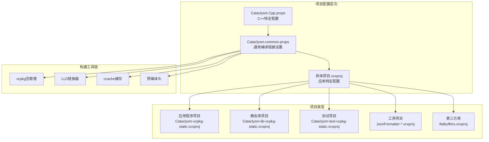
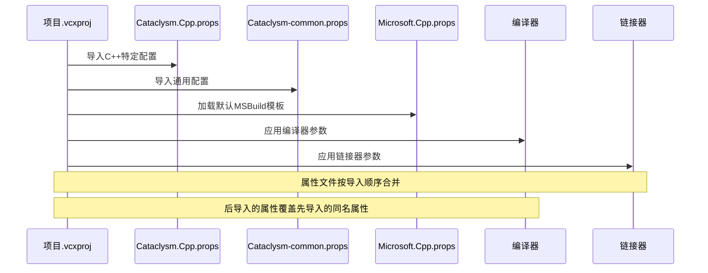
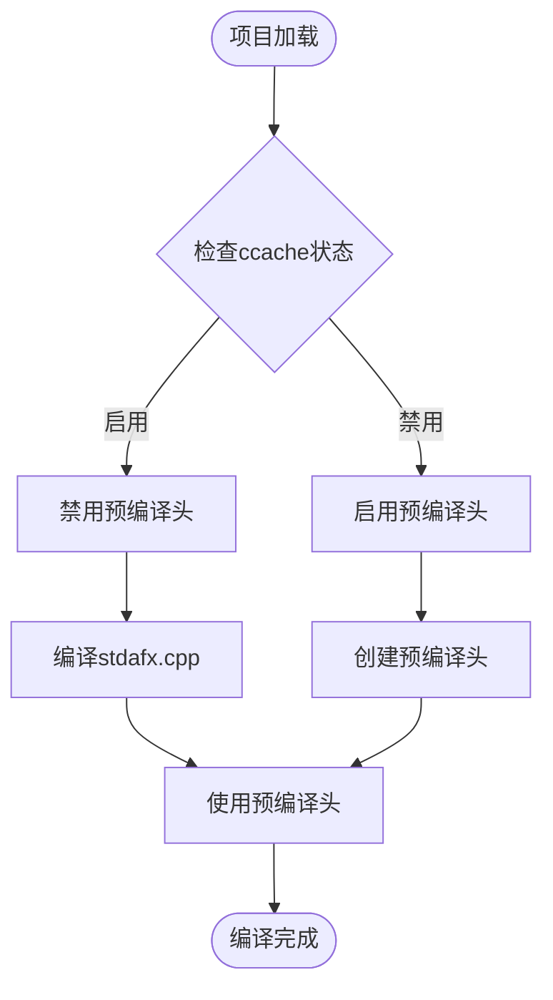
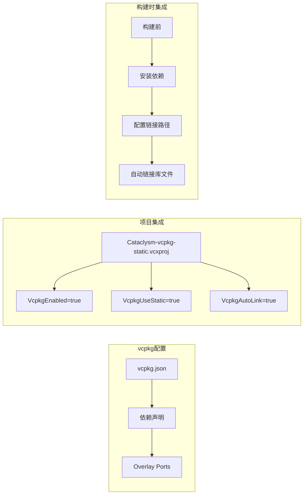
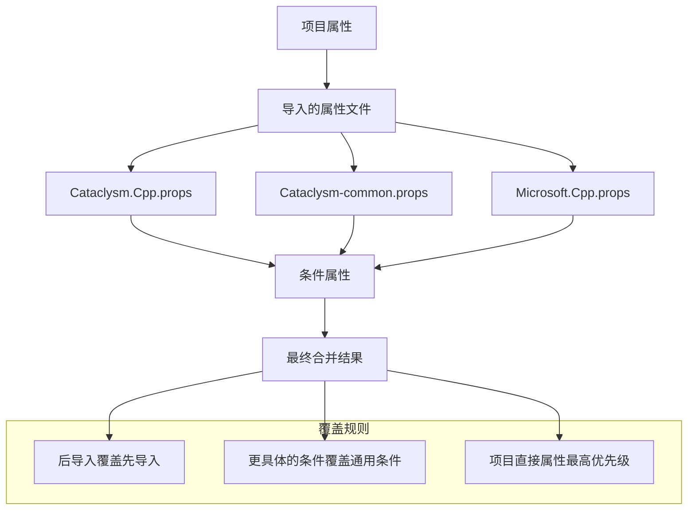
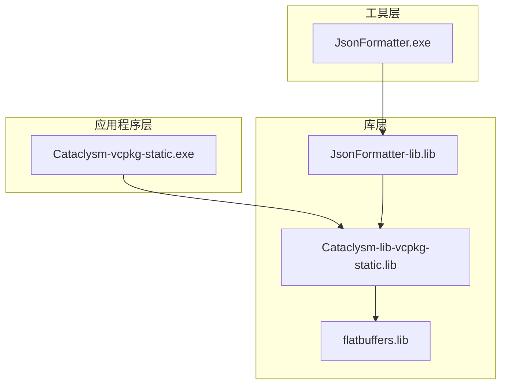

# 共享配置管理

<cite>
**本文档引用的文件**
- [Cataclysm-common.props](file://Cataclysm-common.props)
- [Cataclysm.Cpp.props](file://Cataclysm.Cpp.props)
- [Cataclysm-vcpkg-static.vcxproj](file://Cataclysm-vcpkg-static.vcxproj)
- [Cataclysm-lib-vcpkg-static.vcxproj](file://Cataclysm-lib-vcpkg-static.vcxproj)
- [Cataclysm-test-vcpkg-static.vcxproj](file://Cataclysm-test-vcpkg-static.vcxproj)
- [JsonFormatter-lib-vcpkg-static.vcxproj](file://JsonFormatter-lib-vcpkg-static.vcxproj)
- [JsonFormatter-vcpkg-static.vcxproj](file://JsonFormatter-vcpkg-static.vcxproj)
- [flatbuffers.vcxproj](file://flatbuffers.vcxproj)
- [stdafx.h](file://stdafx.h)
- [stdafx.cpp](file://stdafx.cpp)
- [vcpkg.json](file://vcpkg.json)
</cite>

## 目录
1. [简介](#简介)
2. [项目结构概览](#项目结构概览)
3. [核心组件分析](#核心组件分析)
4. [架构总览](#架构总览)
5. [详细组件分析](#详细组件分析)
6. [依赖关系分析](#依赖关系分析)
7. [性能考虑](#性能考虑)
8. [故障排除指南](#故障排除指南)
9. [结论](#结论)

## 简介

本文件深入解析MSVC Full Features项目的共享配置文件体系，重点分析两个核心属性文件：Cataclysm-common.props（通用编译和链接设置）和Cataclysm.Cpp.props（C++特定编译选项）。该体系通过MSBuild属性文件实现配置的集中管理和一致性控制，支持多平台（Win32、x64、ARM64EC）、多配置（Debug、Release、Debug-NoTiles、Release-NoTiles）以及多种构建场景（应用程序、静态库、测试项目）。

## 项目结构概览

该项目采用分层配置架构，通过属性文件实现配置的模块化和复用：

**图表来源**
- [Cataclysm.Cpp.props:1-11](file://Cataclysm.Cpp.props#L1-L11)
- [Cataclysm-common.props:1-154](file://Cataclysm-common.props#L1-L154)
- [Cataclysm-vcpkg-static.vcxproj:97-104](file://Cataclysm-vcpkg-static.vcxproj#L97-L104)

**章节来源**
- [Cataclysm.Cpp.props:1-11](file://Cataclysm.Cpp.props#L1-L11)
- [Cataclysm-common.props:1-154](file://Cataclysm-common.props#L1-L154)
- [Cataclysm-vcpkg-static.vcxproj:97-104](file://Cataclysm-vcpkg-static.vcxproj#L97-L104)

## 核心组件分析

### Cataclysm-common.props - 通用编译和链接设置

Cataclysm-common.props是整个配置体系的核心，提供了统一的编译和链接参数：

#### 基础路径配置
- **根目录设置**：`$(CDDA_ROOT)` 指向项目根目录
- **输出目录**：自动为每个配置和平台生成独立的objwin目录结构
- **目标名称**：包含配置和平台信息，便于区分不同构建产物

#### 条件编译控制
- **回溯功能**：通过 `_CDDA_BACKTRACE` 控制是否启用堆栈回溯
- **发布构建**：`_CDDA_RELEASE_BUILD` 标志控制发布版本特性
- **Thin Archives**：支持LLVM thin archive优化
- **LLD链接器**：可选的LLD替代链接器

#### 编译器配置
- **警告级别**：Level1（相对宽松）
- **安全检查**：禁用缓冲区安全检查以提高性能
- **并行编译**：启用多处理器编译
- **调试信息**：使用ProgramDatabase格式
- **字符集**：UTF-8支持
- **语言标准**：C++17标准
- **预编译头**：集成stdafx.h

#### 链接器配置
- **调试信息**：DebugFastLink用于快速调试
- **增量链接**：默认启用以加快二次构建
- **系统库**：包含Windows常用系统库依赖

**章节来源**
- [Cataclysm-common.props:5-25](file://Cataclysm-common.props#L5-L25)
- [Cataclysm-common.props:41-90](file://Cataclysm-common.props#L41-L90)

### Cataclysm.Cpp.props - C++特定编译选项

Cataclysm.Cpp.props专注于C++编译器行为控制：

#### ccache集成
- **条件启用**：仅在非Debug配置下启用ccache
- **性能优化**：通过 `UseMultiToolTask` 提升编译速度
- **兼容性调整**：与ccache配合时禁用某些编译器特性

#### 构建工具链选择
- **默认工具链**：基于项目配置自动选择
- **LLVM集成**：支持LLVM工具链的替代编译器
- **Thin Archive**：优化静态库的链接性能

**章节来源**
- [Cataclysm.Cpp.props:3-10](file://Cataclysm.Cpp.props#L3-L10)

## 架构总览

**图表来源**
- [Cataclysm-vcpkg-static.vcxproj:97-104](file://Cataclysm-vcpkg-static.vcxproj#L97-L104)
- [Cataclysm.Cpp.props:1-11](file://Cataclysm.Cpp.props#L1-L11)
- [Cataclysm-common.props:1-154](file://Cataclysm-common.props#L1-L154)

## 详细组件分析

### 预编译头系统

项目实现了高效的预编译头机制：

**图表来源**
- [Cataclysm-common.props:149-151](file://Cataclysm-common.props#L149-L151)
- [Cataclysm-common.props:65-70](file://Cataclysm-common.props#L65-L70)

#### 预编译头文件内容
stdafx.h包含了大量常用的C++标准库头文件，包括：
- 容器类（vector、map、set等）
- 算法和函数式编程支持
- I/O流和字符串处理
- 正则表达式和随机数生成
- 多线程同步原语

**章节来源**
- [stdafx.h:1-96](file://stdafx.h#L1-L96)
- [Cataclysm-common.props:145-151](file://Cataclysm-common.props#L145-L151)

### vcpkg包管理系统集成

项目通过vcpkg实现依赖管理：

**图表来源**
- [vcpkg.json:1-22](file://vcpkg.json#L1-L22)
- [Cataclysm-vcpkg-static.vcxproj:63-72](file://Cataclysm-vcpkg-static.vcxproj#L63-L72)

#### 支持的SDL2扩展
- **SDL2 Image**：JPEG Turbo加速的图像处理
- **SDL2 Mixer**：FLAC、MPG123、ModPlug音频解码
- **SDL2 TTF**：TrueType字体渲染

**章节来源**
- [vcpkg.json:4-15](file://vcpkg.json#L4-L15)
- [Cataclysm-common.props:98-136](file://Cataclysm-common.props#L98-L136)

### 多平台支持架构

项目支持三种主要平台：

| 平台 | 三字母代码 | vcpkg三元组 | 特殊配置 |
|------|------------|-------------|----------|
| Win32 | x86 | x86-windows-static | 32位构建 |
| x64 | AMD64 | x64-windows-static | 默认64位 |
| ARM64EC | ARM64EC | x64-windows-static | ARM64仿真 |

**章节来源**
- [Cataclysm-vcpkg-static.vcxproj:59-61](file://Cataclysm-vcpkg-static.vcxproj#L59-L61)
- [Cataclysm-lib-vcpkg-static.vcxproj:66-68](file://Cataclysm-lib-vcpkg-static.vcxproj#L66-L68)

### 配置继承和覆盖机制

MSBuild的属性继承遵循严格的优先级规则：

**图表来源**
- [Cataclysm-vcpkg-static.vcxproj:97-104](file://Cataclysm-vcpkg-static.vcxproj#L97-L104)
- [Cataclysm.Cpp.props:5-5](file://Cataclysm.Cpp.props#L5-L5)
- [Cataclysm-common.props:12-21](file://Cataclysm-common.props#L12-L21)

## 依赖关系分析

### 项目间依赖图

**图表来源**
- [Cataclysm-vcpkg-static.vcxproj:226-228](file://Cataclysm-vcpkg-static.vcxproj#L226-L228)
- [JsonFormatter-vcpkg-static.vcxproj:144-149](file://JsonFormatter-vcpkg-static.vcxproj#L144-L149)

### 运行时库选择策略

项目根据配置类型自动选择合适的运行时库：

| 配置类型 | 运行时库 | 特点 | 使用场景 |
|----------|----------|------|----------|
| Debug | MultiThreadedDebug | 调试友好，包含调试符号 | 开发和调试 |
| Release | MultiThreaded | 性能优化，无调试开销 | 发布版本 |

**章节来源**
- [Cataclysm-vcpkg-static.vcxproj:177](file://Cataclysm-vcpkg-static.vcxproj#L177)
- [Cataclysm-lib-vcpkg-static.vcxproj:132](file://Cataclysm-lib-vcpkg-static.vcxproj#L132)

## 性能考虑

### 编译性能优化

1. **并行编译**：启用多处理器编译提升构建速度
2. **预编译头**：减少重复编译时间
3. **ccache集成**：缓存编译结果避免重复编译
4. **Thin Archives**：优化静态库链接性能

### 链接器优化

1. **增量链接**：默认启用以加快二次构建
2. **COMDAT折叠**：移除重复代码段
3. **链接时代码生成**：在Release配置下启用优化

## 故障排除指南

### 常见问题及解决方案

#### 预编译头相关问题
- **问题**：启用ccache后预编译头失效
- **原因**：ccache不支持某些编译器特性
- **解决**：ccache启用时自动禁用预编译头

#### 链接器兼容性问题
- **问题**：LLD链接器不支持某些依赖模式
- **解决**：手动枚举所有依赖库而非使用通配符

#### vcpkg依赖冲突
- **问题**：静态库链接错误
- **解决**：确保所有依赖都使用相同的静态链接模式

**章节来源**
- [Cataclysm-common.props:65-70](file://Cataclysm-common.props#L65-L70)
- [Cataclysm-common.props:36-40](file://Cataclysm-common.props#L36-L40)
- [Cataclysm-common.props:122-136](file://Cataclysm-common.props#L122-L136)

## 结论

该MSVC Full Features项目的共享配置文件体系展现了优秀的工程实践：

1. **模块化设计**：通过属性文件实现配置的模块化和复用
2. **一致性保证**：统一的编译和链接设置确保跨项目的一致性
3. **灵活性**：支持多种平台、配置和构建场景
4. **性能优化**：集成ccache、Thin Archives等现代构建技术
5. **可维护性**：清晰的继承关系和覆盖机制便于维护

这套配置体系为大型C++项目提供了可靠的构建基础设施，值得在类似项目中借鉴和参考。