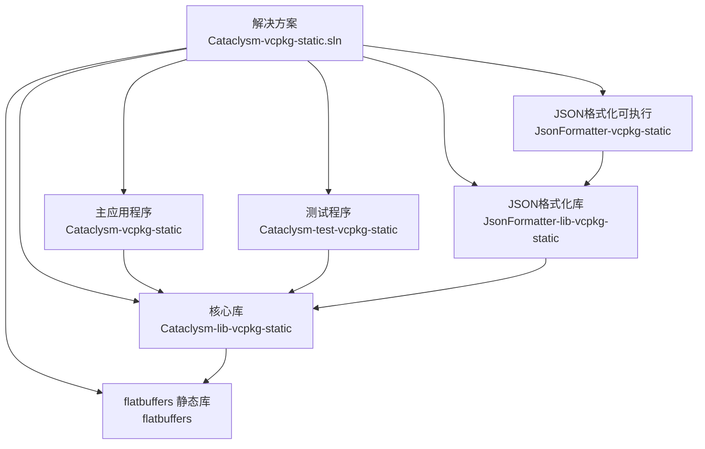
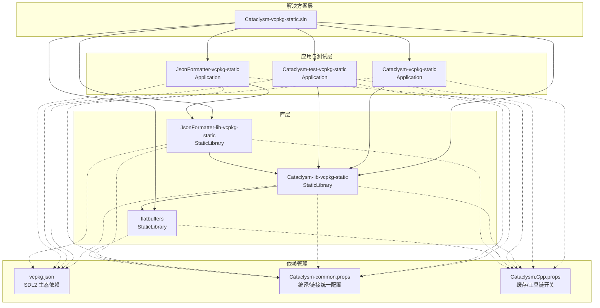
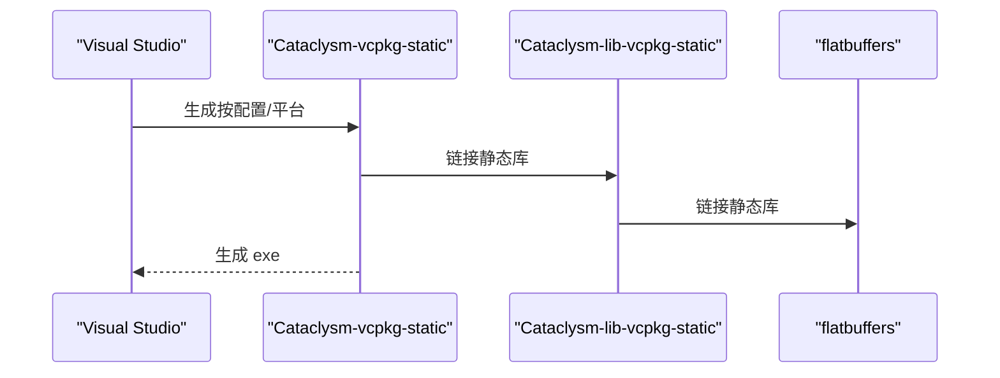
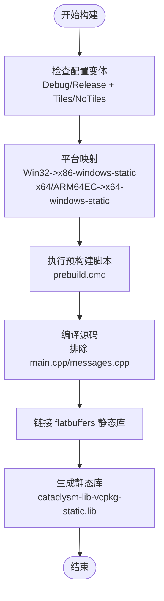
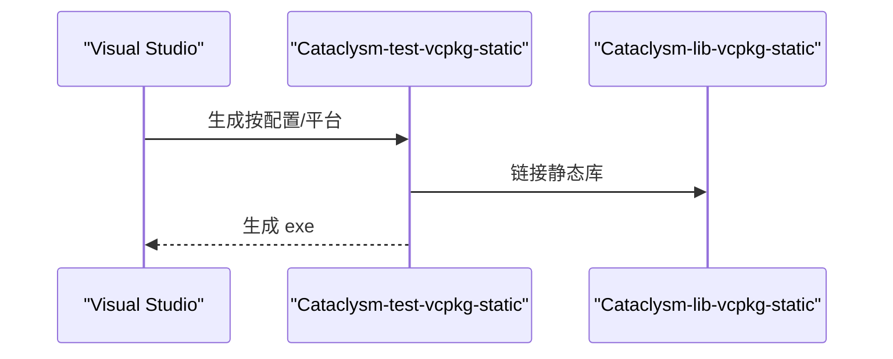
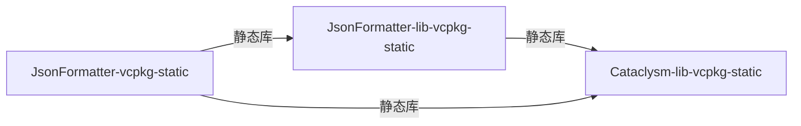
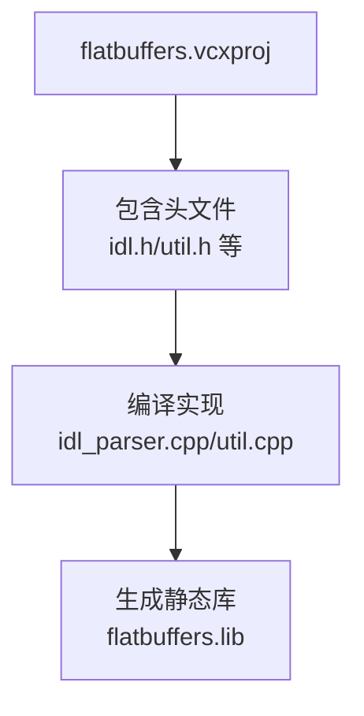
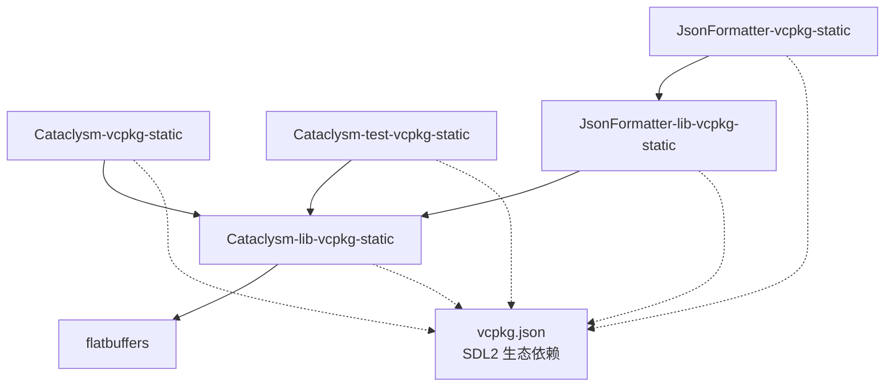

# 解决方案组织结构

<cite>
**本文档引用的文件**
- [Cataclysm-vcpkg-static.sln](file://Cataclysm-vcpkg-static.sln)
- [Cataclysm-vcpkg-static.vcxproj](file://Cataclysm-vcpkg-static.vcxproj)
- [Cataclysm-lib-vcpkg-static.vcxproj](file://Cataclysm-lib-vcpkg-static.vcxproj)
- [Cataclysm-test-vcpkg-static.vcxproj](file://Cataclysm-test-vcpkg-static.vcxproj)
- [JsonFormatter-vcpkg-static.vcxproj](file://JsonFormatter-vcpkg-static.vcxproj)
- [JsonFormatter-lib-vcpkg-static.vcxproj](file://JsonFormatter-lib-vcpkg-static.vcxproj)
- [flatbuffers.vcxproj](file://flatbuffers.vcxproj)
- [Cataclysm.Cpp.props](file://Cataclysm.Cpp.props)
- [Cataclysm-common.props](file://Cataclysm-common.props)
- [vcpkg.json](file://vcpkg.json)
- [Cataclysm-vcpkg-static.vcxproj.user](file://Cataclysm-vcpkg-static.vcxproj.user)
- [Cataclysm-lib-vcpkg-static.vcxproj.user](file://Cataclysm-lib-vcpkg-static.vcxproj.user)
- [Cataclysm-test-vcpkg-static.vcxproj.user](file://Cataclysm-test-vcpkg-static.vcxproj.user)
- [JsonFormatter-vcpkg-static.vcxproj.user](file://JsonFormatter-vcpkg-static.vcxproj.user)
- [JsonFormatter-lib-vcpkg-static.vcxproj.user](file://JsonFormatter-lib-vcpkg-static.vcxproj.user)
</cite>

## 目录
1. [简介](#简介)
2. [项目结构概览](#项目结构概览)
3. [核心组件分析](#核心组件分析)
4. [架构总览](#架构总览)
5. [详细组件分析](#详细组件分析)
6. [依赖关系分析](#依赖关系分析)
7. [性能与构建特性](#性能与构建特性)
8. [Visual Studio 导航最佳实践](#visual-studio-导航最佳实践)
9. [故障排除指南](#故障排除指南)
10. [结论](#结论)

## 简介
本文件系统性解析 MSVC Full Features 解决方案的组织结构，覆盖以下方面：
- 解决方案中的项目类型与职责划分：主应用程序、核心库、测试程序、JSON 格式化器（库与可执行）、数据序列化库（flatbuffers）。
- 项目间的依赖关系与构建顺序。
- 支持的解决方案配置平台（Debug/Release）与架构（x86/x64/ARM64EC）。
- 在 Visual Studio 中高效导航与管理构建配置的方法。

## 项目结构概览
该解决方案采用“多项目单解决方案”的组织方式，所有项目共享统一的公共属性与工具链设置，通过 vcpkg 进行依赖管理，并以静态链接方式集成第三方库。核心项目包括：
- 主应用程序：Cataclysm-vcpkg-static（Win32 控制台应用）
- 核心库：Cataclysm-lib-vcpkg-static（静态库）
- 测试程序：Cataclysm-test-vcpkg-static（控制台测试应用）
- JSON 格式化器：
  - 库：JsonFormatter-lib-vcpkg-static（静态库）
  - 可执行：JsonFormatter-vcpkg-static（控制台应用）
- 数据序列化库：flatbuffers（静态库）

图表来源
- [Cataclysm-vcpkg-static.sln:17-28](file://Cataclysm-vcpkg-static.sln#L17-L28)
- [Cataclysm-vcpkg-static.vcxproj:226-228](file://Cataclysm-vcpkg-static.vcxproj#L226-L228)
- [Cataclysm-test-vcpkg-static.vcxproj:188-190](file://Cataclysm-test-vcpkg-static.vcxproj#L188-L190)
- [JsonFormatter-lib-vcpkg-static.vcxproj:129-132](file://JsonFormatter-lib-vcpkg-static.vcxproj#L129-L132)
- [JsonFormatter-vcpkg-static.vcxproj:144-149](file://JsonFormatter-vcpkg-static.vcxproj#L144-L149)
- [Cataclysm-lib-vcpkg-static.vcxproj:182-185](file://Cataclysm-lib-vcpkg-static.vcxproj#L182-L185)

章节来源
- [Cataclysm-vcpkg-static.sln:17-28](file://Cataclysm-vcpkg-static.sln#L17-L28)

## 核心组件分析
本节从项目类型、目标类型、依赖关系与构建特性四个维度，对各项目进行深入剖析。

- 主应用程序（Cataclysm-vcpkg-static）
  - 类型：Win32 控制台应用（Application）
  - 依赖：核心库 Cataclysm-lib-vcpkg-static
  - 构建产物：cataclysm-tiles.exe（按配置命名）
  - 特性：支持 Debug/Release 与 NoTiles 变体；x86/x64/ARM64EC 平台；Windows 子系统；启用 vcpkg 静态链接；预处理器定义含 TILES 或无 TILES（取决于变体）
  
- 核心库（Cataclysm-lib-vcpkg-static）
  - 类型：静态库（StaticLibrary）
  - 依赖：flatbuffers（静态库）；间接依赖 vcpkg 管理的 SDL2 生态（由 vcpkg.json 声明）
  - 构建产物：cataclysm-lib-vcpkg-static.lib
  - 特性：预构建事件调用 prebuild.cmd；vcpkg 静态链接；统一的编译/链接选项由公共 props 提供
  
- 测试程序（Cataclysm-test-vcpkg-static）
  - 类型：控制台测试应用（Application）
  - 依赖：核心库 Cataclysm-lib-vcpkg-static
  - 构建产物：CataclysmTest-<配置>-<平台>.exe
  - 特性：启用 Catch2 基准测试宏；链接 legacy_stdio_float_rounding.obj；x86/x64/ARM64EC 全平台支持
  
- JSON 格式化器（库与可执行）
  - 库（JsonFormatter-lib-vcpkg-static）：静态库，输出至 tools/format 目录，依赖核心库
  - 可执行（JsonFormatter-vcpkg-static）：控制台应用，依赖核心库与库版本，输出到 tools/format 目录
  - 特性：库版本目标名含配置与平台后缀；可执行版本固定目标名为 json_formatter
  
- 数据序列化库（flatbuffers）
  - 类型：静态库（StaticLibrary）
  - 来源：src/third-party 下的头文件与部分实现文件
  - 特性：禁用 vcpkg 自动安装；使用公共编译/链接选项；x86/x64/ARM64EC 平台支持（ARM64EC 映射为 x64 三元组）

章节来源
- [Cataclysm-vcpkg-static.vcxproj:75-96](file://Cataclysm-vcpkg-static.vcxproj#L75-L96)
- [Cataclysm-lib-vcpkg-static.vcxproj:73-94](file://Cataclysm-lib-vcpkg-static.vcxproj#L73-L94)
- [Cataclysm-test-vcpkg-static.vcxproj:75-96](file://Cataclysm-test-vcpkg-static.vcxproj#L75-L96)
- [JsonFormatter-lib-vcpkg-static.vcxproj:51-65](file://JsonFormatter-lib-vcpkg-static.vcxproj#L51-L65)
- [JsonFormatter-vcpkg-static.vcxproj:52-65](file://JsonFormatter-vcpkg-static.vcxproj#L52-L65)
- [flatbuffers.vcxproj:58-62](file://flatbuffers.vcxproj#L58-L62)

## 架构总览
下图展示了解决方案的整体架构与项目间依赖关系，以及 vcpkg 依赖注入与静态链接策略：

图表来源
- [Cataclysm-vcpkg-static.sln:17-28](file://Cataclysm-vcpkg-static.sln#L17-L28)
- [Cataclysm-vcpkg-static.vcxproj:226-228](file://Cataclysm-vcpkg-static.vcxproj#L226-L228)
- [Cataclysm-test-vcpkg-static.vcxproj:188-190](file://Cataclysm-test-vcpkg-static.vcxproj#L188-L190)
- [JsonFormatter-vcpkg-static.vcxproj:144-149](file://JsonFormatter-vcpkg-static.vcxproj#L144-L149)
- [JsonFormatter-lib-vcpkg-static.vcxproj:129-132](file://JsonFormatter-lib-vcpkg-static.vcxproj#L129-L132)
- [Cataclysm-lib-vcpkg-static.vcxproj:182-185](file://Cataclysm-lib-vcpkg-static.vcxproj#L182-L185)
- [vcpkg.json:1-22](file://vcpkg.json#L1-L22)
- [Cataclysm-common.props:23-40](file://Cataclysm-common.props#L23-L40)
- [Cataclysm.Cpp.props:1-11](file://Cataclysm.Cpp.props#L1-L11)

## 详细组件分析

### 组件一：主应用程序（Cataclysm-vcpkg-static）
- 项目类型与目标：Application，Windows 子系统，静态链接 vcpkg 依赖
- 关键构建特性：
  - 配置变体：Debug/Debug-NoTiles、Release/Release-NoTiles
  - 平台映射：Win32 → x86-windows-static；x64/ARM64EC → x64-windows-static
  - 目标命名：统一为 cataclysm-tiles.exe（按配置区分）
  - 预处理器：TILES 或空（NoTiles），Windows 主入口
- 依赖关系：引用核心库（静态库）

图表来源
- [Cataclysm-vcpkg-static.vcxproj:226-228](file://Cataclysm-vcpkg-static.vcxproj#L226-L228)
- [Cataclysm-lib-vcpkg-static.vcxproj:182-185](file://Cataclysm-lib-vcpkg-static.vcxproj#L182-L185)

章节来源
- [Cataclysm-vcpkg-static.vcxproj:53-96](file://Cataclysm-vcpkg-static.vcxproj#L53-L96)
- [Cataclysm-vcpkg-static.vcxproj:106-158](file://Cataclysm-vcpkg-static.vcxproj#L106-L158)

### 组件二：核心库（Cataclysm-lib-vcpkg-static）
- 项目类型与目标：StaticLibrary
- 关键构建特性：
  - 配置变体：Debug/Debug-NoTiles、Release/Release-NoTiles
  - 平台映射：Win32/x64/ARM64EC → x64-windows-static（ARM64EC 使用 x64 三元组）
  - 预构建事件：执行 prebuild.cmd
  - vcpkg：启用清单、静态链接、自动链接；宿主三元组与目标三元组一致
- 依赖关系：引用 flatbuffers（静态库），作为应用与测试的共同基础

图表来源
- [Cataclysm-lib-vcpkg-static.vcxproj:60-71](file://Cataclysm-lib-vcpkg-static.vcxproj#L60-L71)
- [Cataclysm-lib-vcpkg-static.vcxproj:123-125](file://Cataclysm-lib-vcpkg-static.vcxproj#L123-L125)
- [Cataclysm-lib-vcpkg-static.vcxproj:175-185](file://Cataclysm-lib-vcpkg-static.vcxproj#L175-L185)

章节来源
- [Cataclysm-lib-vcpkg-static.vcxproj:53-94](file://Cataclysm-lib-vcpkg-static.vcxproj#L53-L94)
- [Cataclysm-lib-vcpkg-static.vcxproj:175-185](file://Cataclysm-lib-vcpkg-static.vcxproj#L175-L185)

### 组件三：测试程序（Cataclysm-test-vcpkg-static）
- 项目类型与目标：Application（控制台）
- 关键构建特性：
  - 配置变体：Debug/Debug-NoTiles、Release/Release-NoTiles
  - 平台映射：Win32/x64/ARM64EC → x64-windows-static
  - 预处理器：启用 SDL_MAIN_HANDLED 与 Catch2 基准测试宏
  - 链接：额外依赖 legacy_stdio_float_rounding.obj
- 依赖关系：引用核心库（静态库）

图表来源
- [Cataclysm-test-vcpkg-static.vcxproj:188-190](file://Cataclysm-test-vcpkg-static.vcxproj#L188-L190)

章节来源
- [Cataclysm-test-vcpkg-static.vcxproj:75-96](file://Cataclysm-test-vcpkg-static.vcxproj#L75-L96)
- [Cataclysm-test-vcpkg-static.vcxproj:124-130](file://Cataclysm-test-vcpkg-static.vcxproj#L124-L130)

### 组件四：JSON 格式化器（库与可执行）
- 库（JsonFormatter-lib-vcpkg-static）：
  - 类型：StaticLibrary
  - 输出目录：tools/format
  - 目标名：$(ProjectName)-$(Configuration)-$(Platform)
  - 依赖：核心库（静态库）
- 可执行（JsonFormatter-vcpkg-static）：
  - 类型：Application（控制台）
  - 输出目录：tools/format
  - 目标名：json_formatter
  - 依赖：核心库与库版本（静态库）

图表来源
- [JsonFormatter-lib-vcpkg-static.vcxproj:129-132](file://JsonFormatter-lib-vcpkg-static.vcxproj#L129-L132)
- [JsonFormatter-vcpkg-static.vcxproj:144-149](file://JsonFormatter-vcpkg-static.vcxproj#L144-L149)

章节来源
- [JsonFormatter-lib-vcpkg-static.vcxproj:51-79](file://JsonFormatter-lib-vcpkg-static.vcxproj#L51-L79)
- [JsonFormatter-vcpkg-static.vcxproj:52-78](file://JsonFormatter-vcpkg-static.vcxproj#L52-L78)

### 组件五：数据序列化库（flatbuffers）
- 类型：StaticLibrary
- 来源：src/third-party 下的头文件与实现
- 特性：禁用 vcpkg 自动安装；使用公共编译/链接选项；x86/x64/ARM64EC 平台支持

图表来源
- [flatbuffers.vcxproj:29-48](file://flatbuffers.vcxproj#L29-L48)
- [flatbuffers.vcxproj:58-62](file://flatbuffers.vcxproj#L58-L62)

章节来源
- [flatbuffers.vcxproj:49-62](file://flatbuffers.vcxproj#L49-L62)

## 依赖关系分析
- 解决方案级依赖：
  - 主应用程序依赖核心库
  - 测试程序依赖核心库
  - JSON 格式化可执行依赖库版本与核心库
  - JSON 格式化库依赖核心库
  - 核心库依赖 flatbuffers 静态库
- vcpkg 依赖：
  - 通过 vcpkg.json 声明 SDL2 生态（sdl2、sdl2-image、sdl2-mixer、sdl2-ttf）
  - 启用 overlay-ports 覆盖自定义端口
- 静态链接策略：
  - 所有 vcpkg 依赖均以静态库形式链接
  - ARM64EC 平台统一映射为 x64-windows-static 三元组

图表来源
- [vcpkg.json:1-22](file://vcpkg.json#L1-L22)
- [Cataclysm-vcpkg-static.sln:17-28](file://Cataclysm-vcpkg-static.sln#L17-L28)

章节来源
- [vcpkg.json:1-22](file://vcpkg.json#L1-L22)
- [Cataclysm-lib-vcpkg-static.vcxproj:60-71](file://Cataclysm-lib-vcpkg-static.vcxproj#L60-L71)
- [Cataclysm-vcpkg-static.vcxproj:59-61](file://Cataclysm-vcpkg-static.vcxproj#L59-L61)

## 性能与构建特性
- 编译器与工具链：
  - 语言标准：C++17
  - 多核编译：开启
  - 大对象支持：/bigobj
  - 预编译头：stdafx.h/stdafx.cpp（受 _CDDA_USE_CCACHE 影响）
- 链接器优化：
  - Debug：DebugFastLink（VS2022 17.4~17.7 段降级为 DebugFull）
  - Release：启用 COMDAT folding 与 optimize references
  - LLD 链接器：可通过环境变量启用 Thin Archives/Lld-link
- vcpkg 集成：
  - 清理策略：--clean-after-build
  - 三元组映射：ARM64EC → x64-windows-static
  - 自动链接：在 LLD 模式下关闭自动链接，改为手动枚举依赖库

章节来源
- [Cataclysm-common.props:41-90](file://Cataclysm-common.props#L41-L90)
- [Cataclysm-common.props:91-140](file://Cataclysm-common.props#L91-L140)
- [Cataclysm.Cpp.props:1-11](file://Cataclysm.Cpp.props#L1-L11)
- [Cataclysm-lib-vcpkg-static.vcxproj:60-71](file://Cataclysm-lib-vcpkg-static.vcxproj#L60-L71)
- [Cataclysm-vcpkg-static.vcxproj:59-61](file://Cataclysm-vcpkg-static.vcxproj#L59-L61)

## Visual Studio 导航最佳实践
- 查看项目依赖图：
  - 在“解决方案资源管理器”右键解决方案 → “查看依赖关系图”
  - 或在“生成”菜单选择“查看依赖关系图”
- 管理构建配置：
  - 使用“配置管理器”切换“活动解决方案配置/平台”
  - 在“项目属性”中查看/修改“通用属性/VC++ 目录”、“C/C++/常规/附加包含目录”等
- 快速定位关键文件：
  - 通过“属性窗口”查看“目标名称/输出目录/中间目录”，便于快速定位构建产物
  - 利用“查找”功能搜索关键宏（如 TILES、_DEBUG、RELEASE）或路径（如 tools/format）
- 构建顺序与依赖：
  - 优先构建 flatbuffers → 核心库 → 主应用程序/测试程序/JSON 格式化器
  - 若需批量生成，建议先生成 Debug/Release 再切换 NoTiles 变体

章节来源
- [Cataclysm-common.props:5-10](file://Cataclysm-common.props#L5-L10)

## 故障排除指南
- 链接器错误（未解析的外部符号）：
  - 确认核心库已成功生成且被正确引用
  - 检查 LLD 链接模式下的依赖库列表是否完整（Cataclysm-common.props 中列出）
- ARM64EC 平台问题：
  - ARM64EC 统一映射为 x64 三元组，确保 vcpkg 三元组一致
  - 若出现 ABI 不匹配，检查工具集版本与运行时库设置
- 预编译头与缓存：
  - 当启用 _CDDA_USE_CCACHE 时，预编译头与调试信息格式会调整，避免与常规构建混用
- vcpkg 安装失败：
  - 检查 vcpkg.json 的 overlay-ports 路径是否正确
  - 确保已执行 vcpkg 安装流程并生成三元组目录

章节来源
- [Cataclysm-common.props:33-40](file://Cataclysm-common.props#L33-L40)
- [Cataclysm-common.props:83-85](file://Cataclysm-common.props#L83-L85)
- [Cataclysm-lib-vcpkg-static.vcxproj:60-71](file://Cataclysm-lib-vcpkg-static.vcxproj#L60-L71)
- [vcpkg.json:16-20](file://vcpkg.json#L16-L20)

## 结论
该解决方案通过清晰的分层设计与统一的构建配置，实现了主应用程序、核心库、测试程序与工具链（JSON 格式化器、flatbuffers）的协同开发。ARM64EC 平台的统一三元组映射与 vcpkg 静态链接策略保证了跨平台一致性与可移植性。借助公共属性文件与配置管理器，开发者可以高效地在不同配置与平台上进行构建与调试。