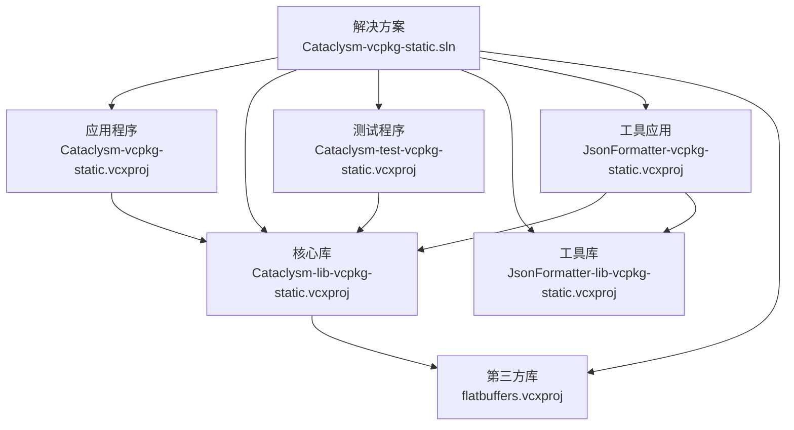
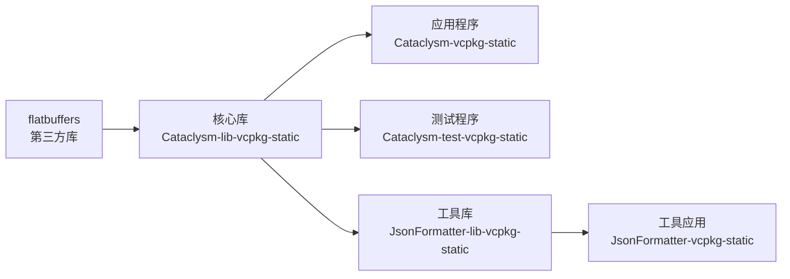
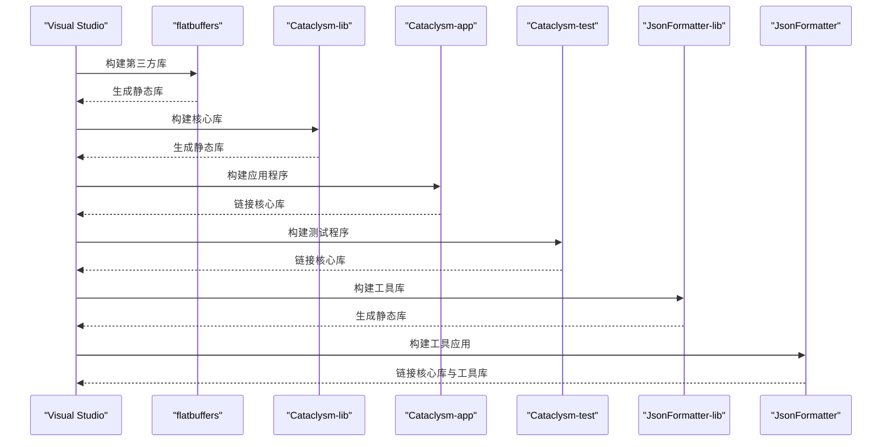

# 项目依赖关系

<cite>
**本文引用的文件**
- [Cataclysm-vcpkg-static.sln](file://Cataclysm-vcpkg-static.sln)
- [Cataclysm-vcpkg-static.vcxproj](file://Cataclysm-vcpkg-static.vcxproj)
- [Cataclysm-lib-vcpkg-static.vcxproj](file://Cataclysm-lib-vcpkg-static.vcxproj)
- [Cataclysm-test-vcpkg-static.vcxproj](file://Cataclysm-test-vcpkg-static.vcxproj)
- [JsonFormatter-lib-vcpkg-static.vcxproj](file://JsonFormatter-lib-vcpkg-static.vcxproj)
- [JsonFormatter-vcpkg-static.vcxproj](file://JsonFormatter-vcpkg-static.vcxproj)
- [flatbuffers.vcxproj](file://flatbuffers.vcxproj)
- [Cataclysm.Cpp.props](file://Cataclysm.Cpp.props)
- [Cataclysm-common.props](file://Cataclysm-common.props)
- [vcpkg.json](file://vcpkg.json)
</cite>

## 目录
1. [简介](#简介)
2. [项目结构](#项目结构)
3. [核心组件](#核心组件)
4. [架构总览](#架构总览)
5. [详细组件分析](#详细组件分析)
6. [依赖关系分析](#依赖关系分析)
7. [性能考量](#性能考量)
8. [故障排查指南](#故障排查指南)
9. [结论](#结论)
10. [附录](#附录)

## 简介
本文件系统性分析 MSVC Full Features 项目的组件依赖与构建顺序，重点覆盖：
- 主应用程序对核心库的依赖
- 测试程序对核心库的依赖
- 测试程序之间的相互依赖
- 静态链接策略对依赖管理的影响
- 依赖传递与链接顺序的重要性
- 在 Visual Studio 中查看与管理项目依赖的方法
- 循环依赖的识别与规避
- 构建性能优化建议

## 项目结构
该解决方案包含以下主要项目：
- 应用程序：Cataclysm-vcpkg-static（可执行）
- 核心库：Cataclysm-lib-vcpkg-static（静态库）
- 测试程序：Cataclysm-test-vcpkg-static（可执行）
- 工具库：JsonFormatter-lib-vcpkg-static（静态库）
- 工具应用：JsonFormatter-vcpkg-static（可执行）
- 第三方库：flatbuffers（静态库）

图表来源
- [Cataclysm-vcpkg-static.sln:17-28](file://Cataclysm-vcpkg-static.sln#L17-L28)
- [Cataclysm-vcpkg-static.vcxproj:225-229](file://Cataclysm-vcpkg-static.vcxproj#L225-L229)
- [Cataclysm-lib-vcpkg-static.vcxproj:181-186](file://Cataclysm-lib-vcpkg-static.vcxproj#L181-L186)
- [Cataclysm-test-vcpkg-static.vcxproj:187-191](file://Cataclysm-test-vcpkg-static.vcxproj#L187-L191)
- [JsonFormatter-vcpkg-static.vcxproj:143-150](file://JsonFormatter-vcpkg-static.vcxproj#L143-L150)
- [JsonFormatter-lib-vcpkg-static.vcxproj:128-133](file://JsonFormatter-lib-vcpkg-static.vcxproj#L128-L133)
- [flatbuffers.vcxproj:1-128](file://flatbuffers.vcxproj#L1-L128)

章节来源
- [Cataclysm-vcpkg-static.sln:17-28](file://Cataclysm-vcpkg-static.sln#L17-L28)

## 核心组件
- 应用程序（Cataclysm-vcpkg-static）：面向最终用户的主程序，依赖核心库以获得功能实现。
- 核心库（Cataclysm-lib-vcpkg-static）：提供游戏运行所需的核心逻辑与资源处理能力；同时内部依赖 flatbuffers 用于数据序列化。
- 测试程序（Cataclysm-test-vcpkg-static）：使用 Catch2 进行单元与基准测试，依赖核心库以验证功能正确性。
- 工具库（JsonFormatter-lib-vcpkg-static）：封装 JSON 格式化相关的通用逻辑，供工具应用复用。
- 工具应用（JsonFormatter-vcpkg-static）：独立可执行的格式化工具，依赖核心库与工具库。
- 第三方库（flatbuffers）：内置于核心库的静态依赖，不对外暴露为公共依赖。

章节来源
- [Cataclysm-vcpkg-static.vcxproj:225-229](file://Cataclysm-vcpkg-static.vcxproj#L225-L229)
- [Cataclysm-lib-vcpkg-static.vcxproj:181-186](file://Cataclysm-lib-vcpkg-static.vcxproj#L181-L186)
- [Cataclysm-test-vcpkg-static.vcxproj:187-191](file://Cataclysm-test-vcpkg-static.vcxproj#L187-L191)
- [JsonFormatter-lib-vcpkg-static.vcxproj:128-133](file://JsonFormatter-lib-vcpkg-static.vcxproj#L128-L133)
- [JsonFormatter-vcpkg-static.vcxproj:143-150](file://JsonFormatter-vcpkg-static.vcxproj#L143-L150)
- [flatbuffers.vcxproj:1-128](file://flatbuffers.vcxproj#L1-L128)

## 架构总览
下图展示项目间依赖与构建顺序的关键路径：

图表来源
- [Cataclysm-lib-vcpkg-static.vcxproj:181-186](file://Cataclysm-lib-vcpkg-static.vcxproj#L181-L186)
- [Cataclysm-vcpkg-static.vcxproj:225-229](file://Cataclysm-vcpkg-static.vcxproj#L225-L229)
- [Cataclysm-test-vcpkg-static.vcxproj:187-191](file://Cataclysm-test-vcpkg-static.vcxproj#L187-L191)
- [JsonFormatter-lib-vcpkg-static.vcxproj:128-133](file://JsonFormatter-lib-vcpkg-static.vcxproj#L128-L133)
- [JsonFormatter-vcpkg-static.vcxproj:143-150](file://JsonFormatter-vcpkg-static.vcxproj#L143-L150)
- [flatbuffers.vcxproj:1-128](file://flatbuffers.vcxproj#L1-L128)

## 详细组件分析

### 应用程序（Cataclysm-vcpkg-static）
- 作用：主程序入口，负责用户界面与游戏运行时行为。
- 对核心库的依赖：通过项目引用建立直接依赖，确保链接阶段能解析符号。
- 配置要点：启用 vcpkg 静态模式、多平台三元组、Windows 子系统等。

章节来源
- [Cataclysm-vcpkg-static.vcxproj:225-229](file://Cataclysm-vcpkg-static.vcxproj#L225-L229)
- [Cataclysm-vcpkg-static.vcxproj:59-72](file://Cataclysm-vcpkg-static.vcxproj#L59-L72)

### 核心库（Cataclysm-lib-vcpkg-static）
- 作用：封装游戏核心逻辑与资源处理，作为多个上层组件的共享基础。
- 对第三方库的依赖：显式引用 flatbuffers 静态库，用于数据序列化。
- 静态链接策略：使用 vcpkg 静态三元组，避免运行时 DLL 依赖，提升分发便利性。
- 构建顺序：必须先于所有依赖它的项目构建完成，否则会导致链接错误。

章节来源
- [Cataclysm-lib-vcpkg-static.vcxproj:181-186](file://Cataclysm-lib-vcpkg-static.vcxproj#L181-L186)
- [Cataclysm-lib-vcpkg-static.vcxproj:60-71](file://Cataclysm-lib-vcpkg-static.vcxproj#L60-L71)
- [flatbuffers.vcxproj:1-128](file://flatbuffers.vcxproj#L1-L128)

### 测试程序（Cataclysm-test-vcpkg-static）
- 作用：使用 Catch2 执行单元与性能测试，验证核心库功能。
- 对核心库的依赖：通过项目引用依赖核心库，确保测试可访问被测模块。
- 特殊链接项：为兼容某些运行时行为添加额外依赖对象。

章节来源
- [Cataclysm-test-vcpkg-static.vcxproj:187-191](file://Cataclysm-test-vcpkg-static.vcxproj#L187-L191)
- [Cataclysm-test-vcpkg-static.vcxproj:127-131](file://Cataclysm-test-vcpkg-static.vcxproj#L127-L131)

### 工具库与工具应用（JsonFormatter-*）
- 工具库：封装 JSON 格式化逻辑，供工具应用复用。
- 工具应用：独立可执行程序，既依赖核心库又依赖工具库，形成“应用 → 库”的依赖链。
- 依赖管理：工具应用对工具库的引用设置为不自动链接其库依赖，避免重复或冲突。

章节来源
- [JsonFormatter-lib-vcpkg-static.vcxproj:128-133](file://JsonFormatter-lib-vcpkg-static.vcxproj#L128-L133)
- [JsonFormatter-vcpkg-static.vcxproj:143-150](file://JsonFormatter-vcpkg-static.vcxproj#L143-L150)

### 第三方库（flatbuffers）
- 作用：提供跨语言的数据序列化支持，核心库内部使用。
- 静态链接：作为核心库的内部依赖，不暴露给外部项目。
- 构建顺序：必须在核心库之前构建，且由核心库在链接阶段消费。

章节来源
- [flatbuffers.vcxproj:1-128](file://flatbuffers.vcxproj#L1-L128)
- [Cataclysm-lib-vcpkg-static.vcxproj:181-186](file://Cataclysm-lib-vcpkg-static.vcxproj#L181-L186)

## 依赖关系分析

### 依赖传递与链接顺序
- 核心库是多处项目的上游依赖，必须优先构建。
- 应用程序、测试程序、工具应用均通过项目引用依赖核心库，形成“单向依赖”。
- 工具应用对工具库存在直接依赖，但工具库对核心库的依赖通过工具应用间接传递，不会导致循环依赖。
- 静态链接策略下，vcpkg 自动链接机制在默认情况下启用；当使用 LLD 链接器时，会禁用自动链接并手动列举依赖库，确保链接顺序可控。

图表来源
- [Cataclysm-lib-vcpkg-static.vcxproj:181-186](file://Cataclysm-lib-vcpkg-static.vcxproj#L181-L186)
- [Cataclysm-vcpkg-static.vcxproj:225-229](file://Cataclysm-vcpkg-static.vcxproj#L225-L229)
- [Cataclysm-test-vcpkg-static.vcxproj:187-191](file://Cataclysm-test-vcpkg-static.vcxproj#L187-L191)
- [JsonFormatter-lib-vcpkg-static.vcxproj:128-133](file://JsonFormatter-lib-vcpkg-static.vcxproj#L128-L133)
- [JsonFormatter-vcpkg-static.vcxproj:143-150](file://JsonFormatter-vcpkg-static.vcxproj#L143-L150)
- [flatbuffers.vcxproj:1-128](file://flatbuffers.vcxproj#L1-L128)

### 依赖图解读方法
- 从解决方案视图看：项目节点之间的箭头表示“被依赖关系”，即箭头指向的项目需要先于箭尾项目构建。
- 从项目属性看：在“项目引用”中可以查看当前项目依赖哪些库；在“链接器输入”中可确认最终链接的库集合。
- 从 vcpkg 配置看：静态三元组与自动链接开关决定依赖传递与链接顺序；当禁用自动链接时，需在“附加依赖项”中明确列出所需库。

章节来源
- [Cataclysm-common.props:36-40](file://Cataclysm-common.props#L36-L40)
- [Cataclysm-common.props:91-140](file://Cataclysm-common.props#L91-L140)
- [Cataclysm-lib-vcpkg-static.vcxproj:60-71](file://Cataclysm-lib-vcpkg-static.vcxproj#L60-L71)
- [Cataclysm-vcpkg-static.vcxproj:63-72](file://Cataclysm-vcpkg-static.vcxproj#L63-L72)

### 在 Visual Studio 中查看与管理项目依赖
- 解决方案配置：在“配置管理器”中选择目标平台与配置，确保所有项目处于同一配置组合。
- 项目引用管理：右键项目 → “添加引用” → 选择上游项目；对于不需要自动链接的库，可在“项目引用”属性中关闭“链接库依赖”。
- 链接器设置：在“附加依赖项”中补充必要的静态库；若使用 LLD 链接器，需按属性文件中的清单逐一列出。
- 三元组与工具集：确保各项目使用一致的 vcpkg 三元组与平台工具集，避免 ABI 不匹配。

章节来源
- [Cataclysm-common.props:33-40](file://Cataclysm-common.props#L33-L40)
- [Cataclysm-common.props:91-140](file://Cataclysm-common.props#L91-L140)
- [Cataclysm-lib-vcpkg-static.vcxproj:60-71](file://Cataclysm-lib-vcpkg-static.vcxproj#L60-L71)
- [Cataclysm-vcpkg-static.vcxproj:63-72](file://Cataclysm-vcpkg-static.vcxproj#L63-L72)

### 循环依赖问题与规避
- 当前结构未见循环依赖：工具应用依赖工具库，工具库依赖核心库，核心库依赖第三方库，形成清晰的单向链路。
- 规避建议：
  - 将跨项目共享的逻辑下沉到核心库，避免工具库反向依赖应用层。
  - 若确需解耦，可通过接口抽象或导出专用静态库，减少直接引用。
  - 使用“不链接库依赖”选项控制传递依赖，防止无意中引入循环。

章节来源
- [JsonFormatter-lib-vcpkg-static.vcxproj:128-133](file://JsonFormatter-lib-vcpkg-static.vcxproj#L128-L133)
- [JsonFormatter-vcpkg-static.vcxproj:143-150](file://JsonFormatter-vcpkg-static.vcxproj#L143-L150)
- [Cataclysm-lib-vcpkg-static.vcxproj:181-186](file://Cataclysm-lib-vcpkg-static.vcxproj#L181-L186)

## 性能考量
- 静态链接优势：减少运行时 DLL 加载与版本冲突风险，便于分发；但会增加可执行体积与内存占用。
- 链接器选择：若启用 LLD 链接器，需手动列举依赖库，避免通配符导致的链接失败；同时可利用“薄归档”与“快速调试信息”优化构建时间。
- 并行编译：启用多处理器编译与多工具任务，缩短整体构建时间。
- 缓存与预编译：根据项目属性可启用 ccache 或预编译头，进一步降低增量编译成本。

章节来源
- [Cataclysm.Cpp.props:1-11](file://Cataclysm.Cpp.props#L1-L11)
- [Cataclysm-common.props:26-32](file://Cataclysm-common.props#L26-L32)
- [Cataclysm-common.props:46-50](file://Cataclysm-common.props#L46-L50)
- [Cataclysm-common.props:71-73](file://Cataclysm-common.props#L71-L73)
- [Cataclysm-common.props:83-85](file://Cataclysm-common.props#L83-L85)

## 故障排查指南
- 链接错误（未解析的外部符号）：
  - 检查上游项目是否已成功构建并输出静态库。
  - 确认项目引用顺序与“生成前置生成”设置，确保先生成被依赖项目。
  - 若使用 LLD 链接器，核对“附加依赖项”是否完整。
- 三元组不匹配：
  - 统一平台工具集与 vcpkg 三元组，避免 Debug/Release 或 x86/x64 不一致导致的链接失败。
- vcpkg 安装问题：
  - 检查 vcpkg.json 中的依赖声明与 overlay ports 路径。
  - 确保 vcpkg 清理策略与安装选项符合预期。

章节来源
- [Cataclysm-common.props:33-40](file://Cataclysm-common.props#L33-L40)
- [Cataclysm-common.props:91-140](file://Cataclysm-common.props#L91-L140)
- [vcpkg.json:1-22](file://vcpkg.json#L1-L22)

## 结论
本项目采用“核心库为中心”的静态链接架构：应用程序、测试程序与工具应用均依赖核心库；核心库再依赖第三方库（flatbuffers）。通过统一的 vcpkg 三元组与平台工具集，结合项目引用与链接器设置，实现了清晰的依赖传递与可靠的构建顺序。在 Visual Studio 中合理配置项目引用、附加依赖与链接器参数，即可有效避免循环依赖与链接错误，并在满足分发需求的同时兼顾构建性能。

## 附录
- 关键配置要点速览：
  - vcpkg 静态三元组：x86/x64-windows-static
  - 自动链接：默认启用；使用 LLD 时禁用并手动列举
  - 平台工具集：统一版本，避免 ABI 不匹配
  - 预编译头与缓存：按需启用以提升增量构建效率

章节来源
- [Cataclysm-lib-vcpkg-static.vcxproj:60-71](file://Cataclysm-lib-vcpkg-static.vcxproj#L60-L71)
- [Cataclysm-vcpkg-static.vcxproj:63-72](file://Cataclysm-vcpkg-static.vcxproj#L63-L72)
- [Cataclysm-common.props:33-40](file://Cataclysm-common.props#L33-L40)
- [Cataclysm-common.props:91-140](file://Cataclysm-common.props#L91-L140)
- [Cataclysm.Cpp.props:1-11](file://Cataclysm.Cpp.props#L1-L11)