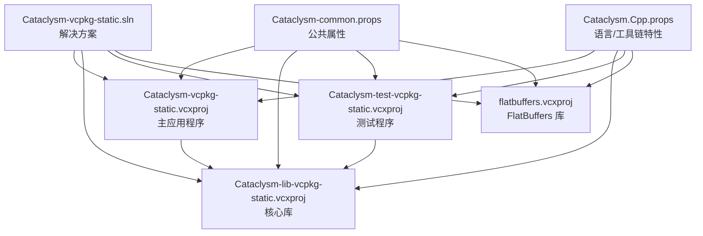
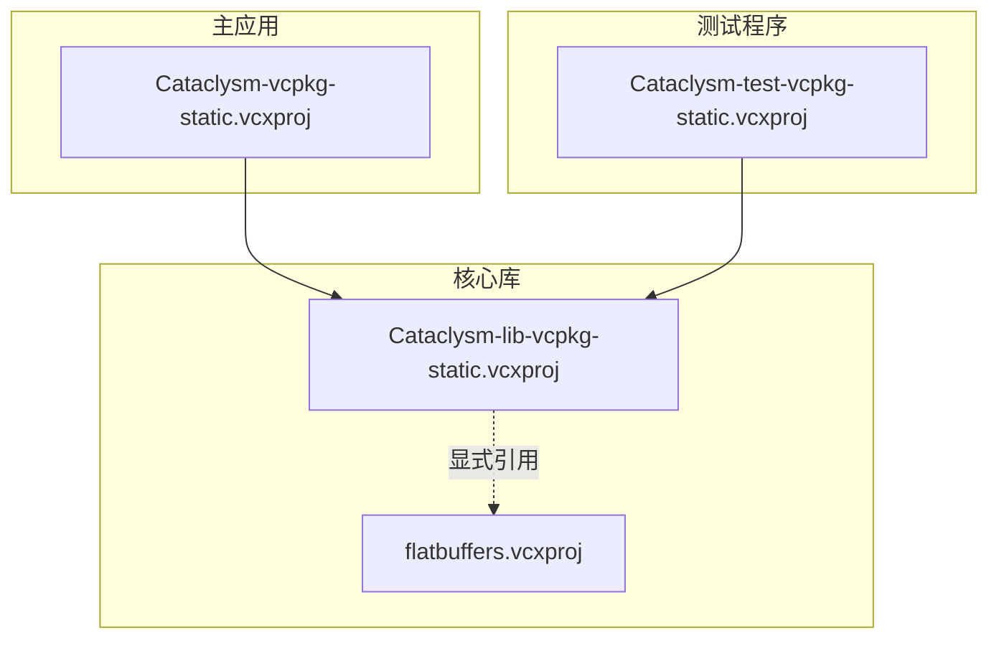
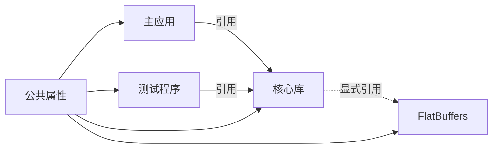

# 项目文件配置详解

<cite>
**本文档引用的文件**
- [Cataclysm-vcpkg-static.vcxproj](file://Cataclysm-vcpkg-static.vcxproj)
- [Cataclysm-lib-vcpkg-static.vcxproj](file://Cataclysm-lib-vcpkg-static.vcxproj)
- [Cataclysm-test-vcpkg-static.vcxproj](file://Cataclysm-test-vcpkg-static.vcxproj)
- [Cataclysm.Cpp.props](file://Cataclysm.Cpp.props)
- [Cataclysm-common.props](file://Cataclysm-common.props)
- [stdafx.h](file://stdafx.h)
- [stdafx.cpp](file://stdafx.cpp)
- [vcpkg.json](file://vcpkg.json)
- [flatbuffers.vcxproj](file://flatbuffers.vcxproj)
- [Cataclysm-vcpkg-static.sln](file://Cataclysm-vcpkg-static.sln)
</cite>

## 目录
1. [简介](#简介)
2. [项目结构概览](#项目结构概览)
3. [核心组件分析](#核心组件分析)
4. [架构总览](#架构总览)
5. [详细组件分析](#详细组件分析)
6. [依赖关系分析](#依赖关系分析)
7. [性能与优化考量](#性能与优化考量)
8. [故障排除指南](#故障排除指南)
9. [结论](#结论)
10. [附录：维护与修改指南](#附录维护与修改指南)

## 简介
本文件系统性解析基于 MSVC 的 C++ 项目配置，重点对比主应用程序、核心库与测试程序三类项目文件的配置差异，涵盖编译选项、链接设置、预处理器定义、包含目录、静态链接策略以及不同构建配置（Debug/Release）与平台架构（Win32/x64/ARM64EC）的具体设置。同时提供项目维护与修改的最佳实践，帮助开发者安全地添加新源文件、配置外部依赖与调整编译参数。

## 项目结构概览
该仓库采用“属性文件共享 + 多项目解决方案”的组织方式：
- 全局公共属性通过 `Cataclysm-common.props` 统一管理，包含编译器/链接器通用设置、警告级别、包含目录、预处理宏等。
- 语言与工具链特性通过 `Cataclysm.Cpp.props` 控制，例如缓存编译开关、多工具任务等。
- 三个主要项目：
  - 主应用程序：`Cataclysm-vcpkg-static.vcxproj`
  - 核心库：`Cataclysm-lib-vcpkg-static.vcxproj`
  - 测试程序：`Cataclysm-test-vcpkg-static.vcxproj`
- 第三方库 FlatBuffers 单独作为静态库项目 `flatbuffers.vcxproj`。
- 解决方案文件 `Cataclysm-vcpkg-static.sln` 组织上述项目，并统一配置各平台/配置组合。

图表来源
- [Cataclysm-vcpkg-static.sln:17-28](file://Cataclysm-vcpkg-static.sln#L17-L28)
- [Cataclysm-common.props:1-154](file://Cataclysm-common.props#L1-L154)
- [Cataclysm.Cpp.props:1-11](file://Cataclysm.Cpp.props#L1-L11)

章节来源
- [Cataclysm-vcpkg-static.sln:1-189](file://Cataclysm-vcpkg-static.sln#L1-L189)

## 核心组件分析
本节从三个维度对比三大项目文件的关键差异：
- 编译类型与目标：主应用为可执行文件，核心库为静态库，测试程序为可执行文件。
- 预处理器定义：主应用区分是否启用瓦片渲染（TILES），测试程序额外启用 CATCH 测试框架与基准测试宏。
- 链接设置：主应用与测试应用均链接核心库；核心库显式引用 FlatBuffers 项目但不自动链接其依赖。
- 包含目录与预编译头：统一使用公共属性文件提供的包含路径与预编译头配置。

章节来源
- [Cataclysm-vcpkg-static.vcxproj:75-236](file://Cataclysm-vcpkg-static.vcxproj#L75-L236)
- [Cataclysm-lib-vcpkg-static.vcxproj:72-191](file://Cataclysm-lib-vcpkg-static.vcxproj#L72-L191)
- [Cataclysm-test-vcpkg-static.vcxproj:74-195](file://Cataclysm-test-vcpkg-static.vcxproj#L74-L195)
- [Cataclysm-common.props:41-144](file://Cataclysm-common.props#L41-L144)
- [stdafx.h:1-96](file://stdafx.h#L1-L96)
- [stdafx.cpp:1-2](file://stdafx.cpp#L1-L2)

## 架构总览
下图展示三大项目之间的依赖关系与数据流，突出主应用依赖核心库、测试应用依赖核心库，核心库内部依赖 FlatBuffers 静态库。

图表来源
- [Cataclysm-vcpkg-static.vcxproj:226-229](file://Cataclysm-vcpkg-static.vcxproj#L226-L229)
- [Cataclysm-test-vcpkg-static.vcxproj:188-191](file://Cataclysm-test-vcpkg-static.vcxproj#L188-L191)
- [Cataclysm-lib-vcpkg-static.vcxproj:182-186](file://Cataclysm-lib-vcpkg-static.vcxproj#L182-L186)

## 详细组件分析

### 主应用程序项目配置（Cataclysm-vcpkg-static.vcxproj）
- 项目类型与工具集：应用程序，使用默认平台工具集，字符集为多字节。
- 平台与配置矩阵：覆盖 Debug/Release 与 Debug-NoTiles/Release-NoTiles 四种配置，支持 Win32/x64/ARM64EC 三种平台。
- vcpkg 配置：启用 vcpkg 清单安装，使用静态链接，按平台选择 triplet（x86/x64/windows-static）。
- 预处理器定义：基础定义包含 Windows 系统宏与主入口宏；Debug 配置追加调试宏与瓦片宏；Release 配置追加瓦片宏。
- 链接子系统：Windows 子系统，嵌入清单关闭。
- 目标命名：所有平台输出目标名统一为 `cataclysm-tiles.exe`。
- 源文件：包含主入口与消息处理文件，资源文件参与编译。
- 依赖：引用核心库项目。

章节来源
- [Cataclysm-vcpkg-static.vcxproj:3-52](file://Cataclysm-vcpkg-static.vcxproj#L3-L52)
- [Cataclysm-vcpkg-static.vcxproj:53-79](file://Cataclysm-vcpkg-static.vcxproj#L53-L79)
- [Cataclysm-vcpkg-static.vcxproj:63-73](file://Cataclysm-vcpkg-static.vcxproj#L63-L73)
- [Cataclysm-vcpkg-static.vcxproj:159-171](file://Cataclysm-vcpkg-static.vcxproj#L159-L171)
- [Cataclysm-vcpkg-static.vcxproj:172-212](file://Cataclysm-vcpkg-static.vcxproj#L172-L212)
- [Cataclysm-vcpkg-static.vcxproj:218-232](file://Cataclysm-vcpkg-static.vcxproj#L218-L232)

### 核心库项目配置（Cataclysm-lib-vcpkg-static.vcxproj）
- 项目类型：静态库，字符集为多字节。
- vcpkg 配置：启用 vcpkg 清单安装，静态链接，按平台选择 triplet。
- 预处理器定义：基础定义包含控制台宏与 SDL 相关宏；Debug 配置追加调试宏与瓦片宏；Release 配置追加瓦片宏。
- 链接增量：Debug 开启，Release 关闭。
- 源文件：包含除主入口与特定文件外的所有源文件。
- 依赖：显式引用 FlatBuffers 项目，且关闭自动链接其依赖库。
- 预构建事件：调用 `prebuild.cmd` 脚本。

章节来源
- [Cataclysm-lib-vcpkg-static.vcxproj:53-94](file://Cataclysm-lib-vcpkg-static.vcxproj#L53-L94)
- [Cataclysm-lib-vcpkg-static.vcxproj:60-71](file://Cataclysm-lib-vcpkg-static.vcxproj#L60-L71)
- [Cataclysm-lib-vcpkg-static.vcxproj:119-126](file://Cataclysm-lib-vcpkg-static.vcxproj#L119-L126)
- [Cataclysm-lib-vcpkg-static.vcxproj:127-169](file://Cataclysm-lib-vcpkg-static.vcxproj#L127-L169)
- [Cataclysm-lib-vcpkg-static.vcxproj:175-186](file://Cataclysm-lib-vcpkg-static.vcxproj#L175-L186)

### 测试程序项目配置（Cataclysm-test-vcpkg-static.vcxproj）
- 项目类型：应用程序，字符集为多字节。
- vcpkg 配置：启用 vcpkg 清单安装，静态链接，按平台选择 triplet。
- 预处理器定义：基础定义包含控制台宏与 SDL 主入口处理宏；测试框架相关宏；Debug 追加调试宏与瓦片宏；Release 追加瓦片宏。
- 链接子系统：控制台子系统，额外依赖一个运行时对象文件。
- 源文件：包含测试代码与消息头文件。
- 依赖：引用核心库项目。

章节来源
- [Cataclysm-test-vcpkg-static.vcxproj:53-96](file://Cataclysm-test-vcpkg-static.vcxproj#L53-L96)
- [Cataclysm-test-vcpkg-static.vcxproj:63-73](file://Cataclysm-test-vcpkg-static.vcxproj#L63-L73)
- [Cataclysm-test-vcpkg-static.vcxproj:123-131](file://Cataclysm-test-vcpkg-static.vcxproj#L123-L131)
- [Cataclysm-test-vcpkg-static.vcxproj:132-174](file://Cataclysm-test-vcpkg-static.vcxproj#L132-L174)
- [Cataclysm-test-vcpkg-static.vcxproj:180-191](file://Cataclysm-test-vcpkg-static.vcxproj#L180-L191)

### 公共属性与语言特性（Cataclysm-common.props 与 Cataclysm.Cpp.props）
- 公共属性：
  - 输出命名与中间目录：统一为 `$(ProjectName)-$(Configuration)-$(Platform)`，便于区分多配置/多平台产物。
  - 工具链替换：可选使用 LLVM/LLD 替代 MSVC 工具链，以支持薄归档与更优链接性能。
  - vcpkg 行为：支持额外安装选项与按配置选择库后缀（Debug 附加 `d` 后缀）。
  - 编译器设置：警告等级、SDL 检查、缓冲区保护、多核编译、UTF-8、大对象支持、C++17 标准、禁用特定警告。
  - 预处理宏：统一启用 Windows 小而美宏、本地化宏、vcpkg 使用宏；Release 额外定义 RELEASE 宏；可选启用回溯宏。
  - 链接器设置：统一附加系统库依赖；VS2022 特定版本的 DebugFastLink 崩溃兼容处理；可选开启 LLD 链接与手动列举依赖。
  - 预编译头：强制包含 `stdafx.h`，Debug 下创建预编译头。
- 语言特性：
  - 可选启用 ccache 编译缓存，配合多工具任务提升编译效率。

章节来源
- [Cataclysm-common.props:5-25](file://Cataclysm-common.props#L5-L25)
- [Cataclysm-common.props:26-40](file://Cataclysm-common.props#L26-L40)
- [Cataclysm-common.props:41-144](file://Cataclysm-common.props#L41-L144)
- [Cataclysm.Cpp.props:1-11](file://Cataclysm.Cpp.props#L1-L11)

### 预编译头与包含目录（stdafx.h/stdafx.cpp）
- 预编译头：集中包含大量标准库与第三方头文件，减少重复编译开销。
- 条件包含：根据瓦片渲染宏与 vcpkg 使用宏选择性包含 SDL 相关头文件。
- 预编译头实现：空实现文件仅包含预编译头头文件。

章节来源
- [stdafx.h:1-96](file://stdafx.h#L1-L96)
- [stdafx.cpp:1-2](file://stdafx.cpp#L1-L2)

### vcpkg 依赖与 FlatBuffers
- vcpkg 依赖：声明 SDL2 生态（图像、混音、字体）及其特性，overlay ports 指向自定义端口目录。
- FlatBuffers：独立静态库项目，核心库显式引用但不自动链接其依赖，需在公共属性中手动列举。

章节来源
- [vcpkg.json:1-22](file://vcpkg.json#L1-L22)
- [flatbuffers.vcxproj:1-128](file://flatbuffers.vcxproj#L1-L128)
- [Cataclysm-lib-vcpkg-static.vcxproj:182-186](file://Cataclysm-lib-vcpkg-static.vcxproj#L182-L186)
- [Cataclysm-common.props:98-140](file://Cataclysm-common.props#L98-L140)

## 依赖关系分析
- 项目耦合度：主应用与测试应用均依赖核心库；核心库依赖 FlatBuffers。
- vcpkg 自动链接策略：默认启用自动链接，但在使用 LLD 链接器时会禁用自动链接并手动列举依赖，确保兼容性。
- 平台与配置一致性：所有项目均覆盖相同的平台/配置矩阵，保证构建一致性。

图表来源
- [Cataclysm-vcpkg-static.vcxproj:226-229](file://Cataclysm-vcpkg-static.vcxproj#L226-L229)
- [Cataclysm-test-vcpkg-static.vcxproj:188-191](file://Cataclysm-test-vcpkg-static.vcxproj#L188-L191)
- [Cataclysm-lib-vcpkg-static.vcxproj:182-186](file://Cataclysm-lib-vcpkg-static.vcxproj#L182-L186)
- [Cataclysm-common.props:33-40](file://Cataclysm-common.props#L33-L40)

章节来源
- [Cataclysm-vcpkg-static.sln:17-28](file://Cataclysm-vcpkg-static.sln#L17-L28)

## 性能与优化考量
- 编译器优化：
  - Debug：禁用优化，启用调试库与多线程调试运行时。
  - Release：启用最大速度优化、内联函数、函数级链接与 COMDAT 折叠优化。
- 链接器优化：
  - Release 配置开启 EnableCOMDATFolding 与 OptimizeReferences，减小体积并提升运行时性能。
- 工具链替换：
  - 可选使用 LLVM/LLD 与 llvm-lib（薄归档），在大型项目中显著提升链接性能与产物体积控制。
- 预编译头：
  - 在 Debug 下创建预编译头，在启用 ccache 时禁用预编译头以避免缓存冲突。
- 多核编译与 UTF-8：
  - 默认启用多核编译与 UTF-8 支持，提升编译吞吐量与国际化支持。

章节来源
- [Cataclysm-vcpkg-static.vcxproj:172-212](file://Cataclysm-vcpkg-static.vcxproj#L172-L212)
- [Cataclysm-lib-vcpkg-static.vcxproj:127-169](file://Cataclysm-lib-vcpkg-static.vcxproj#L127-L169)
- [Cataclysm-test-vcpkg-static.vcxproj:132-174](file://Cataclysm-test-vcpkg-static.vcxproj#L132-L174)
- [Cataclysm-common.props:41-79](file://Cataclysm-common.props#L41-L79)
- [Cataclysm-common.props:26-40](file://Cataclysm-common.props#L26-L40)
- [Cataclysm.Cpp.props:1-11](file://Cataclysm.Cpp.props#L1-L11)

## 故障排除指南
- VS2022 DebugFastLink 崩溃：
  - 当平台工具集版本为 14.3 且 vctools 版本小于等于 14.37 时，自动降级为 DebugFull 以规避崩溃。
- LLD 链接器兼容性：
  - 使用 LLD 链接器时禁用 vcpkg 自动链接，改为手动列举依赖库，确保路径与后缀正确。
- 预编译头与 ccache 冲突：
  - 启用 ccache 时禁用预编译头并调整调试信息格式，避免缓存命中异常。
- 平台工具集版本问题：
  - ARM64EC 平台使用 x64-windows-static triplet，确保依赖匹配。

章节来源
- [Cataclysm-common.props:81-85](file://Cataclysm-common.props#L81-L85)
- [Cataclysm-common.props:33-40](file://Cataclysm-common.props#L33-L40)
- [Cataclysm-common.props:65-70](file://Cataclysm-common.props#L65-L70)
- [Cataclysm-vcpkg-static.vcxproj:59-61](file://Cataclysm-vcpkg-static.vcxproj#L59-L61)
- [Cataclysm-lib-vcpkg-static.vcxproj:66-69](file://Cataclysm-lib-vcpkg-static.vcxproj#L66-L69)
- [Cataclysm-test-vcpkg-static.vcxproj:59-62](file://Cataclysm-test-vcpkg-static.vcxproj#L59-L62)

## 结论
该配置体系通过公共属性文件实现了高度一致的编译与链接行为，结合 vcpkg 清单与静态链接策略，确保了跨平台与跨配置的一致性。主应用、核心库与测试程序在预处理器定义、链接设置与依赖关系上各有侧重，既满足功能需求又保持清晰的职责边界。对于大型项目，建议优先采用 LLD 链接器与薄归档，以获得更好的构建性能与产物体积控制。

## 附录：维护与修改指南

### 添加新源文件
- 主应用与测试程序：
  - 在对应项目文件的 ItemGroup 中添加新的 `.cpp/.h` 文件条目，或使用通配符模式（如 `..\src\*.cpp`）自动包含。
  - 若为新增模块，建议先在公共属性中确认包含目录与预处理宏已满足需求。
- 核心库：
  - 新增源文件后，确保未被现有排除规则误删（例如排除主入口与特定文件的规则）。
  - 如涉及第三方头文件，确认公共属性中的包含目录已覆盖。

章节来源
- [Cataclysm-vcpkg-static.vcxproj:218-224](file://Cataclysm-vcpkg-static.vcxproj#L218-L224)
- [Cataclysm-test-vcpkg-static.vcxproj:180-186](file://Cataclysm-test-vcpkg-static.vcxproj#L180-L186)
- [Cataclysm-lib-vcpkg-static.vcxproj:175-180](file://Cataclysm-lib-vcpkg-static.vcxproj#L175-L180)

### 配置外部依赖（vcpkg）
- 依赖声明：
  - 在 `vcpkg.json` 中添加或调整依赖项与特性，确保与项目使用的宏一致（如 SDL2 图像/混音特性）。
- triplet 选择：
  - Win32 使用 `x86-windows-static`，x64 使用 `x64-windows-static`，ARM64EC 使用 `x64-windows-static`。
- 自动链接与 LLD：
  - 默认启用自动链接；若使用 LLD 链接器，需禁用自动链接并在公共属性中手动列举依赖库与后缀。

章节来源
- [vcpkg.json:1-22](file://vcpkg.json#L1-L22)
- [Cataclysm-vcpkg-static.vcxproj:59-61](file://Cataclysm-vcpkg-static.vcxproj#L59-L61)
- [Cataclysm-lib-vcpkg-static.vcxproj:66-69](file://Cataclysm-lib-vcpkg-static.vcxproj#L66-L69)
- [Cataclysm-test-vcpkg-static.vcxproj:59-62](file://Cataclysm-test-vcpkg-static.vcxproj#L59-L62)
- [Cataclysm-common.props:33-40](file://Cataclysm-common.props#L33-L40)
- [Cataclysm-common.props:98-140](file://Cataclysm-common.props#L98-L140)

### 调整编译参数
- 通用编译器设置：
  - 在公共属性中调整警告级别、SDL 检查、缓冲区保护、多核编译、UTF-8、大对象支持、语言标准与禁用警告列表。
- 预处理宏：
  - 在公共属性中添加/移除宏，或在具体项目中按配置追加宏（如 TILES、RELEASE、BACKTRACE）。
- 链接器设置：
  - 在公共属性中调整附加系统库、调试信息生成策略、链接增量与 LLD 工具链路径。
- 预编译头：
  - 在公共属性中控制预编译头创建与强制包含；启用 ccache 时需禁用预编译头。

章节来源
- [Cataclysm-common.props:41-79](file://Cataclysm-common.props#L41-L79)
- [Cataclysm-common.props:55-70](file://Cataclysm-common.props#L55-L70)
- [Cataclysm-common.props:74-90](file://Cataclysm-common.props#L74-L90)
- [Cataclysm.Cpp.props:1-11](file://Cataclysm.Cpp.props#L1-L11)

### 不同构建配置与平台的特定设置
- Debug/Release：
  - Debug：禁用优化、启用调试库与多线程调试运行时；Release：启用最大速度优化、内联与链接优化。
- Debug-NoTiles/Release-NoTiles：
  - 与对应 Debug/Release 类似，但不启用瓦片相关宏，适合无图形界面的构建场景。
- 平台架构：
  - Win32：追加 WIN32 宏；ARM64EC 使用 x64 triplet；所有平台均设置首选工具架构为 x64。

章节来源
- [Cataclysm-vcpkg-static.vcxproj:172-212](file://Cataclysm-vcpkg-static.vcxproj#L172-L212)
- [Cataclysm-lib-vcpkg-static.vcxproj:127-169](file://Cataclysm-lib-vcpkg-static.vcxproj#L127-L169)
- [Cataclysm-test-vcpkg-static.vcxproj:132-174](file://Cataclysm-test-vcpkg-static.vcxproj#L132-L174)
- [Cataclysm-vcpkg-static.vcxproj:213-217](file://Cataclysm-vcpkg-static.vcxproj#L213-L217)
- [Cataclysm-lib-vcpkg-static.vcxproj:170-174](file://Cataclysm-lib-vcpkg-static.vcxproj#L170-L174)
- [Cataclysm-test-vcpkg-static.vcxproj:175-179](file://Cataclysm-test-vcpkg-static.vcxproj#L175-L179)