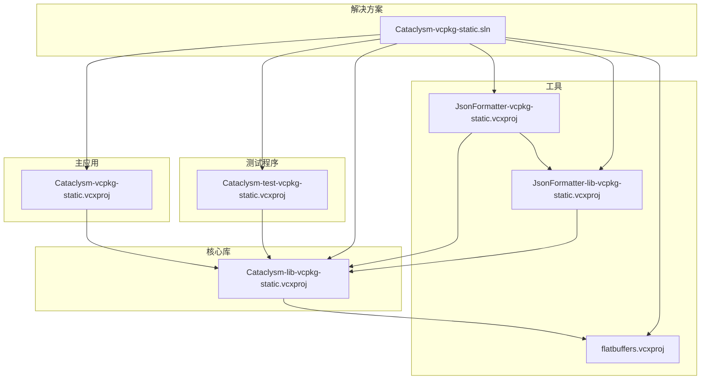
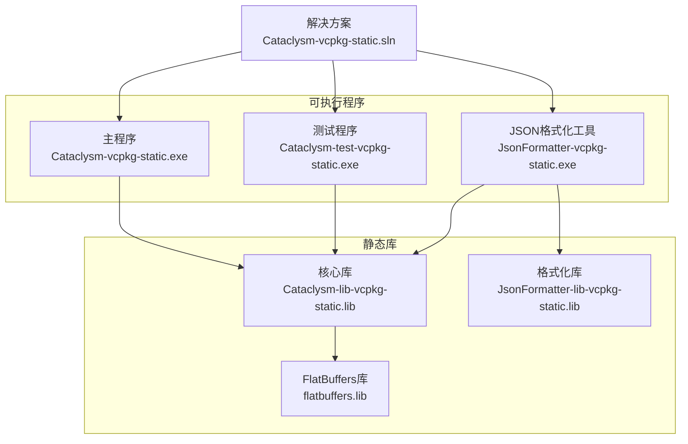
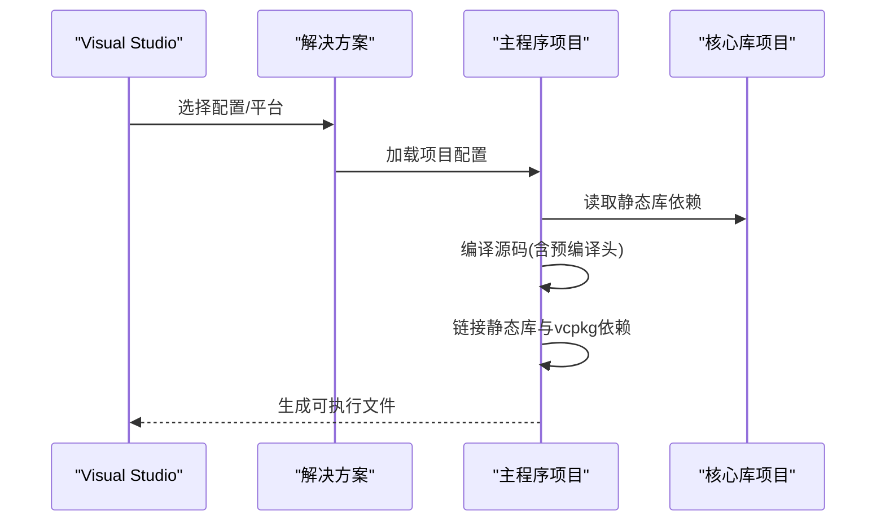
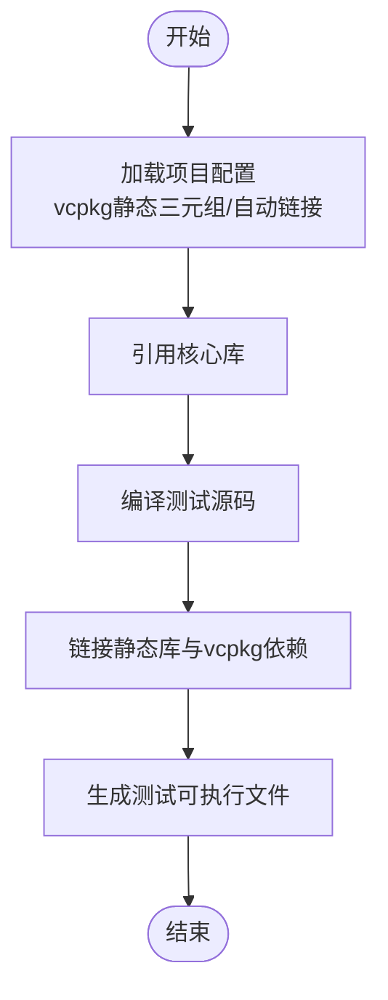
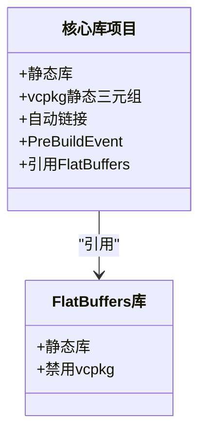
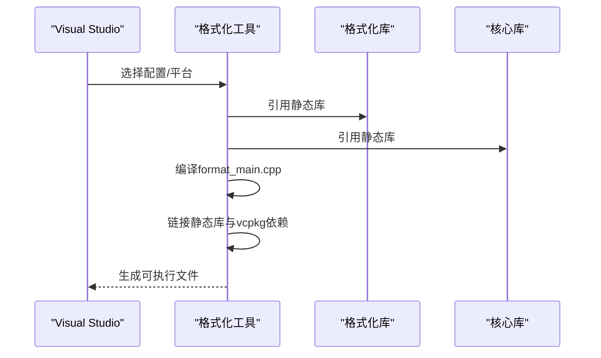
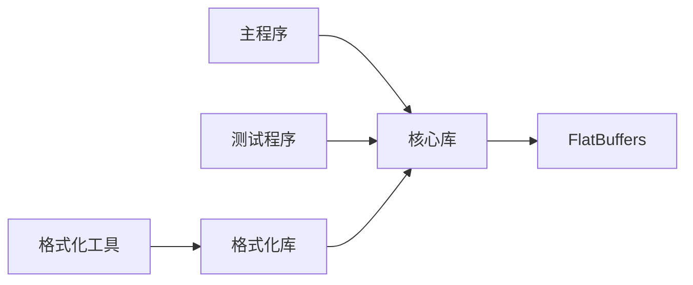

# 项目结构详解

<cite>
**本文引用的文件**
- [Cataclysm-vcpkg-static.sln](file://Cataclysm-vcpkg-static.sln)
- [vcpkg.json](file://vcpkg.json)
- [Cataclysm.Cpp.props](file://Cataclysm.Cpp.props)
- [Cataclysm-common.props](file://Cataclysm-common.props)
- [stdafx.h](file://stdafx.h)
- [Cataclysm-vcpkg-static.vcxproj](file://Cataclysm-vcpkg-static.vcxproj)
- [Cataclysm-test-vcpkg-static.vcxproj](file://Cataclysm-test-vcpkg-static.vcxproj)
- [Cataclysm-lib-vcpkg-static.vcxproj](file://Cataclysm-lib-vcpkg-static.vcxproj)
- [JsonFormatter-vcpkg-static.vcxproj](file://JsonFormatter-vcpkg-static.vcxproj)
- [JsonFormatter-lib-vcpkg-static.vcxproj](file://JsonFormatter-lib-vcpkg-static.vcxproj)
- [flatbuffers.vcxproj](file://flatbuffers.vcxproj)
- [prebuild.cmd](file://prebuild.cmd)
- [distribute.bat](file://distribute.bat)
- [cataclysm.code-workspace](file://cataclysm.code-workspace)
</cite>

## 目录
1. [简介](#简介)
2. [项目结构](#项目结构)
3. [核心组件](#核心组件)
4. [架构总览](#架构总览)
5. [详细组件分析](#详细组件分析)
6. [依赖关系分析](#依赖关系分析)
7. [性能考量](#性能考量)
8. [故障排查指南](#故障排查指南)
9. [结论](#结论)
10. [附录](#附录)

## 简介
本文件系统性解析 MSVC Full Features 项目的目录与文件组织，聚焦以下目标：
- 解释各项目文件的职责与相互关系（主应用程序、核心库、测试程序、工具库）
- 说明解决方案文件的组织方式及在 Visual Studio 中的导航方法
- 分析项目间依赖与构建顺序，阐述静态链接策略对项目结构的影响
- 总结项目文件命名约定与配置原则，帮助理解模块化设计思想

## 项目结构
该工作区采用“解决方案 + 多项目”的组织方式，所有项目共享统一的公共属性与编译配置，通过 vcpkg 管理第三方依赖，并以静态链接方式集成到最终可执行文件中。

图表来源
- [Cataclysm-vcpkg-static.sln:17-28](file://Cataclysm-vcpkg-static.sln#L17-L28)
- [Cataclysm-vcpkg-static.vcxproj:226-229](file://Cataclysm-vcpkg-static.vcxproj#L226-L229)
- [Cataclysm-test-vcpkg-static.vcxproj:188-191](file://Cataclysm-test-vcpkg-static.vcxproj#L188-L191)
- [JsonFormatter-vcpkg-static.vcxproj:144-150](file://JsonFormatter-vcpkg-static.vcxproj#L144-L150)
- [JsonFormatter-lib-vcpkg-static.vcxproj:129-133](file://JsonFormatter-lib-vcpkg-static.vcxproj#L129-L133)
- [Cataclysm-lib-vcpkg-static.vcxproj:182-186](file://Cataclysm-lib-vcpkg-static.vcxproj#L182-L186)
- [flatbuffers.vcxproj:182-184](file://flatbuffers.vcxproj#L182-L184)

章节来源
- [Cataclysm-vcpkg-static.sln:17-28](file://Cataclysm-vcpkg-static.sln#L17-L28)
- [Cataclysm-vcpkg-static.sln:29-187](file://Cataclysm-vcpkg-static.sln#L29-L187)

## 核心组件
- 公共属性与编译策略：通过公共 props 文件集中定义编译器选项、预处理器宏、包含路径、链接器行为等，确保多项目一致性与可维护性。
- vcpkg 依赖声明：在 vcpkg.json 中声明 SDL2 生态链（图像、音频、字体）及其特性，配合 overlay-ports 覆盖本地端口。
- 预编译头与版本生成：stdafx.h 提供统一包含集合；prebuild.cmd 在构建前生成版本头文件。
- 工作区与脚本：VS 代码工作区配置、分发打包脚本等辅助工具。

章节来源
- [Cataclysm-common.props:41-144](file://Cataclysm-common.props#L41-L144)
- [vcpkg.json:1-22](file://vcpkg.json#L1-L22)
- [stdafx.h:1-96](file://stdafx.h#L1-L96)
- [prebuild.cmd:1-16](file://prebuild.cmd#L1-L16)
- [cataclysm.code-workspace:1-22](file://cataclysm.code-workspace#L1-L22)

## 架构总览
下图展示从解决方案到各子项目的依赖与产物流向，强调静态链接策略带来的“单二进制”输出与简化运行时分发。

图表来源
- [Cataclysm-vcpkg-static.sln:17-28](file://Cataclysm-vcpkg-static.sln#L17-L28)
- [Cataclysm-vcpkg-static.vcxproj:226-229](file://Cataclysm-vcpkg-static.vcxproj#L226-L229)
- [Cataclysm-test-vcpkg-static.vcxproj:188-191](file://Cataclysm-test-vcpkg-static.vcxproj#L188-L191)
- [JsonFormatter-vcpkg-static.vcxproj:144-150](file://JsonFormatter-vcpkg-static.vcxproj#L144-L150)
- [Cataclysm-lib-vcpkg-static.vcxproj:182-186](file://Cataclysm-lib-vcpkg-static.vcxproj#L182-L186)
- [flatbuffers.vcxproj:182-184](file://flatbuffers.vcxproj#L182-L184)

## 详细组件分析

### 主应用程序：Cataclysm-vcpkg-static
- 角色定位：桌面 Windows 应用，使用 WinMain 启动，面向图形界面（TILES 模式）。
- 配置要点：
  - 使用 vcpkg 静态三元组，启用静态链接与自动链接。
  - 针对不同平台设置 VcpkgTriplet，统一为 x86/x64 的静态 Windows 三元组。
  - 通过 ProjectReference 引用核心库，形成“应用 → 核心库”的直接依赖。
  - 链接器设置 SubSystem 为 Windows，预处理定义包含 TILES 与 _WINDOWS。
- 构建产物：输出 exe，命名统一为 cataclysm-tiles。

图表来源
- [Cataclysm-vcpkg-static.vcxproj:59-73](file://Cataclysm-vcpkg-static.vcxproj#L59-L73)
- [Cataclysm-vcpkg-static.vcxproj:226-229](file://Cataclysm-vcpkg-static.vcxproj#L226-L229)
- [Cataclysm-common.props:91-140](file://Cataclysm-common.props#L91-L140)

章节来源
- [Cataclysm-vcpkg-static.vcxproj:1-236](file://Cataclysm-vcpkg-static.vcxproj#L1-L236)

### 测试程序：Cataclysm-test-vcpkg-static
- 角色定位：控制台测试程序，用于单元测试与基准测试。
- 配置要点：
  - 使用 vcpkg 静态三元组，启用静态链接与自动链接。
  - 预处理定义包含 _CONSOLE、SDL_SOUND、SDL_MAIN_HANDLED、CATCH_CONFIG_ENABLE_BENCHMARKING 等。
  - 通过 ProjectReference 引用核心库，便于复用游戏逻辑与资源。
- 构建产物：输出 exe，命名统一为 Cataclysm-test-vcpkg-static。

图表来源
- [Cataclysm-test-vcpkg-static.vcxproj:63-73](file://Cataclysm-test-vcpkg-static.vcxproj#L63-L73)
- [Cataclysm-test-vcpkg-static.vcxproj:188-191](file://Cataclysm-test-vcpkg-static.vcxproj#L188-L191)
- [Cataclysm-common.props:91-140](file://Cataclysm-common.props#L91-L140)

章节来源
- [Cataclysm-test-vcpkg-static.vcxproj:1-195](file://Cataclysm-test-vcpkg-static.vcxproj#L1-L195)

### 核心库：Cataclysm-lib-vcpkg-static
- 角色定位：静态库，封装游戏核心逻辑与通用功能，被主程序与测试程序复用。
- 配置要点：
  - 静态库类型，启用 vcpkg 静态三元组与自动链接。
  - PreBuildEvent 调用 prebuild.cmd 生成版本头文件。
  - 通过 ProjectReference 引用 FlatBuffers 静态库，避免重复构建。
- 构建产物：输出 lib，命名规则由公共 props 控制。

图表来源
- [Cataclysm-lib-vcpkg-static.vcxproj:60-71](file://Cataclysm-lib-vcpkg-static.vcxproj#L60-L71)
- [Cataclysm-lib-vcpkg-static.vcxproj:123-125](file://Cataclysm-lib-vcpkg-static.vcxproj#L123-L125)
- [Cataclysm-lib-vcpkg-static.vcxproj:182-186](file://Cataclysm-lib-vcpkg-static.vcxproj#L182-L186)
- [flatbuffers.vcxproj:87-89](file://flatbuffers.vcxproj#L87-L89)

章节来源
- [Cataclysm-lib-vcpkg-static.vcxproj:1-191](file://Cataclysm-lib-vcpkg-static.vcxproj#L1-L191)

### JSON 格式化工具与库：JsonFormatter
- 角色定位：
  - JsonFormatter-lib-vcpkg-static：静态库，封装消息与格式化逻辑。
  - JsonFormatter-vcpkg-static：控制台工具，消费上述库，独立输出可执行文件。
- 配置要点：
  - 均使用 vcpkg 静态三元组与自动链接。
  - 工具项目同时引用核心库与格式化库，形成“工具 → 格式化库 → 核心库”的链路。
  - 输出目录位于 tools/format，便于集成分发。

图表来源
- [JsonFormatter-vcpkg-static.vcxproj:144-150](file://JsonFormatter-vcpkg-static.vcxproj#L144-L150)
- [JsonFormatter-lib-vcpkg-static.vcxproj:129-133](file://JsonFormatter-lib-vcpkg-static.vcxproj#L129-L133)
- [Cataclysm-lib-vcpkg-static.vcxproj:182-186](file://Cataclysm-lib-vcpkg-static.vcxproj#L182-L186)

章节来源
- [JsonFormatter-vcpkg-static.vcxproj:1-154](file://JsonFormatter-vcpkg-static.vcxproj#L1-L154)
- [JsonFormatter-lib-vcpkg-static.vcxproj:1-137](file://JsonFormatter-lib-vcpkg-static.vcxproj#L1-L137)

### FlatBuffers 静态库：flatbuffers
- 角色定位：内嵌的第三方 FlatBuffers 实现，作为核心库的底层依赖。
- 配置要点：
  - 明确禁用 vcpkg（VcpkgEnabled=false），直接使用源码实现。
  - 仅包含必要的头文件与源文件，保持体积最小化。

章节来源
- [flatbuffers.vcxproj:1-128](file://flatbuffers.vcxproj#L1-L128)

## 依赖关系分析
- 项目耦合与内聚：
  - 主程序与测试程序均依赖核心库，形成高内聚、低耦合的结构。
  - 工具链（JSON 格式化）与核心库解耦，通过独立库复用核心能力。
- 直接与间接依赖：
  - 主程序 → 核心库 → FlatBuffers
  - 测试程序 → 核心库
  - JSON 格式化工具 → 格式化库 → 核心库
- 平台与三元组：
  - 所有项目统一使用 x86/x64 的静态 Windows 三元组，保证二进制兼容性与链接一致性。

图表来源
- [Cataclysm-vcpkg-static.vcxproj:226-229](file://Cataclysm-vcpkg-static.vcxproj#L226-L229)
- [Cataclysm-test-vcpkg-static.vcxproj:188-191](file://Cataclysm-test-vcpkg-static.vcxproj#L188-L191)
- [JsonFormatter-vcpkg-static.vcxproj:144-150](file://JsonFormatter-vcpkg-static.vcxproj#L144-L150)
- [JsonFormatter-lib-vcpkg-static.vcxproj:129-133](file://JsonFormatter-lib-vcpkg-static.vcxproj#L129-L133)
- [Cataclysm-lib-vcpkg-static.vcxproj:182-186](file://Cataclysm-lib-vcpkg-static.vcxproj#L182-L186)
- [flatbuffers.vcxproj:182-184](file://flatbuffers.vcxproj#L182-L184)

章节来源
- [Cataclysm-vcpkg-static.sln:17-28](file://Cataclysm-vcpkg-static.sln#L17-L28)

## 性能考量
- 静态链接策略：
  - 将第三方库与运行时静态链接至可执行文件，减少部署复杂度，但会增大二进制体积。
  - 对于大型依赖（如 SDL2 生态），建议结合链接器优化与调试信息裁剪策略。
- 编译与链接优化：
  - 公共 props 中启用多核编译、预编译头、语言标准等，提升编译效率。
  - 链接阶段使用快速增量或全量优化，依据配置调整。
- 特定工具链：
  - 当使用 LLD 链接器时，需手动枚举静态依赖库并关闭 vcpkg 自动链接，确保兼容性。

章节来源
- [Cataclysm-common.props:41-144](file://Cataclysm-common.props#L41-L144)
- [Cataclysm-vcpkg-static.vcxproj:172-212](file://Cataclysm-vcpkg-static.vcxproj#L172-L212)
- [Cataclysm-test-vcpkg-static.vcxproj:132-174](file://Cataclysm-test-vcpkg-static.vcxproj#L132-L174)
- [Cataclysm-lib-vcpkg-static.vcxproj:127-169](file://Cataclysm-lib-vcpkg-static.vcxproj#L127-L169)

## 故障排查指南
- 版本头未生成：
  - 现象：src/version.h 不存在或内容过期。
  - 排查：确认 prebuild.cmd 可执行且 Git 可用；检查 VS 预生成事件是否触发。
- vcpkg 依赖缺失或链接失败：
  - 现象：链接时报错找不到静态库或符号。
  - 排查：确认 vcpkg.json 中依赖已安装；检查三元组与静态开关；若使用 LLD 链接器，确认 AdditionalDependencies 列表完整。
- 预编译头问题：
  - 现象：编译缓慢或 PCH 相关错误。
  - 排查：确保 stdafx.h 包含完整；在特定工具链条件下禁用 PCH 或调整对象文件名。
- 工作区与外部工具：
  - 现象：VS 无法找到 Git 或外部扩展。
  - 排查：检查 VS 扩展推荐与环境变量；确认 VS 版本满足链接器要求。

章节来源
- [prebuild.cmd:1-16](file://prebuild.cmd#L1-L16)
- [Cataclysm-common.props:26-70](file://Cataclysm-common.props#L26-L70)
- [Cataclysm-common.props:91-140](file://Cataclysm-common.props#L91-L140)
- [cataclysm.code-workspace:1-22](file://cataclysm.code-workspace#L1-L22)

## 结论
本项目通过“公共属性 + vcpkg + 静态链接”的组合，实现了清晰的模块化与一致的构建体验。主程序、测试程序与工具链围绕核心库展开，既保证了功能复用，又降低了运行时依赖复杂度。遵循统一的命名约定与配置原则，有助于新成员快速上手并维持长期可维护性。

## 附录

### 命名约定与配置原则
- 项目命名：
  - 主程序：Cataclysm-vcpkg-static
  - 核心库：Cataclysm-lib-vcpkg-static
  - 测试程序：Cataclysm-test-vcpkg-static
  - 工具与库：JsonFormatter(-lib)-vcpkg-static
  - 第三方库：flatbuffers
- 配置原则：
  - 统一使用 vcpkg 静态三元组，确保跨平台一致性。
  - 通过公共 props 集中管理编译与链接参数，避免重复配置。
  - 优先静态链接第三方库，简化分发；必要时使用 LLD 链接器并手动列举依赖。
  - 预编译头与版本生成自动化，提升开发效率与一致性。

章节来源
- [Cataclysm-vcpkg-static.sln:17-28](file://Cataclysm-vcpkg-static.sln#L17-L28)
- [Cataclysm-common.props:1-154](file://Cataclysm-common.props#L1-L154)
- [vcpkg.json:1-22](file://vcpkg.json#L1-L22)
- [Cataclysm-vcpkg-static.vcxproj:59-73](file://Cataclysm-vcpkg-static.vcxproj#L59-L73)
- [Cataclysm-lib-vcpkg-static.vcxproj:60-71](file://Cataclysm-lib-vcpkg-static.vcxproj#L60-L71)
- [JsonFormatter-vcpkg-static.vcxproj:35-48](file://JsonFormatter-vcpkg-static.vcxproj#L35-L48)
- [flatbuffers.vcxproj:87-89](file://flatbuffers.vcxproj#L87-L89)